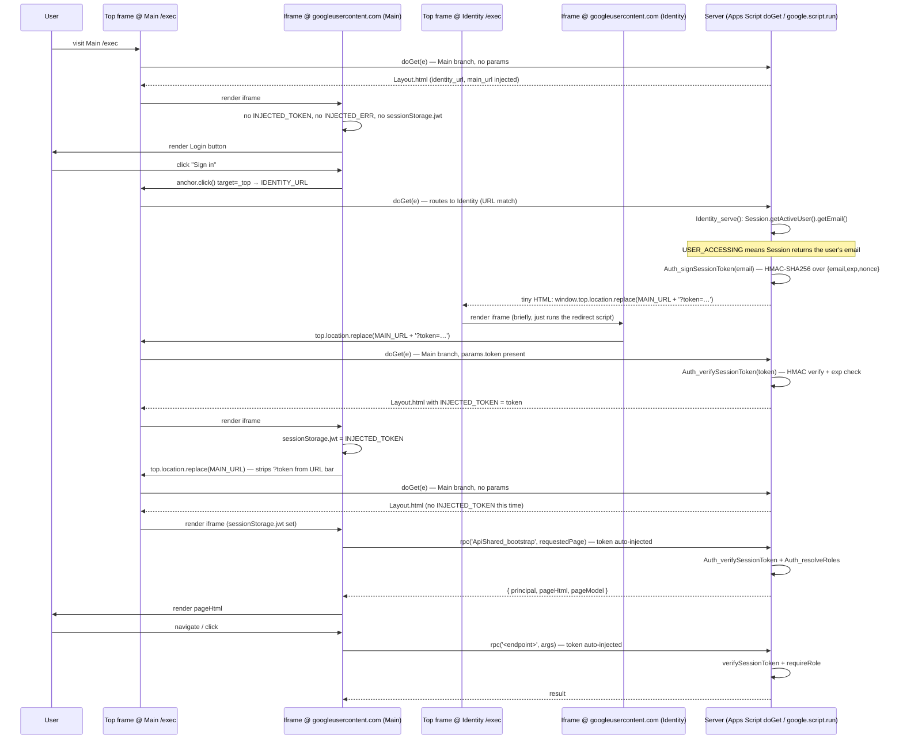

# Architecture

## 1. Goals

- One deployable artifact (a single bound Apps Script project).
- Everything stored in the backing Sheet — no external DB, no Script Properties except for rare low-level flags.
- Clear separation between data access (`repos/`), business logic (`services/`), and client-facing API (`api/`), so each layer is reviewable in isolation.
- Every write is serialised by `LockService` and audited to `AuditLog`.
- Cloudflare Worker is decoupled and added last.

### Scale targets (confirmed 2026-04-19)

12 wards, ~250 active seats, 1–2 manual/temp requests per week. This is low-traffic software: no server-side pagination, no polling/real-time updates, no batched writes, and no importer continuation-token scheme needed for v1. If any of these assumptions shift by >5×, revisit.

**One exception to the no-pagination rule (Chunk 10).** The `AuditLog` tab grows at ~300-500 rows per week at target scale (per-row import audits from Chunk 3 are the dominant source), so a year's data is ~20k rows. The manager **Audit Log page is the only page that paginates server-side**, because rendering that tab in a single table is not feasible. Every other read (roster pages, queue, access, dashboard, import) still reads the whole tab once per request and returns every relevant row — that's the baked-in assumption for low-traffic software. The Audit Log page uses offset/limit (max 100 rows per page) against the full-scan read — simple; cheap to reason about; refactorable to a cursor scheme or reverse-chronological short-circuit when the N+1-read cost stops being tolerable (noted in the ApiManager_auditLog endpoint).

## 2. Decisions made here (not explicit in the spec)

| # | Decision | Why |
| --- | --- | --- |
| D1 | **Container-bound** Apps Script project for Main (bound to the backing Sheet via Extensions → Apps Script). The Sheet may live in a Workspace shared drive — the auth flow's Workspace incompatibility is handled by D10 (Identity is a separate, personal-account-owned project). | Simpler deploy and permissions model; `SpreadsheetApp.getActiveSpreadsheet()` always returns the right sheet, no Script-Property plumbing. Trade-off: one Sheet per Main deployment. |
| D2 | `webapp.executeAs = "USER_DEPLOYING"` (Main deployment) and `webapp.access = "ANYONE"`. The Identity deployment uses `executeAs = "USER_ACCESSING"` instead — see D10. Both share `access = "ANYONE"`. (The deploy dialog shows `ANYONE` as the human-readable label "Anyone with Google account" — `ANYONE` in the manifest *requires sign-in*; `ANYONE_ANONYMOUS` would be the no-sign-in variant.) | On Main, users never need read access to the backing sheet (the deployer does). All users are on consumer Gmail, so `DOMAIN` access doesn't apply; `ANYONE` gates the app at the Google login wall. Identity is established by Identity_serve under `USER_ACCESSING` (D10), not by `Session.getActiveUser().getEmail()` on Main — that returns empty cross-customer. |
| D3 | UUIDs (`Utilities.getUuid()`) for `seat_id` and `request_id` (system-generated, never seen by users). **Natural keys** for `Wards` (`ward_code`, 2-char user-chosen) and `Buildings` (`building_name`, free text user-chosen). Cross-tab references (`Wards.building_name`, `Seats.scope`, `Access.scope`, `Requests.scope`, `Seats.building_names`) use these natural keys directly — no separate slug-PK column. | UUIDs are right when there's no good natural key (the same person can have many seats; same email can have many requests). Wards and Buildings each have an obviously-unique natural identifier (`ward_code` because the importer joins on it; `building_name` because users picked unique names anyway), so a separate slug-PK was just one more thing to keep in sync. Renaming a natural key still cascades-breaks references; the manager UI fires a `confirm()` before submitting a rename. See open-questions.md C-5. |
| D4 | Emails are stored **as typed** (preserve case, dots, `+suffix`); a canonical form (lowercased + Gmail dot/`+suffix` stripping + `googlemail.com` → `gmail.com`) is computed on the fly only for **comparison** via `Utils_emailsEqual`. The canonical form never lands in a cell. Source-row hashes (importer) still use the canonical form so they're stable across the format wobbles LCR introduces. | Storing canonical strips information the user typed (e.g. `first.last@gmail.com` → `firstlast@gmail.com`), which is wrong for display and for any future "email this person" path. Comparing canonical-on-the-fly preserves the original while still letting `first.last@gmail.com` and `firstlast@gmail.com` resolve to the same role. See [`open-questions.md` I-8](open-questions.md#i-8-resolved-2026-04-19-gmail-address-canonicalisation--apply-from-day-1) for the exact algorithm. |
| D5 | `source_row_hash` = SHA-256 of `scope|calling|canonical_email` (canonicalisation per D4). | Stable; identifies a specific auto-seat assignment across imports regardless of row order or incoming email variant. |
| D6 | All sheet reads go through a thin `Repo` layer that returns plain objects; callers never touch `Range`/`Values` directly. | Lets us swap out Sheet for another backend later; and keeps column-index knowledge in exactly one place. |
| D7 | A single `Setup.gs` function (`setupSheet`) creates/repairs all tabs and headers. Optionally exposed via `onOpen()` custom menu. | Removes human error from manual tab creation; safely re-runnable. |
| D8 | Dates stored as ISO date strings in `Requests.start_date`, `Seats.start_date`, etc.; timestamps stored as `Date` in `*_at` columns. | ISO dates sort lexically and are unambiguous across locales; `Date` on `*_at` lets Sheets show human-readable times. |
| D9 | Query routing via a single `?p=` query param; default page picked by highest-privilege role held by the user. | Keeps URLs short, makes deep links possible, preserves single-entry-point `doGet`. |
| D10 | **Two-project `Session.getActiveUser` + HMAC-signed session token** as the identity layer. Two **separate** Apps Script projects, sharing only an HMAC `session_secret` value held in two places (manually synchronized). **Main** is the Workspace-owned, Sheet-bound project (`executeAs: USER_DEPLOYING`, URL stored in `Config.main_url`); it renders all UI and reads/writes the backing Sheet under the deployer's identity. **Identity** is a personal-account-owned, *standalone* project (`executeAs: USER_ACCESSING`, URL stored in `Config.identity_url`); it only reads `Session.getActiveUser().getEmail()`, HMAC-signs `{email, exp, nonce}` with `session_secret`, and renders a tiny page that navigates the top frame back to Main with `?token=…`. Main's `doGet` consumes the `?token`, hands it to `Auth_verifySessionToken` (constant-time HMAC compare + `exp` check), and stashes it in `sessionStorage.jwt`; every subsequent `google.script.run` call re-verifies. The Login link in `Layout.html` navigates straight to `Config.identity_url` — no routing param, no dispatch on the Main side. The shared `session_secret` lives in (a) Main's Sheet `Config.session_secret`, (b) Identity's project Script Properties; rotation procedure is documented in `identity-project/README.md`. Both projects' source is in this repo: Main under `src/`, Identity under `identity-project/` (copy-pasted into the editor; not pushed via clasp). | The original plan was to use Google Sign-In (GSI) drop-in or any other browser-initiated OAuth flow from inside Apps Script HtmlService. **All such flows fail** — `*.googleusercontent.com` is on Google's permanent OAuth-origin denylist, and Google rejects every initial `accounts.google.com/o/oauth2/v2/auth` request with `origin_mismatch` regardless of `response_type` (implicit *or* code), regardless of Referer suppression. The only Apps-Script-native primitive that returns the user's email reliably is `Session.getActiveUser` under `USER_ACCESSING`. The two-project (rather than two-deployment) split exists because **Workspace-owned Apps Script projects gate consumer-Gmail accounts at the OAuth-authorize step** for `executeAs: USER_ACCESSING` deployments, even when "Who has access" is "Anyone with Google account" and the OAuth consent screen is External + In production. The Workspace tenant's gate is below the deployment dialog. Personal-account projects are not subject to that gate, so Identity lives in a personal-account project. Main remains Workspace-bound so the Sheet keeps its Workspace ownership / shared-drive properties. The HMAC signature lets Main *trust* what Identity issues without any shared database — the only shared state is the secret, which is small enough to copy by hand. **No OAuth client (in the GCP sense) is required.** Cost: a one-time per-user OAuth-consent prompt on the Identity project (for the email scope only — non-sensitive, immediate accept) and a second Apps Script project to manage. See open-questions.md A-8 (the failed OAuth pivots) and D-3 (the Workspace incompatibility). |
| D11 | **Replace `reactfire` with an in-house Firestore hooks layer at `apps/web/src/lib/data/`.** Three hooks: `useFirestoreDoc<T>(ref)` and `useFirestoreCollection<T>(query)` subscribe via `onSnapshot` and push snapshots into the TanStack Query cache via `setQueryData`; `useFirestoreOnce<T>(refOrQuery)` does one-shot `getDoc` / `getDocs` for cursor-paginated reads (Phase 5's Audit Log). Roughly 80 LoC total. SDK singletons from `apps/web/src/lib/firebase.ts` are consumed directly — no React-context provider required for the instances themselves. Implemented in Phase 3.5 (Firebase migration). | F2 in `firebase-migration.md` originally locked in `reactfire` (June 2025 era). A dependency audit on 2026-04-28 found `reactfire` is "Experimental — not a supported Firebase product" with last release v4.2.3 (2023-06-27), 53 open issues + 57 unmerged PRs, and no Firebase v12 / React 19 commitment. Alternatives surveyed: `react-firebase-hooks` (CSFrequency) shipped v5.1.1 in November 2024 but the v5.1.0 notes flagged unresolved React 18 issues — ruled inactive; `@invertase/tanstack-query-firebase` is actively maintained (v2.1.1 Aug 2025) but its Firestore live-query support is officially "🟠 Work in progress" — only `firestore/lite` (no `onSnapshot`) is "✅ Ready for use", and Phases 5+ shared-attention pages need real-time listeners, so `lite` alone doesn't cover us. Owning the wiring layer ourselves is ~80 lines of code in exchange for unbounded third-party risk. The pattern (`onSnapshot` → `setQueryData` over `useSyncExternalStore`) is the canonical React 19 / TanStack Query idiom; well-documented externally; testable via SDK mocks. F2 is superseded by this decision for the wiring layer specifically; the rest of F2's stack choices (TanStack Router, TanStack Query, Zustand, react-hook-form, zod, shadcn-ui, vite-plugin-pwa) stand. |

**Implementation note (2026-04-28).** Phase 3.5 landed D11 with the following actuals on `main`:

- **Module:** `apps/web/src/lib/data/` — `useFirestoreDoc.ts` (141 LoC), `useFirestoreCollection.ts` (156 LoC), `useFirestoreOnce.ts` (162 LoC), `queryKeys.ts` (80 LoC), `index.ts` barrel (26 LoC); 565 LoC of production source. Test files (`*.test.tsx`) add another 526 LoC across 17 cases; together they bring `@kindoo/web` from 15 → 32 tests at Phase 3.5 close. (The "~80 LoC" estimate in the original D11 prose held only for the three hook bodies stripped of error/loading state machinery, ref-stability bookkeeping, query-key derivation, and the barrel; the production module is meaningfully larger because real-world robustness is in those areas, not in the snapshot-to-cache wiring itself.)
- **Versions landed:** TanStack Query `^5.62.10`, TanStack Router `^1.95.5`, Firebase Web SDK `^12.12.1`, React `^19.0.0`. SDK singletons exported from `apps/web/src/lib/firebase.ts`; consumed directly. `<QueryClientProvider>` wraps the router in `apps/web/src/main.tsx` — it's the only provider required.
- **Two patterns load-bearing for future hooks added to this module.** (1) **Sentinel-wrapping** in the cache: `{ value: T | undefined }`. TanStack Query 5 disallows raw `undefined` as a resolved value, but a Firestore doc-not-found is naturally that. The wrapper resolves the conflict; consumers still see `T | undefined` after unwrap. (2) **Never-resolving placeholder `queryFn`** for live-subscribed hooks. The `onSnapshot` listener is the single state-transition owner; if `queryFn` resolved it would race the listener and clobber freshly-arrived data. The `queryFn` returns a `Promise` that never settles, by design. Both patterns are documented inline in the hook source files and should be preserved as new hooks are added.

See [`open-questions.md`](open-questions.md) for decisions I'm not sure about.

## 3. Directory structure

The repo holds **two** Apps Script projects:

- **`src/`** — the Main project. Workspace-bound to the backing Sheet,
  pushed via `clasp` (`npm run push`).
- **`identity-project/`** — the standalone Identity service. Lives in a
  personal Google Drive (no Workspace ownership), no bound Sheet.
  Source kept in this repo for reference; copy-pasted into the
  Apps Script editor manually. See `identity-project/README.md`.

```
src/
├── appsscript.json                # manifest (scopes, timezone, webapp config)
│
├── core/                          # cross-cutting infrastructure
│   ├── Main.gs                    # doGet / doPost entry points
│   ├── Router.gs                  # maps (role, page) → template
│   ├── Auth.gs                    # resolves signed-in email → roles
│   ├── Lock.gs                    # withLock(fn) helper
│   └── Utils.gs                   # date, hash, uuid, email-normalise helpers
│
├── repos/                         # one module per Sheet tab — pure data access
│   ├── ConfigRepo.gs
│   ├── KindooManagersRepo.gs
│   ├── BuildingsRepo.gs
│   ├── WardsRepo.gs
│   ├── TemplatesRepo.gs           # both WardCallingTemplate and StakeCallingTemplate
│   ├── AccessRepo.gs
│   ├── SeatsRepo.gs
│   ├── RequestsRepo.gs
│   └── AuditRepo.gs
│
├── services/                      # business logic; calls repos, wraps locks, writes audit
│   ├── Setup.gs                   # setupSheet(): idempotent tab/header creation
│   ├── Bootstrap.gs               # first-run wizard state machine
│   ├── Importer.gs                # weekly import from callings sheet
│   ├── Expiry.gs                  # daily temp-seat expiry
│   ├── Rosters.gs                 # read-side roster shape + utilization math
│   ├── RequestsService.gs         # submit / complete / reject / cancel
│   ├── EmailService.gs            # typed wrappers over MailApp.sendEmail
│   └── TriggersService.gs         # install/remove time-based triggers
│
├── api/                           # server-side entry points exposed to google.script.run
│   ├── ApiShared.gs               # whoami(), version, health
│   ├── ApiBishopric.gs
│   ├── ApiStake.gs
│   ├── ApiRequests.gs             # consolidated submit/listMy/cancel/checkDuplicate (bishopric OR stake)
│   └── ApiManager.gs
│
└── ui/                            # HTML served via HtmlService
    ├── Layout.html                # shell: head, nav, role switcher, content slot
    ├── Nav.html                   # per-role navigation links
    ├── Styles.html                # shared CSS (<style>)
    ├── ClientUtils.html           # shared client JS (<script>) — rpc helper, toasts
    ├── NotAuthorized.html
    ├── BootstrapWizard.html
    ├── NewRequest.html            # shared submit form (bishopric OR stake) — Chunk 6
    ├── MyRequests.html            # shared requester list (bishopric OR stake) — Chunk 6
    ├── bishopric/
    │   └── Roster.html
    ├── stake/
    │   ├── Roster.html
    │   └── WardRosters.html
    └── manager/
        ├── Dashboard.html
        ├── RequestsQueue.html
        ├── AllSeats.html
        ├── Config.html
        ├── Access.html
        ├── Import.html
        └── AuditLog.html

identity-project/                  # standalone Identity service (separate Apps Script project)
├── Code.gs                        # Session.getActiveUser → HMAC-sign → top-frame redirect
├── appsscript.json                # USER_ACCESSING + ANYONE + userinfo.email scope only
└── README.md                      # setup + secret-rotation runbook
```

**Note on Apps Script's flat namespace.** Apps Script concatenates all `.gs` files into one global scope at runtime; subdirectories under `src/` become folder prefixes in the Apps Script editor (e.g., `repos/SeatsRepo`) but don't isolate anything. Every exported function must have a unique, prefixed name — `Seats_getByScope`, not `getByScope`. Treat the repo modules like `namespace.module` identifiers.

## 4. Request lifecycle

Authentication is split between **two Apps Script projects** — a Workspace-bound Main project that handles UI and data access, and a personal-account-owned Identity project that exists only to read `Session.getActiveUser` and HMAC-sign the result. The two share an HMAC `session_secret` value (manually synchronized between Main's `Config.session_secret` cell and Identity's Script Properties — see `identity-project/README.md`). The flow round-trips the user between them once at sign-in. Sequence diagram below labels them generically as "Main" and "Identity"; the underlying split is two-project, not two-deployment-of-one-project.



### Step-by-step

1. **Initial visit.** User visits Main `/exec`. `Main.doGet(e)` checks whether the current request is hitting the Identity deployment by comparing `ScriptApp.getService().getUrl()` against `Config.identity_url`. On the Main deployment this comparison is false, so doGet renders `Layout.html` with `identity_url`, `main_url`, `injected_token=''`, `injected_error=''` injected.
2. **Iframe boot.** Layout.html's `<script>` checks four states in order:
   1. `INJECTED_TOKEN` set → just returned from Identity with a verified token. Stash in `sessionStorage.jwt`, reload top to clean `MAIN_URL`.
   2. `INJECTED_ERR` set → token verification failed server-side (most often: stale token, or `session_secret` was rotated). Show the error.
   3. `sessionStorage.jwt` present and not client-side-expired → bootstrap path.
   4. Otherwise → show Login button.
3. **Sign-in click.** `startSignIn()` programmatically clicks an `<a target="_top" href="IDENTITY_URL">` to navigate the top frame to the Identity deployment.
4. **Identity round trip.** Top frame navigates to the Identity deployment's `/exec`. Apps Script invokes `doGet`, which sees that this URL matches `Config.identity_url` and dispatches to `Identity_serve()`:
   1. Reads `Session.getActiveUser().getEmail()` (works because this deployment runs as `USER_ACCESSING`). On first user visit, Google shows the standard "Kindoo Access Tracker wants to access: View your email address" consent screen — non-sensitive scope, no Google-verification review required, immediate accept.
   2. Calls `Auth_signSessionToken(email)`: builds `{ email: canonical, exp: now+3600, nonce: uuid() }`, base64url-encodes the JSON payload, HMAC-SHA256 signs it with `Config.session_secret`, returns `<base64url-payload>.<base64url-sig>`.
   3. Returns a tiny HTML page that does `window.top.location.replace(MAIN_URL + '?token=<TOKEN>')`. Wrapped in iframe by HtmlService — but the script inside reaches `window.top` and navigates the top frame.
5. **Token exchange completes.** Top frame navigates to Main `/exec?token=…`. `Main.doGet` sees `e.parameter.token`, calls `Auth_verifySessionToken(token)`:
   1. Splits on `.`. Re-computes HMAC over the payload using `Config.session_secret`. Constant-time compare against the supplied signature.
   2. base64url-decodes the payload, parses JSON. Validates `exp > now − 30s`.
   3. Returns `{ email, name:'', picture:'' }`.
   doGet sets `template.injected_token = token` (or `template.injected_error = err.message` on failure) and renders Layout.
6. **Client stashes token, cleans URL.** Iframe boot sees `INJECTED_TOKEN` (step 2.i): `sessionStorage.jwt = INJECTED_TOKEN`, then `window.top.location.replace(MAIN_URL)`. The top reloads to bare Main `/exec`, stripping `?token` from the address bar and browser history.
7. **Bootstrap path.** With `sessionStorage.jwt` set, the client calls `rpc('ApiShared_bootstrap', requestedPage)` (the rpc helper auto-injects the token as the first argument). Server-side:
   1. `Auth_verifySessionToken(token)` — cheap HMAC re-verify.
   2. **Setup-complete gate (Chunk 4, live).** Read `Config.setup_complete`. If `FALSE` and verified email matches `bootstrap_admin_email` (via `Utils_emailsEqual`), short-circuit to `ui/BootstrapWizard.html` ignoring `?p=`. If `FALSE` and email does NOT match, short-circuit to `ui/SetupInProgress.html` (distinct from `NotAuthorized`). Only if `setup_complete === true` does the request proceed to role resolution below.
   3. `Auth_resolveRoles(email)` returns `{ email, roles[] }`. No roles → `NotAuthorized`.
   4. `Router_pick(requestedPage, principal)` returns `{ template, pageHtml, pageModel }`; role restrictions enforced here.
   5. Server returns `{ principal, pageHtml, pageModel }` to the client.
8. **Client renders** the returned `pageHtml` into the content slot. Topbar shows the user's email.
9. **Subsequent calls** pass the token (auto-injected by `rpc`) and re-verify on the server. HMAC verification is pure local CPU — no network — so re-verify is essentially free.

### Failure modes

| Failure | Client behaviour | Server behaviour |
| --- | --- | --- |
| Token expired (exp in the past) | Client-side `isExpired` short-circuits before any rpc — clear `sessionStorage.jwt`, show Login. | `Auth_verifySessionToken` throws `AuthExpired` if a stale token slipped past the client check. |
| Token HMAC invalid (tampered or signed with a rotated `session_secret`) | Same as above (clear token, show Login). | Throws `AuthInvalid`. Logged. |
| `session_secret` missing in Config | Login button works through to Identity, but Identity throws `AuthNotConfigured` and renders an error page. | `Auth_signSessionToken` / `Auth_verifySessionToken` throw `AuthNotConfigured`. |
| `identity_url` missing in Config | Login button refuses; shows "identity_url is not configured." | n/a. |
| `main_url` missing in Config | Identity service refuses to redirect; shows "Configuration error: main_url is not configured." | n/a. |
| `Session.getActiveUser` returns empty (user hasn't authorised the Identity deployment) | Identity service shows "Sign-in unavailable: visit the Identity URL once directly to grant the email permission, then return." | n/a. (Should self-heal once the user goes through Google's consent prompt.) |
| User has no roles after sign-in | Show `NotAuthorized` explaining bishopric-import-lag possibility. | `principal.roles.length === 0`. |
| Browser-initiated OAuth from inside the HtmlService iframe (e.g. an attempt to revert to GSI's drop-in button or `response_type=id_token`) | Google rejects with `origin_mismatch` because `*.googleusercontent.com` is on the JS-origin denylist and can't be allowlisted. **This is why we use the two-deployment Session+HMAC pattern instead of OAuth.** See open-questions.md A-8. | n/a. |

## 5. Auth & role resolution

### Inputs

- An **HMAC-signed session token** presented by the client with every `google.script.run` call. Source of truth for identity. Issued by the Identity deployment after it reads `Session.getActiveUser().getEmail()`; verified by Main on every request via `Config.session_secret`.
- `KindooManagers` rows with `active = true` — the manager set.
- `Access` rows — the bishopric and stake-presidency set.

`Session.getActiveUser().getEmail()` is **only** called inside `Identity_serve` — that's the one place in the codebase that runs under `executeAs: USER_ACCESSING`, where Session correctly returns the accessing user's email (even for consumer Gmail). Everywhere else (Main deployment, `executeAs: USER_DEPLOYING`), Session would return either empty or the deployer; we never use it for identity outside Identity_serve.

### Session token format

```
<base64url(JSON({ email, exp, nonce }))>.<base64url(HMAC-SHA256(payload, session_secret))>
```

Two segments, dot-separated. Distinguishable from a JWT (three segments). Stored client-side in `sessionStorage.jwt` (the key name predates this design and is preserved for rpc-helper compat).

### Token verification — `Auth_verifySessionToken(token)`

1. Split on `.` — must yield exactly two segments.
2. Re-compute `HMAC-SHA256(segment0, Config.session_secret)` via `Utilities.computeHmacSha256Signature`.
3. base64url-encode and constant-time-compare against `segment1`. Mismatch → throw `AuthInvalid`.
4. base64url-decode `segment0`, parse JSON.
5. Check `exp > now − 30s` (small clock-skew leeway). Past-exp → throw `AuthExpired`.
6. Return `{ email: normaliseEmail(payload.email), name: '', picture: '' }`. The `name`/`picture` fields are empty because `Session.getActiveUser` doesn't surface them; we could fill via a People API call later if we needed avatars in the UI.

If `Config.session_secret` is unset or shorter than 32 chars, both `Auth_signSessionToken` and `Auth_verifySessionToken` throw `AuthNotConfigured`.

### Token issuance — `Auth_signSessionToken(email, ttlSeconds?)`

Inverse of the above. Builds `{ email: canonical, exp: now+ttl, nonce: uuid() }`, base64url-encodes the JSON, HMAC-SHA256-signs with the secret, returns the two-segment token. Default TTL is 1 hour.

Called only from `Identity_serve` after `Session.getActiveUser` succeeds.

### Output — a `Principal` object

```
{
  email: "jane@example.org",
  name: "",     // empty for now; Session.getActiveUser doesn't surface it
  picture: "",  // ditto
  roles: [
    { type: "manager" },
    { type: "stake" },
    { type: "bishopric", wardId: "cordera-1st" }
  ]
}
```

Multi-role is possible (one person can be a Kindoo Manager AND a bishopric counsellor AND in the stake presidency — rare but real; spec requires UI to show the union).

### Enforcement

- `Auth_principalFrom(token)` — verifies the session token, resolves roles, returns a `Principal`. Every `api/` function calls this before doing work.
- `Auth_requireRole(principal, roleMatcher)` — throws `Forbidden` on mismatch.
- `Auth_requireWardScope(principal, wardId)` — throws `Forbidden` if the user is not a bishopric for that ward and not a manager/stake. Used to prevent cross-ward data access.
- The client's `rpc(name, args)` helper automatically injects `sessionStorage.jwt` as the first argument, so call sites don't repeat it.

### Bishopric lag

Accepted per spec. A newly-called bishopric member cannot sign in until the next weekly import (or a manual "Import Now" run). `NotAuthorized` mentions this as a possible cause.

### Two identities — Apps Script execution vs. actor

The **Main** deployment runs `executeAs: USER_DEPLOYING`, so every Sheet write happens under the **deployer's** Google identity. That's what shows up in the Sheet's file-level revision history, and that's what `Session.getEffectiveUser().getEmail()` would return inside Main. That identity is **infrastructure** — it represents "the app", not the person who caused the change.

The **actor** on any change is whoever initiated it: the signed-in user whose HMAC session token we just verified (originally captured by Identity_serve via `Session.getActiveUser` under `USER_ACCESSING`), or the literal string `"Importer"` / `"ExpiryTrigger"` for automated runs. That's what we write to `AuditLog.actor_email`.

This distinction is deliberate and needs to be understood before debugging history:

- **Sheet revision history shows the deployer for every row** — this is correct and uninteresting. Don't use it to figure out who did what.
- **`AuditLog` is the authoritative record** of authorship. `actor_email` is truth; the Apps Script execution identity is plumbing.
- **In the Main deployment we never read `Session.getActiveUser()` or `Session.getEffectiveUser()` for authorship** — the only source is the verified session token. (Inside Identity_serve, `Session.getActiveUser` is the *only* identity primitive — that's the entire purpose of having a separate Identity deployment with `USER_ACCESSING`.)

Consequence for services: `AuditRepo.write({actor_email, ...})` requires the caller to pass the actor — there is no "pick it up from the environment" convenience fallback, because doing so would silently record the deployer.

## 6. LockService strategy

One helper, `Lock.withLock(fn, opts?)`:

```
function Lock_withLock(fn, opts) {
  opts = opts || {};
  var lock = LockService.getScriptLock();
  var timeout = opts.timeoutMs || 10000; // 10s default
  if (!lock.tryLock(timeout)) {
    throw new Error("Another change is in progress — please retry in a moment.");
  }
  try {
    return fn();
  } finally {
    lock.releaseLock();
  }
}
```

### Rules

- **Every** service function that writes to any tab wraps its work in `Lock_withLock`. No exceptions.
- Importer and Expiry wrap their full run (they're long — up to a few minutes — so we raise `timeoutMs` to, e.g., 30s of waiting). They also write a `start`/`end` row to `AuditLog` to bracket the run.
- Read paths do **not** take the lock. Sheet reads are snapshot-consistent enough for this workload, and locking reads would serialise the entire app.
- Within a single request, we acquire the lock once at the top of the write path and release at the end. Nested calls are avoided.
- **Contention contract.** On `tryLock` timeout, `Lock_withLock` throws the literal string `"Another change is in progress — please retry in a moment."` The client's `rpc` helper surfaces server-thrown errors as toasts (`ClientUtils.html#toast`); the message is intended to be shown to the user verbatim.

### Why script lock, not document lock

Script lock is per-script-instance and covers any user invocation, including triggers. Document lock covers the sheet only from the script's perspective but isn't stronger for our purposes, and script lock also serialises import-with-expiry concurrency.

## 7. Data access layer

One file per tab under `repos/`. Each exports pure functions that return plain JS objects (snake_case keys matching header names). No file talks to `SpreadsheetApp` except through the shared `Sheet_getTab(name)` helper (in `core/Cache.gs`) — which memoizes `getSheetByName` lookups within a single request. Repos call `Sheet_getTab` from their `_sheet_` helper; direct `SpreadsheetApp.getActiveSpreadsheet().getSheetByName(...)` calls are an error. The one legitimate exception is `services/Setup.gs#setupSheet`, which has to create missing tabs and therefore cannot go through the memo (which throws on miss).

### Patterns used across repos

- `Xxx_getAll()` — returns every row as an array of objects.
- `Xxx_getById(id)` / `Xxx_getByScope(scope)` — filtered reads.
- `Xxx_insert(obj)` / `Xxx_update(id, patch)` / `Xxx_delete(id)` — pure single-tab writes. The repo enforces single-tab invariants (PK uniqueness on insert, existence-check on update/delete, header-drift refusal). The repo does **not** call `AuditRepo.write` itself, and does **not** acquire the lock. Both are the **API layer's** responsibility — the canonical Chunk-2 pattern (chunk-1-scaffolding.md "Next") wraps the repo write and the audit write in the same `Lock_withLock` block, so the log is always consistent with the data even on crash.
- Cross-tab invariants (foreign-key blocks like Buildings → Wards on delete; Wards → Seats on delete in Chunk 5+) live in the **API layer**, not in repos. This keeps each repo testable in isolation and avoids circular module dependencies.
- For tabs whose schema is shared between two physical tabs (e.g., `WardCallingTemplate` and `StakeCallingTemplate`), one repo file exports `Xxx_<verb>(kind, ...)` taking a `kind` discriminator (`'ward'` / `'stake'`), so the schema lives in one place.
- The API-layer convention for "insert or update by PK" is `ApiManager_<thing>Upsert(token, row)`: read existing by PK, branch to repo `_insert` or `_update` based on whether it exists, emit one audit row with the chosen action (`insert` / `update`) and `before` populated from the lookup.
- Columns are defined once per repo as a `const XXX_HEADERS_ = ['seat_id', 'scope', ...]` tuple. `setupSheet` reads these to build the headers. If a header mismatch is detected on any read **or write** path, the repo throws with the column index and bad value — prevents subtle column-drift bugs.

### Why not one monolithic `SheetService`

Tried it mentally — every function ends up switch-casing on tab name. Per-tab repos co-locate column knowledge and validation with the thing being validated. Testable by swapping the repo module.

## 7.5. Caching layer (Chunk 10.5)

Chunk 10.5 adds a thin `core/Cache.gs` module that wraps `CacheService.getScriptCache()` with a memoize / invalidate API, and adopts it at a short list of hot read paths. The module is the **single call site for `CacheService` in the Main project** — no other file touches `CacheService` directly, so invalidation discipline is reviewable from one place.

**Why this chunk exists.** Chunks 1-10 shipped a working v1. Post-Chunk-10 measurements showed the Dashboard endpoint reading the full `Requests`, `Seats`, `Wards`, `Config`, `AuditLog`, and trigger list on every page load; `bishopric/Roster` re-reading `Seats` + `Wards` + `Buildings` + `Requests` (for `removal_pending`) on every load; `mgr/seats` doing similar work across all scopes. At target scale the reads themselves are fast, but `SpreadsheetApp` round-trips add up — 300-500 ms per page is the felt latency, and client-side navigation (§8.5) can't close that gap alone.

### Module shape

```
Cache_memoize(key, ttlSeconds, computeFn)   // get-or-compute over getScriptCache()
Cache_invalidate(keyOrKeys)                 // removes one or many keys
Cache_invalidateAll()                       // nuclear option (ward rename, etc.)
Cache_stats()                               // per-request hit/miss counters, for the debug panel
```

Serialization is JSON; values > 90 KB skip the cache with a `[Cache] size-limit skipped <key> (<n>KB)` log line and fall through to the un-cached compute. CacheService's hard per-value limit is 100 KB; 90 KB is a soft ceiling that leaves headroom for the key metadata CacheService prefixes internally. Throwing on over-size would break reads, which is unacceptable — the Sheet stays the source of truth and cache misses must be transparent.

Dates don't survive `JSON.stringify` → `JSON.parse` round-trips as `Date` instances; they come back as ISO strings and callers that type-check `instanceof Date` silently get wrong answers. `Cache_memoize` encodes `Date` values as `{ __date__: ISO }` before put and revives them on get, so the wire shape of cached results matches the uncached shape. Every other value type passes through unchanged.

### Read paths memoized (initial list)

| Function | TTL | Cache key | Invalidated by |
| --- | --- | --- | --- |
| `Config_getAll()` | 60 s | `config:getAll` | `Config_update(key, …)`; Importer / Expiry end-of-run |
| `Config_get(key)` | — | (delegates to `Config_getAll`) | (cascades) |
| `KindooManagers_getAll()` | 60 s | `kindooManagers:getAll` | `KindooManagers_insert` / `_update` / `_delete` / `_bulkInsert` |
| `Access_getAll()` | 60 s | `access:getAll` | `Access_insert` / `_delete`; `Importer_runImport` end-of-run |
| `Wards_getAll()` | 300 s | `wards:getAll` | `Wards_insert` / `_update` / `_delete` / `_bulkInsert` |
| `Buildings_getAll()` | 300 s | `buildings:getAll` | `Buildings_insert` / `_update` / `_delete` / `_bulkInsert` |
| `Templates_getAll('ward')` | 300 s | `templates:ward:getAll` | `Templates_insert('ward', …)` / `_update` / `_delete` |
| `Templates_getAll('stake')` | 300 s | `templates:stake:getAll` | `Templates_insert('stake', …)` / `_update` / `_delete` |

TTLs are short on write-frequent tabs (Config, KindooManagers, Access) and longer on nearly-static tabs (Wards, Buildings, Templates). The 60 s floor accepts up to a minute of staleness on a missed invalidation; the 300 s ceiling accepts up to five minutes on the nearly-static tabs. Acceptable at target scale.

Two notes on the table shape vs. the pre-implementation draft:

- **`Config_getAll` rather than per-key `Config_get`.** The pre-implementation table memoized `Config_get(key)` per key, which would have issued N Sheet reads per request for each distinct key a page touched. Memoizing `Config_getAll` once and having `Config_get(key)` read from the cached map keeps the same cache surface (one key, `config:getAll`, invalidated on every `Config_update`) but serves every subsequent `Config_get` for any key from the same in-memory result. Dashboard reads ~5 Config keys; warm-cache that's 0 Sheet reads instead of up to 5.
- **`KindooManagers_getAll` rather than `_getActive`.** The pre-implementation table named `KindooManagers_getActive()`, which has never existed in shipped code. Role resolution reaches this tab through `KindooManagers_isActiveByEmail → _getByEmail → _getAll`, so `_getAll` is the real hot path. Memoizing there caches the data the `_getActive` entry intended.

### Invalidation discipline

Every write site owns its invalidation call. Writes are concentrated in:

- Repo `_insert` / `_update` / `_delete` paths (invalidate their own tab's cache keys before returning).
- Importer end-of-run (invalidate `Seats` + `Access` keys after the over-cap pass finishes; the invalidation lives in `Importer_runImport`, not in `SeatsRepo_bulkInsertAuto`, so a single batched insert doesn't thrash the cache in the middle of the run).
- Expiry end-of-run (same shape).
- `Config_update` (invalidate the specific key it just wrote).

The chunk-10.5 changelog enumerates every invalidation site as a review checklist. A missed invalidation is the dominant failure mode for this chunk; enumeration + review is cheaper than any dynamic detection scheme.

### What is NOT cached

- **Role resolution.** Alice's role set is not Bob's. Per-script-cache of `(email → roles)` would leak roles across users under the same script instance; per-user-cache is more moving parts than the problem warrants. The reads role resolution DOES (`KindooManagers_getActive` + `Access_getAll`) are cached at the repo layer, so role resolution stays cheap without introducing per-user cache scope.
- **`AuditLog` reads.** The tab grows unbounded (~20k rows / year at target scale) and is already the ONE paginated read in the app (§1 "one exception"). Caching the full-tab read would fight the pagination contract, and the per-row payload can exceed the 100 KB CacheService limit at year+1 scale. The `ApiManager_auditLog` endpoint comment block notes this explicitly.
- **`Requests` and `Seats` reads.** Write-hot enough that short-TTL cache would produce staleness on the very pages (`mgr/queue`, `mgr/seats`) that users refresh most. If Dashboard's `Seats` read becomes a measured bottleneck, revisit — but the default is uncached.

### Relationship to the JWKS cache

`Auth.gs` no longer uses `CacheService` (the JWKS cache was deleted when Chunk 1's auth pivot landed on the HMAC-signed session token — see `open-questions.md` A-8 and `chunk-1-scaffolding.md` deviation list). Chunk 10.5's `core/Cache.gs` is therefore the project's **first** `CacheService` user in shipped code. The module's shape mirrors what the original JWKS cache used (per-script cache, JSON serialization, short TTLs, hit/miss logging) — "same pattern, new call sites" is accurate in intent even though the literal precedent isn't in the tree.

If a future auth refactor reintroduces a network-identity lookup (e.g. People API for avatars), that one lives in `Auth.gs` with its own cache, distinct from `core/Cache.gs` — auth is cross-cutting enough that it owns its own cache surface. Enforcement is architectural, not code-level: `core/Cache.gs` is for repo / service read paths; `Auth.gs` is for auth-scope network calls.

### Per-request sheet-handle memo — `Sheet_getTab(name)`

Distinct from `CacheService`. `Sheet_getTab(name)` memoizes `SpreadsheetApp.getActiveSpreadsheet().getSheetByName(name)` within a single script invocation (a module-level `var` that resets between requests). Apps Script's `getActiveSpreadsheet().getSheetByName()` is not free — each call hits the underlying spreadsheet handle — so collapsing N calls per request to one is a measurable lift when every repo touches the spreadsheet.

§7 has described this helper since Chunk 1, but the actual repos called `SpreadsheetApp.getActiveSpreadsheet().getSheetByName(...)` directly until Chunk 10.5. The helper now lives in `core/Cache.gs` alongside the `CacheService` wrapper — one module owns both caching concerns — and every repo's `Xxx_sheet_()` helper delegates to it. The ConfigRepo and AuditRepo paths (which had inline `SpreadsheetApp` calls, not a `_sheet_` helper) were refactored to route through `Sheet_getTab` too. The CacheService-level cache and the request-lifetime memo are separate concerns; the latter doesn't need invalidation (the request ends and the memo vanishes). The one non-repo call to `SpreadsheetApp.getActiveSpreadsheet()` that remains in the tree is in `services/Setup.gs#setupSheet` — it has to create missing tabs, and `Sheet_getTab` throws on miss.

### Debug surface

`ApiManager_cacheStats(token)` returns `{ byKey: { '<key>': { hits, misses, skipped_size, bytes_cached } }, aggregate: { hits, misses, skipped_size } }`. The manager Configuration page renders a read-only "Cache statistics" panel below the Scheduled triggers panel, showing the aggregate line plus the top-10 keys by total access count. Hit / miss counts reset per script execution — the panel answers "did THIS rpc hit the cache?", not "what's our long-term hit rate" (the latter would need a sheet-backed counter, which is not worth building). A sibling `ApiManager_clearCache(token)` endpoint runs `Cache_invalidateAll()` and writes one `clear_cache` audit row so a sudden slowdown can be traced to a deliberate clear rather than cache eviction.

## 8. HTML & page routing

> **Firebase port note.** The top-tab `Nav.html` described below is replaced in the Firebase port by a left-rail + sectioned-nav design (Quick Links / Rosters / Settings) that adapts across phone / tablet / desktop breakpoints. See [`navigation-redesign.md`](navigation-redesign.md) for the full spec; implementation lands in `firebase-migration.md` Phase 10.1. The `?p=` query-param routing convention (D9) and the role-gated bundle approach (§8.5) carry forward unchanged.

- **Entry point**: `doGet(e)` returns an `HtmlOutput` built from `Layout.html` via `HtmlService.createTemplateFromFile('ui/Layout')`.
- **Includes**: a global `include(path)` helper returns `HtmlService.createHtmlOutputFromFile(path).getContent()` so templates can compose each other via `<?!= include('ui/Styles') ?>`.
- **Model injection**: the template's `evaluate()` is preceded by assigning properties on the template object (`t.principal = ...; t.model = ...`). Client code reads initial state from a `<script>var __init = <?= JSON.stringify(model) ?>;</script>` block at the bottom of the layout.
- **Client RPC**: `ClientUtils.html` wraps `google.script.run` into a `rpc(name, args)` that returns a Promise, with a toast/error UI on failure. All client-side calls go through it.
- **Role-based menus**: `Nav.html` is rendered server-side with the current principal (by `Router_pick` in `core/Router.gs`) and returned as `navHtml` alongside `pageHtml`. It emits only the links the user's roles allow and marks the currently-rendered page as `active`. `Layout.html` hosts it in a `#nav-host` slot above `#content` and rehydrates its inline script (the one that sets each `data-page` anchor's href to `MAIN_URL + ?p=<page>` as the top-frame fallback for right-click / middle-click). Normal primary-button clicks on `data-page` links are intercepted by `Layout.html`'s delegated click handler and served from the client-side `pageBundle` cache (Chunk 10.6 — §8.5). The `active` class is kept in sync by `updateNavActive` on each swap.
- **Page routing is server-resolved once per bootstrap**: `Router_pick(requestedPage, principal)` runs inside `ApiShared_bootstrap` to produce the initial page's HTML + navHtml + pageModel, and `Router_buildPageBundle(principal)` renders every other role-allowed page's HTML into a `pageBundle: {pageId → pageHtml}` map that ships with the same bootstrap response. Intra-app navigation after that point is a client-side lookup against the bundle — no rpc, no second pass through `Router_pick`. Role-gating is enforced server-side at bundle-build time: a bishopric user's bundle never contains manager pages, so a hand-crafted `data-page="mgr/seats"` link can't surface HTML the user isn't entitled to. Role changes mid-session produce a stale bundle; the user must reload to refresh (§8.5 "Nav staleness — accepted").
- **Deep links**: query-string `?p=<page-id>` for page dispatch, plus per-page filter keys (e.g. `&ward=CO&type=manual` for `mgr/seats`) forwarded through as `QUERY_PARAMS` on the client. Main.doGet strips the reserved keys (`p`, `token`) and JSON-encodes the remainder into the Layout template, since the iframe can't read the top-frame's query string (cross-origin). Deep links survive the Cloudflare Worker proxy as long as the worker preserves query strings.

### Page ID map

| `?p=` | Template | Allowed roles |
| --- | --- | --- |
| *(empty)* | role default (manager → `mgr/dashboard`; stake → `stake/roster`; bishopric → `bishopric/roster`) | any |
| `bishopric/roster` | `ui/bishopric/Roster` | bishopric |
| `stake/roster` | `ui/stake/Roster` | stake |
| `stake/ward-rosters` | `ui/stake/WardRosters` | stake |
| `new` | `ui/NewRequest` | bishopric **OR** stake |
| `my` | `ui/MyRequests` | bishopric **OR** stake |
| `mgr/dashboard` | `ui/manager/Dashboard` | manager |
| `mgr/seats` | `ui/manager/AllSeats` | manager |
| `mgr/queue` | `ui/manager/RequestsQueue` | manager |
| `mgr/config` | `ui/manager/Config` | manager |
| `mgr/access` | `ui/manager/Access` | manager |
| `mgr/import` | `ui/manager/Import` | manager |
| `mgr/audit` | `ui/manager/AuditLog` | manager |

**Multi-role page access (Chunk 6).** The `new` and `my` pages are the first entries that accept MORE THAN ONE role — any principal holding `bishopric` OR `stake` (or both) may reach them. The Router entry stores this as `{ roles: ['bishopric', 'stake'] }` instead of the single-role `{ role: 'manager' }` shape. `Router_hasAllowedRole_` walks either shape; single-role entries are unchanged. Managers do NOT automatically get access to `new` / `my` — holding `manager` without `bishopric` / `stake` is insufficient (a manager who wants to submit a request needs to also hold a request-capable role, which is the realistic case: Kindoo Managers are typically drawn from the stake presidency or a bishopric).

The pre-Chunk-6 plan had role-suffixed pages (`bishopric/new`, `stake/new`, etc.); Chunk 6 consolidated those to one `ui/NewRequest.html` + one `ui/MyRequests.html` since the forms are identical except for scope, which is derived server-side from `Auth_requestableScopes(principal)` and (for multi-role users) a client-side dropdown selection.

Multi-role principals land on the highest-privilege role's default (manager > stake > bishopric). A user who hits a `?p=` they can't access (wrong role, or an unrecognised id) silently falls back to their default page; the "redirect with toast" UX is Chunk 10 polish.

### Role-scoped reads

Roster reads enforce scope at the **API layer**, not the UI. A bishopric member for ward CO physically cannot read ward GE's roster by crafting a URL or calling `ApiBishopric_roster` with a spoofed scope — the scope is derived server-side from the verified principal via `Auth_findBishopricRole(principal)`, never from a parameter. Cross-ward reads for stake users go through `ApiStake_wardRoster(token, wardCode)` which validates the ward_code exists and that the caller holds the `stake` role. Managers use `ApiManager_allSeats(token, filters)` which checks `manager` independently. Every endpoint checks its own role requirement — having manager role doesn't satisfy a bishopric-scoped check.

## 8.5. Client-side navigation (Chunk 10.6)

Pre-Chunk-10.6, every nav-link click navigates the top frame to `Main /exec?p=<page>`, which re-runs `doGet` → `Router_pick` → `Layout` re-render → `ApiShared_bootstrap` rpc → page render. The `Layout` shell (topbar, sign-out, nav) re-renders identically every time — wasted work, felt as a 1-2 second latency budget per click.

Chunk 10.6 pivots to an SPA shape: the initial bootstrap rpc returns **every role-allowed page's HTML pre-rendered** in a `pageBundle: {pageId → pageHtml}` map. Intra-app navigation after that point is a pure client-side lookup against the bundle — zero rpc per click, zero re-render of the shell. The only server round-trip per tab click is the page's own data rpc inside its init fn (`ApiManager_dashboard`, `ApiManager_allSeats`, etc.), and that runs AFTER the page HTML is already on screen so the user sees a "Loading …" placeholder rather than a blank pause.

### Bootstrap response — extended

`ApiShared_bootstrap(token, requestedPage)` returns:

| Field | Shape | Purpose |
| --- | --- | --- |
| `principal` | `{email, name, roles}` | Auth-resolved identity. Stashed in `currentPrincipal`; reused to build `pageModel` on every swap. |
| `template` | template path | Kept for backwards compatibility; shell uses `pageId` (below) directly. |
| `pageModel` | `{principal, current_page}` | For the INITIAL page's init call. |
| `pageHtml` | HTML | INITIAL page's rendered HTML. Always present; for bootstrap/wizard / setup-in-progress / NotAuthorized this is the full page (no bundle needed). |
| `navHtml` | HTML | Rendered `ui/Nav`. Non-empty only for principals with roles. |
| `pageBundle` | `{pageId → pageHtml}` | Chunk-10.6 addition. Every `ROUTER_PAGES_` entry the principal is role-allowed for, rendered once and shipped in one response. Empty `{}` for no-roles / bootstrap / setup-in-progress principals. |

Bundle construction is `Router_buildPageBundle(principal)` — walks `ROUTER_PAGES_`, filters by `Router_hasAllowedRole_`, and renders each allowed entry. A bishopric user's bundle excludes every `mgr/*` page; a manager's bundle excludes nothing (managers have the union of nav links). The initial page is ALSO present in the bundle (idempotent — same bytes), so re-entering a deep-linked page via in-app nav hits the same cached HTML the bookmark would have rendered.

Cost: one extra `HtmlTemplate.evaluate()` call per allowed page on bootstrap. At the 12-page menu in `ROUTER_PAGES_`, that's ~50-150ms of additional server time and a few tens of KB more on the wire (gzipped). In exchange, every subsequent intra-app click is synchronous.

There is no longer a separate `ApiShared_renderPage` rpc. The earlier draft of Chunk 10.6 had one; it was dropped once the bundled approach made it dead code.

### Shell swap — `ui/Layout.html`

The shell lives in `ui/Layout.html` (not `ClientUtils.html` — `ClientUtils.html` stays focused on `rpc`, `toast`, and render helpers shared across pages). State kept across intra-app swaps:

- `currentPageId` — last-rendered pageId; keys teardown + nav-active.
- `currentPrincipal` — the bootstrap-time principal, reused to build `pageModel` on every swap.
- `pageBundle` — the `{pageId → pageHtml}` map from bootstrap.
- `navReady` — flips true once the initial render finishes; guards the click and popstate handlers against pre-render clicks.

A delegated `document.addEventListener('click', …)` catches clicks on any `a[data-page]` anchor; modifier-clicks (cmd / ctrl / shift / alt) and non-primary buttons fall through so "open in new tab" keeps working. Query params come from the clicked link's `href` (stripped of `p` and `token`; same rules `Main.doGet` applies server-side).

`navigateTo(pageId, queryParams, opts)` runs the swap — **synchronously**:

1. Look up `pageBundle[pageId]`. If missing (shouldn't happen — nav + deep-links are all role-gated server-side, so this means a stale bundle after an unexpected role change), toast + fall back to a full top-frame reload.
2. Call the outgoing page's `window.page_<X>_teardown` if defined.
3. `innerHTML`-replace `#content` with the cached HTML.
4. `rehydrateScripts` re-runs each page's inline `<script>`, re-defining `window.page_<X>_init` on `window`.
5. Update `window.QUERY_PARAMS` so pages still reading it as a Chunk-5-global keep working.
6. `history.pushState({pageId, queryParams}, '', '?p=<pageId>&...')` unless `opts.skipPushState` is set (popstate does that).
7. Toggle the `active` class on every `a[data-page]` link to match the new pageId.
8. Build `pageModel = {principal: currentPrincipal, current_page: pageId}` — identical shape to what `Router_pick` produces server-side — and call `window.page_<X>_init(pageModel, queryParams)`.

No loading bar on swap. The swap itself is single-digit-millisecond; the "Loading …" placeholder the user sees is the init fn's own data rpc (which is unchanged from Chunk 10).

A `popstate` listener re-runs `navigateTo(state.pageId, state.queryParams, {skipPushState: true})` so browser back/forward work across intra-app navs.

The initial bootstrap path (`showContent` after `ApiShared_bootstrap`) stashes the bundle and principal, calls `history.replaceState` on the current URL so the first back-button press pops to a valid state object, and calls the page's init fn the same way the swap path does. Single entry point regardless of how the page was reached.

Direct-load (a fresh browser tab, a shared URL) still flows through `Main.doGet` → Layout → bootstrap, identical to Chunks 1-10. The bundle arrives in the same bootstrap response; the target deep-linked page renders from `pageHtml`; subsequent nav serves from the bundle.

### Other deep-link sources

Besides `Nav.html`, two call sites emit `?p=` anchors inside the content area: `Dashboard.html` (utilization card → `mgr/seats?ward=<code>`; recent-activity → `mgr/audit?entity_id=<id>`; pending-counts → `mgr/queue?state=pending&type=<t>`), and `Import.html`'s over-cap banner (→ `mgr/seats?ward=<code>`). Each anchor carries both `data-page="<pageId>"` (for the shell's interceptor) and a MAIN_URL-based `href` (for right-click / middle-click / modifier-click fallback). The two surfaces read the same pageId; the interceptor parses the other query params out of the href so the two paths agree on filter state.

### Per-page init-function convention

Each page template exports an init fn on `window` whose name derives from the pageId: `mgr/seats` → `page_mgr_seats_init`; `new` → `page_new_init`; `bishopric/roster` → `page_bishopric_roster_init`; `stake/ward-rosters` → `page_stake_ward_rosters_init`. Rule: replace every `/` AND every `-` with `_` (hyphens aren't valid in JS identifiers), prefix `page_`, suffix `_init`. Signature: `function page_<pageId>_init(pageModel, queryParams) { … }`.

Teardown is a separate optional function on `window` with the `_teardown` suffix (rather than returned from init — avoids the ambiguity of "what if init's return value is something else"). The shell calls it before the next swap:

```
window.page_new_init     = function (pageModel, queryParams) { … };
window.page_new_teardown = function () { … };      // optional
```

The shell's swap-path calls `window[initName](pageModel, queryParams)` after `rehydrateScripts` has re-run the page's inline `<script>` block (which defines the init fn on `window`). Initial bootstrap reaches the same entry point — the bootstrap handler in `Layout.html` calls the init fn after injecting the initial `pageHtml`. Both paths end up calling the same init; the difference is only in who triggers it (bootstrap's `showContent` on initial load, `navigateTo` on swap).

The `queryParams` init arg is authoritative on the swap path (parsed from the clicked link's `href`); on initial load the shell passes the Layout-injected `QUERY_PARAMS` global. Gradual migration: pages port to the init-arg pattern as they're touched, reading `queryParams` instead of the `QUERY_PARAMS` global. Pages that still read the global keep working because the shell also updates `window.QUERY_PARAMS` on every swap.

Alternative considered: `eval` / `new Function(scriptText)` on each swap. Rejected — stack traces degrade, refactoring becomes harder, and the test-vs-prod behaviour diverges subtly. Named init fns are boring and legible.

Pages that DON'T export an init fn (`NotAuthorized`, `SetupInProgress`, `BootstrapWizard`) are reached only through the initial bootstrap path and have no intra-app nav surface. The shell's `callPageInit` is a no-op when the function isn't defined.

### Background preload

After the initial page renders, `Layout.html` yields via `setTimeout(fn, 0)` and preloads a role-picked shortlist of other tabs in offscreen panes — builds each pane, **attaches it to a hidden `#preload-staging` container positioned 10000px off-screen** (an HTML-spec requirement: inline `<script>` elements only execute when their parent is connected to a Document, so a fully-detached pane's init fn would never be defined and the `Loading…` placeholder would stick forever), rehydrates its scripts, calls `page_<X>_init` with an empty `queryParams`, and stores the pane reference in `cachedPanes`. When the user later clicks the nav link, `navigateTo`'s `appendChild` on `#content` re-parents the pane out of staging (HTML `appendChild` auto-removes from the previous parent) and skips init — data already in the pane's DOM. First-click latency drops from one Apps Script rpc round-trip (~1 s) to a DOM attach (single-digit ms).

Preload list by role (deliberately a shortlist, not every role-allowed tab — heavier reads like Dashboard / AllSeats / AuditLog / Import stay cold so paying their rpc cost up front doesn't delay the initial render):

| Role | Preloaded tabs (minus the initial page) |
| --- | --- |
| Bishopric (without stake) | `my`, `bishopric/roster` |
| Stake | `my`, `stake/roster`, `stake/ward-rosters` |
| Manager | `mgr/queue` |

Multi-role principals get the union. Preload honours the Nav.html rule that suppresses the bishopric Ward Roster link when the user also holds stake (Ward Rosters covers it) — otherwise we'd warm a tab the nav doesn't surface.

Cache model: preloaded panes store with `queryParams: {}`. A subsequent nav-click with empty params finds the cache; a nav-click with filter params (dashboard deep-link, queue filter) misses and builds fresh — correct, because unfiltered prefetched data can't safely render a filtered view.

### Memory-leak discipline

Two allowed patterns for per-page event listeners:

- **Listeners on elements inside `#content`** (preferred — the default). A page attaches listeners to buttons, modals, dropdowns, etc. that live inside `#content`. When the next swap replaces `#content`'s innerHTML, those elements are garbage-collected along with their listeners. No teardown needed because the DOM tear-out handles the cleanup.
- **Teardown fn declared as `window.page_<X>_teardown`.** If a page attaches to `document`, `window`, or to an element that outlives a swap, its teardown removes what it added. Also right for cancellable timers (`setInterval`, a debounce `setTimeout` that might fire after the page is gone). The shell calls the teardown before swapping in the next page.

As-of 10.6, the only page with a teardown is `NewRequest` (cancels the duplicate-check debounce timer so an in-flight blur doesn't fire `checkDuplicate` into a torn DOM). Every other page's listeners are inside `#content` and rely on DOM tear-out; teardown is undefined and the shell's `callPageTeardown` is a no-op for those pages.

Bare `addEventListener(handler)` on `document` / `window` without a teardown is a bug.

### History API boundaries — iframe vs. top frame

Apps Script wraps `HtmlService` output in an iframe on `n-<hash>-script.googleusercontent.com`; the top frame is on `script.google.com`. These are **two different origins** — the iframe cannot manipulate `window.top.location` beyond a handful of whitelisted operations (full-URL `.replace()` for navigation works; `.pathname` / `.search` writes do not).

Chunk 10.6's History API work happens **inside the iframe**. `history.pushState(…, '?p=mgr/seats&ward=CO')` updates the iframe's URL and its back / forward stack; the top frame's URL bar stays on `.../macros/s/<SCRIPT_ID>/exec`. This is an acceptable tradeoff:

- **Intra-app back / forward** — works. The iframe pops its own history stack; the shell's popstate handler re-renders the new content.
- **Sharable deep links** — still use the top-frame URL (unchanged from Chunk 5). A user who wants to share "the Audit Log filtered by action=over_cap_warning" still copies the top-frame URL, and the recipient's direct-load flows through `Main.doGet` with the query string intact.
- **Top-frame address bar does not reflect intra-app nav.** Acceptable: users rarely read the address bar of an Apps Script web app (it's a `/macros/s/<id>/exec` URL), and the in-app nav's own highlight makes the current page obvious.

Chunk 5's "URL reflects post-load filter changes on AllSeats" out-of-scope item is effectively unlocked for intra-app nav by 10.6 (pushState in the iframe carries the filter state) — but the top-frame URL still doesn't change on filter changes.

### Nav staleness — accepted

`Nav.html` is rendered once per principal at initial bootstrap and cached client-side. If a user's role set changes mid-session (rare: requires an LCR change + import run), the nav is stale until the user reloads. Accept this; a full reload resolves it. Role-change frequency at target scale is << 1/week; the optimization isn't worth a per-swap nav re-render.

### Interaction with 10.5

10.6 benefits from 10.5's cached reads but doesn't require them. The bundle-build pass (`Router_buildPageBundle`) evaluates ~12 `HtmlTemplate`s — pure HTML generation with no Sheet reads — so it's orthogonal to the read cache. Where 10.5 still helps is the init-fn data rpcs (`ApiManager_dashboard`, `ApiManager_allSeats`, etc.) that fire after each swap — those hit the cached `Wards` / `Buildings` / template reads that 10.5 memoized. The two chunks stack cleanly: 10.5 made data reads cheap, 10.6 made navigation free of data reads entirely.

## 9. Importer & Expiry triggers

### Importer

- Public entry: `Importer_runImport(opts)` in `services/Importer.gs`. Accepts either `{ triggeredBy: '<manager email>' }` (from `ApiManager_importerRun`) or no argument / an Apps Script trigger-event object (from the weekly trigger — Chunk 9 installs that entry in `Triggers_plan_`). Trigger-originated calls without an explicit `triggeredBy` default to the literal `'weekly-trigger'`. `triggeredBy` is recorded only in the `import_start` / `import_end` audit payloads — **`actor_email` on every per-row AuditLog entry is the literal string `"Importer"`** (spec §3.2, §5 "Two identities"), not the manager's email.
- `Importer_runImport` **owns its own `Lock_withLock(fn, { timeoutMs: 30000 })` acquisition** (Chunk 9 pulled the lock out of `ApiManager_importerRun` so the weekly trigger — which has no token and no outer lock — gets the same acquisition shape as a manual run). One lock covers the full diff-and-apply run across all tabs, not one lock per tab. The generous timeout is per §6's "Importer and Expiry wrap their full run" rule. `ApiManager_importerRun(token)` just verifies the manager role and forwards; it does NOT take an outer lock.
- Reads `Config.callings_sheet_id`, opens via `SpreadsheetApp.openById`. Runs as the deployer (Main's `executeAs: USER_DEPLOYING`), so the callings sheet must be shared with the deployer's personal Google account — documented in `sheet-setup.md` step 15.
- Loops sheets; matches tab name against `Wards.ward_code` or `"Stake"`. Other tabs skipped (recorded as `skipped_tabs` in the `import_end` payload).
- Per matched tab, parses rows per spec §8: scans the top 5 rows for a header row that has `Position` anywhere AND a column-D header that is literally `Name` (case-insensitive, trimmed) AND a column-E header whose text contains `personal email` (case-insensitive) — so a title / instructions block above the real headers doesn't break the parse, and LCR's Personal-Email header-text variations (`Personal Email`, `Personal Email(s)`, `Personal Emails`, sometimes followed by a `Note: …` blurb in the same cell) all resolve. On ward tabs, strips the 2-letter `<CODE> ` prefix from `Position`; on the Stake tab, uses `Position` verbatim (LCR's Stake export has no ward-code prefix). Splits the Col D Name cell on `,` into an ordered list of display names; unions column E + every non-blank cell to its right into a parallel list of emails (handles I-3's multi-row variant too via hash-keyed dedupe); pairs `names[i]` with `emails[i]` by position, falling back to an empty display name for overflow emails (LCR occasionally omits names for unfilled callings). Filters `(calling, email)` pairs against the appropriate template (`WardCallingTemplate` or `StakeCallingTemplate`). Template `calling_name` values may contain `*` as a wildcard — the importer builds an index (`Importer_templateIndex_`) that keeps exact entries on a fast-path map and compiles wildcard entries into anchored regexes; `Importer_templateMatch_` prefers exact over wildcard, Sheet-order among wildcards. See data-model.md "Wildcard patterns". Rows whose calling isn't in the template are silently skipped (I-6). On ward tabs, a position that doesn't start with the tab's prefix is skipped with a warning (I-5); the Stake tab has no prefix rule so I-5 doesn't apply there.
- **Idempotency key**: `source_row_hash = SHA-256(scope|calling|canonical_email)` (D5). Emails are stored as typed in `Seats.member_email` and `Access.email` (D4 — `Utils_cleanEmail`, trim only), but canonicalised for the hash and for Access's `(canonical_email, scope, calling)` diff key, so a LCR-side format wobble (`alice.smith@gmail.com` → `alicesmith@gmail.com`) produces zero inserts and zero deletes. **`member_name` is deliberately NOT in the hash** — a display-name correction in LCR (e.g. "Bob" → "Robert") should flow through in place rather than rotate the seat_id / audit trail.
- Fetches current `Seats` (auto only) and `Access` per scope once, builds diffable sets keyed on `source_row_hash` and `(canonical_email, calling)`. A row unchanged in the source produces **zero** AuditLog entries — only `import_start` / `import_end` are always written.
- **In-place name updates.** For each `source_row_hash` present in both current and desired, the importer compares the two `member_name` values (null/undefined on either side is normalised to `''`). When they differ, it calls `Seats_updateAutoName(hash, newName, 'Importer')` — a repo helper that mutates only `member_name` + `last_modified_*` on the existing auto row and refuses non-auto rows — and emits one `update` AuditLog row per change. The import_end payload carries `updated_names` alongside `inserted` / `deleted` / `access_added` / `access_removed`; the manager Audit-Log page surfaces it as a `"N name upd"` chip so a rename-only import doesn't look like a zero-activity run.
- **Scopes with no matching tab are left alone (I-2).** If `Wards` lists `ward_code=CO` but the callings sheet has no `CO` tab, the ward's existing auto-seats and Access rows are preserved — a tab rename must not silently wipe a ward's roster. A per-ward warning is recorded in the `import_end` payload.
- **Batched writes.** Inserts hit `Seats_bulkInsertAuto(rows)` (one `setValues` call) and `AuditRepo_writeMany(entries)` (one `setValues` for the audit batch). Deletes stay per-row via `Seats_deleteByHash` / `Access_delete` (volumes are small — a few per week). This keeps a full first-run import (~250 rows, ~500 writes equivalent) well under the 6-minute execution cap; `[Importer] completed in Xs` is logged at end-of-run for early detection if scale shifts.
- Writes `Config.last_import_at` and `Config.last_import_summary` (human-readable: `5 inserts, 2 deletes, 3 name updates, 1 access+/0 access- (2026-04-20 14:32 MDT, 6.4s)` — `name updates` / `access+/-` chips only appear when non-zero) at the end of the successful path. On failure, writes a `FAILED: <msg>` summary so the manager UI shows the reason without re-running.
- **Over-cap detection (Chunk 9).** After the main import lock releases, `Importer_runImport` runs `Importer_computeOverCaps_()` — a read-only scan over `Seats` + `Wards` + `Config.stake_seat_cap`. For each ward whose `seat_cap > 0` it counts that ward's seats (every row regardless of `type`, matching Chunk 5's utilization math) and flags the ward when the count exceeds the cap. For the stake, when `stake_seat_cap > 0`, it computes the **stake portion** (`portion_cap = stake_seat_cap - wardSeatsCount`, clamped ≥ 0) and compares the stake-scope sub-pool count against it; the stake is flagged when stake-scope > portion, which is mathematically equivalent to `total_seats > stake_seat_cap` but expressed in portion terms so the emitted descriptor reads "Stake: 40 / 20 (over by 20)" rather than "Stake: 220 / 200". Each over-cap pool is emitted as a `{scope, ward_name, cap, count, over_by}` descriptor. Scopes with no configured cap are silently skipped. The resulting array is persisted to `Config.last_over_caps_json` on every run (empty array on clean runs, so a resolved over-cap clears the manager Import page's banner), and — if any pools are over — one `over_cap_warning` AuditLog row (`actor_email='Importer'`, `entity_type='System'`, `entity_id='over_cap'`, `after={pools, source, triggered_by}`) is written in a small follow-up `Lock_withLock`. Both writes live outside the main import lock so the import lock window stays narrow. The manager notification email (`EmailService_notifyManagersOverCap`) is sent best-effort OUTSIDE both locks, matching Chunk 6's "email outside the lock, best-effort with a surfaced warning on failure" policy (§9.5).
- **Repo boundary**: the importer service owns the diff logic and both locks; the repos (`SeatsRepo`, `AccessRepo`, `AuditRepo`, `ConfigRepo`) expose pure single-tab helpers and never acquire the lock or emit audit rows themselves (§7).

### Expiry

- Public entry: `Expiry_runExpiry()` in `services/Expiry.gs`. Safe to call manually (via the `Kindoo Admin → Run expiry now` menu or from the Apps Script editor) or from the time-based trigger created by `TriggersService_install`.
- Runs daily at `Config.expiry_hour` (default `3`, local time — `appsscript.json` `timeZone: America/Denver`).
- Scans `Seats` for rows with `type=temp` and `end_date < today`, where `today = Utils_todayIso()` in the script timezone. Seats with an empty `end_date` are skipped (malformed temp row; the run logs and moves on rather than crashing). The comparison is a lexical string compare on ISO date strings — valid because `YYYY-MM-DD` sorts chronologically.
- Wraps the full run in one `Lock_withLock(fn, { timeoutMs: 30000 })` — same shape and timeout as the Importer (§6 "Importer and Expiry wrap their full run"). Inside the lock: read `Seats` once, iterate and call `Seats_deleteById` per expiring row collecting the deleted before-rows, then flush per-row AuditLog entries via `AuditRepo_writeMany` in one `setValues` at end of run. Volumes are much smaller than the importer (1–5 rows/week at target scale) but the batched-write shape stays consistent with Chunk 3.
- `actor_email` on every audit row is the literal `"ExpiryTrigger"` (spec §3.2, data-model.md §10). Not `Session.getEffectiveUser()` — the trigger runs as the script owner, which is infrastructure, not authorship. `AuditRepo.write` requires `actor_email` explicitly, so there's no accidental fallback.
- No email on auto-expire. Spec §9 doesn't list it as an email trigger; the `auto_expire` audit row is the trail.
- **R-1 race interaction.** If a requester submits a `remove` request for a temp seat and Expiry deletes the seat before the manager clicks Complete, Chunk 7's `RequestsService_completeRemove_` auto-completes the request with a `completion_note` and emits a single audit row (`complete_request`). Nothing for the Expiry service to do on its side — the two runs produce two distinct audit rows (`auto_expire` from Expiry, `complete_request` from the manager's subsequent complete) with a clean trail.

### Trigger management

`TriggersService_install()` idempotently installs every scheduled trigger the project needs. Chunk 8 installed the daily Expiry trigger; Chunk 9 added the weekly Importer trigger to the same plan.

`Triggers_plan_()` returns the per-handler descriptor list. Each descriptor has a `handler` (function name) and a `buildSpec` closure that reads Config at install time and returns the schedule spec:

| Handler | kind | Schedule inputs |
| --- | --- | --- |
| `Expiry_runExpiry` | `daily` | `Config.expiry_hour` (default `3`) |
| `Importer_runImport` | `weekly` | `Config.import_day` (default `SUNDAY`), `Config.import_hour` (default `4`) |

The install loop branches on `spec.kind`: `daily` → `ScriptApp.newTrigger(handler).timeBased().atHour(h).everyDays(1).create()`; `weekly` → `.onWeekDay(ScriptApp.WeekDay[DAY]).atHour(h).create()`. Extra kinds (`hourly`, `monthly`, etc.) would slot in without changing the uninstall side.

Idempotency strategy: before installing, `TriggersService_install` scans `ScriptApp.getProjectTriggers()` and **removes every existing trigger whose handlerFunction matches a planned handler**, then creates fresh triggers from the current Config. This covers three cases in one shape:

- *First run* — nothing to remove; install creates new triggers.
- *Re-run with no Config changes* — old triggers removed, identical new ones created (wasteful but trivial at 1–2 installs over the life of the deployment, and safer than per-trigger attribute comparison — `atHour` / `onWeekDay` aren't exposed on the Trigger object, so the alternative would be to store a parallel "what we installed last time" Config key).
- *`Config.expiry_hour` / `import_day` / `import_hour` changed* — the re-run picks up the new schedule automatically.

Triggers whose handlerFunction is **not** on the planned list are left alone, so an operator can install an ad-hoc trigger via the Apps Script editor without `TriggersService_install` stomping it.

Return shape:

```
{ installed: ['Expiry_runExpiry', 'Importer_runImport'],
  removed:   ['Expiry_runExpiry', 'Importer_runImport'],
  message:   '[TriggersService] installed 2 trigger(s): Expiry_runExpiry @ 3:00 daily; Importer_runImport @ 4:00 every Sunday (removed 2 prior)' }
```

Invoked from:

- The bootstrap wizard's Complete-Setup step (Chunk 4). The returned `message` is captured in the `setup_complete` audit row's `after_json.triggers_install` field so the operator can see what landed.
- The manager Configuration page's "Reinstall triggers" button (via `ApiManager_reinstallTriggers`). Wrapped in `Lock_withLock` + one `AuditRepo_write` with `action='reinstall_triggers'`, `entity_type='Config'`, `entity_id='triggers'`, and before/after payloads carrying the trigger list so the audit trail shows exactly what was torn down and rebuilt.
- `Kindoo Admin → Install/reinstall triggers` menu item on the bound Sheet, for an operator running directly from the Sheet UI without loading the web app.

A sibling read-only `TriggersService_list()` / `ApiManager_listTriggers` returns the current trigger set so the Configuration page can render what's installed without the manager having to open the Apps Script editor.

**UX contract for schedule keys (`expiry_hour`, `import_day`, `import_hour`):** the manager Configuration page surfaces them in the editable Config table and carries a hint that saving the new value does NOT reschedule the existing trigger — an explicit "Reinstall triggers" click is required. A save toast on any of these keys reads *"Saved. Click 'Reinstall triggers' to apply the new schedule."* to reduce the chance of a surprised operator. `import_day` renders as a dropdown over the seven canonical `ScriptApp.WeekDay` names (UPPERCASE) so the operator can't typo a value; `Config_update` additionally rejects non-weekday values and non-integer / out-of-range hours server-side with clean error messages, not stack traces.

**Historical drift caveat.** Once installed, an Apps Script trigger runs on its own schedule regardless of whether its deployment is still the active one. If the project is re-deployed and the prior deployment is archived, a trigger installed from the archived deployment keeps firing but may hit stale code. The weekly importer is the first trigger in this project that runs without operator presence, so this is worth naming, but the mitigation is operational (archive old deployments; Chunk 10's Dashboard will surface a "last weekly import" card) — nothing to build here.

## 9.5. Email send policy (Chunk 6)

Every notification in `services/EmailService.gs` (the four request-lifecycle emails today; the Chunk-9 over-cap email later) follows one policy: **atomic write inside the lock, mail outside the lock, best-effort with a surfaced warning on failure**. The canonical shape is:

```
function ApiX_action(token, ...) {
  var principal = Auth_principalFrom(token);
  // ... role checks ...
  var result = Lock_withLock(function () {
    return SomeService_action(principal, ...);  // data write + AuditLog
  });
  try {
    EmailService_notifyX(result.request, principal, ...);
  } catch (e) {
    Logger.log('[ApiX_action] notify failed: ' + (e && e.message ? e.message : e));
    result.warning = '… saved, but the notification email failed to send.';
  }
  return result;
}
```

### Why outside the lock

`MailApp.sendEmail` typically takes 1–2 s per recipient (network round-trip to Google's mail infrastructure). Holding `LockService.getScriptLock()` for the duration of multi-recipient mail I/O would serialise every other write in the app behind a notification that, operationally, is a side effect — not a load-bearing invariant. The Sheet write and its AuditLog row are what must be atomic; the email is a convenience.

Concurrency model as a result:

- Submit / complete / reject / cancel: the `Requests` row flip (+ `Seats` row on complete) + AuditLog all commit inside one lock acquisition (~50–200 ms at current scale). Another submit from a different browser window waits at most that long.
- Mail I/O then runs outside the lock. If it takes 2 s, the next writer has already had the lock since ~200 ms in.

### Why best-effort (with warning, not error)

A mail failure means the notification didn't reach someone — the write itself succeeded and is already audited. Rolling back a successful + audited write because a mail provider hiccupped would be worse UX than surfacing a warning.

Every `ApiRequests_*` / `ApiManager_*Request` endpoint returns a response shape that MAY include a `warning` string. The client-side rpc path surfaces it as `toast('…', 'warn')` alongside the success toast. The AuditLog captures the write; the warning tells the operator "go ping the manager in Slack" or equivalent.

A caller that logs + surfaces warnings already has the pattern visible in Chunk-2's `ApiManager_kindooManagersDelete` (last-active-manager warning). Chunk-6 reuses the same field name (`warning`), same toast kind (`warn`).

### Global kill-switch: `Config.notifications_enabled`

`EmailService_send_` reads `Config.notifications_enabled` on every call. When `FALSE`, the function logs what WOULD have been sent (subject + recipient count) and returns without invoking `MailApp.sendEmail`. Default is `TRUE` (the spec-compliant behaviour). An unset / missing cell is also treated as `TRUE` so a pre-Chunk-6 Sheet that's missing the key still sends mail.

The key renders in the manager Configuration page's Editable Config table (it's not protected or importer-owned) as a checkbox. Operators can flip it during testing, while the mailbox is being provisioned, or temporarily if a bad address in `KindooManagers` is bouncing.

### Link-back URLs

Every email includes exactly one link back to the app, built from `Config.main_url`:

- Manager-targeted emails link to `<main_url>?p=mgr/queue`.
- Requester-targeted emails link to `<main_url>?p=my`.

If `main_url` is unset, the link becomes the literal string `(main_url not configured)` rather than a broken URL — loud rather than subtle, so the operator notices.

### From address and display name

`MailApp.sendEmail` on Main runs as the deployer (`executeAs: USER_DEPLOYING`). The `name:` parameter is set to `"<Config.stake_name> — Kindoo Access"` (or a generic `"Kindoo Access Tracker"` when `stake_name` is unset). Replies go to the deployer's inbox — acceptable per open-questions.md A-2.

## 10. Bootstrap flow

1. `setupSheet()` (run once in the Apps Script editor, or via a custom menu added by `onOpen()`): creates every tab, writes headers, seeds empty `Config` rows for well-known keys, and a `setup_complete=FALSE` flag.
2. The Kindoo Manager sets `Config.bootstrap_admin_email` manually in the sheet, deploys both the Main and Identity webapps, and pastes the URLs into Config.
3. The **setup-complete gate** runs in `ApiShared_bootstrap` (`src/api/ApiShared.gs`), **before** `Router_pick` / role resolution, on every page load:
   - `setup_complete === true` → normal role resolution (the Chunks 1-3 path).
   - `setup_complete === false` AND signed-in email matches `bootstrap_admin_email` (via `Utils_emailsEqual`) → render `ui/BootstrapWizard.html` regardless of `?p=`.
   - `setup_complete === false` AND email does NOT match → render `ui/SetupInProgress.html` (NOT `NotAuthorized` — the user isn't unauthorised, the app isn't ready).
   The gate runs before role resolution so the bootstrap admin — who has no roles yet (KindooManagers is empty, Access is empty) — doesn't land on NotAuthorized.
4. Wizard steps (single page, state-driven entirely from the server; each `ApiBootstrap_*` rpc returns the full refreshed state so the UI is resilient to mid-wizard browser reload):
   1. Stake name + callings-sheet ID + stake seat cap (writes to `Config`).
   2. At least one Building (writes to `Buildings`).
   3. At least one Ward (writes to `Wards`; building picker reads current Buildings).
   4. Additional Kindoo Managers (optional — the bootstrap admin is **auto-added** as the first active `KindooManager` on wizard entry; step 4 is for seeding further managers).
   Navigation between completed steps is free so the admin can edit prior entries; the **Complete Setup** button is enabled only when steps 1-3 all have data.
5. Finish: inside one `Lock_withLock` acquisition, the wizard calls `TriggersService_install()` (stubbed until Chunks 8/9 land the real triggers), flips `Config.setup_complete=TRUE` via `Config_update`, writes an `AuditLog` row with `action='setup_complete'`, and redirects the admin to `Config.main_url` (which now routes through normal role resolution → manager default page, since the admin was auto-added to `KindooManagers`).

### `ApiBootstrap_*` endpoint pattern

The bootstrap admin holds NO roles during setup (KindooManagers empty, Access empty), so `Auth_requireRole('manager')` would reject them. Rather than temporarily elevate them to manager (which leaks a special case into every guard), the wizard has its own endpoint surface in `services/Bootstrap.gs` with its own auth gate:

- `Bootstrap_requireBootstrapAdmin_(principal)` — checks both (a) signed-in email matches `Config.bootstrap_admin_email` via `Utils_emailsEqual`, AND (b) `Config.setup_complete` is still `FALSE`. Both required. Once setup flips to TRUE, every `ApiBootstrap_*` endpoint hard-refuses regardless of caller (the wizard is **one-shot**; post-setup edits go through the normal manager Configuration page).
- Each endpoint wraps its work in `Lock_withLock` and emits exactly one `AuditRepo_write` (or `AuditRepo_writeMany` for bulk inserts — see below) inside the same acquisition, exactly like `ApiManager_*`. The underlying repos (`BuildingsRepo`, `WardsRepo`, `KindooManagersRepo`, `ConfigRepo`) are the Chunk-2 CRUD surface — no duplication.
- **Bulk-insert endpoints** (`ApiBootstrap_buildingsBulkInsert`, `ApiBootstrap_wardsBulkInsert`, `ApiBootstrap_kindooManagersBulkInsert`) take an array of rows and commit the whole batch in one `setValues` call plus one `AuditRepo_writeMany` call. The wizard UI queues each step's Adds client-side and flushes on navigation. Repos' `*_bulkInsert` helpers validate every row (PK presence, cross-batch uniqueness, uniqueness against existing rows) before any Sheet write, so a bad row aborts the whole batch and leaves the Sheet untouched; FK checks stay in the API layer. Single-row `*Upsert` / `*Delete` endpoints are preserved for edits and deletes on already-saved rows.
- `actor_email` on every audit row is the signed-in admin's email (the one Identity handed us), not a synthetic `"Bootstrap"` literal. This is different from the automated-actor convention (`Importer`, `ExpiryTrigger`) because the admin is a real human initiating a real action — they should see their own email in AuditLog history.
- The auto-add-admin-as-KindooManager step (`Bootstrap_ensureAdminAsManager_`) runs idempotently at the top of every endpoint inside the lock, emitting its own audit row on first insert. This guarantees that by the time `Complete Setup` runs, the admin is already in KindooManagers, and role resolution on the next page load resolves `'manager'` without manual seed.

## 10.5. Dashboard + Audit Log (Chunk 10)

The manager Dashboard is the default landing page (`Router_defaultPageFor_` returns `'mgr/dashboard'` for the manager role). It renders from a **single `ApiManager_dashboard` rpc** that aggregates five cards' worth of state:

```
{
  pending: { total, by_type: { add_manual, add_temp, remove } },
  recent_activity: [ { timestamp, actor_email, action, entity_type, entity_id, summary }, ... max 10 ],
  utilization: [ { scope, label, count, cap, utilization_pct, over_cap, state: 'ok'|'warn'|'over' }, ... ],
  warnings:    { over_caps: [ ... ] },
  last_operations: {
    last_import_at, last_import_summary,
    last_expiry_at, last_expiry_summary,
    last_triggers_installed_at
  },
  elapsed_ms
}
```

The single-endpoint design avoids per-card round-trips and keeps the dashboard below Apps Script's per-request budget at target scale. Reads touch `Requests`, `Seats`, `Wards`, `Config`, `AuditLog`, and `ScriptApp.getProjectTriggers()`. The endpoint logs `elapsed_ms` at completion so a future operator can tell whether the aggregation has started to creep. If it does creep past ~2 s, split per-card with `CacheService` for `AuditLog` / `Seats` behind the scenes — the wire shape won't need to change.

Utilization reuses the Chunk-5 `Rosters_buildContext_` + `Rosters_buildSummary_` helpers directly, so the cap / count / over-cap math is identical across Dashboard, All Seats, and the rosters. `utilization[].state` is the one piece the dashboard precomputes — `over` if `over_cap`; `warn` if utilization ≥ 90 %; `ok` otherwise. The UI just reads that state to colour the bar.

Warnings reuse the Chunk-9 `Config.last_over_caps_json` snapshot (same shape the Import page banner already renders). Resolving the over-cap and re-importing clears both the Import page banner and the Dashboard Warnings card on the next run.

`last_triggers_installed_at` is derived from the most-recent `reinstall_triggers` or `setup_complete` AuditLog row rather than a dedicated Config key — the audit trail is already the source of truth for that timestamp, and a parallel Config key would be another thing to keep in sync.

### Audit Log — the server-side-pagination exception

Architecture.md §1 says "no server-side pagination for v1" — the Audit Log page is the ONE exception, because the `AuditLog` tab grows unbounded (~300-500 rows/week at target scale). `ApiManager_auditLog(token, filters)` returns:

```
{
  rows:     [ ...audit row objects, max 100 ],
  total:    <number of rows matching the filters>,
  offset:   <number>,
  limit:    <number, ≤ AUDIT_LOG_MAX_LIMIT_>,
  has_more: <bool>,
  applied_filters: { actor_email, action, entity_type, entity_id, date_from, date_to },
  used_default_range: <bool>   // true when the server applied the default last-7-days window
}
```

Filters combine as AND. `actor_email` canonical-email-compares real users and literal-matches `"Importer"` / `"ExpiryTrigger"`. `entity_type` is validated against the `data-model.md` §10 enum (so a typo returns an error, not an empty result). Date edges are inclusive on both ends in the script timezone. The endpoint uses offset/limit (simpler than a cursor scheme given we already read the full tab to filter); a future refactor to reverse-chronological short-circuit or a `CacheService`-backed memoisation is one substitution away.

The `last_expiry_at` / `last_expiry_summary` Config keys are written by `Expiry_runExpiry` at the end of every run (including runs that expire zero rows), symmetric with the Importer's `last_import_at` / `last_import_summary`. Both pairs feed the Dashboard's "Last Operations" card.

### Renaming `CONFIG_IMPORTER_KEYS_` → `CONFIG_SYSTEM_KEYS_`

Chunk 10 added two new system-managed Config keys (`last_expiry_at`, `last_expiry_summary`). Pre-Chunk-10, the read-only keys list in `ConfigRepo` was called `CONFIG_IMPORTER_KEYS_` — a misnomer once the Expiry service started writing its own last-run stamps. Chunk 10 renamed it to `CONFIG_SYSTEM_KEYS_` ("owned by any background process") and retained `Config_isImporterKey(key)` as a backward-compat alias for the Chunk-2 ApiManager callers. The manager Configuration UI shows the read-only keys under a `system-managed` badge instead of the old `importer-owned`.

## 11. Custom domain — iframe wrapper on GitHub Pages

`https://kindoo.csnorth.org` is served by a static `website/index.html` page hosted on **GitHub Pages** out of the `kindoo_access_tracker` repo, deployed via the GitHub Actions workflow at `.github/workflows/pages.yml` (the Pages source mode is "GitHub Actions", not the simpler "Deploy from a branch" mode — branch-deploy supports only `/` or `/docs` as source folders, and we wanted website resources tracked in their own directory). The page contains a single full-viewport iframe whose `src` is the Main Apps Script `/exec` URL. Both `doGet` deployments (Main + Identity) call `setXFrameOptionsMode(HtmlService.XFrameOptionsMode.ALLOWALL)` on every HtmlOutput they return, which permits cross-origin iframe embedding from the wrapper.

```
┌─────────────────────────────────────────────────────────────────┐
│ Top frame: https://kindoo.csnorth.org   (GitHub Pages, static)  │
│  ┌───────────────────────────────────────────────────────────┐  │
│  │ Wrapper iframe: https://script.google.com/.../exec        │  │
│  │  (Apps Script's own internal iframe still wraps the Main  │  │
│  │   doGet output on n-<hash>-script.googleusercontent.com)  │  │
│  │  ┌─────────────────────────────────────────────────────┐  │  │
│  │  │ Layout.html — the actual app                        │  │  │
│  │  └─────────────────────────────────────────────────────┘  │  │
│  └───────────────────────────────────────────────────────────┘  │
└─────────────────────────────────────────────────────────────────┘
```

### Why this shape (and not a Cloudflare Worker proxy)

The pre-Chunk-11 plan was a Cloudflare Worker proxying `kindoo.csnorth.org/*` to the Main `/exec` URL. That approach delivers a pretty URL in the address bar but does **not** remove the *"This application was created by a Google Apps Script user"* banner. The banner lives in the outer wrapper page Apps Script serves from `script.google.com`; a transparent proxy ships that page through unchanged. Stripping it would require modifying HTML in flight (brittle, breaks any time Apps Script adjusts its wrapper).

The iframe-embed approach removes the banner because **the top frame never loads the `script.google.com` wrapper page at all** — the wrapper iframe at `kindoo.csnorth.org` loads the Main `/exec` directly, which Apps Script wraps in *its* iframe (the user-content iframe on `*.googleusercontent.com`), and the user-visible chrome is the wrapper page's chrome (i.e. nothing — the wrapper is a 100%-viewport iframe). One step further out, one less wrapper page, no banner.

### `website/index.html`

A minimal self-contained HTML file. No analytics, no external dependencies. Full-viewport iframe, `clipboard-read; clipboard-write` allowed for the Chunk-5 "Copy link" affordance. The only JavaScript on the page is a six-line same-origin query-string forwarder — explained below. Sibling `website/CNAME` carries `kindoo.csnorth.org` so the published artifact preserves the custom domain.

```html
<!DOCTYPE html>
<html lang="en">
<head>
  <meta charset="UTF-8">
  <meta name="viewport" content="width=device-width, initial-scale=1">
  <title>Kindoo Access Tracker</title>
  <style>
    html, body { margin: 0; padding: 0; height: 100%; overflow: hidden; }
    iframe { width: 100%; height: 100%; border: 0; display: block; }
  </style>
</head>
<body>
  <iframe
    src="https://script.google.com/macros/s/<MAIN_SCRIPT_ID>/exec"
    title="Kindoo Access Tracker"
    allow="clipboard-read; clipboard-write"
  ></iframe>
  <script>
    (function () {
      if (!window.location.search) return;
      var iframe = document.querySelector('iframe');
      if (iframe) iframe.src = iframe.src.split('?')[0] + window.location.search;
    })();
  </script>
</body>
</html>
```

Adding a `sandbox` attribute would *further* restrict the iframe; we want the default permissions, just full-screen layout. Omitted.

### Why the wrapper carries (a tiny bit of) JavaScript

The wrapper origin's query string would otherwise be invisible to the iframe — GitHub Pages serves the static HTML regardless of `?…`, and the `<iframe src="…">` value is fixed at parse time. The wrapper's inline script does two things, both same-origin DOM only (no `postMessage`, no listeners attached, runs once at page load):

1. **Forward the wrapper origin's query string into the iframe `src`.** Whether the user arrived cold with a deep link (`?p=mgr/seats&ward=CO`) or post-auth (`?token=…&redirect=…`), the iframe needs to see those params so Main's `doGet` can route correctly.

2. **Strip the post-auth `?token=` off the user-visible URL** (Chunk 11.1). When the wrapper detects a `token` in its own query, it routes the token into the iframe `src` only and `history.replaceState`'s the wrapper's URL to a clean form (`/` or `/?<original-deep-link>`). The token stays inside Apps Script's nested-iframe structure where it isn't user-visible; the address bar shows just the deep-link query.

Detail of the auth-URL round-trip — including the `redirect` param's encoding chain and the wrapper's sanitization rules — lives in the next subsection. Pre-Chunk-11.1, the wrapper did only step (1) and the iframe-side bootstrap did `window.top.location.replace(MAIN_URL)` to clean the address bar via a full top-frame reload — a workaround that left `?token=…` visible until the reload completed and dropped any deep-link query through the auth round-trip.

### Auth URL polish — Chunk 11.1

The Chunk 11 wrapper delivered the pretty domain and removed the Apps Script banner but left two UX warts:

- The HMAC token sat in the user-visible address bar as `?token=…` for the rest of the session, until the iframe-side `window.top.location.replace(MAIN_URL)` reload eventually cleaned it. Aesthetically poor; minor (the token is in `sessionStorage` anyway and is single-use, so browser-history capture isn't a real escalation), but visible.
- A wrapper-origin deep link (`https://kindoo.csnorth.org/?p=mgr/seats&ward=CO`) opened pre-sign-in lost its `?p=` through the auth round-trip — Identity's redirect carried only `?token=…` and threw the original query away. The user landed on their role default after auth, not the deep-linked page.

Chunk 11.1 closes both with three coordinated changes (no token / verification logic touched):

#### 1. Login link carries a `redirect` param

`Layout.html`'s `buildIdentityUrl_()` helper, called from `showLogin()`, reconstructs the original deep-link query from the server-injected `REQUESTED_PAGE` + `QUERY_PARAMS` globals:

```js
var inner = new URLSearchParams();
if (REQUESTED_PAGE) inner.set('p', REQUESTED_PAGE);
for (var k in QUERY_PARAMS) inner.set(k, String(QUERY_PARAMS[k]));
// 'token' and 'redirect' filtered out as defense.
var redirectStr = inner.toString();   // e.g. "p=mgr%2Fseats&ward=CO"
link.href = IDENTITY_URL + '?redirect=' + encodeURIComponent(redirectStr);
```

The double-encoding (`URLSearchParams.toString()` once + `encodeURIComponent()` again) is what survives travel as a query-param value through two URL-context boundaries (Identity's URL, then Continue's redirect URL). Empty REQUESTED_PAGE + empty QUERY_PARAMS → no `&redirect=` appended; Identity treats a missing redirect as the no-deep-link case.

The Login page can't read its own `window.location.search` to source the deep-link params: the iframe's `window.location` carries Apps Script's internal params (`?createOAuthDialog=true&…`), not our `?p=`. The deep-link params reach the iframe only via server-side template injection (Main's `doGet` reads `e.parameter`, populates `template.requested_page` and `template.query_params`), so reconstructing from the injected globals is the only path.

#### 2. Identity round-trips the `redirect` param verbatim

`identity-project/Code.gs`'s `doGet(e)` reads `e.parameter.redirect`, signs the HMAC token as before, and includes the redirect in the Continue link's destination URL:

```js
var redirect = mainUrl + '?token=' + encodeURIComponent(token);
if (rawRedirect) redirect += '&redirect=' + encodeURIComponent(rawRedirect);
```

Identity makes no claims about the `redirect` value — it's opaque here. The HMAC token is the auth; the `redirect` carries no security claims and gets sanitized on arrival by the wrapper.

#### 3. Wrapper extracts + sanitizes + replaceStates

The wrapper at `kindoo.csnorth.org` lands at `/?token=<HMAC>&redirect=<encoded>`. The inline script:

```js
var topParams = new URLSearchParams(window.location.search);
var token = topParams.get('token');
if (!token) { iframe.src = BASE + window.location.search; return; }

var rawRedirect = topParams.get('redirect') || '';
var redirectParams = new URLSearchParams(rawRedirect);
redirectParams.delete('token');     // never round-trip the token
redirectParams.delete('redirect');  // never re-nest

var iframeParams = new URLSearchParams();
iframeParams.set('token', token);
redirectParams.forEach(function (value, key) { iframeParams.set(key, value); });
iframe.src = BASE + '?' + iframeParams.toString();

var cleanedQuery = redirectParams.toString();
history.replaceState({}, '', '/' + (cleanedQuery ? '?' + cleanedQuery : ''));
```

Two destinations from one input:

- **Iframe URL** carries the token (so Main's `Auth_verifySessionToken` runs server-side as today) plus the cleaned deep-link query. Iframe URL isn't user-visible — it's inside Apps Script's nested-iframe structure on `*.googleusercontent.com`.
- **Wrapper URL** loses the token and any `redirect`, keeps the deep-link query. User-visible address bar reads `kindoo.csnorth.org/?p=mgr/seats&ward=CO`.

#### Sanitization contract

The wrapper's `delete('token')` and `delete('redirect')` on the decoded redirect are defense-in-depth: a hostile URL like `?token=<good>&redirect=token%3D<malicious>` is parsed as `redirect={token: '<malicious>'}` after URLSearchParams decoding, but the deletes drop it before it can reach the iframe URL or the address bar. The legitimate token from the outer `?token=` position is the only token that survives. `delete('redirect')` similarly defends against `?redirect=redirect%3D<another>` recursive nesting.

`Main.gs`'s `doGet` independently strips `'redirect'` from the `query_params` map (alongside the existing `'p'` and `'token'` strip), so even if a hostile request hits `/exec` directly with a crafted `?redirect=`, no app code sees the param. Belt-and-braces.

#### No iframe-side replaceState

The pre-write design considered an iframe-side `history.replaceState` to drop `?token=` from the iframe's URL too. Investigation found the iframe's `window.location` carries Apps Script's internal params, not our `?token=` — so there's nothing to clean at that layer. The wrapper-side replaceState is sufficient. The pre-Chunk-11.1 `window.top.location.replace(MAIN_URL)` was specifically a top-frame reload (not a `replaceState`); Chunk 11.1 drops it because the wrapper has already cleaned the user-visible URL by the time the iframe boots.

#### What this leaves open

- **Continue click on Identity** — still required by the iframe-sandbox user-activation rule for cross-origin top-frame navigation. Out of scope.
- **Direct-`/exec` URL access** — if an operator hits the raw `script.google.com/.../exec?token=…` URL (bypassing the wrapper), the address bar shows the token until they manually navigate elsewhere. The pre-Chunk-11.1 `window.top.location.replace(MAIN_URL)` would have re-navigated top to the wrapper, which would then not see a token in its query (the redirect strips it) — so the old behavior for direct access was "force a redirect to the wrapper and then forget you ever signed in here". Chunk 11.1's drop of that reload means direct-access users see the token in the URL bar. Acceptable: direct access is operator-only per Chunk 11; operators can copy the URL out before sign-in and not lose anything.

### `ALLOWALL` on every `doGet` HtmlOutput

`HtmlService.XFrameOptionsMode.ALLOWALL` removes the `X-Frame-Options` header that would otherwise be `SAMEORIGIN`, which browsers use to refuse cross-origin iframe embedding. The call must be applied to the `HtmlOutput` returned from each `doGet`, not to the upstream `HtmlTemplate`. If a `doGet` has multiple return paths (success, error fallbacks), every path's `HtmlOutput` must call it — a missed return path manifests as a blank/refused iframe in the wrapper, not as a script error.

Sites in this codebase (audited Chunk 11):

| File | `doGet` location | Return paths covered |
| --- | --- | --- |
| `src/core/Main.gs` | line 14 | One return, line 72–75 — `template.evaluate().setTitle(…).addMetaTag(…).setXFrameOptionsMode(ALLOWALL)`. |
| `identity-project/Code.gs` | line 46 | One success return (line 115–117) + three error returns funneled through `Identity_errPage_` (line 152–154). All four set ALLOWALL. |

`Router.gs` and `ApiShared.gs` construct `HtmlTemplate` objects but extract `.getContent()` strings and inline them into the parent Layout's `HtmlOutput` — they never return a standalone `HtmlOutput`, so the parent's ALLOWALL covers them. The `include()` helper in `Main.gs` likewise returns a string.

### First-time-login instructions (Chunk 11.2)

`Login.html` carries a one-time-per-browser instructions overlay that walks new users through the three consent-style screens between Sign-In and the app: Apps Script's *"Unverified"* warning (the page that displays the `(Unverified)` label and the **Review Permissions** button), Google's OAuth scope consent (a normal permissions screen showing only the email scope), and Identity's Continue page. The overlay shows screenshots of the first two screens (served from `https://kindoo.csnorth.org/images/{review-permissions,auth-scopes}.png`) and an honest note explaining that the "Unverified" warning on the first screen means *not publicly listed*, not *unsafe*.

**Where the flag lives — and why.** The flag's authoritative storage is a **cookie at the wrapper origin** (`kindoo.csnorth.org`), `kindooLoginInstructionsV1Seen=1` with `Path=/; Max-Age=5y; SameSite=Lax; Secure`. Three locations were considered and ruled out:

1. **Iframe-origin localStorage** (the obvious first try). Apps Script's iframe hostname rotates per execution (`n-<hash1>-script.googleusercontent.com` on one render, `n-<hash2>-…` on the next), so localStorage written at one hash isn't visible from the next. Browsers also progressively partition or block storage in cross-origin iframes embedded under a different top-level site, which compounds the unreliability.
2. **Iframe-origin cookies.** Same hash-rotation problem. Even with the `Domain` attribute set as broadly as possible, the only domain that would cover all `n-*-script.googleusercontent.com` hosts is `googleusercontent.com` itself, which is on the public suffix list — browsers reject `Domain=googleusercontent.com` on cookie writes. `script.googleusercontent.com` is a sibling of `n-<hash>-script.googleusercontent.com`, not a parent, so cookies scoped there don't apply either.
3. **Wrapper-origin storage with a postMessage bridge from the iframe.** Tried this; the iframe's `window.top.postMessage` either doesn't reach the wrapper from inside Apps Script's nested iframe, or the message is silently dropped. The `Got it` click never persisted the flag.

**The simpler win** that resolved all three: the wrapper *already* sees the canonical "user has signed in successfully" signal — Identity's post-auth Continue redirect lands at `kindoo.csnorth.org/?token=<HMAC>&redirect=<encoded>`. The wrapper's existing inline script processes that landing on every successful auth. Setting the cookie at that exact moment is a single line of additional code, and it requires zero coordination with the iframe. The flag can only be set by going through the full auth flow at least once — which is exactly when the user has experienced (and therefore "seen") the three-screen consent flow the overlay was teaching.

**One-direction bridge.** The wrapper reads the cookie on every load and appends `&xinst=1` to the iframe `src` when set. `Main.doGet` reads `e.parameter.xinst` server-side and injects `template.instructions_seen` into Layout, which lands as the `INSTRUCTIONS_SEEN` global. `getLoginInstructionsFlag_()` returns `'1'` / `null` based on it. The iframe never writes the flag — the dismiss buttons just hide the overlay for the rest of this session. `'xinst'` is in `Main.gs`'s reserved-keys strip alongside `p` / `token` / `redirect`, and the wrapper strips inbound `xinst` defensively before applying its own value, so a hostile request can't pre-set the flag.

**V1 versioning.** The cookie key includes `V1`. A future redesign of the auth flow significant enough to warrant re-prompting all users bumps the key to `V2` — no migration needed; old `V1Seen` cookies become irrelevant.

**Two action paths.** "Got it, sign me in" hides the overlay and triggers `startSignIn_()` (a programmatic `.click()` on the existing `#signin-link` anchor — Chunk 11.1's `buildIdentityUrl_()` populated its `href` with the redirect-param round-trip, so deep-link preservation flows through both code paths identically). "Skip instructions next time" hides the overlay for this session only — it doesn't persist, because the user hasn't completed the flow yet. If they go on to sign in via the regular button, the wrapper sets the cookie on the post-auth landing and the overlay stays hidden across future visits. If they close the browser without signing in, the overlay shows next visit — correct behaviour, since they haven't actually been through the consent screens yet.

**Failure modes.** Cookie write blocked (privacy mode, extension): flag never persists → overlay shows every login. Auth flow itself never touches the cookie path, so degradation is bounded to the overlay UX.

### `Config.main_url`

Post-cutover, `Config.main_url` holds `https://kindoo.csnorth.org` rather than the raw Main `/exec` URL. Identity's redirect (`Identity_serve` in `identity-project/Code.gs`) reads `main_url` from its own Script Properties — which **must be updated to the same value** at cutover, or Identity will keep landing the user on the raw `/exec` URL after sign-in.

`Config.identity_url` is unchanged. Identity stays on `script.google.com`; the user briefly sees its URL during the Continue click, then the top frame navigates back to `https://kindoo.csnorth.org/?token=…`.

### Trade-offs

- **Top-frame back button leaves the app.** Chunk 10.6's `pushState`/`popstate` work happens inside the wrapper iframe (which inherits Apps Script's own internal iframe layer); the top frame's history stack contains only `kindoo.csnorth.org` and whatever the user came from. Top-frame back navigates away from the app. Accepted: users do not typically use browser-back in this app.
- **Continue click on Identity remains.** The auth flow still requires a user-activation gesture for the cross-origin top-frame navigation from inside Apps Script's iframe sandbox. Wrapping changes nothing about that requirement.
- **Two iframe boundaries.** `kindoo.csnorth.org` (wrapper) → `script.google.com/.../exec` (Apps Script's own outer iframe context, briefly) → `n-<hash>-script.googleusercontent.com` (the user-content iframe where Main's HTML actually runs). The Chunk 10.6 pushState writes happen at the innermost frame, the wrapper iframe loads the middle frame, and the top frame is static. All cross-origin writes that the app needs (`window.top.location.replace` for the auth round-trip) are still possible — they navigate the *top* frame regardless of how deep the iframe nesting is.
- **Third-party cookie restrictions.** Browsers (notably Safari ITP, Firefox Total Cookie Protection, and Chrome's tracking-protection rollout) are progressively partitioning third-party cookies. The app uses **`sessionStorage`** for the HMAC token (Chunk 1, A-8) — `sessionStorage` is partitioned per-iframe-origin and unaffected by third-party cookie restrictions. The auth flow's only cross-origin-cookie touch point is Google's first-party session at `accounts.google.com` / `script.google.com`, which the user is already signed into; iframing doesn't change that. If a future browser change breaks the embedded sign-in flow, the fallback is to drop iframe-embed and accept the banner — the wrapper is a layer that can be peeled off without touching app code. Tracked in `open-questions.md` CF-1.
- **GitHub Pages as host.** Hosting is one-CNAME, one-static-file simple. If the static page ever needs to grow (e.g. a maintenance message during a deploy window), GitHub Pages handles HTML/CSS/JS without server-side logic. If we ever need server-side logic at the wrapper origin (auth gating, rate limiting, A/B), the wrapper migrates to Cloudflare Pages or a Worker — independent of any app-side change.

### Why GitHub Pages over a Cloudflare Worker

- **Free, no Cloudflare account needed** — the operator already manages DNS at Squarespace; adding a Cloudflare account would add an organisation to administer for no functional gain at this scale.
- **No proxy in the request path** — fewer moving parts, no proxy-side configuration to drift, no Worker bundle to redeploy when the wrapper HTML changes (the file is in the repo; a `git push` is the deploy).
- **Static HTML is the simplest possible thing.** If the wrapper page itself is the layer that breaks, "the iframe didn't load" is trivially diagnosable from DevTools.

Cloudflare retained as a fallback option in the `open-questions.md` entry — if a future browser change makes iframe-embed untenable, swapping to a CNAME at Cloudflare + Workers Routes proxying the `/exec` URL is the documented pivot.

## 12. What lives where, quick reference

| Concern | File |
| --- | --- |
| HTTP entry point (Main project) | `src/core/Main.gs` |
| Decides what page to render; role-default picking; Nav render | `src/core/Router.gs` |
| Identity collection (Session.getActiveUser + HMAC sign) | `identity-project/Code.gs` (separate Apps Script project; see `identity-project/README.md`) |
| Verifies HMAC session tokens; resolves roles; `Auth_findBishopricRole`; `Auth_requestableScopes` | `core/Auth.gs` |
| Guards against concurrent writes | `core/Lock.gs` |
| Reads/writes one Sheet tab | `repos/XxxRepo.gs` |
| Orchestrates a business workflow | `services/Xxx.gs` |
| Shared roster shape (row mapper + utilization; row.removal_pending annotation) | `services/Rosters.gs` |
| Request lifecycle (submit / complete / reject / cancel; remove branch with R-1 race auto-complete) | `services/RequestsService.gs` |
| Typed mail wrappers + kill-switch | `services/EmailService.gs` (reads `Config.notifications_enabled`) |
| Exposed to client via `google.script.run` | `api/ApiXxx.gs` (each endpoint takes the session token as first arg) |
| Rendered to the user | `ui/**.html` |
| Shared client helpers (`rpc`, `toast`, `escapeHtml`, roster renderer) | `ui/ClientUtils.html` |
| Role-aware navigation template | `ui/Nav.html` |
| Login button + token capture | `ui/Login.html` + `ui/ClientUtils.html#rpc` |
