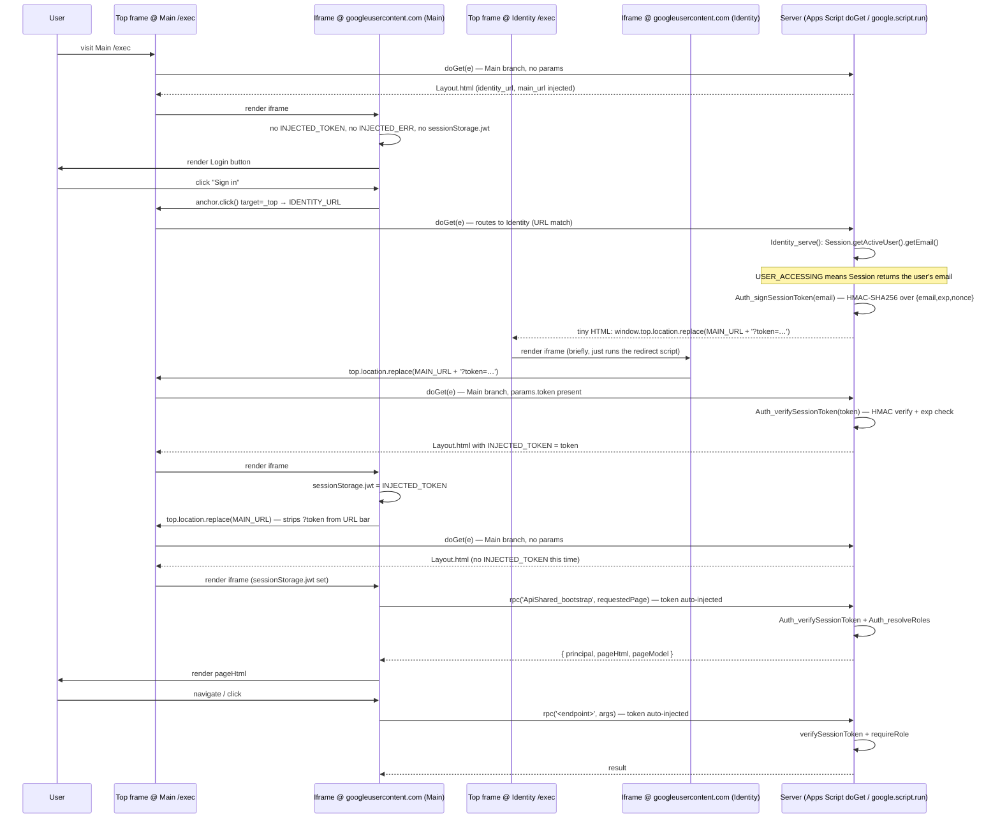

# Architecture

## 1. Goals

- One deployable artifact (a single bound Apps Script project).
- Everything stored in the backing Sheet — no external DB, no Script Properties except for rare low-level flags.
- Clear separation between data access (`repos/`), business logic (`services/`), and client-facing API (`api/`), so each layer is reviewable in isolation.
- Every write is serialised by `LockService` and audited to `AuditLog`.
- Cloudflare Worker is decoupled and added last.

### Scale targets (confirmed 2026-04-19)

12 wards, ~250 active seats, 1–2 manual/temp requests per week. This is low-traffic software: no server-side pagination, no polling/real-time updates, no batched writes, and no importer continuation-token scheme needed for v1. If any of these assumptions shift by >5×, revisit.

## 2. Decisions made here (not explicit in the spec)

| # | Decision | Why |
| --- | --- | --- |
| D1 | **Container-bound** Apps Script project for Main (bound to the backing Sheet via Extensions → Apps Script). The Sheet may live in a Workspace shared drive — the auth flow's Workspace incompatibility is handled by D10 (Identity is a separate, personal-account-owned project). | Simpler deploy and permissions model; `SpreadsheetApp.getActiveSpreadsheet()` always returns the right sheet, no Script-Property plumbing. Trade-off: one Sheet per Main deployment. |
| D2 | `webapp.executeAs = "USER_DEPLOYING"` (Main deployment) and `webapp.access = "ANYONE"`. The Identity deployment uses `executeAs = "USER_ACCESSING"` instead — see D10. Both share `access = "ANYONE"`. (The deploy dialog shows `ANYONE` as the human-readable label "Anyone with Google account" — `ANYONE` in the manifest *requires sign-in*; `ANYONE_ANONYMOUS` would be the no-sign-in variant.) | On Main, users never need read access to the backing sheet (the deployer does). All users are on consumer Gmail, so `DOMAIN` access doesn't apply; `ANYONE` gates the app at the Google login wall. Identity is established by Identity_serve under `USER_ACCESSING` (D10), not by `Session.getActiveUser().getEmail()` on Main — that returns empty cross-customer. |
| D3 | UUIDs (`Utilities.getUuid()`) for `seat_id` and `request_id` (system-generated, never seen by users). **Natural keys** for `Wards` (`ward_code`, 2-char user-chosen) and `Buildings` (`building_name`, free text user-chosen). Cross-tab references (`Wards.building_name`, `Seats.scope`, `Access.scope`, `Requests.scope`, `Seats.building_names`) use these natural keys directly — no separate slug-PK column. | UUIDs are right when there's no good natural key (the same person can have many seats; same email can have many requests). Wards and Buildings each have an obviously-unique natural identifier (`ward_code` because the importer joins on it; `building_name` because users picked unique names anyway), so a separate slug-PK was just one more thing to keep in sync. Renaming a natural key still cascades-breaks references; the manager UI fires a `confirm()` before submitting a rename. See open-questions.md C-5. |
| D4 | Emails are stored **as typed** (preserve case, dots, `+suffix`); a canonical form (lowercased + Gmail dot/`+suffix` stripping + `googlemail.com` → `gmail.com`) is computed on the fly only for **comparison** via `Utils_emailsEqual`. The canonical form never lands in a cell. Source-row hashes (importer) still use the canonical form so they're stable across the format wobbles LCR introduces. | Storing canonical strips information the user typed (e.g. `first.last@gmail.com` → `firstlast@gmail.com`), which is wrong for display and for any future "email this person" path. Comparing canonical-on-the-fly preserves the original while still letting `first.last@gmail.com` and `firstlast@gmail.com` resolve to the same role. See [`open-questions.md` I-8](open-questions.md#i-8-resolved-2026-04-19-gmail-address-canonicalisation--apply-from-day-1) for the exact algorithm. |
| D5 | `source_row_hash` = SHA-256 of `scope|calling|canonical_email` (canonicalisation per D4). | Stable; identifies a specific auto-seat assignment across imports regardless of row order or incoming email variant. |
| D6 | All sheet reads go through a thin `Repo` layer that returns plain objects; callers never touch `Range`/`Values` directly. | Lets us swap out Sheet for another backend later; and keeps column-index knowledge in exactly one place. |
| D7 | A single `Setup.gs` function (`setupSheet`) creates/repairs all tabs and headers. Optionally exposed via `onOpen()` custom menu. | Removes human error from manual tab creation; safely re-runnable. |
| D8 | Dates stored as ISO date strings in `Requests.start_date`, `Seats.start_date`, etc.; timestamps stored as `Date` in `*_at` columns. | ISO dates sort lexically and are unambiguous across locales; `Date` on `*_at` lets Sheets show human-readable times. |
| D9 | Query routing via a single `?p=` query param; default page picked by highest-privilege role held by the user. | Keeps URLs short, makes deep links possible, preserves single-entry-point `doGet`. |
| D10 | **Two-project `Session.getActiveUser` + HMAC-signed session token** as the identity layer. Two **separate** Apps Script projects, sharing only an HMAC `session_secret` value held in two places (manually synchronized). **Main** is the Workspace-owned, Sheet-bound project (`executeAs: USER_DEPLOYING`, URL stored in `Config.main_url`); it renders all UI and reads/writes the backing Sheet under the deployer's identity. **Identity** is a personal-account-owned, *standalone* project (`executeAs: USER_ACCESSING`, URL stored in `Config.identity_url`); it only reads `Session.getActiveUser().getEmail()`, HMAC-signs `{email, exp, nonce}` with `session_secret`, and renders a tiny page that navigates the top frame back to Main with `?token=…`. Main's `doGet` consumes the `?token`, hands it to `Auth_verifySessionToken` (constant-time HMAC compare + `exp` check), and stashes it in `sessionStorage.jwt`; every subsequent `google.script.run` call re-verifies. The Login link in `Layout.html` navigates straight to `Config.identity_url` — no routing param, no dispatch on the Main side. The shared `session_secret` lives in (a) Main's Sheet `Config.session_secret`, (b) Identity's project Script Properties; rotation procedure is documented in `identity-project/README.md`. Both projects' source is in this repo: Main under `src/`, Identity under `identity-project/` (copy-pasted into the editor; not pushed via clasp). | The original plan was to use Google Sign-In (GSI) drop-in or any other browser-initiated OAuth flow from inside Apps Script HtmlService. **All such flows fail** — `*.googleusercontent.com` is on Google's permanent OAuth-origin denylist, and Google rejects every initial `accounts.google.com/o/oauth2/v2/auth` request with `origin_mismatch` regardless of `response_type` (implicit *or* code), regardless of Referer suppression. The only Apps-Script-native primitive that returns the user's email reliably is `Session.getActiveUser` under `USER_ACCESSING`. The two-project (rather than two-deployment) split exists because **Workspace-owned Apps Script projects gate consumer-Gmail accounts at the OAuth-authorize step** for `executeAs: USER_ACCESSING` deployments, even when "Who has access" is "Anyone with Google account" and the OAuth consent screen is External + In production. The Workspace tenant's gate is below the deployment dialog. Personal-account projects are not subject to that gate, so Identity lives in a personal-account project. Main remains Workspace-bound so the Sheet keeps its Workspace ownership / shared-drive properties. The HMAC signature lets Main *trust* what Identity issues without any shared database — the only shared state is the secret, which is small enough to copy by hand. **No OAuth client (in the GCP sense) is required.** Cost: a one-time per-user OAuth-consent prompt on the Identity project (for the email scope only — non-sensitive, immediate accept) and a second Apps Script project to manage. See open-questions.md A-8 (the failed OAuth pivots) and D-3 (the Workspace incompatibility). |

See [`open-questions.md`](open-questions.md) for decisions I'm not sure about.

## 3. Directory structure

The repo holds **two** Apps Script projects:

- **`src/`** — the Main project. Workspace-bound to the backing Sheet,
  pushed via `clasp` (`npm run push`).
- **`identity-project/`** — the standalone Identity service. Lives in a
  personal Google Drive (no Workspace ownership), no bound Sheet.
  Source kept in this repo for reference; copy-pasted into the
  Apps Script editor manually. See `identity-project/README.md`.

```
src/
├── appsscript.json                # manifest (scopes, timezone, webapp config)
│
├── core/                          # cross-cutting infrastructure
│   ├── Main.gs                    # doGet / doPost entry points
│   ├── Router.gs                  # maps (role, page) → template
│   ├── Auth.gs                    # resolves signed-in email → roles
│   ├── Lock.gs                    # withLock(fn) helper
│   └── Utils.gs                   # date, hash, uuid, email-normalise helpers
│
├── repos/                         # one module per Sheet tab — pure data access
│   ├── ConfigRepo.gs
│   ├── KindooManagersRepo.gs
│   ├── BuildingsRepo.gs
│   ├── WardsRepo.gs
│   ├── TemplatesRepo.gs           # both WardCallingTemplate and StakeCallingTemplate
│   ├── AccessRepo.gs
│   ├── SeatsRepo.gs
│   ├── RequestsRepo.gs
│   └── AuditRepo.gs
│
├── services/                      # business logic; calls repos, wraps locks, writes audit
│   ├── Setup.gs                   # setupSheet(): idempotent tab/header creation
│   ├── Bootstrap.gs               # first-run wizard state machine
│   ├── Importer.gs                # weekly import from callings sheet
│   ├── Expiry.gs                  # daily temp-seat expiry
│   ├── Rosters.gs                 # read-side roster shape + utilization math
│   ├── RequestsService.gs         # submit / complete / reject / cancel
│   ├── EmailService.gs            # typed wrappers over MailApp.sendEmail
│   └── TriggersService.gs         # install/remove time-based triggers
│
├── api/                           # server-side entry points exposed to google.script.run
│   ├── ApiShared.gs               # whoami(), version, health
│   ├── ApiBishopric.gs
│   ├── ApiStake.gs
│   └── ApiManager.gs
│
└── ui/                            # HTML served via HtmlService
    ├── Layout.html                # shell: head, nav, role switcher, content slot
    ├── Nav.html                   # per-role navigation links
    ├── Styles.html                # shared CSS (<style>)
    ├── ClientUtils.html           # shared client JS (<script>) — rpc helper, toasts
    ├── NotAuthorized.html
    ├── BootstrapWizard.html
    ├── bishopric/
    │   ├── Roster.html
    │   ├── NewRequest.html
    │   └── MyRequests.html
    ├── stake/
    │   ├── Roster.html
    │   ├── NewRequest.html
    │   ├── MyRequests.html
    │   └── WardRosters.html
    └── manager/
        ├── Dashboard.html
        ├── RequestsQueue.html
        ├── AllSeats.html
        ├── Config.html
        ├── Access.html
        ├── Import.html
        └── AuditLog.html

identity-project/                  # standalone Identity service (separate Apps Script project)
├── Code.gs                        # Session.getActiveUser → HMAC-sign → top-frame redirect
├── appsscript.json                # USER_ACCESSING + ANYONE + userinfo.email scope only
└── README.md                      # setup + secret-rotation runbook
```

**Note on Apps Script's flat namespace.** Apps Script concatenates all `.gs` files into one global scope at runtime; subdirectories under `src/` become folder prefixes in the Apps Script editor (e.g., `repos/SeatsRepo`) but don't isolate anything. Every exported function must have a unique, prefixed name — `Seats_getByScope`, not `getByScope`. Treat the repo modules like `namespace.module` identifiers.

## 4. Request lifecycle

Authentication is split between **two Apps Script projects** — a Workspace-bound Main project that handles UI and data access, and a personal-account-owned Identity project that exists only to read `Session.getActiveUser` and HMAC-sign the result. The two share an HMAC `session_secret` value (manually synchronized between Main's `Config.session_secret` cell and Identity's Script Properties — see `identity-project/README.md`). The flow round-trips the user between them once at sign-in. Sequence diagram below labels them generically as "Main" and "Identity"; the underlying split is two-project, not two-deployment-of-one-project.



### Step-by-step

1. **Initial visit.** User visits Main `/exec`. `Main.doGet(e)` checks whether the current request is hitting the Identity deployment by comparing `ScriptApp.getService().getUrl()` against `Config.identity_url`. On the Main deployment this comparison is false, so doGet renders `Layout.html` with `identity_url`, `main_url`, `injected_token=''`, `injected_error=''` injected.
2. **Iframe boot.** Layout.html's `<script>` checks four states in order:
   1. `INJECTED_TOKEN` set → just returned from Identity with a verified token. Stash in `sessionStorage.jwt`, reload top to clean `MAIN_URL`.
   2. `INJECTED_ERR` set → token verification failed server-side (most often: stale token, or `session_secret` was rotated). Show the error.
   3. `sessionStorage.jwt` present and not client-side-expired → bootstrap path.
   4. Otherwise → show Login button.
3. **Sign-in click.** `startSignIn()` programmatically clicks an `<a target="_top" href="IDENTITY_URL">` to navigate the top frame to the Identity deployment.
4. **Identity round trip.** Top frame navigates to the Identity deployment's `/exec`. Apps Script invokes `doGet`, which sees that this URL matches `Config.identity_url` and dispatches to `Identity_serve()`:
   1. Reads `Session.getActiveUser().getEmail()` (works because this deployment runs as `USER_ACCESSING`). On first user visit, Google shows the standard "Kindoo Access Tracker wants to access: View your email address" consent screen — non-sensitive scope, no Google-verification review required, immediate accept.
   2. Calls `Auth_signSessionToken(email)`: builds `{ email: canonical, exp: now+3600, nonce: uuid() }`, base64url-encodes the JSON payload, HMAC-SHA256 signs it with `Config.session_secret`, returns `<base64url-payload>.<base64url-sig>`.
   3. Returns a tiny HTML page that does `window.top.location.replace(MAIN_URL + '?token=<TOKEN>')`. Wrapped in iframe by HtmlService — but the script inside reaches `window.top` and navigates the top frame.
5. **Token exchange completes.** Top frame navigates to Main `/exec?token=…`. `Main.doGet` sees `e.parameter.token`, calls `Auth_verifySessionToken(token)`:
   1. Splits on `.`. Re-computes HMAC over the payload using `Config.session_secret`. Constant-time compare against the supplied signature.
   2. base64url-decodes the payload, parses JSON. Validates `exp > now − 30s`.
   3. Returns `{ email, name:'', picture:'' }`.
   doGet sets `template.injected_token = token` (or `template.injected_error = err.message` on failure) and renders Layout.
6. **Client stashes token, cleans URL.** Iframe boot sees `INJECTED_TOKEN` (step 2.i): `sessionStorage.jwt = INJECTED_TOKEN`, then `window.top.location.replace(MAIN_URL)`. The top reloads to bare Main `/exec`, stripping `?token` from the address bar and browser history.
7. **Bootstrap path.** With `sessionStorage.jwt` set, the client calls `rpc('ApiShared_bootstrap', requestedPage)` (the rpc helper auto-injects the token as the first argument). Server-side:
   1. `Auth_verifySessionToken(token)` — cheap HMAC re-verify.
   2. **Setup-complete gate (Chunk 4, live).** Read `Config.setup_complete`. If `FALSE` and verified email matches `bootstrap_admin_email` (via `Utils_emailsEqual`), short-circuit to `ui/BootstrapWizard.html` ignoring `?p=`. If `FALSE` and email does NOT match, short-circuit to `ui/SetupInProgress.html` (distinct from `NotAuthorized`). Only if `setup_complete === true` does the request proceed to role resolution below.
   3. `Auth_resolveRoles(email)` returns `{ email, roles[] }`. No roles → `NotAuthorized`.
   4. `Router_pick(requestedPage, principal)` returns `{ template, pageHtml, pageModel }`; role restrictions enforced here.
   5. Server returns `{ principal, pageHtml, pageModel }` to the client.
8. **Client renders** the returned `pageHtml` into the content slot. Topbar shows the user's email.
9. **Subsequent calls** pass the token (auto-injected by `rpc`) and re-verify on the server. HMAC verification is pure local CPU — no network — so re-verify is essentially free.

### Failure modes

| Failure | Client behaviour | Server behaviour |
| --- | --- | --- |
| Token expired (exp in the past) | Client-side `isExpired` short-circuits before any rpc — clear `sessionStorage.jwt`, show Login. | `Auth_verifySessionToken` throws `AuthExpired` if a stale token slipped past the client check. |
| Token HMAC invalid (tampered or signed with a rotated `session_secret`) | Same as above (clear token, show Login). | Throws `AuthInvalid`. Logged. |
| `session_secret` missing in Config | Login button works through to Identity, but Identity throws `AuthNotConfigured` and renders an error page. | `Auth_signSessionToken` / `Auth_verifySessionToken` throw `AuthNotConfigured`. |
| `identity_url` missing in Config | Login button refuses; shows "identity_url is not configured." | n/a. |
| `main_url` missing in Config | Identity service refuses to redirect; shows "Configuration error: main_url is not configured." | n/a. |
| `Session.getActiveUser` returns empty (user hasn't authorised the Identity deployment) | Identity service shows "Sign-in unavailable: visit the Identity URL once directly to grant the email permission, then return." | n/a. (Should self-heal once the user goes through Google's consent prompt.) |
| User has no roles after sign-in | Show `NotAuthorized` explaining bishopric-import-lag possibility. | `principal.roles.length === 0`. |
| Browser-initiated OAuth from inside the HtmlService iframe (e.g. an attempt to revert to GSI's drop-in button or `response_type=id_token`) | Google rejects with `origin_mismatch` because `*.googleusercontent.com` is on the JS-origin denylist and can't be allowlisted. **This is why we use the two-deployment Session+HMAC pattern instead of OAuth.** See open-questions.md A-8. | n/a. |

## 5. Auth & role resolution

### Inputs

- An **HMAC-signed session token** presented by the client with every `google.script.run` call. Source of truth for identity. Issued by the Identity deployment after it reads `Session.getActiveUser().getEmail()`; verified by Main on every request via `Config.session_secret`.
- `KindooManagers` rows with `active = true` — the manager set.
- `Access` rows — the bishopric and stake-presidency set.

`Session.getActiveUser().getEmail()` is **only** called inside `Identity_serve` — that's the one place in the codebase that runs under `executeAs: USER_ACCESSING`, where Session correctly returns the accessing user's email (even for consumer Gmail). Everywhere else (Main deployment, `executeAs: USER_DEPLOYING`), Session would return either empty or the deployer; we never use it for identity outside Identity_serve.

### Session token format

```
<base64url(JSON({ email, exp, nonce }))>.<base64url(HMAC-SHA256(payload, session_secret))>
```

Two segments, dot-separated. Distinguishable from a JWT (three segments). Stored client-side in `sessionStorage.jwt` (the key name predates this design and is preserved for rpc-helper compat).

### Token verification — `Auth_verifySessionToken(token)`

1. Split on `.` — must yield exactly two segments.
2. Re-compute `HMAC-SHA256(segment0, Config.session_secret)` via `Utilities.computeHmacSha256Signature`.
3. base64url-encode and constant-time-compare against `segment1`. Mismatch → throw `AuthInvalid`.
4. base64url-decode `segment0`, parse JSON.
5. Check `exp > now − 30s` (small clock-skew leeway). Past-exp → throw `AuthExpired`.
6. Return `{ email: normaliseEmail(payload.email), name: '', picture: '' }`. The `name`/`picture` fields are empty because `Session.getActiveUser` doesn't surface them; we could fill via a People API call later if we needed avatars in the UI.

If `Config.session_secret` is unset or shorter than 32 chars, both `Auth_signSessionToken` and `Auth_verifySessionToken` throw `AuthNotConfigured`.

### Token issuance — `Auth_signSessionToken(email, ttlSeconds?)`

Inverse of the above. Builds `{ email: canonical, exp: now+ttl, nonce: uuid() }`, base64url-encodes the JSON, HMAC-SHA256-signs with the secret, returns the two-segment token. Default TTL is 1 hour.

Called only from `Identity_serve` after `Session.getActiveUser` succeeds.

### Output — a `Principal` object

```
{
  email: "jane@example.org",
  name: "",     // empty for now; Session.getActiveUser doesn't surface it
  picture: "",  // ditto
  roles: [
    { type: "manager" },
    { type: "stake" },
    { type: "bishopric", wardId: "cordera-1st" }
  ]
}
```

Multi-role is possible (one person can be a Kindoo Manager AND a bishopric counsellor AND in the stake presidency — rare but real; spec requires UI to show the union).

### Enforcement

- `Auth_principalFrom(token)` — verifies the session token, resolves roles, returns a `Principal`. Every `api/` function calls this before doing work.
- `Auth_requireRole(principal, roleMatcher)` — throws `Forbidden` on mismatch.
- `Auth_requireWardScope(principal, wardId)` — throws `Forbidden` if the user is not a bishopric for that ward and not a manager/stake. Used to prevent cross-ward data access.
- The client's `rpc(name, args)` helper automatically injects `sessionStorage.jwt` as the first argument, so call sites don't repeat it.

### Bishopric lag

Accepted per spec. A newly-called bishopric member cannot sign in until the next weekly import (or a manual "Import Now" run). `NotAuthorized` mentions this as a possible cause.

### Two identities — Apps Script execution vs. actor

The **Main** deployment runs `executeAs: USER_DEPLOYING`, so every Sheet write happens under the **deployer's** Google identity. That's what shows up in the Sheet's file-level revision history, and that's what `Session.getEffectiveUser().getEmail()` would return inside Main. That identity is **infrastructure** — it represents "the app", not the person who caused the change.

The **actor** on any change is whoever initiated it: the signed-in user whose HMAC session token we just verified (originally captured by Identity_serve via `Session.getActiveUser` under `USER_ACCESSING`), or the literal string `"Importer"` / `"ExpiryTrigger"` for automated runs. That's what we write to `AuditLog.actor_email`.

This distinction is deliberate and needs to be understood before debugging history:

- **Sheet revision history shows the deployer for every row** — this is correct and uninteresting. Don't use it to figure out who did what.
- **`AuditLog` is the authoritative record** of authorship. `actor_email` is truth; the Apps Script execution identity is plumbing.
- **In the Main deployment we never read `Session.getActiveUser()` or `Session.getEffectiveUser()` for authorship** — the only source is the verified session token. (Inside Identity_serve, `Session.getActiveUser` is the *only* identity primitive — that's the entire purpose of having a separate Identity deployment with `USER_ACCESSING`.)

Consequence for services: `AuditRepo.write({actor_email, ...})` requires the caller to pass the actor — there is no "pick it up from the environment" convenience fallback, because doing so would silently record the deployer.

## 6. LockService strategy

One helper, `Lock.withLock(fn, opts?)`:

```
function Lock_withLock(fn, opts) {
  opts = opts || {};
  var lock = LockService.getScriptLock();
  var timeout = opts.timeoutMs || 10000; // 10s default
  if (!lock.tryLock(timeout)) {
    throw new Error("Another change is in progress — please retry in a moment.");
  }
  try {
    return fn();
  } finally {
    lock.releaseLock();
  }
}
```

### Rules

- **Every** service function that writes to any tab wraps its work in `Lock_withLock`. No exceptions.
- Importer and Expiry wrap their full run (they're long — up to a few minutes — so we raise `timeoutMs` to, e.g., 30s of waiting). They also write a `start`/`end` row to `AuditLog` to bracket the run.
- Read paths do **not** take the lock. Sheet reads are snapshot-consistent enough for this workload, and locking reads would serialise the entire app.
- Within a single request, we acquire the lock once at the top of the write path and release at the end. Nested calls are avoided.
- **Contention contract.** On `tryLock` timeout, `Lock_withLock` throws the literal string `"Another change is in progress — please retry in a moment."` The client's `rpc` helper surfaces server-thrown errors as toasts (`ClientUtils.html#toast`); the message is intended to be shown to the user verbatim.

### Why script lock, not document lock

Script lock is per-script-instance and covers any user invocation, including triggers. Document lock covers the sheet only from the script's perspective but isn't stronger for our purposes, and script lock also serialises import-with-expiry concurrency.

## 7. Data access layer

One file per tab under `repos/`. Each exports pure functions that return plain JS objects (snake_case keys matching header names). No file talks to `SpreadsheetApp` except through a repo. A tiny shared `Sheet_getTab(name)` helper caches `getSheetByName` lookups within a single request.

### Patterns used across repos

- `Xxx_getAll()` — returns every row as an array of objects.
- `Xxx_getById(id)` / `Xxx_getByScope(scope)` — filtered reads.
- `Xxx_insert(obj)` / `Xxx_update(id, patch)` / `Xxx_delete(id)` — pure single-tab writes. The repo enforces single-tab invariants (PK uniqueness on insert, existence-check on update/delete, header-drift refusal). The repo does **not** call `AuditRepo.write` itself, and does **not** acquire the lock. Both are the **API layer's** responsibility — the canonical Chunk-2 pattern (chunk-1-scaffolding.md "Next") wraps the repo write and the audit write in the same `Lock_withLock` block, so the log is always consistent with the data even on crash.
- Cross-tab invariants (foreign-key blocks like Buildings → Wards on delete; Wards → Seats on delete in Chunk 5+) live in the **API layer**, not in repos. This keeps each repo testable in isolation and avoids circular module dependencies.
- For tabs whose schema is shared between two physical tabs (e.g., `WardCallingTemplate` and `StakeCallingTemplate`), one repo file exports `Xxx_<verb>(kind, ...)` taking a `kind` discriminator (`'ward'` / `'stake'`), so the schema lives in one place.
- The API-layer convention for "insert or update by PK" is `ApiManager_<thing>Upsert(token, row)`: read existing by PK, branch to repo `_insert` or `_update` based on whether it exists, emit one audit row with the chosen action (`insert` / `update`) and `before` populated from the lookup.
- Columns are defined once per repo as a `const XXX_HEADERS_ = ['seat_id', 'scope', ...]` tuple. `setupSheet` reads these to build the headers. If a header mismatch is detected on any read **or write** path, the repo throws with the column index and bad value — prevents subtle column-drift bugs.

### Why not one monolithic `SheetService`

Tried it mentally — every function ends up switch-casing on tab name. Per-tab repos co-locate column knowledge and validation with the thing being validated. Testable by swapping the repo module.

## 8. HTML & page routing

- **Entry point**: `doGet(e)` returns an `HtmlOutput` built from `Layout.html` via `HtmlService.createTemplateFromFile('ui/Layout')`.
- **Includes**: a global `include(path)` helper returns `HtmlService.createHtmlOutputFromFile(path).getContent()` so templates can compose each other via `<?!= include('ui/Styles') ?>`.
- **Model injection**: the template's `evaluate()` is preceded by assigning properties on the template object (`t.principal = ...; t.model = ...`). Client code reads initial state from a `<script>var __init = <?= JSON.stringify(model) ?>;</script>` block at the bottom of the layout.
- **Client RPC**: `ClientUtils.html` wraps `google.script.run` into a `rpc(name, args)` that returns a Promise, with a toast/error UI on failure. All client-side calls go through it.
- **Role-based menus**: `Nav.html` is rendered server-side with the current principal (by `Router_pick` in `core/Router.gs`) and returned as `navHtml` alongside `pageHtml`. It emits only the links the user's roles allow and marks the currently-rendered page as `active`. `Layout.html` hosts it in a `#nav-host` slot above `#content` and rehydrates its inline script (the one that rewires each `data-page` anchor's href to `MAIN_URL + ?p=<page>`).
- **Deep links**: query-string `?p=<page-id>` for page dispatch, plus per-page filter keys (e.g. `&ward=CO&type=manual` for `mgr/seats`) forwarded through as `QUERY_PARAMS` on the client. Main.doGet strips the reserved keys (`p`, `token`) and JSON-encodes the remainder into the Layout template, since the iframe can't read the top-frame's query string (cross-origin). Deep links survive the Cloudflare Worker proxy as long as the worker preserves query strings.

### Page ID map

Entries marked *(Chunk N)* are page-id placeholders reserved for later chunks — Router returns the role default for them today.

| `?p=` | Template | Allowed roles |
| --- | --- | --- |
| *(empty)* | role default (manager → `mgr/seats` until Chunk 10's Dashboard; stake → `stake/roster`; bishopric → `bishopric/roster`) | any |
| `bishopric/roster` | `ui/bishopric/Roster` | bishopric |
| `bishopric/new` *(Chunk 6)* | `ui/bishopric/NewRequest` | bishopric |
| `bishopric/my` *(Chunk 6)* | `ui/bishopric/MyRequests` | bishopric |
| `stake/roster` | `ui/stake/Roster` | stake |
| `stake/ward-rosters` | `ui/stake/WardRosters` | stake |
| `stake/new` *(Chunk 6)* | `ui/stake/NewRequest` | stake |
| `stake/my` *(Chunk 6)* | `ui/stake/MyRequests` | stake |
| `mgr/seats` | `ui/manager/AllSeats` | manager |
| `mgr/config` | `ui/manager/Config` | manager |
| `mgr/access` | `ui/manager/Access` | manager |
| `mgr/import` | `ui/manager/Import` | manager |
| `mgr/dashboard` *(Chunk 10)* | `ui/manager/Dashboard` | manager |
| `mgr/queue` *(Chunk 6)* | `ui/manager/RequestsQueue` | manager |
| `mgr/audit` *(Chunk 10)* | `ui/manager/AuditLog` | manager |

Multi-role principals land on the highest-privilege role's default (manager > stake > bishopric). A user who hits a `?p=` they can't access (wrong role, or an unrecognised id) silently falls back to their default page; the "redirect with toast" UX is Chunk 10 polish.

### Role-scoped reads

Roster reads enforce scope at the **API layer**, not the UI. A bishopric member for ward CO physically cannot read ward GE's roster by crafting a URL or calling `ApiBishopric_roster` with a spoofed scope — the scope is derived server-side from the verified principal via `Auth_findBishopricRole(principal)`, never from a parameter. Cross-ward reads for stake users go through `ApiStake_wardRoster(token, wardCode)` which validates the ward_code exists and that the caller holds the `stake` role. Managers use `ApiManager_allSeats(token, filters)` which checks `manager` independently. Every endpoint checks its own role requirement — having manager role doesn't satisfy a bishopric-scoped check.

## 9. Importer & Expiry triggers

### Importer

- Public entry: `Importer_runImport({ triggeredBy })` in `services/Importer.gs`. `triggeredBy` is the manager's email (or the literal `"weekly-trigger"` once Chunk 9 lands) and is recorded only in the `import_start` / `import_end` audit payloads — **`actor_email` on every per-row AuditLog entry is the literal string `"Importer"`** (spec §3.2, §5 "Two identities"), not the manager's email.
- Invoked from `ApiManager_importerRun(token)`, which applies the canonical Chunk-2 shape (`Auth_principalFrom` → `Auth_requireRole('manager')` → `Lock_withLock(fn, { timeoutMs: 30000 })`). One lock covers the full run — diff + apply across all tabs — not one lock per tab. The generous timeout is per §6's "Importer and Expiry wrap their full run" rule.
- Reads `Config.callings_sheet_id`, opens via `SpreadsheetApp.openById`. Runs as the deployer (Main's `executeAs: USER_DEPLOYING`), so the callings sheet must be shared with the deployer's personal Google account — documented in `sheet-setup.md` step 15.
- Loops sheets; matches tab name against `Wards.ward_code` or `"Stake"`. Other tabs skipped (recorded as `skipped_tabs` in the `import_end` payload).
- Per matched tab, parses rows per spec §8: scans the top 5 rows for a header row that has `Position` anywhere AND a column-D header whose text contains `personal email` (case-insensitive) — so a title / instructions block above the real headers doesn't break the parse, and LCR's header-text variations (`Personal Email`, `Personal Email(s)`, `Personal Emails`, sometimes followed by a `Note: …` blurb in the same cell) all resolve. On ward tabs, strips the 2-letter `<CODE> ` prefix from `Position`; on the Stake tab, uses `Position` verbatim (LCR's Stake export has no ward-code prefix). Unions column D + every non-blank cell to its right (handles I-3's multi-row variant too via hash-keyed dedupe), filters `(calling, email)` pairs against the appropriate template (`WardCallingTemplate` or `StakeCallingTemplate`). Template `calling_name` values may contain `*` as a wildcard — the importer builds an index (`Importer_templateIndex_`) that keeps exact entries on a fast-path map and compiles wildcard entries into anchored regexes; `Importer_templateMatch_` prefers exact over wildcard, Sheet-order among wildcards. See data-model.md "Wildcard patterns". Rows whose calling isn't in the template are silently skipped (I-6). On ward tabs, a position that doesn't start with the tab's prefix is skipped with a warning (I-5); the Stake tab has no prefix rule so I-5 doesn't apply there.
- **Idempotency key**: `source_row_hash = SHA-256(scope|calling|canonical_email)` (D5). Emails are stored as typed in `Seats.person_email` and `Access.email` (D4 — `Utils_cleanEmail`, trim only), but canonicalised for the hash and for Access's `(canonical_email, scope, calling)` diff key, so a LCR-side format wobble (`alice.smith@gmail.com` → `alicesmith@gmail.com`) produces zero inserts and zero deletes.
- Fetches current `Seats` (auto only) and `Access` per scope once, builds diffable sets keyed on `source_row_hash` and `(canonical_email, calling)`. A row unchanged in the source produces **zero** AuditLog entries — only `import_start` / `import_end` are always written.
- **Scopes with no matching tab are left alone (I-2).** If `Wards` lists `ward_code=CO` but the callings sheet has no `CO` tab, the ward's existing auto-seats and Access rows are preserved — a tab rename must not silently wipe a ward's roster. A per-ward warning is recorded in the `import_end` payload.
- **Batched writes.** Inserts hit `Seats_bulkInsertAuto(rows)` (one `setValues` call) and `AuditRepo_writeMany(entries)` (one `setValues` for the audit batch). Deletes stay per-row via `Seats_deleteByHash` / `Access_delete` (volumes are small — a few per week). This keeps a full first-run import (~250 rows, ~500 writes equivalent) well under the 6-minute execution cap; `[Importer] completed in Xs` is logged at end-of-run for early detection if scale shifts.
- Writes `Config.last_import_at` and `Config.last_import_summary` (human-readable: `5 inserts, 2 deletes, 1 access+/0 access- (2026-04-20 14:32 MDT, 6.4s)`) at the end of the successful path. On failure, writes a `FAILED: <msg>` summary so the manager UI shows the reason without re-running.
- Emits an over-cap email if any ward's or stake's final seat count > its cap — **deferred to Chunk 9**, not part of Chunk 3.
- **Repo boundary**: the importer service owns the diff logic and the lock; the repos (`SeatsRepo`, `AccessRepo`, `AuditRepo`, `ConfigRepo`) expose pure single-tab helpers and never acquire the lock or emit audit rows themselves (§7).

### Expiry

- Runs daily at 03:00 local time (configurable, stored in `Config.expiry_hour`).
- Scans `Seats` for rows with `type=temp` and `end_date < today` (midnight, local time zone from `appsscript.json`).
- Deletes rows inside one lock; writes per-row AuditLog entries with action `auto_expire` and `before_json` preserving the row.

### Trigger management

`TriggersService.install()` idempotently creates both triggers if absent. Invoked from the bootstrap wizard's last step and from a manager-only "Reinstall triggers" button on the Configuration page, so operators can self-heal.

## 10. Bootstrap flow

1. `setupSheet()` (run once in the Apps Script editor, or via a custom menu added by `onOpen()`): creates every tab, writes headers, seeds empty `Config` rows for well-known keys, and a `setup_complete=FALSE` flag.
2. The Kindoo Manager sets `Config.bootstrap_admin_email` manually in the sheet, deploys both the Main and Identity webapps, and pastes the URLs into Config.
3. The **setup-complete gate** runs in `ApiShared_bootstrap` (`src/api/ApiShared.gs`), **before** `Router_pick` / role resolution, on every page load:
   - `setup_complete === true` → normal role resolution (the Chunks 1-3 path).
   - `setup_complete === false` AND signed-in email matches `bootstrap_admin_email` (via `Utils_emailsEqual`) → render `ui/BootstrapWizard.html` regardless of `?p=`.
   - `setup_complete === false` AND email does NOT match → render `ui/SetupInProgress.html` (NOT `NotAuthorized` — the user isn't unauthorised, the app isn't ready).
   The gate runs before role resolution so the bootstrap admin — who has no roles yet (KindooManagers is empty, Access is empty) — doesn't land on NotAuthorized.
4. Wizard steps (single page, state-driven entirely from the server; each `ApiBootstrap_*` rpc returns the full refreshed state so the UI is resilient to mid-wizard browser reload):
   1. Stake name + callings-sheet ID + stake seat cap (writes to `Config`).
   2. At least one Building (writes to `Buildings`).
   3. At least one Ward (writes to `Wards`; building picker reads current Buildings).
   4. Additional Kindoo Managers (optional — the bootstrap admin is **auto-added** as the first active `KindooManager` on wizard entry; step 4 is for seeding further managers).
   Navigation between completed steps is free so the admin can edit prior entries; the **Complete Setup** button is enabled only when steps 1-3 all have data.
5. Finish: inside one `Lock_withLock` acquisition, the wizard calls `TriggersService_install()` (stubbed until Chunks 8/9 land the real triggers), flips `Config.setup_complete=TRUE` via `Config_update`, writes an `AuditLog` row with `action='setup_complete'`, and redirects the admin to `Config.main_url` (which now routes through normal role resolution → manager default page, since the admin was auto-added to `KindooManagers`).

### `ApiBootstrap_*` endpoint pattern

The bootstrap admin holds NO roles during setup (KindooManagers empty, Access empty), so `Auth_requireRole('manager')` would reject them. Rather than temporarily elevate them to manager (which leaks a special case into every guard), the wizard has its own endpoint surface in `services/Bootstrap.gs` with its own auth gate:

- `Bootstrap_requireBootstrapAdmin_(principal)` — checks both (a) signed-in email matches `Config.bootstrap_admin_email` via `Utils_emailsEqual`, AND (b) `Config.setup_complete` is still `FALSE`. Both required. Once setup flips to TRUE, every `ApiBootstrap_*` endpoint hard-refuses regardless of caller (the wizard is **one-shot**; post-setup edits go through the normal manager Configuration page).
- Each endpoint wraps its work in `Lock_withLock` and emits exactly one `AuditRepo_write` (or `AuditRepo_writeMany` for bulk inserts — see below) inside the same acquisition, exactly like `ApiManager_*`. The underlying repos (`BuildingsRepo`, `WardsRepo`, `KindooManagersRepo`, `ConfigRepo`) are the Chunk-2 CRUD surface — no duplication.
- **Bulk-insert endpoints** (`ApiBootstrap_buildingsBulkInsert`, `ApiBootstrap_wardsBulkInsert`, `ApiBootstrap_kindooManagersBulkInsert`) take an array of rows and commit the whole batch in one `setValues` call plus one `AuditRepo_writeMany` call. The wizard UI queues each step's Adds client-side and flushes on navigation. Repos' `*_bulkInsert` helpers validate every row (PK presence, cross-batch uniqueness, uniqueness against existing rows) before any Sheet write, so a bad row aborts the whole batch and leaves the Sheet untouched; FK checks stay in the API layer. Single-row `*Upsert` / `*Delete` endpoints are preserved for edits and deletes on already-saved rows.
- `actor_email` on every audit row is the signed-in admin's email (the one Identity handed us), not a synthetic `"Bootstrap"` literal. This is different from the automated-actor convention (`Importer`, `ExpiryTrigger`) because the admin is a real human initiating a real action — they should see their own email in AuditLog history.
- The auto-add-admin-as-KindooManager step (`Bootstrap_ensureAdminAsManager_`) runs idempotently at the top of every endpoint inside the lock, emitting its own audit row on first insert. This guarantees that by the time `Complete Setup` runs, the admin is already in KindooManagers, and role resolution on the next page load resolves `'manager'` without manual seed.

## 11. Cloudflare Worker

Final chunk. The Apps Script web app URL is `https://script.google.com/a/macros/<DOMAIN>/s/<SCRIPT_ID>/exec` (or the personal variant). A Worker bound to `kindoo.csnorth.org/*` does:

```js
export default {
  async fetch(request) {
    const src = new URL(request.url);
    const target = new URL('https://script.google.com/macros/s/<SCRIPT_ID>/exec');
    target.search = src.search; // preserve query string
    const proxied = new Request(target.toString(), request);
    return fetch(proxied, { redirect: 'follow' });
  }
}
```

**Known risk** (flagged in open-questions.md): Apps Script web apps perform OAuth redirects through `accounts.google.com` and expect to land back on the `script.google.com` URL. A transparent proxy may break the round trip. If we hit that, Chunk 11 likely pivots to just CNAME + a Cloudflare Redirect Rule (302) to the `/exec` URL — we lose the pretty URL in the address bar after the first hop, but auth still works.

## 12. What lives where, quick reference

| Concern | File |
| --- | --- |
| HTTP entry point (Main project) | `src/core/Main.gs` |
| Decides what page to render; role-default picking; Nav render | `src/core/Router.gs` |
| Identity collection (Session.getActiveUser + HMAC sign) | `identity-project/Code.gs` (separate Apps Script project; see `identity-project/README.md`) |
| Verifies HMAC session tokens; resolves roles; `Auth_findBishopricRole` | `core/Auth.gs` |
| Guards against concurrent writes | `core/Lock.gs` |
| Reads/writes one Sheet tab | `repos/XxxRepo.gs` |
| Orchestrates a business workflow | `services/Xxx.gs` |
| Shared roster shape (row mapper + utilization) | `services/Rosters.gs` |
| Exposed to client via `google.script.run` | `api/ApiXxx.gs` (each endpoint takes the session token as first arg) |
| Rendered to the user | `ui/**.html` |
| Shared client helpers (`rpc`, `toast`, `escapeHtml`, roster renderer) | `ui/ClientUtils.html` |
| Role-aware navigation template | `ui/Nav.html` |
| Login button + token capture | `ui/Login.html` + `ui/ClientUtils.html#rpc` |
