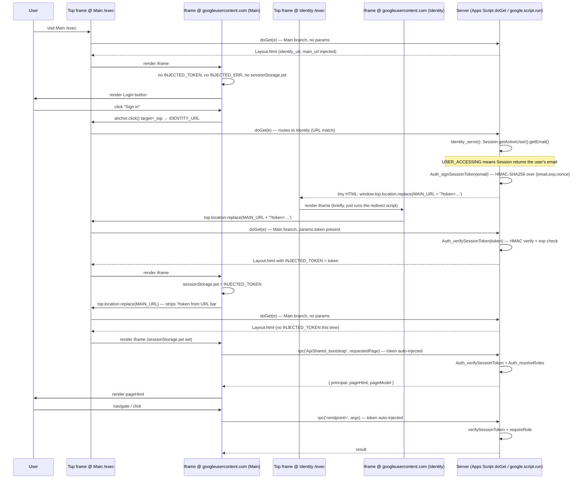

# Architecture

## 1. Goals

- One deployable artifact (a single bound Apps Script project).
- Everything stored in the backing Sheet — no external DB, no Script Properties except for rare low-level flags.
- Clear separation between data access (`repos/`), business logic (`services/`), and client-facing API (`api/`), so each layer is reviewable in isolation.
- Every write is serialised by `LockService` and audited to `AuditLog`.
- Cloudflare Worker is decoupled and added last.

### Scale targets (confirmed 2026-04-19)

12 wards, ~250 active seats, 1–2 manual/temp requests per week. This is low-traffic software: no server-side pagination, no polling/real-time updates, no batched writes, and no importer continuation-token scheme needed for v1. If any of these assumptions shift by >5×, revisit.

**One exception to the no-pagination rule (Chunk 10).** The `AuditLog` tab grows at ~300-500 rows per week at target scale (per-row import audits from Chunk 3 are the dominant source), so a year's data is ~20k rows. The manager **Audit Log page is the only page that paginates server-side**, because rendering that tab in a single table is not feasible. Every other read (roster pages, queue, access, dashboard, import) still reads the whole tab once per request and returns every relevant row — that's the baked-in assumption for low-traffic software. The Audit Log page uses offset/limit (max 100 rows per page) against the full-scan read — simple; cheap to reason about; refactorable to a cursor scheme or reverse-chronological short-circuit when the N+1-read cost stops being tolerable (noted in the ApiManager_auditLog endpoint).

## 2. Decisions made here (not explicit in the spec)

| # | Decision | Why |
| --- | --- | --- |
| D1 | **Container-bound** Apps Script project for Main (bound to the backing Sheet via Extensions → Apps Script). The Sheet may live in a Workspace shared drive — the auth flow's Workspace incompatibility is handled by D10 (Identity is a separate, personal-account-owned project). | Simpler deploy and permissions model; `SpreadsheetApp.getActiveSpreadsheet()` always returns the right sheet, no Script-Property plumbing. Trade-off: one Sheet per Main deployment. |
| D2 | `webapp.executeAs = "USER_DEPLOYING"` (Main deployment) and `webapp.access = "ANYONE"`. The Identity deployment uses `executeAs = "USER_ACCESSING"` instead — see D10. Both share `access = "ANYONE"`. (The deploy dialog shows `ANYONE` as the human-readable label "Anyone with Google account" — `ANYONE` in the manifest *requires sign-in*; `ANYONE_ANONYMOUS` would be the no-sign-in variant.) | On Main, users never need read access to the backing sheet (the deployer does). All users are on consumer Gmail, so `DOMAIN` access doesn't apply; `ANYONE` gates the app at the Google login wall. Identity is established by Identity_serve under `USER_ACCESSING` (D10), not by `Session.getActiveUser().getEmail()` on Main — that returns empty cross-customer. |
| D3 | UUIDs (`Utilities.getUuid()`) for `seat_id` and `request_id` (system-generated, never seen by users). **Natural keys** for `Wards` (`ward_code`, 2-char user-chosen) and `Buildings` (`building_name`, free text user-chosen). Cross-tab references (`Wards.building_name`, `Seats.scope`, `Access.scope`, `Requests.scope`, `Seats.building_names`) use these natural keys directly — no separate slug-PK column. | UUIDs are right when there's no good natural key (the same person can have many seats; same email can have many requests). Wards and Buildings each have an obviously-unique natural identifier (`ward_code` because the importer joins on it; `building_name` because users picked unique names anyway), so a separate slug-PK was just one more thing to keep in sync. Renaming a natural key still cascades-breaks references; the manager UI fires a `confirm()` before submitting a rename. See open-questions.md C-5. |
| D4 | Emails are stored **as typed** (preserve case, dots, `+suffix`); a canonical form (lowercased + Gmail dot/`+suffix` stripping + `googlemail.com` → `gmail.com`) is computed on the fly only for **comparison** via `Utils_emailsEqual`. The canonical form never lands in a cell. Source-row hashes (importer) still use the canonical form so they're stable across the format wobbles LCR introduces. | Storing canonical strips information the user typed (e.g. `first.last@gmail.com` → `firstlast@gmail.com`), which is wrong for display and for any future "email this person" path. Comparing canonical-on-the-fly preserves the original while still letting `first.last@gmail.com` and `firstlast@gmail.com` resolve to the same role. See [`open-questions.md` I-8](open-questions.md#i-8-resolved-2026-04-19-gmail-address-canonicalisation--apply-from-day-1) for the exact algorithm. |
| D5 | `source_row_hash` = SHA-256 of `scope|calling|canonical_email` (canonicalisation per D4). | Stable; identifies a specific auto-seat assignment across imports regardless of row order or incoming email variant. |
| D6 | All sheet reads go through a thin `Repo` layer that returns plain objects; callers never touch `Range`/`Values` directly. | Lets us swap out Sheet for another backend later; and keeps column-index knowledge in exactly one place. |
| D7 | A single `Setup.gs` function (`setupSheet`) creates/repairs all tabs and headers. Optionally exposed via `onOpen()` custom menu. | Removes human error from manual tab creation; safely re-runnable. |
| D8 | Dates stored as ISO date strings in `Requests.start_date`, `Seats.start_date`, etc.; timestamps stored as `Date` in `*_at` columns. | ISO dates sort lexically and are unambiguous across locales; `Date` on `*_at` lets Sheets show human-readable times. |
| D9 | Query routing via a single `?p=` query param; default page picked by highest-privilege role held by the user. | Keeps URLs short, makes deep links possible, preserves single-entry-point `doGet`. |
| D10 | **Two-project `Session.getActiveUser` + HMAC-signed session token** as the identity layer. Two **separate** Apps Script projects, sharing only an HMAC `session_secret` value held in two places (manually synchronized). **Main** is the Workspace-owned, Sheet-bound project (`executeAs: USER_DEPLOYING`, URL stored in `Config.main_url`); it renders all UI and reads/writes the backing Sheet under the deployer's identity. **Identity** is a personal-account-owned, *standalone* project (`executeAs: USER_ACCESSING`, URL stored in `Config.identity_url`); it only reads `Session.getActiveUser().getEmail()`, HMAC-signs `{email, exp, nonce}` with `session_secret`, and renders a tiny page that navigates the top frame back to Main with `?token=…`. Main's `doGet` consumes the `?token`, hands it to `Auth_verifySessionToken` (constant-time HMAC compare + `exp` check), and stashes it in `sessionStorage.jwt`; every subsequent `google.script.run` call re-verifies. The Login link in `Layout.html` navigates straight to `Config.identity_url` — no routing param, no dispatch on the Main side. The shared `session_secret` lives in (a) Main's Sheet `Config.session_secret`, (b) Identity's project Script Properties; rotation procedure is documented in `identity-project/README.md`. Both projects' source is in this repo: Main under `src/`, Identity under `identity-project/` (copy-pasted into the editor; not pushed via clasp). | The original plan was to use Google Sign-In (GSI) drop-in or any other browser-initiated OAuth flow from inside Apps Script HtmlService. **All such flows fail** — `*.googleusercontent.com` is on Google's permanent OAuth-origin denylist, and Google rejects every initial `accounts.google.com/o/oauth2/v2/auth` request with `origin_mismatch` regardless of `response_type` (implicit *or* code), regardless of Referer suppression. The only Apps-Script-native primitive that returns the user's email reliably is `Session.getActiveUser` under `USER_ACCESSING`. The two-project (rather than two-deployment) split exists because **Workspace-owned Apps Script projects gate consumer-Gmail accounts at the OAuth-authorize step** for `executeAs: USER_ACCESSING` deployments, even when "Who has access" is "Anyone with Google account" and the OAuth consent screen is External + In production. The Workspace tenant's gate is below the deployment dialog. Personal-account projects are not subject to that gate, so Identity lives in a personal-account project. Main remains Workspace-bound so the Sheet keeps its Workspace ownership / shared-drive properties. The HMAC signature lets Main *trust* what Identity issues without any shared database — the only shared state is the secret, which is small enough to copy by hand. **No OAuth client (in the GCP sense) is required.** Cost: a one-time per-user OAuth-consent prompt on the Identity project (for the email scope only — non-sensitive, immediate accept) and a second Apps Script project to manage. See open-questions.md A-8 (the failed OAuth pivots) and D-3 (the Workspace incompatibility). |
| D11 | **Replace `reactfire` with an in-house Firestore hooks layer at `apps/web/src/lib/data/`.** Three hooks: `useFirestoreDoc<T>(ref)` and `useFirestoreCollection<T>(query)` subscribe via `onSnapshot` and push snapshots into the TanStack Query cache via `setQueryData`; `useFirestoreOnce<T>(refOrQuery)` does one-shot `getDoc` / `getDocs` for cursor-paginated reads (Phase 5's Audit Log). Roughly 80 LoC total. SDK singletons from `apps/web/src/lib/firebase.ts` are consumed directly — no React-context provider required for the instances themselves. Implemented in Phase 3.5 (Firebase migration). | F2 in `firebase-migration.md` originally locked in `reactfire` (June 2025 era). A dependency audit on 2026-04-28 found `reactfire` is "Experimental — not a supported Firebase product" with last release v4.2.3 (2023-06-27), 53 open issues + 57 unmerged PRs, and no Firebase v12 / React 19 commitment. Alternatives surveyed: `react-firebase-hooks` (CSFrequency) shipped v5.1.1 in November 2024 but the v5.1.0 notes flagged unresolved React 18 issues — ruled inactive; `@invertase/tanstack-query-firebase` is actively maintained (v2.1.1 Aug 2025) but its Firestore live-query support is officially "🟠 Work in progress" — only `firestore/lite` (no `onSnapshot`) is "✅ Ready for use", and Phases 5+ shared-attention pages need real-time listeners, so `lite` alone doesn't cover us. Owning the wiring layer ourselves is ~80 lines of code in exchange for unbounded third-party risk. The pattern (`onSnapshot` → `setQueryData` over `useSyncExternalStore`) is the canonical React 19 / TanStack Query idiom; well-documented externally; testable via SDK mocks. F2 is superseded by this decision for the wiring layer specifically; the rest of F2's stack choices (TanStack Router, TanStack Query, Zustand, react-hook-form, zod, shadcn-ui, vite-plugin-pwa) stand. |
| D12 | **Cloud Functions deploy uses esbuild bundling, not pnpm `workspace:*`.** `functions/scripts/build.mjs` runs esbuild over `functions/src/index.ts`, inlining `@kindoo/shared` source into `functions/lib/index.js` and leaving real-npm runtime deps (`firebase-admin`, `firebase-functions`, `googleapis`, `resend`) external. The same script writes a clean `functions/lib/package.json` listing only those real-npm deps — no workspace protocol, no devDeps. `firebase.json`'s `functions.source` points at `functions/lib`, so Cloud Build never sees the workspace `package.json`. The build also symlinks `functions/lib/node_modules` → `../node_modules` so the local Functions emulator can resolve `firebase-admin` / `firebase-functions` against the workspace install; `firebase.json`'s `ignore: ["node_modules"]` keeps the symlink out of the deploy upload. The predeploy hook (`pnpm --filter @kindoo/functions build`) is mandatory — a manual `firebase deploy --only functions` from a stale `functions/lib/` deploys stale bytes. | Cloud Build runs `npm install` against the deploy source's `package.json` regardless of the local package manager. pnpm's `workspace:*` protocol is not understood by npm, so a `@kindoo/shared: workspace:*` line in `functions/package.json` blocks the deploy on Cloud Build. Alternatives considered: (a) publish `@kindoo/shared` to a private registry — added per-release ceremony for a v1 with a single consumer; (b) inline the shared source by copy — drift between web and functions; (c) `pnpm deploy --filter` to materialise a hoisted artifact — works, but produces a directory tree the Firebase CLI doesn't natively understand, and we still have to point `firebase.json` somewhere. Bundling sidesteps all three: source stays single-rooted in `packages/shared/`, the deploy artifact is one file plus a clean manifest, and the only ongoing cost is "do not bypass the predeploy hook." See `infra/CLAUDE.md` "Cloud Functions deploy artifact" and the Phase 2 changelog "Deviations" section for the discovery trail. |
| D14 | **LCR Sheet importer removed; the extension's Sync feature is the sole auto-seat source.** The `runImporter` scheduled job, `runImportNow` callable, `functions/src/services/Importer.ts`, the Sheets-client wrapper, the manager Import page, and the bootstrap wizard's sheet-ID step are all deleted. The six deprecated `stake` fields are `callings_sheet_id`, `import_day`, `import_hour`, `last_import_at`, `last_import_summary`, `last_import_triggered_by`. `wardCallingTemplates` + `stakeCallingTemplates` stay — Sync's classifier matches against them and `sheet_order` continues to feed roster sort priority. See `spec.md` §8 and `firebase-schema.md` §3 Stake doc. | The Chrome extension's Sync feature already covers auto-seat creation, calling-change detection, and calling-end removal: `fix.ts`'s `kindoo-only` path creates auto seats via `syncApplyFix` when the classifier matches an Auto Ward / Auto Stake calling template. Kindoo already ingests LCR via Church Access Automation (visible in the prod Kindoo env's `InvitedByUser: "Church Access Automation"` attribution), so the sheet was duplicating an upstream path that already exists. Only `csnorth` had the LCR sheet wired up — extending to additional stakes would otherwise require sheet setup + service account access per stake. Removing the importer unblocks multi-stake (Phase 12), removes the Google Sheets API dependency (`googleapis` from `functions/package.json`), eliminates one Cloud Scheduler job, and collapses the bootstrap wizard's step 1. See T-45. |
| D13 | **Kindoo Sites modelled as a per-stake sub-collection; the SBA stake stays single.** A doc under `stakes/{stakeId}/kindooSites/{kindooSiteId}` represents one foreign Kindoo environment the SBA stake's managers write to (e.g. a building physically governed by a different stake's Kindoo site). Buildings and wards carry `kindoo_site_id: string \| null` — `null` (or absent) means the home site, captured implicitly on the parent stake doc (`stake.kindoo_config.site_id` / `kindoo_config.site_name`); a string value points at a `kindooSites` doc id. The home site has NO `KindooSite` document. The `kindoo_eid` field on a `KindooSite` doc is extension-populated (not manager-supplied) — the extension discovers it from `localStorage.state.sites.ids[0]` on a session logged into the site and writes it on first use; Phase 1's Configuration UI captures only display name and Kindoo site-name. Authority gating stays on the SBA stake's existing `kindooManagers` allow-list; Kindoo Sites does NOT introduce a new role or principal shape. Stake-scope auto seats are intentionally restricted to home-site buildings only. Feature rolls out in four phases (data model + Configuration UI, request-form filtering, extension orchestrator enforcement, sync filtering) — Phase 1 ships data only with no behavioural change anywhere else. See `spec.md` §15 and `firebase-schema.md` §4.11. | The operator manages a single SBA stake (`csnorth`) but is a Kindoo Manager on multiple Kindoo sites: two csnorth wards live in a building whose access doors are physically governed by a different stake's Kindoo environment. SBA needs to track which Kindoo site governs each ward / building so the SPA, the extension, and the weekly sync can route writes correctly without misprovisioning. Alternatives ruled out: (a) **a second SBA stake doc per foreign Kindoo site** — bloats Phase 12 multi-stake semantics with rows that aren't actually separate SBA stakes; (b) **`kindoo_site_id` only on buildings** — wards still need their own value because Kindoo's per-user roster placement is keyed by site even when the building is correctly tagged; (c) **a Kindoo-site-keyed collection at the top level** — needlessly hoists what is fundamentally a per-stake configuration concern out of the stake's sub-collection layout. The chosen shape keeps the stake-as-aggregate-root invariant, costs zero migration (existing wards and buildings default to `null` = home), and Phase 12 (multi-stake) is unaffected because `kindoo_site_id` is local to each stake's sub-collection. |
| D15 | **Phase 12 — multi-stake first-class.** Reverses three Phase 12 design decisions settled 2026-05-05. (1) **Multi-stake managers allowed.** A single user can hold any role on multiple stakes simultaneously; the principal shape's `managerStakes: string[]`, `stakeMemberStakes: string[]`, and `bishopricWards: Record<stakeId, string[]>` are load-bearing, not vestigial. Custom claims mirror the same plural shape. The Phase 12 `transfer-manager.ts` hop-script + the "importer-driven-role abort" go away. (2) **Stake provisioning moves from CLI to a superadmin web surface.** A new `createStake` Cloud Function callable, gated on `isPlatformSuperadmin`, writes the `stakes/{slug}` parent doc with `setup_complete=false`. A new `/superadmin/stakes` page lists existing stakes and offers a Create Stake form. The Phase 12 `provision-stake.ts` Admin-SDK script is dropped. The bootstrap wizard itself is unchanged — the named bootstrap admin still has to sign in to complete setup (operator decision: superadmin's only act is creating the parent doc). (3) **Active-stake selection via switcher + per-tab session.** When the user has any role on ≥ 2 stakes, a drop-down next to the current stake name surfaces a stake picker. The active stake persists per-tab in `sessionStorage['kindoo.activeStake']` and falls through to `localStorage['kindoo.activeStake']` (sticky default for fresh tabs). `?stake=X` is an entry-boundary param only (push deep links, shared links) — read once on first render and `history.replaceState`-stripped. Path-prefixed `/{stakeId}/...` URLs are explicitly rejected. The web-side `'csnorth'` constant in `apps/web/src/lib/constants.ts` goes away; every per-stake read reads off the active-stake selector. See `spec.md` §2 "Active stake," `firebase-migration.md` Phase 12 (F18 / F19 / F20), and `navigation-redesign.md` §8 Superadmin section. | The 2026-05-05 Phase 12 design sized for "second stake every six months, operator-only support" and reflected the conservative assumption that multi-stake would arrive only when forced. The operator's actual operating model is the opposite — cross-stake helpers and the operator-as-superadmin routinely need simultaneous access to multiple stakes — and the principal shape was already plural (F3 / Phase 2's principal contract), so the Phase 12 single-stake-per-user enforcement was a layer of CLI scaffolding around data that was always meant to be many-to-many. Web-surface provisioning removes the operator-laptop dependency and keeps stake creation in the same trust path as everything else superadmin-gated. Per-tab `sessionStorage` plus a sticky `localStorage` fallback gives the operator independent active-stake state in each tab (manager helpers regularly want stake A in tab 1, stake B in tab 2) while keeping URLs clean. Alternatives ruled out: (a) `?stake=X` on every URL — pollutes shared links and breaks `history.pushState` patterns within an SPA; (b) path-prefixed `/{stakeId}/...` — the same pollution at a different layer plus a routing-table rewrite; (c) account-scoped active stake stored server-side — adds a Firestore write per switcher click and a second source of truth alongside the auth-token claim. |
| D16 | **Same-scope DuplicateGrants collapse on render.** On every manager render surface (AllSeats and per-scope roster pages — Bishopric Roster, Stake Roster, Ward Rosters), a DuplicateGrant whose `scope` matches the primary's renders as part of the (member, scope) row owned by the primary (or the first same-scope grant when no primary matches), not as its own row. The collapsed row's `building_names` is the stable primary-first union of every same-scope grant's buildings, and the row carries the same-scope-duplicate badge with operator-facing tooltip *"This user was manually granted access to additional buildings."*. **Per-type label, all surfaces (revised 2026-05-30):** the badge label follows the collapsed row's primary grant type uniformly on every surface (AllSeats, Bishopric Roster, Stake Roster, Ward Rosters) — primary `type: 'auto'` → "Edited"; `manual` or `temp` → "Duplicate". An auto primary is LCR-imported / calling-derived, so absorbing extra buildings reads as an edit to that baseline; manual/temp primaries have no such baseline, so the additive grant reads as a duplicate. The tooltip is the single unified copy above for both labels on every surface — the earlier Bishopric-only "…beyond their calling." wording and the per-view scoping were removed. (PR #170 had introduced the "Edited" label as a Bishopric-only variant gated by a `PerGrantRosterCard.autoEditedBadge` prop; this revision makes `auto → Edited` global and deletes that prop — the label is now computed inline as `grant.type === 'auto' ? 'edited' : 'duplicate'` in both `PerGrantRosterCard` and AllSeats' `GrantRowCard`.) Cross-scope DuplicateGrants (and parallel-site, scope-different) keep their own rows under the existing multi-row rule. Implemented in `collapseSameScopeGrants` (AllSeats) and in `pickGrantForScope`'s same-scope union branch (roster pages); flagged on `GrantView.hasSameScopeDuplicates`. The Phase B per-grant data shape (landed under T-43, not separately D-numbered) is unchanged for cross-scope rows. See `spec.md` §475 / §479 / §481 / §485 / §492. | The Phase B "one row per grant" rule was rendering same-scope DuplicateGrants as standalone rows alongside the primary they were additive metadata for — confusing operators who saw "two seats" when the user has a single logical (member, scope) grant with widened buildings. The operator-reported repro (primary auto MH + manual MH DuplicateGrant adding extra buildings) surfaced as two AllSeats rows with overlapping buildings and no signal that they were the same logical grant. The collapse rule makes the rendering match how operators reason about access ("one row per person per scope") while preserving the data model exactly (DuplicateGrants stay distinct rows on disk; only the render folds them). The operator-facing tooltip replaces the implementor-facing copy *"Within-site priority loser — covered by the primary write."* which named an internal Kindoo-write concept rather than the user-visible fact that the row covers additional buildings. Alternatives ruled out: (a) merge same-scope DuplicateGrants into the primary at write time — drops audit precision on which grant added which buildings, and complicates the `planRemove` splice; (b) hide same-scope DuplicateGrants entirely — operators lose the "extra-buildings" affordance and the badge that says so; (c) leave the multi-row rendering as-is and add a "same as above" hint — duplicates the row count without simplifying the cognitive load. |
| D17 | **App-access callings are a fixed churchwide list; a ward's Kindoo site is derived from its building.** Two coupled simplifications (PR #192). **(a) Fixed app-access list.** In-app (web/SPA) access is no longer per-stake configurable. The `wardCallingTemplates` / `stakeCallingTemplates` collections, their two Configuration tabs, the `give_app_access` / `auto_kindoo_access` / `sheet_order` template fields, the `callingTemplate` shared type + zod schemas, `functions/src/lib/parser.ts`, the template audit triggers, and the extension's template classifier are all deleted. App access is granted **iff** a member's calling is in a hard-coded churchwide list (`packages/shared/src/appAccessCallings.ts`, matched trimmed + case-insensitively): ward = Bishop; Bishopric First / Second Counselor; Ward Clerk; Ward Executive Secretary — stake = Stake President; Stake Presidency First / Second Counselor; Stake Clerk; Stake Executive Secretary; Stake High Councilor. Sync's `syncApplyFix` writes `access.importer_callings[scope]` from `filterAppAccessCallings(scope, callings)`; the list is exclusive (no wildcards, no per-stake config), so any access previously granted via an off-list calling or a wildcard template is revoked on the next Sync that touches the seat. Seat **type** is unchanged — role-derived (`DepartmentType`) + door-grant-derived (D14 / Sync Stage 1), never template-derived. Seat / access `sort_order` and roster ordering use the canonical churchwide `callingSortOrder` table (`seatCallingOrder()`), not template `sheet_order`. **Supersedes D14's** "`wardCallingTemplates` + `stakeCallingTemplates` stay — Sync's classifier matches against them and `sheet_order` continues to feed roster sort priority": the classifier and templates are gone; the classifier's calling-matching role is replaced by the hard-coded list + the canonical sort table. **(b) Ward site from building.** A ward no longer stores `kindoo_site_id`; its Kindoo site is derived from its assigned building (`ward.building_name → building.kindoo_site_id`; `null` / absent = home) via `resolveWardSite(ward, buildingsByName)` (`packages/shared`) and the `wardSiteMap` server helper (`functions/src/lib/wardSites.ts`). Buildings still carry `kindoo_site_id`. The Configuration page orders **Buildings before Wards** and disables "Add Ward" until ≥1 building exists (the bootstrap wizard already did so); the ward Kindoo-site selector is removed; the Kindoo-site delete guard checks buildings only (wards are covered transitively). **Supersedes D13's** "Buildings and wards carry `kindoo_site_id`" and its alternative-(b) rejection ("`kindoo_site_id` only on buildings — wards still need their own value because Kindoo's per-user roster placement is keyed by site even when the building is correctly tagged"): in practice a ward sits in exactly one building, so the building's site is sufficient and the duplicated field was a drift hazard. See `spec.md` §3.2 / §5.3 / §8 / §10, `firebase-schema.md` §4.2 / §4.5 / §4.6 / §4.8 / §4.11, and `docs/changelog/config-simplification.md`. | Two motivations. App-access config was a per-stake surface that, in practice, only ever encoded the same churchwide leadership callings — the calling hierarchy is the Church's, not the stake's, so per-stake customization was config nobody varied, plus a wildcard-precedence mechanism (`sheet_order`) that added matcher complexity for no real degree of freedom. Hard-coding the list deletes a whole Configuration surface, the `parser.ts` matcher, both template collections, and the extension classifier, and removes the only remaining `give_app_access` plumbing. Deriving a ward's site from its building removes a second place to set the same fact: a ward is physically *in* a building, the building is what a Kindoo site governs, and a separate `ward.kindoo_site_id` could silently disagree with `ward.building_name`'s building (the exact "legacy data where they disagree" case the Phase-2 form filter had to special-case). Alternatives ruled out: (a) keep templates but seed them with the churchwide list at stake creation — still ships the editor UI, the matcher, and the drift surface for zero realized variation; (b) keep `ward.kindoo_site_id` and validate it equals the building's at write time — adds a cross-collection invariant to enforce instead of just removing the redundant field. Both changes self-heal on the next Sync (access) and at read time (ward-fallback site resolver), so no data migration blocks the merge; orphaned template docs and stale `ward.kindoo_site_id` values are a non-blocking post-merge cleanup (T-65). |
| D19 | **SBA no longer mutates seats on a schedule; the Phase 8 temp-seat expiry scheduler is retired (2026-06-05, PR #210).** The `runExpiry` Cloud Function, `functions/src/services/Expiry.ts`, `functions/src/lib/schedule.ts`, and the Cloud Scheduler job that fired it are deleted. The three stake fields they wrote / read — `expiry_hour`, `last_expiry_at`, `last_expiry_summary` — are removed from the `Stake` type (`timezone` stays, now used only for audit-log date filtering). The `auto_expire` audit action and the `"ExpiryTrigger"` synthetic actor are removed **entirely** — no legacy/historical retention (operator decision); pre-removal `auto_expire` rows that may still sit in any stake's `auditLog` are not surfaced in the action-filter palette. The manager Dashboard drops its fifth "Last Operations" card (it only displayed `last_expiry_at`); four cards remain (the over-cap Warnings card was later removed in PR #215 — three cards remain; see T-54). `installScheduledJobs` survives but now verifies only `timezone` + manager auth — it no longer reads `expiry_hour`. The nightly `reconcileAuditGaps` scheduled job is untouched. **Supersedes D14's** "eliminates one Cloud Scheduler job" framing (D14 retired the importer's Scheduler job; this retires the expiry one — SBA now runs exactly one scheduled job) and **retires the Phase 8 expiry deliverable** described in `firebase-migration.md` Phase 8 and `architecture.md` §9 "Expiry" (Apps Script-era narrative, preserved as history). See `spec.md` §7, `firebase-schema.md` §4.1 / §4.10 / §7, and `docs/changelog/remove-temp-seat-expiry-scheduler.md`. | Kindoo is authoritative for seats, and temp seats are already time-bound **in Kindoo**. When Kindoo expires a temp user's access, the extension's Sync detects the now-orphaned SBA seat as `sba-only` and removes it through the existing "Remove From SBA" path (`syncApplyFix`, `spec.md` §8) — the same path that already reaps every other Kindoo-side removal. The SBA-side scheduler was therefore a second, independent expiry clock racing Kindoo's: it could delete a seat Kindoo still considered live (or lag one Kindoo had already expired), and it duplicated removal logic Sync already owns. Removing it collapses SBA to a single source of truth for seat lifecycle and a single scheduled job. Operator chose full removal of `auto_expire` / `"ExpiryTrigger"` over a legacy-retention caveat because the audit surface is low-value once no fresh writes produce the action and the few historical rows (if any survive TTL) are not worth carrying a dead filter option. Alternative ruled out: keep the scheduler as a backstop in case Sync isn't run regularly — Sync is the sole auto-seat path already (D14), so any stake where Sync isn't run has bigger drift than stale temp seats, and a backstop clock would reintroduce the race. |
| D20 | **All stake-local time semantics resolve through `stake.timezone`, and `installScheduledJobs` is retired (2026-06-05, PR #214).** Two coupled cleanups landing after D19 retired the expiry scheduler. **(a) Stake-tz audit filtering.** The Audit Log date filter now computes its inclusive day boundaries in the stake's IANA `timezone` instead of UTC, so the filtered range matches the already-tz-aware timestamp display. New `startOfDayInStakeTz` / `endOfDayInStakeTz` helpers (`packages/shared/src/stakeTime.ts` — **the whole module moved out of the web workspace on 2026-09-04, T-103 / D37**, when the server needed the same calendar-day definition) resolve a `YYYY-MM-DD` to the absolute instant of `00:00:00.000` / `23:59:59.999` of that calendar day in `tz` — they form the naive UTC instant, measure `tz`'s offset for the target day via `Intl` (sampled at noon to dodge the DST midnight edge), and subtract it. Both fall back to `America/Denver` when `timezone` is undefined, the same default the display formatters use. The zone threads through `useAuditLogInfinite` → `buildConstraints` and joins the TanStack query key so a stake/tz change refetches. `stake.timezone` is therefore consumed only by stake-local rendering — Audit Log display + filter, and the superadmin stake-list `created_at` — never by a scheduler. **[Amended 2026-09-04, D37]** The rendering-only half no longer holds: `SyncReminderService` reads the zone server-side to resolve which calendar day a temp grant expired on. The scheduler half does — the zone still drives no dispatch decision anywhere, and D37 keeps it that way by design. **(b) `installScheduledJobs` removed.** The callable (`functions/src/callable/installScheduledJobs.ts`), its web wrapper (`apps/web/src/features/bootstrap/callables.ts`), the Complete-Setup invocation, and the e2e spec are deleted. After D19 it was a no-op verifier (manager-auth + `timezone` check, no creates) because the single remaining scheduled job (`reconcileAuditGaps`) is single-loop and platform-managed, so there is nothing per-stake to install. The bootstrap wizard's "Complete Setup" is now the rules-gated `stake.setup_complete=true` Firestore flip alone — `auditTrigger` still fans the `setup_complete` audit row, and the routing gate redirects on the flip. **Supersedes D19's** "`installScheduledJobs` survives but now verifies only `timezone` + manager auth" clause: it survives no longer. See `spec.md` §2 / §5.3 / §10, `firebase-schema.md` §4.1 / §7, and `docs/changelog/audit-tz-filter-remove-installscheduledjobs.md`. | The Audit Log already rendered timestamps in the stake's timezone, but the date filter sliced days at UTC midnight, so a filter for "June 4" excluded rows that displayed as June 4 in Denver but landed June 5 UTC (and vice versa) — the filter and the display disagreed on what day a row belonged to. Computing boundaries in `tz` collapses them onto one definition of "day." `installScheduledJobs` was the last consumer of the "Complete Setup calls a callable" shape; once the expiry scheduler (its only real job to install) was gone (D19) it created nothing and only re-checked invariants the wizard already enforced, so the wrapper, the deploy target, and a 184-line e2e spec were pure carrying cost. Removing it makes Complete Setup a single audited Firestore write with no best-effort callable that could warn-toast on a not-yet-deployed function. Alternative ruled out: keep the callable as a forward hook for future per-stake jobs — speculative; the single-loop scheduling pattern (one Cloud Scheduler job iterating every stake) means a future job needs no per-stake install either, so the hook would stay a no-op. |
| D21 | **Organizations are referenced by immutable slug, and the inline org chip is the one direct client seat-write.** PR #224. **(a) Slug reference, not name-snapshot.** Seats (primary `organization_id` + each `duplicate_grants[].organization_id`) and stake-scope requests (`organization_id`) reference an organization by its immutable slug doc id (`buildingSlug(name)`, frozen at create; org edit never re-slugs), and resolve slug → display name at render time (`organizationName(orgs, id)`). This is the deliberate opposite of the `building_names` / `request.building_names` **display-name-snapshot arrays**: because the reference is the stable slug, renaming an organization is free — no reference cascade, and no rename-time ref-guard (the org Configuration tab needs only a unique-name guard + a delete ref-guard, not the building-style rename block — see `firebase-schema.md` §4.12 vs §4.3). **(b) Inline org edit = the sole client seat-update path.** Setting a stake-roster member's organization from the chip writes the seat doc directly from the client (`useSetSeatOrganization`), deliberately departing from the otherwise-absolute "seat edits are request-only" rule (every other seat field flows through an `edit_*` request → `markRequestComplete`). The departure is safe because organizations are a stake-scope display concept (not access) and the `seats` `update` rule constrains the write tightly: `isStakeMember(stakeId)` AND `resource.data.scope == 'stake'` AND `affectedKeys().hasOnly(['organization_id','last_modified_at','last_modified_by','lastActor'])` AND `lastActorMatchesAuth`. The mutation writes exactly those four keys, so the allowlist can't be used to smuggle any other field change. Only the **primary** stake grant is chip-editable; a parallel-site stake *duplicate* grant's org is set via the request form (chip read-only). The per-org utilization bars are committed-only and the org `seat_cap` is display-only (never blocks). See `spec.md` §3.2 / §5.2 / §5.3 / §6 / §6.1, `firebase-schema.md` §4.6 / §4.7 / §4.12 / §6 / §7, T-71, and `docs/changelog/stake-organizations.md`. | Two coupled decisions. **Slug vs name-snapshot:** D3 / the building-grant arrays key cross-references on display names, which made building rename a cascade hazard that D18's rename-block and the building delete-guard exist to contain. Organizations were a fresh collection with no legacy snapshot baggage, so they key on the immutable slug from day one — the same lesson D18 applied to the ward → building FK, now applied to a brand-new reference rather than retrofitted. The cost (a slug → name resolve at render time) is trivial; the benefit (rename is a single-doc write that orphans nothing) removes an entire class of guard. **Direct write vs request flow:** organizations are bookkeeping over an already-granted stake seat, not an access change, so routing a re-org through the submit → approve → complete pipeline would be ceremony with no approval value — and the roster is exactly where a stake member reasons about which org a seat belongs to. The risk of opening a client `seats.update` path is that it could be abused to mutate access-bearing fields; the `hasOnly` 4-key allowlist + `scope == 'stake'` scoping reduces the surface to precisely the org field, so the path can't escalate. Alternatives ruled out: (a) add an `edit_org` request type — pipeline ceremony for a non-access field nobody needs to approve; (b) a callable that writes the seat server-side — a Cloud Function round-trip for a single-field write the rules can gate directly, with no server logic to run; (c) snapshot the org name onto the seat like buildings — reintroduces the rename-cascade problem D18 just removed. |
| D18 | **`building_id` is immutable; the ward → building FK moves from the mutable display name to the immutable slug (additive).** T-67 / PR #205. Refines D17(b). **(a) Immutable slug.** Building **create** derives `building_id = buildingSlug(name)` once. Building **edit** carries the original `building_id` through and writes the same doc — it never re-derives the slug from a renamed building. Display name, address, and `kindoo_site_id` are mutable on the frozen slug. **(b) Id-first ward FK.** `Ward` gains optional `building_id?: string`; `building_name` is retained, still required + populated. `resolveWardBuilding(ward, buildings)` resolves id-first (match `building.building_id` when `ward.building_id` is set, else fall back to `building.building_name`; a stale slug that matches nothing also falls through to the name). `resolveWardSite`'s signature changes from the D17(b) `(ward, buildingsByName: Map)` form to `(ward, buildings: readonly Building[])`, implemented as `resolveWardBuilding(...)?.kindoo_site_id ?? null`; the pre-built `buildingsByName` Map helper is deleted from `wardSites.ts`, the extension's `provision.ts`, and `sync/detector.ts`. New `buildingNameById(buildings, building_id)` renders a slug FK as a display name. **(c) Unique display names.** The Buildings UI blocks a save (create or edit) when another building already uses the chosen name, case-insensitive + trimmed (`duplicateBuildingNameBlocker`) — client-side only, since rules can't iterate the sibling collection. **(d) Backfill.** `functions/scripts/backfill-ward-building-id.mjs` (operator-run) populates `building_id` from `building_name`; not required for correctness (name fallback covers un-migrated wards), and `building_name` stays on wards — dropping it is a deliberate later follow-up. Grant arrays (`seat.building_names` / `request.building_names`) are unchanged — display-name arrays, not slugs. See `spec.md` §3.2 / §5.3 / §15, `firebase-schema.md` §4.2 / §4.3, and `docs/changelog/t-67-immutable-building-id-ward-slug.md`. | D17(b) keyed the ward → building FK on `building_name`, and building edit re-slugged on every save. Renaming a building therefore wrote a new doc id and orphaned the old doc plus every ward / seat reference on the original slug — the exact "legacy data where they disagree" failure D17(b) was trying to design out, now reintroduced through the doc-id itself. The display name is the field most likely to change and the worst possible FK target; the slug is stable by construction. Making the FK id-first with a name fallback fixes the orphaning while staying additive — un-migrated wards and stale browser bundles keep resolving, so the deploy is safe with no blocking migration. Unique display names became load-bearing once the name decoupled from the slug on edit: two same-named buildings would make the legacy `building_name` FK (and every grant-array display name) ambiguous. Alternatives ruled out: (a) make the FK slug-only and drop `building_name` from wards in the same PR — breaks stale bundles and un-migrated wards mid-deploy, the precise case the additive design protects; (b) keep re-slugging but cascade-rewrite every reference on rename — a cross-collection write fan-out (wards + seats + duplicate_grants) where freezing the slug costs nothing; (c) enforce unique names in rules — rules can't read the sibling buildings collection, so the guard is client-side regardless. |
| D22 | **`ward_code` is a hidden, auto-derived, immutable slug; ward identity is the display name.** PR #229 (branch `feat/ward-code-autoslug-hidden`). Extends the D18 / D21 immutable-slug pattern to wards. **(a) Auto-derived, hidden code.** The ward create/edit form drops the "Ward code" `<Input>`; rows render `ward_name` only and the edit dialog title is just "Edit ward". On **create** `ward_code = buildingSlug(ward_name)` is derived once and pinned as the doc ID; on **edit** the existing doc ID is carried through unchanged and never re-derived (`WardInput.ward_code` is now optional — its presence marks the edit path). Persisted `ward_code` regex widened from `^[A-Za-z0-9]+$` to `^[A-Za-z0-9]+(?:-[A-Za-z0-9]+)*$` to admit hyphenated slugs while still validating legacy uppercase 2-letter codes. **(b) Legacy codes retained.** Existing wards keep their original 2-letter codes (e.g. `CO`) as immutable doc IDs — not regenerated; only their display changed. **(c) Unique display name.** Because the name is the only visible identifier, a create or edit whose name collides (case-insensitive, trimmed) with another ward is blocked by `duplicateWardNameBlocker` (config) / an inline `setError` (bootstrap), mirroring `duplicateBuildingNameBlocker`. *(The comparison here is superseded by D31(e): it is now variant-set intersection, not case-insensitive equality, so `Maple` collides with `Maple Ward`. The guard sites are unchanged.)* The name check (not a slug check) is load-bearing: a new "Maple" slugs to `maple` and would not collide with a legacy "Maple" at doc ID `CO`, so a slug-only guard would let two wards share a name. The create path also backstops in its `runTransaction` — a pre-existing derived doc ID rejects rather than merges. Admin list sorts by `ward_name` (legacy uppercase codes would otherwise sort before lowercase slugs). **(d) No rules / functions change.** `match /wards/{wardCode}` gates on role + `lastActor` with an unconstrained doc ID, so a hyphenated slug needs no rules change; `ward_code` stays a by-value FK in `seat.scope` / `request.scope` / the `access.*` map keys (string equality, form-agnostic), so `wardSites.ts` and every consumer are untouched. Grant arrays and the building FK are unchanged. **Supersedes the live half of D3's** "`ward_code`, 2-char user-chosen" for new wards (D3 retained as Apps Script-era history). See `spec.md` §3.2 / §3.3 / §5.3 / §10, `firebase-schema.md` §4.2, and `docs/changelog/hide-ward-code-autoslug.md`. | The ward code was the last user-typed natural key in the UI, and it leaked an internal doc ID into a field operators had to invent and keep unique by hand — exactly the friction D18 removed from buildings (slug from the name) and D21 removed from organizations (slug from the name). The code is already immutable (it's the doc ID), so the only real changes are hiding it and generating it; nothing in the data model or the by-value FK semantics moves. Blocking duplicate names became load-bearing the moment the name became the sole visible identifier: without it a create whose name slugs to an existing ID would silently merge into that ward, and a name matching a legacy 2-letter-coded ward would produce two wards indistinguishable in the UI. The guard keys on the name rather than the derived slug precisely to catch the legacy-code case the slug check misses. Alternatives ruled out: (a) keep the typed code but auto-fill it from the name — still exposes an internal ID and a second field to reconcile; (b) regenerate legacy 2-letter codes into name-slugs for consistency — rewrites every doc ID and orphans every seat / request / grant keyed on the old code, for a cosmetic gain; (c) block duplicates by derived slug only — misses legacy-coded same-name wards, the case operators are most likely to hit. |
| D23 | **Elders Quorum President app access is the single per-stake app-access degree of freedom — one opt-in boolean, not a template revival.** PR #241. **Partially supersedes D17(a)'s** "the list is exclusive — no per-stake customization": exactly one ward calling is stake-gated, and nothing else about the list moves. `stake.eq_president_app_access?: boolean` is **opt-in — absent means off** — and is always read as `=== true`, deliberately the opposite defaulting from `notifications_enabled`'s `?? true` (a stake nobody has configured must not grant access). `true` adds **Elders Quorum President** to the **ward** app-access set for that stake; `WARD_APP_ACCESS_CALLINGS` / `STAKE_APP_ACCESS_CALLINGS` are unchanged, the stake set is never gated, and the match is on the exact title — the quorum's counselors and its secretary never grant access. The plumbing is an optional `AppAccessOptions { eqPresidentAccess?: boolean }` trailing parameter on `appAccessCallingsForScope` / `filterAppAccessCallings`. `syncApplyFix` reads the stake doc once per invocation (after the manager gate, before the drift-type switch) and threads the options into every app-access filter; a missing stake doc reads as off, and a config flip landing mid-Sync-run is a benign race the next run heals. The extension's `pickPrimarySegment` / `pickSegmentForSite` tiebreak takes the same flag off the stake doc the content script already holds, so drift rows agree with the server; no wire, protocol, or permission change. **(a) The toggle is not retroactive in either direction.** No drift code detects "access disagrees with the toggle", so flipping it changes only what future Sync runs derive — turning it OFF revokes nothing by itself. **(b) Reconciling is a separate confirmed action.** A Config-tab save that *flips* the value opens a dialog offering "Grant access now" / "Revoke access now", which calls the new `backfillEqPresidentAccess` callable (`{stakeId, direction}` → `{ok, seats_matched, docs_written, docs_deleted}`; active-Kindoo-Manager auth read from `kindooManagers/{canonical}` rather than the ~1h-stale claim; `direction` guarded against the stake's current flag, `failed-precondition` otherwise). The sweep is **merge-only** — it adds / removes exactly the Elders Quorum President entry in `importer_callings[scope]`, never a wholesale replace, and never touches `manual_grants` — deletes the access doc only when the importer map empties and no manual grants remain, and is idempotent both ways. The config save lands regardless of the dialog answer; declining leaves data as-is. The dialog is suppressed unless `setup_complete === true`, and the bootstrap wizard's Step 1 carries the same switch with no dialog (a stake in setup has no seats). `createStake` writes `eq_president_app_access: false` on new stakes. Audit rows and claims fan automatically (`auditTrigger`, `syncAccessClaims`); the callable writes neither. **No Firestore rules change and no new index** — the stake-doc update rule carries no per-field allowlist, and the sweep runs a single-field `type == 'auto'` query. See `spec.md` §3.2 / §5.3 / §8 / §10, `firebase-schema.md` §4.1 / §4.5 / §4.8 / §7, and `docs/changelog/eq-president-app-access.md`. | D17(a) hard-coded the list because per-stake calling templates encoded variation nobody actually used — the calling hierarchy is the Church's, not the stake's. This exception encodes variation that is real: Elders Quorum Presidents assign temporary access for building cleaning and building lockup assignments, and not every stake works that way, so any single churchwide answer is wrong for one group or the other. That is the line between D17 and D23 — D17 deleted config nobody varied; D23 adds config that stakes demonstrably do vary. Alternatives ruled out: (a) add Elders Quorum President to `WARD_APP_ACCESS_CALLINGS` churchwide — grants a real authorization surface in every stake that doesn't want it; (b) revive the calling-template collections — D17's whole point, and it reintroduces the editor UI, the matcher, and the drift surface to express one boolean; (c) leave it to per-person manual grants — a manager would re-do that bookkeeping by hand every time an Elders Quorum presidency turns over, which is exactly what calling-derived access exists to avoid. One boolean is the smallest shape that carries the variation without any of that, and it stays a *gate on the existing list* rather than a mechanism for expressing arbitrary lists. Opt-in (absent ⇒ off) rather than opt-out because the field lands absent on every existing stake doc, and the safe reading of "nobody has answered this question yet" for an access grant is "no" — hence the `=== true` idiom instead of copying `notifications_enabled`'s `?? true`. The backfill is a confirmed second action rather than a side effect of the save because the save is cheap and reversible while the sweep writes access docs across the whole stake; making it implicit would let a mis-click revoke app access for every Elders Quorum President in the stake with no confirmation. `direction` is an explicit parameter guarded against the current config (rather than inferred server-side) so a retry is unambiguous and a stale dialog fails loudly instead of writing the wrong side. Merge-only rather than reusing `writeAccessForAutoScope`'s wholesale replace keeps the write inside the action the operator consented to — rebuilding a scope's list from the seat's callings would also silently "fix" unrelated stale entries. |
| D24 | **Kindoo Managers hold blanket request-creation authority — every scope, every type, no `access` row.** PR #240, 2026-07-24. The requests `create` predicate in `firestore/firestore.rules` gains `isManager(stakeId)` as an unconditional first branch; `isScopeAllowed` / `allowedScopesFor` (`apps/web/src/features/requests/scopeOptions.ts`) mirror it on the SPA. **(a) Reverses B-3 / T-36.** PR #52 had deliberately removed the `isManager` blanket from this predicate so a manager-only principal had no submit surface; PR #223 then punctured that hardening with an `add_manual` / `scope: 'stake'` carve-out for the "Give Access To Stake Buildings" flow. D24 restores the blanket and deletes the carve-out as subsumed — `GrantStakeAccessDialog` itself is unchanged and still shipping (its license-warning banner and home-site building filter are what make it distinct, not the authority it carries). **(b) Blanket, not an intersection.** Manager authority is not intersected with the caller's claim-derived scopes, so a **manager who also holds a Bishopric claim** may now submit for wards they hold no bishopric claim on — behaviour changes for managers who already had an `access` row, not only for those without one. Two pre-existing rules tests in `firestore/tests/requests.test.ts` had their premise flipped to encode this. **(c) Platform superadmin alone grants nothing.** Only the per-stake `stakes[stakeId].manager` claim carries request authority. This deliberately diverges from the nav model (`apps/web/src/components/layout/navModel.ts`), whose `isManager` helper treats a superadmin as a manager for nav-section visibility; the divergence is regression-guarded in `scopeOptions.test.ts`. **(d) Policy 1 survives.** `edit_auto` at `scope == 'stake'` stays forbidden for managers — an independent conjunct in the rule and the first early-return in `canEditSeat`. The manager branch widens WHO may create, never WHAT the payload must carry. **(e) Accepted non-guard: the rule does not verify the ward code exists.** A manager can write a `scope` naming a ward absent from the `wards` collection. **(f) Requester display.** A manager-submitted request has no `access` row to name its requester, so `deriveRequesterDisplay` (`packages/shared/src/requesterDisplay.ts`) takes an optional `kindooManagers` doc that backstops name and supplies the literal calling `"Kindoo Manager"`; `access` wins on each field independently and only an `active === true` manager doc contributes. Consumed by the manager Queue, `EmailService.resolveRequesterLabel`, and the extension `RequestCard`. Builds on D15 (the manager claim is per-stake, so this authority never crosses stakes) and leaves D21 intact (the inline organization chip remains the only direct client seat-write; widening who may *submit* widens no direct-write path). See `spec.md` §5 / §5.2 / §5.3 / §6 / §6.1 / §9 / §15, `firebase-schema.md` §4.4 / §4.7 / §6.1, and `docs/changelog/manager-request-any-scope.md`. | Operator decision. The premise behind B-3 / T-36 was that a Kindoo Manager is a downstream fulfiller, not a requester, so granting them scope options they held no role for was a UI bug. Production use inverted that: the manager is the person who most often knows a grant is needed and has the least friction in describing it, and requiring a parallel `access` row purely to unlock the submit button was bookkeeping with no safety value — the manager can already complete any request in the queue, including their own (the self-approval policy, spec §6). Once PR #223 had already punctured the hardening for the one flow that hurt most, the remaining restriction was arbitrary: the same person could create a stake-scope `add_manual` but not a stake-scope `add_temp`. Blanket authority is the honest model and collapses three rule branches into one comprehensible sentence. Blanket-rather-than-intersection is deliberate: an intersection would make a manager's reach depend on which other roles they happened to hold, which is exactly the confusing surface B-3 was filed about, inverted. The superadmin exclusion is the one place we did NOT widen — a platform superadmin administers stakes structurally and has no business authoring access requests inside one, and the nav model's opposite treatment is a visibility convenience, not an authority claim. Skipping the ward-code `exists()` check trades a data-quality gap for a read on every submit: the only principal who can reach it is a trusted manager, the SPA only ever offers codes from the live ward catalogue, and a bad scope surfaces as a request that renders under an unresolved label rather than as any kind of privilege escalation. Alternatives ruled out: (a) keep the role-for-scope gate and tell managers to grant themselves an `access` row — busywork that also pollutes the app-access list with non-leadership entries; (b) widen the carve-out type-by-type as flows demand it — the PR #223 pattern, which produces a rule nobody can read and a spec table nobody can hold in their head; (c) intersect manager authority with claim-derived scopes — a manager+Bishopric user would reach fewer wards than a manager-only user, which is indefensible. |
| D25 | **Limited app access is one optional per-grant marker plus one derived boolean claim — absent means full, and it is enforced in two layers at creation time.** PR #244. A Kindoo Manager can hand someone a *limited* grant instead of a full one; a limited user may create only `add_temp` requests, edit and remove only `temp` seats, request a temp window of at most 90 days, and — at ward scope — request only their own ward's building. **(a) Storage is a marker on the grant, not a parallel structure.** `ManualGrant.level?: 'limited'` on `stakes/{stakeId}/access/{canonical}.manual_grants[]` (`firebase-schema.md` §4.5). It is written only for the limited tier and **never as `'full'`** — deletion is an `arrayRemove` matching by deep equality, so a stray `level: 'full'` would make the grant undeletable from the UI. No access-rules change was required: `manual_grants` already sits in the access-update `affectedKeys()` allowlist. There is no edit-level control; re-tiering means delete-and-re-add. **(b) Importer callings are classified by name, not treated as blanket-full.** `LIMITED_ACCESS_CALLINGS` + `isLimitedAccessCalling()` (`packages/shared/src/appAccessCallings.ts`) decide an importer calling's tier at claim-computation time; nothing is stored on the access doc. **The set ships empty** — every calling the importer grants is full today. It is the seam the planned "Elders Quorum Presidents get limited access through the importer / Sync flow" follow-up flips: a one-line addition there, plus a claim re-mint for existing EQ-President access docs, because `syncAccessClaims` fires only on access-doc writes and nothing about a doc changes when the constant does. **(c) One derived boolean per stake.** `StakeClaims.limited?: boolean`, computed by `computeStakeClaims` (`functions/src/lib/seedClaims.ts`) when the user holds ≥1 grant in the stake, **every** grant is limited, and they are **not** an active Kindoo Manager. That last fold is the exported `isLimitedTier` (with `isActiveManagerDoc` for the manager half), because the claim minter is no longer its only caller: the app-access welcome email branches its copy on the same predicate (`spec.md` §9, `docs/changelog/welcome-email-on-access-grant.md`). The email is a **reader** of the tier, not a third enforcement layer — it decides wording, never authority — and sharing the predicate is what keeps the wording and the claim from diverging. Written only when true, so full users' claim blocks stay byte-identical and no refresh tokens churn on rollout; rules read it behind an `'limited' in …` presence guard. A grant counts as limited only on positive evidence — a missing `level`, `'full'`, wrong casing, or a malformed entry all read as full, so garbage data fails toward more access, never less. **(d) Two enforcement layers, both at creation time.** The web UI removes the choices the rules would reject (`scopeOptions.ts`'s `isLimitedInStake` / `canEditSeat` / `canRemoveSeat`, the `{ limited }` schema factories in `apps/web/src/features/requests/schemas.ts`, and the narrowed `NewRequestForm` / `EditSeatDialog`), and the requests `create` predicate re-checks all five constraints as the last conjunct — short-circuiting on `!isLimited(stakeId)` so full users pay for none of its document reads. **Deliberately no `markRequestComplete` third layer**, which is the difference from Policy 1's three-layer defence (D24(d), `spec.md` §6.1). **(e) The ward-building lock resolves id-first on both sides.** The rules' `limitedWardBuildingName` mirrors the shared `resolveWardBuilding`: `ward.building_id` → that building's current `building_name` when the doc exists, else the ward's raw `building_name` snapshot. Reading the snapshot directly demanded a stale name whenever a building had been renamed while no seat or pending request pinned it, because `buildingRenameBlocker` never consults `wards` (T-74). **(f) The client is stricter than the rules in exactly one place, in the safe direction.** `canRemoveSeat` requires the specific grant row to be temp as well as the seat's primary type, while `limitedRemoveTargetIsTemp` can only read the seat's primary `type` — a rules `get()` cannot cheaply prove which `duplicate_grants[]` row a removal targets. Everything the client admits the rules admit. Builds on D15 (per-stake claims, so a tier never crosses stakes) and leaves D21 untouched. See `spec.md` §4 / §5.1 / §5.2 / §5.3 / §6 / §6.1 / §9, `firebase-schema.md` §2 / §4.5 / §6 / §6.1, T-74, and `docs/changelog/limited-app-access.md`. | Operator decision: Elders Quorum Presidents and similar ward-level helpers need to arrange short-term building access without acquiring authority over ongoing grants. Every part of the design points the same direction — **defaults off, absence means full** — so the feature is inert until a manager deliberately turns it on for one person, and so no existing user, grant, or token is touched by shipping it. That is also why the claim is written only when true rather than `false`: `claimsEqual` is a canonical-JSON compare, and emitting `limited: false` for the whole stake would revoke every full user's refresh token to communicate nothing. The same instinct governs the parse: only positive evidence counts as a restriction, so a half-written or hand-edited grant degrades to full access instead of silently locking someone out. Alternatives ruled out: (a) **a separate `limited_grants` map beside `manual_grants`** — doubles the write surface the access rules must gate, forces every reader to union two maps, and splits one person's grants across two places where the only difference is a tier; a marker on the existing entry needed no rules change at all. (b) **Separate `limitedWards[]` / `limitedStake` claim axes** mirroring `wards` / `stake` — would let a user be limited in one ward and full in another, which is a shape nobody asked for, doubles the claim payload for a token already near its size budget, and forces every rule and every UI gate to ask "limited *where*" rather than "limited". Per-stake collapse ("any full grant, or an active manager, makes the stake full") is the smallest thing that expresses the real requirement. (c) **A `markRequestComplete` third layer** — a requester's tier can legitimately change between submit and complete (a manager adds a full grant, or deletes the last limited one, while the request sits in the queue), so a completion-time re-check would reject a request that was valid when submitted, for a reason the completing manager can neither see on the card nor fix. Every field the limited clause constrains is immutable on the request between submit and complete (the update rule's `affectedKeys()` allowlists exclude all of them), so nothing can be smuggled past the create gate afterwards, and the completing manager is a human review step besides. Policy 1 earns its third layer because "stake auto seats are not editable" is a permanent property of the seat, not a property of the requester that can drift. (d) **Treating every importer calling as blanket-full** and reserving limited for manual grants — rejected specifically because the next step is Elders Quorum Presidents arriving *limited* through the importer / Sync flow; hard-coding "importer ⇒ full" would have to be unpicked immediately, and the classify-by-name seam costs one empty `Set` today. |
| D26 | **An importer calling's access tier is stored on the access record when the record is written, never classified by name at read time — and Elders Quorum President is the first calling to carry the limited tier.** PR #248, 2026-08-02. **Amends D23**, which added Elders Quorum President to the ward app-access set without stating what tier it conferred (implicitly full, since D25's importer-side set shipped empty), and **reverses D25(b)**. **(a) A parallel server-only map on the access doc.** `Access.importer_limited_callings?: Record<string, string[]>` sits beside `importer_callings` on `stakes/{stakeId}/access/{canonical}` (`firebase-schema.md` §4.5). Same scope keys; each value is the subset of that scope's `importer_callings[scope]` entries that confer *limited* access, stored verbatim in the casing of the entries it names. **Absent means full** — absent field, absent scope key, or empty array all read as "every importer calling in this scope is full" — the same convention D25 uses for `ManualGrant.level` and `StakeClaims.limited`. No existing record changes shape, so there is no migration and no claim churn on deploy: an untouched doc computes a byte-identical claim block. Rules forbid every client write path from creating or altering the field, matching `importer_callings`' split-ownership boundary. **(b) The writer stamps; readers only read.** `LIMITED_TIER_CALLINGS` (exactly `EQ_PRESIDENT_CALLING`) and `filterLimitedTierCallings()` (`packages/shared/src/appAccessCallings.ts`) are consulted **only** where a record is inserted: `syncApplyFix`'s three access helpers — the auto-scope upsert, the scope-clear, and the `kindoo-unparseable` stake-scope reshape — stamp the field in the *same write* as `importer_callings` so the two cannot drift, and `backfillEqPresidentAccess` stamps an entry it inserts. **(c) `isLimitedAccessCalling()` and `LIMITED_ACCESS_CALLINGS` are deleted.** `scopesFromAccessDoc` (`functions/src/lib/seedClaims.ts`) reads the stored field instead — an importer calling is limited iff it appears in `importer_limited_callings[scope]` — and its injectable `limitedCallings` parameter is gone. The App Access page reads the same field, per calling (`spec.md` §5.3). Malformed stamp data (non-array, non-string entries, a name absent from `importer_callings`) still reads as full: D25's fail-toward-more-access rule is unchanged. **(d) A stale stamp cannot keep a doc alive.** The doc-existence test — the rules' delete predicate and the server helpers alike — still reads only `importer_callings` and `manual_grants`. D25(a) / (c) / (d) / (e) / (f) are untouched: the manual-grant marker, the derived per-stake `limited` claim, the two creation-time enforcement layers, the id-first ward-building resolution, and the client's one deliberate extra strictness all behave exactly as before. D23's opt-in boolean, its dialog, and its backfill semantics are likewise unchanged — this decision says what tier the opt-in confers, not who gets it. See `spec.md` §4 / §5.3 / §8, `firebase-schema.md` §2 / §4.5, and `docs/changelog/eq-president-limited-access.md`. | Two decisions, and the second is what makes the first safe to ship. **Elders Quorum President is limited-tier** because that is what the calling is for: D23 admitted it precisely so a president could arrange temporary access for building cleaning and lockup assignments, and full tier would have handed them authority over ongoing grants nobody asked them to carry. D25 anticipated this — its rejected alternative (d) was "treat every importer calling as blanket-full" — so the only open question was where the tier lives. **Storing it beats deriving it because a read-time classifier lets two readers of the same person disagree.** `syncAccessClaims` fires on access-doc writes, so a claim re-mints only when the record changes, and a constant changing is not a record change. Under D25(b), the moment `EQ_PRESIDENT_CALLING` joined the set every existing president's claim would still have said full while the App Access page — reading the same constant — labelled them LIMITED. One of those is what the rules enforce and the other is what a manager sees, and there is no principled way to decide which is lying. A stored stamp collapses them: the page, the claim minter, and the welcome-email copy branch all read one field on one record, so a row that reads Full is a person the rules treat as full. That D25 already named "a claim re-mint for existing EQ-President access docs" as a deferred cost is the tell — that cost existed only because the tier wasn't on the record. **Absent-means-full is what makes this a zero-migration change.** Every access doc in production lacks the field and therefore keeps today's behaviour exactly; nothing is backfilled and no refresh token is revoked on deploy. The same convention already governs `ManualGrant.level` and `StakeClaims.limited`, so there is one rule to hold across the whole tier system rather than three. Re-tiering live records at deploy time would silently narrow the authority of people using the app today, with no dialog and no operator action to point at — the exact thing D23 made a confirmed second action to avoid.  Alternatives ruled out: (a) **keep the name classifier and force a claim re-mint on deploy** — a one-off script touching every EQ-President access doc; it patches the claim but not the design, the page and the claim would drift again the next time the constant changed. (b) **Store one tier per scope** (`{[scope]: 'limited'}`) rather than a list of callings — cheaper to write, but a ward scope can legitimately hold both Bishop and Elders Quorum President, and the App Access page renders one row per (scope, calling), so per-scope granularity cannot label rows honestly. (c) **Promote `importer_callings`' values from `string[]` to objects carrying a tier** — changes the shape of a field every reader in the repo already parses, forcing a real migration to buy nothing the parallel map doesn't. (d) **Add the calling to `WARD_APP_ACCESS_CALLINGS` churchwide at limited tier** instead of leaving it stake-gated — reopens exactly what D23 settled. |
| D27 | **Remote apply is a per-manager Firestore mailbox that the desktop extension polls, with presence and job routing keyed by Kindoo site. No push, no new Cloud Function, no new Chrome permission, no composite index.** PR #250, 2026-08-03. A Kindoo Manager opts in on their desktop ("Allow requests from my phone", top of the extension's Queue tab); the opt-in alone lives at `remoteApply/{canonicalEmail}`. While opted in, each Kindoo tab publishes liveness to `remoteApply/{canonicalEmail}/desktops/{siteKey}` for the one site it is inside every 60s, and polls `remoteApply/{canonicalEmail}/jobs` for `queued` work it can serve every 10s (60s while the Kindoo tab is hidden). The web queue on the manager's phone reads that presence and offers **Apply via extension** on each pending card whose own target site a fresh tab covers; a tap writes a job doc stamped with that site, the tab inside it claims it, runs the provisioning flow, and writes the outcome back, which the phone renders live. **(a) The transport is decided by where Kindoo writes can happen.** Kindoo has no API key we hold — writes run in the content script against the page's `localStorage.kindoo_token` plus the active-site EID recovered by DOM scrape (`extension/src/content/kindoo/auth.ts`). Remote execution therefore already *requires* an open, signed-in Kindoo tab, and whenever that tab exists the content script is mounted (`content/mount.tsx`, on every page load, panel open or not) and can simply poll. **(b) Presence is gated on a *usable* Kindoo session, not on a token string.** `readKindooSession()` only proves a token exists; an expired one is indistinguishable until something calls the API. `startRemoteApplyLoop` (`content/remoteApply/loop.ts`) resolves the active site name via `getEnvironments` on each heartbeat and treats a rejection **from Kindoo** as "this desktop cannot act" — no site, no presence write, and the poll is skipped too. A rejected `desktops` **write** is deliberately not that: since PR #253 such a tab goes on polling, claiming and running while publishing no presence, because the presence doc answers "can the phone see me" and the poll answers "can I do work", and a tab that reached Kindoo and knows its site can still finish a job already in the mailbox — failing it with a real message beats letting it expire as unattended. Cost: one Kindoo API call per 60s per open Kindoo tab — a bound that held only for a tab that could resolve its site until (y) made it true of every tab, and only for one whose presence write kept landing until PR #253 moved the gate ahead of the resolved / unresolved split and keyed it on the ATTEMPT. The budget is on calls to a third party, so a failing tick consumes its slot; keying it on the last *successful* write put a `getEnvironments` POST on every 10s tick, per tab, for as long as the denial lasted. **Absence of a fresh heartbeat is precisely how the phone learns the desktop can't help**, so a heartbeat that outlived its session would be worse than no heartbeat at all. **(c) The lock is a rules-enforced status compare-and-set, not a transaction.** The consuming side is an MV3 service worker, where `runTransaction` throws (WebChannel needs `XMLHttpRequest`), so the `jobs` update rule pins the before-status on every branch: `queued → running` (the claim), `queued → cancelled` (the phone's 90s no-pickup timeout), `running → applied | partial | failed`. Two Kindoo tabs racing the same job both fire the claim; the first commits, the second finds `running` where its branch required `queued` and is denied — `claimRemoteApplyJob` maps that one denial to `claimed: false` and skips silently, while any other error still throws. The same mechanism settles the timeout-versus-claim race in the phone's `useCancelRemoteApplyJob`, which swallows `permission-denied` because it means the desktop picked the job up after all. **(d) `partial` is a distinct terminal status, not a failure.** Kindoo took the write and `markRequestComplete` did not; the phone says "Applied in Kindoo, but this request is still open here" and deliberately offers **no** Retry, because retrying would consume a second Kindoo licence. **(e) The terminal-write rule type-checks `finished_at` / `outcome` / `claimed_at` / `claimed_by` but does not *require* them, and `outcome.code` is checked as a string rather than against the `RemoteApplyOutcomeCode` union.** Both are deliberate and should not be "tightened": a denial on the extension's report-back would strand the job in `running` with the phone spinning forever, which is a worse failure than a terminal row missing a timestamp, and the code union is the desktop's vocabulary — it must be able to grow without a rules deploy. **(f) The job *create* rule is an exact key set** (`keysAreExactly` — `hasOnly` AND `hasAll`), not a minimum, so adding a field to the job doc requires widening the rule first. **(g) The mailbox is top-level, and `isManager` is the second gate on everything that carries a `stake_id`.** The doc key is the manager's canonical email and the stake is a *field*, because the desktop resolves its own stake from whichever Kindoo site it is in — there is no stake in the path to scope by. Every write is gated on `authedCanonical() == memberCanonical`, and the `desktops` and `jobs` writes additionally on `isManager(<the doc's stake_id>)`, claims-only, so a signed-in non-manager can't register a desktop or queue work under a stake they don't manage. The parent doc carries no `stake_id` and therefore no `isManager` gate — see (q). **(h) One provisioning orchestration, extracted.** `content/kindoo/applyRequest.ts` is now the only path from a pending request to a Kindoo write plus `markRequestComplete`; both the panel's own button (`panel/RequestCard.tsx`) and the phone-initiated runner (`content/remoteApply/runner.ts`) call it, and its discriminated result is what `ResultDialog` renders and what the runner serialises onto the job doc — so the two surfaces cannot word the same failure differently. The one place this refactor changed existing desktop behaviour: `ProvisionSiteMismatchError` now names the *active* site as well as the target ("This request needs to be provisioned on 'X'. You are currently in 'Y'. Switch Kindoo sites and try again."), because the phone displays that sentence verbatim and "switch sites" is unactionable there unless it says which site the desktop is sitting in. The phone derives a target site of its own to decide whether to offer a button (see (r)), but it never asserts a mismatch — the desktop's check is the only one that refuses a provision. **(i) The loop is hosted by `panel/TabbedShell`, not `panel/QueuePanel`** — `QueuePanel` unmounts when the operator switches to the Sync tab, which would silently make the manager unreachable from their phone. **(j) The runner trusts the job doc for nothing but a `request_id`.** It re-reads the request through `getMyPendingRequests` and fails `request_not_pending` if it is gone, which also covers the double-tap and the already-handled-elsewhere cases. Jobs are never deleted (`delete: false` on both docs) — at 1–2 requests/week the history is free and useful. **(k) A `running` job nobody reports on is recovered by age, not by identity.** The terminal write retries three times (1s, 4s backoff) but never on `permission-denied`, which means the job has already left `running` and the transition can no longer succeed; and any of the manager's Kindoo tabs sweeps `where('status','==','running')` on loop start and every 60s, finalising anything past its age threshold as `failed` — `REMOTE_APPLY_STRANDED_MS` (5 minutes) for a job this tab's own site could have served, `REMOTE_APPLY_STRANDED_OTHER_SITE_MS` (10 minutes) for anything else, both in `content/remoteApply/loop.ts`; see (t). Without the sweep a job whose tab died between the claim and the report sits at `running` forever — `findQueuedRemoteApplyJobs` only ever queries `queued`, the phone's timeout is `queued → cancelled` — and the phone spins with no exit. Attribution is as strong as it can be made and no stronger: the mailbox is keyed to one manager and the rules admit no other writer, so every `running` job in it was claimed by one of that manager's own tabs; `claimed_by` carries `{ ext_version, kindoo_eid }`, neither of which is tab-unique, so filtering on it would distinguish nothing and would only guarantee that strands from another Kindoo site or an older extension build are never cleaned up. What is left is age plus the `inFlight` set — a tab never sweeps a job it is itself running — and a job whose `claimed_at` / `created_at` reads as null is skipped entirely, since age is the whole safety argument. Neither stake nor site is filtered, only thresholded: requiring a tab in the stranded job's stake or site to clean it up requires the thing that just failed to happen. Accepted residual: two tabs, one of them on a run that genuinely exceeds five minutes, means the sweep can mark `failed` a job that then succeeds — which is exactly why (o) reworded the `failed` headline and why the swept message refuses to say whether Kindoo took the write. **(l) The desktop's own Provision & Complete button is disabled for a request any phone-initiated job holds; Reject is not.** Both surfaces enter the same `applyRequest`, so tapping on the phone and then clicking on the desktop reaches `provisionAddOrChange` twice — for a member not yet in Kindoo that is a second `inviteUser` and a consumed licence, which `markRequestComplete` settling on one winner does nothing to undo. Reject stays ungated because it makes no Kindoo write at all. **`useRemoteApply`'s `running` is only that tab's own claim**, so the gate takes a second input (`onBusyRequestIds`, PR #253): every `request_id` a job holds — one still `queued` in the mailbox, unfiltered by `canClaimRemoteApplyJob`, one **another tab is running**, and this tab's own claim from the moment it wins it until its terminal write lands. That last one reads as redundant with `running` and is not: `onJobEnd` fires whether or not the job reached a terminal status, so dropping the id at claim time (as the first cut did) left the button live from a `finishWithRetry` that exhausted its three attempts until the next successful poll re-read the job as `running` — a job still `running` in Firestore, with an unknown Kindoo outcome, and a `partial` leaves the request `pending` so its card is on screen to be clicked. Low-probability and precisely the failure the gate exists for. The `running` half is what makes the gate survive a claim: the poller's query is `status == 'queued'`, so a job leaves that page the instant a sibling claims it, and a set built from the queued page alone re-enabled the button one poll into the sibling's `applyRequest` — the start of the risky window rather than the end. It is a second read on each poll, taken **after** the queued page (a job only moves `queued → running`, so that order has no hole) and never shared with the sweep's, which is rate-limited to 60s against a 10s poll and taken ahead of the session gate. **A tick that cannot make those reads holds the last answer, bounded, and every such tick answers on one clock.** A failed `running` read, a tick that ends before the poll, and a tick that throws are the same question — "I couldn't look; is a sibling still working?" — and PR #253's first cut had them answering it opposite ways: the failed read held, while all three early returns published `[]`. The clearing side covered the more reachable failures, and both of the ones that matter are transient — `getEnvironments` giving up at its new 30s timeout, and the `no-eid` DOM scrape returning null on zero *or several* header matches. The tick's failure and the manager's click are independent samples, so the button could go live and its own `readKindooSession()` / `getEnvironments()` succeed a second later, with a sibling still inside `applyRequest`. All of them now hold for `REMOTE_APPLY_BUSY_HOLD_MS` (150s) from the last poll where both reads landed, then lapse to `[]`. The bound is only total because **every** path out of a tick publishes something, which is the second reason a denied presence write is caught rather than thrown (see (b)): as a throw it was the one exit that published nothing at all, so the hold was never consulted and the set never aged. The dedupe that spares the React host a re-render every 10s starts from `null` rather than `[]` for the same reason: it is loop-local where the host's state is not, so a loop restarted by a `stakeId` change has to be able to publish its first empty set rather than have it deduped against a set the host is still holding — reachable only for a multi-stake manager, and the one way the hold could be outlived by the thing it bounds. The bound is sandwiched: above two hidden-tab poll periods, and above the ~90s that a single failed Kindoo call blinds a tab for once the resolve gate withholds the retry; below `REMOTE_APPLY_STRANDED_MS`, past which this same loop declares any `running` job dead, so a gate held longer would refuse on evidence the sweep has already disowned. Unbounded was not an option in either direction: a hold nothing refreshes strands a manager whose own button is dead while no sibling is serving them. The opt-in check is the deliberate exception that still clears outright, because opting out stops the loop — no later tick would age the hold out — and the flag is profile-wide, so no sibling tab is polling either. What remains uncovered: the tap → claim window for a job this tab can serve, which is one Firestore write wide because the poll that sees the job claims it in the same tick, and which the phone covers by withholding Apply for a request with a live job; and two Kindoo tabs whose manager clicks Provision & Complete in both with no phone involved, where no job doc exists for either to see. **(m) The opt-in is re-read synchronously in the instant before the presence write.** `stop()` cancels the scheduler but cannot abort a tick already awaiting `getEnvironments`; that tick's `enabled: true` would land *after* the disable write and win, leaving the phone offering a button the manager just revoked for a full staleness window. The re-check therefore sits inside `heartbeatIfDue` with no `await` between it and the write, which is the only reason `remoteApplyEnabledSnapshot` is synchronous. **(n) The phone resolves a request to its most *conclusive* job, and the jobs query carries no constraints.** Precedence is `applied` > `partial` > `running` > `queued` > `failed` / `cancelled`, newest within a rank (`pickRemoteApplyJob`), because the loser of a duplicate is claimed *after* the job that succeeded and comes back `failed` with `request_not_pending` — resolving by recency would report a failure on a request that had in fact applied, the one message that sends a manager to redo a licence-consuming provision. Making that work cost two constraints: the `status in ['queued','running']` filter (terminal jobs have to stay visible or the card holds only the orphan) and any `orderBy` / `limit` (a just-written `serverTimestamp()` reads as null locally and sorts *last*, so the new job would fall out of a limited window during exactly the seconds the duplicate guard needs it). Reading one manager's whole mailbox at 1–2 requests/week costs less than either. The tap guard that keeps duplicates rare is a ref flipped *before* `mutate`, not derived state, which lands a microtask too late for a phone's synthesised second click; the Apply button is additionally withheld until the subscription resolves, since an absent job is not a fact until the mailbox has been read. **Cross-device duplicates remain possible and are accepted** — two phones tapping at once each write their own job and nothing client-side can prevent it under a permissive create rule; (n)'s precedence and the runner's `request_not_pending` refusal are what make it harmless. **(o) The `failed` headline is "Your desktop didn't finish this.", not "couldn't apply this."** A swept job is `failed` too, and its message explicitly refuses to say whether Kindoo took the write; a headline asserting it didn't would contradict the line under it, and a manager reading only the headline would redo the provision — the same mistake `partial`'s wording exists to avoid. **(p) Presence is split by lifetime: the opt-in is profile-wide, liveness is per Kindoo site.** The original single `remoteApply/{canonical}` doc carried both, and a manager with two Kindoo tabs on two sites of one stake broke it two ways at once: the tabs overwrote each other's `kindoo_eid` every 60s, and the claim filter was stake-only, so the foreground tab (10s poll) took work belonging to the backgrounded tab (60s poll) and failed it with `site_mismatch` — telling the manager to switch Kindoo sites when the right site was open in the next tab. The opt-in stayed on the parent because it comes from `chrome.storage.local` and is therefore profile-wide by construction; liveness moved to `desktops/{siteKey}`, one doc per site with a live tab, each written whole (never `{ merge: true }` — rules check an exact key set against the *merged* result, so merging onto a doc an older build left carrying the retired keys is denied, and overwriting is also what migrates those profiles). **Home has no `kindooSites` doc** — it lives on `stake.kindoo_config` — and a doc id cannot be null, so `remoteApplySiteKey()` maps null to the reserved key `'home'` and every surface derives keys through it rather than hand-rolling `?? 'home'`. A closing tab **deletes** its own desktop doc rather than aging out, because a stale-but-present doc names a site as covered for 150s, which is the exact failure this reshape removes; that delete is safe only because the flag is profile-wide and now off, which is why a tab that *moves* sites does not delete the doc it leaves. **(q) The parent doc lost its `isManager` gate, and the `ext_version` length cap is what replaces it.** The gate read `stake_id`, which moved to `desktops`. Rules cannot ask "is this user a manager of *any* stake" — the `stakes` claim is a map with no way to test a predicate across its values — and keeping a `stake_id` on the parent purely as a gate anchor would reintroduce the field that flapped. Dropping it is safe because the doc grants nothing on its own (one bool, one version string, a `lastActor`) and the phone requires a fresh `desktops` doc before offering any button. What the gate actually guarded was free storage under a signed-in user's own email, and that is now bounded by the exact three-key shape plus `ext_version.size() <= 32` — **load-bearing, not cosmetic**; removing it reopens the hole. **(r) A request's target Kindoo site is derived, never read off the request.** `remoteApplyTargetSiteKey(request, wards, buildings)` in `@kindoo/shared` mirrors the extension's `checkRequestSite`: stake scope → home unconditionally (`building_names` never enters it, because a stake-scope request's buildings may span sites and it is still provisioned on home), ward scope → `resolveWardSite`, unknown ward → home. It lives in `shared` precisely so the phone's answer and the desktop's refusal cannot diverge — a phone deriving differently offers a button the desktop then rejects. **`AccessRequest.kindoo_site_id` is not this field**: it is the site of the grant a `remove` targets, absent on add/edit, and reading it as the target resolves to "no site" on almost every request. That misreading cost this PR a full cycle and now carries a warning comment on the field. The job doc stamps the derived key as `target_site_key`, required and immutable — a mutable one would let a tab retarget work to itself and provision on the wrong Kindoo site — and `canClaimRemoteApplyJob` is the single expression of who may claim it. **(s) Gating is per card, not per manager, and the copy names sites.** The queue header names *every* covered site ("You can apply requests for X and Y from here."), because naming one when two are covered reads as a promise about the other; a card whose site isn't covered names the site to open ("Open X in Kindoo on your computer to apply this one.") rather than leaving the manager to discover it from a failed job; and the top-of-queue extension note dropped its "When your desktop is online" clause, since online-ness is no longer a single fact. The button is withheld entirely until the ward and building catalogues land: an empty ward catalogue derives every request to home, which is right for a genuinely unknown ward and wrong for a subscription that hasn't arrived. **(t) The stranded sweep uses two thresholds, not a site filter.** 5 minutes for a job this tab could itself have run, 10 for anything else. A hard site filter would mean a job stranded on site B is only ever cleaned up by a tab on site B — and the likeliest reason a job strands is that the manager closed that very tab, so the cleanup would wait on the thing that just failed to happen. No filter at all lets the foreground tab finalise another site's genuinely in-flight work. Thresholding keeps both properties. The sweep also runs ahead of site resolution on each tick, so a freshly-loaded tab's first sweep holds everything to the longer threshold — deliberate, because running the sweep before the Kindoo session check is what keeps it working when Kindoo is unreachable. **(u) A job doc predating `target_site_key` is permanently frozen.** `jobCoreUnchanged` reads the field bare, a missing-key read errors, an erroring condition denies, and that helper gates `allow update` ahead of all three transition branches — so such a job can't be claimed, cancelled, or reported, and `allow delete: if false` blocks any client from clearing it. Console or Admin SDK only. The extension drops such docs from both queries with a repeating warning rather than guessing home: a guess buys a doomed claim every poll that `claimRemoteApplyJob` misreports as "already claimed elsewhere", and would provision against the guessed site if the freeze were lifted. Unreachable in production only because every writer of that collection is a client gated by the create rule — T-79 exists so a future server-side writer doesn't invalidate that quietly. **(p)–(u) are the same decision reshaped for multi-site, not a new one.** **(v) A terminal outcome raises a modal on the phone. It fires for four statuses where the desktop's fires for two, it is mounted by the page rather than by the card, and it raises on sight rather than on a witnessed transition.** The desktop ends every Provision & Complete in `ResultDialog`; the phone showed only the inline row, so a manager who tapped Apply and pocketed the phone came back to a card that had quietly changed colour. `RemoteApplyResultDialog` mirrors it, undismissable by Escape or outside-tap (`Dialog dismissable={false}`). `failed` and `cancelled` raise it too, unlike the desktop's applied/partial pair: a phone gets pocketed, and a silent failure there is worse than a silent success. The inline row is unchanged and remains the at-a-glance state. **Two live production tests corrected the raise rule, and both corrections are structural.** The first cut raised on the *transition* into a terminal status this device watched, which fails for the one device the feature exists for: the manager taps Apply, turns to the desktop to watch it work, and the phone locks — on wake the page has re-mounted and the job is already terminal on first sight, so the dialog was suppressed in the commonest real flow. The rule is now that a terminal job raises when `created_by_device` matches `getDeviceId()` and the id is not in `kindoo:remoteApplyAckedJobs` (`apps/web/src/features/manager/queue/acknowledgedJobs.ts`) — the two narrower facts the transition rule was standing in for, *not someone else's* and *not history*, with the acknowledgement persisted rather than in component state because a locked phone guarantees the reload, and an unreadable device id matching nothing so an unattributable job stays silent. The second cut still showed nothing: the dialog was rendered by `RemoteApplyRow`, **inside the pending request's card**, and a successful apply ends in `markRequestComplete`, so `usePendingRequests` drops the request from the next snapshot and the card unmounts and takes the dialog with it. It was mounted inside the one component whose lifetime ends exactly when the event it exists to announce occurs; what the operator saw was a flash — two snapshots landing in order, terminal job first, request-status change a beat later. It is now `RemoteApplyResults`, mounted once by `ManagerQueuePage` in **both** return branches including the loading one, selecting across the whole mailbox, so it raises with an empty queue behind it — the state applying the last pending request actually produces. That the tests passed throughout is the tell: they transitioned the job but left the request in the pending list, the one sequence in which the bug does not occur. **Three consequences follow from the hoist.** *Outcomes queue, oldest completion first, one dialog at a time*, each needing its own Dismiss: every outcome is a separate acknowledgement, and completion order beats recency because it is monotone — an open dialog can only change by being dismissed, so a job terminating a beat later cannot swap the contents out from under a tap already travelling toward Dismiss. Ordering reads `finished_at`, falls back to `created_at` for the phone's own `queued → cancelled` write (whose `serverTimestamp()` is unresolved in the snapshot that follows it), then breaks ties on job id, since the mailbox query is unordered. *The acknowledgement cap moved 50 → 500 and its justification inverted*: the original bound was safe because an evicted id belonged to a request that had long since left the queue and so had nothing rendered to re-raise it — true only while the dialog needed a card. At page level, eviction re-raises the outcome it acknowledged, and dismissing that re-raise evicts the next-oldest, which raises in turn: a modal loop through the manager's own history. The cap is now a storage-quota backstop sized to be unreachable (decades at 1–2 requests/week, ~20KB against a 5MB quota) rather than a working limit. Residual, not fixed: a device that somehow exceeds 500 dismissals re-raises one old outcome per new dismissal, and a hard fix needs an acknowledgement watermark rather than an id list. *No retry on the dialog, on any status* — (d) covers `partial`; for `failed` the shapes that leave the request out of the queue (`request_not_pending`, a stranded tab finalised after it reached `markRequestComplete`) are exactly the unsafe ones to re-run, and the shapes worth re-running (`site_mismatch`, `kindoo_session_lost`, `building_rule_missing`) leave the request `pending` with its card's **Try again** intact. A retry on the dialog would be available exactly when it is unsafe and redundant exactly when it is safe. **(w) `RemoteApplyOutcome.over_caps` carries the over-cap warning across the mailbox, and rules bound it as a list and no deeper.** `applyRequest` already surfaced `overCaps` and the desktop dialog already rendered them; the job doc had no field, so the remote path dropped them and a manager applying from their phone never learned a cap was breached. The rules check is `is list` + `size() <= 64`: CEL has no list iteration, so the per-entry `OverCapEntry` shape is not expressible at any depth, and typing `over_caps[0]` would error on an empty list while proving nothing about the rest. The bound is a **render** bound — the phone draws one row per element — not a storage one, since `message` beside it is an unbounded string; 64 sits several times above the reachable maximum of wards-over-cap plus the stake pool. That `over_caps` rides only `applied` is enforced by the writer, not by rules: on `partial` the completion call is what failed, so there is no answer to carry, and pinning that would mean threading a target status into a helper the `queued → cancelled` branch also calls, to gain a conjunct that can only ever deny. **(x) The 90-second pickup timeout gained a desktop-side enforcer, and it cancels rather than skips.** The phone's timeout is a `setTimeout` in a React effect in a phone browser tab; a screen lock suspends it and a close kills it, which is how a phone session normally ends — so a job left `queued` stayed claimable indefinitely and the poller would provision a 12-hour-old tap unattended the next time Kindoo opened. The poller now checks age ahead of the claim rule and writes `queued → cancelled`. **Cancelling, not skipping**, because a `queued` job is not inert on the phone: it withholds the Apply button for that request, so skipping would trade an unattended provision for a silent lockout. **Site-independent, unlike the claim**, because the tab that could have served the job is the one most likely to be closed — that is *how* it went stale. An unreadable `created_at` reads as claimable, the opposite lean to (k)'s sweep and for a different question: there a missing age would license writing a job terminal, here it would license cancelling work tapped seconds ago. **(y) The Kindoo site resolve is rate-limited on its own timestamp — never on `activeSite === null`, and never on the last successful presence write.** Null is the resting state of two ordinary situations that persist indefinitely — an expired Kindoo session in a tab left open, and an EID this stake hasn't configured — so deriving "re-resolve me" from it put a third-party `getEnvironments` POST on every 10s poll tick, forever. **A third case has the same shape and was missed here**: a tab whose site resolves fine but whose `desktops` write is denied, reachable by deactivating a manager who has a Kindoo tab open (`App` only flips to NotAuthorized off a queue-fetch denial, which is not on a timer, so the loop keeps ticking). Gating the resolved branch on the last successful write left that tab POSTing every tick too, which is why PR #253 moved the gate ahead of the resolved / unresolved split entirely. `lastResolveAt` / `lastResolveEid` now hold every sick tab to the same one-call-per-60s budget (b) claims for a healthy one, while a changed EID still re-resolves immediately because that is new information rather than a retry. The periodic retry is also what lets a tab recover on its own once the manager signs back into Kindoo. **(z) The add-onto-existing-seat gate has one definition, in `packages/shared/src/existingSeatGate.ts`.** The web queue's `blockedByDuplicate` was `isAdd && !!seat` while the extension card carved out stake-scope `add_manual` for a member with no stake grant — the shape `planAddMerge` provisions cleanly and the web's own "Give Access To Stake Buildings" button produces. **The broader gate did not fail safe**: the chip and the Apply-via-extension suppression are one boolean, so that class of request was told "this request can't be completed — reject it" while the desktop would have applied it. Two surfaces asking the same question with neither able to see the other's copy is what produced the drift; `addBlockedByExistingSeat` takes the request plus two booleans so both can consume it without a prop-shape change. The extension's adoption is T-82. **(v)–(z) close the second review round plus one operator-requested change ((v)); like (k)–(o), they are failure modes this design creates rather than new decisions.** (v) was then corrected twice against live production, both times for one reason: the phone is asleep at the moment the outcome lands, so any raise rule that depends on the page being mounted, or on the request still being pending, is a rule about a device that isn't there. See `spec.md` §16 / §5.3 / §15, `firebase-schema.md` §3.4 / §5.1 / §6 / §6.1, `extension/CLAUDE.md`, and `docs/changelog/remote-apply.md`. | Operator ask: the manager is often standing in a building with a phone when they learn a grant is needed, and the queue page there could show the request but not act on it. The binding constraint decided the design — because a Kindoo write needs a live Kindoo page, remote execution can never outrun the desktop tab, so the only question was how the desktop learns a job exists. **Polling wins because the alternative buys ~5 seconds.** Push (FCM or Web Push to the extension's service worker) would cost a VAPID keypair, a Secret Manager entry, a `web-push` sender, and a receiver in an MV3 service worker that structurally cannot hold state — and would still have to hand the work to the content script, which is where the poll already lives. At 1–2 requests a week, five seconds of latency is not worth four new pieces of infrastructure (`architecture.md` §1 scale targets). Alternatives ruled out: (a) **a Firestore `onSnapshot` listener in the service worker** — not available at all; `onSnapshot` rides WebChannel, which needs `XMLHttpRequest`, undefined in MV3 (the same wall the reject path hit, `extension/CLAUDE.md`). (b) **`externally_connectable`** — same-device only, and the phone is by definition a different device. (c) **A Cloud Function as the mailbox** — the client SDK already writes Firestore from both sides and rules already express the whole lifecycle; a callable would add a deploy surface and a cold start to move bytes between two clients that can both reach the database. (d) **Presence on `userIndex/{canonical}`** — its update rule is a strict three-key `hasOnly` allowlist that the Phase 10.5 changelog already records as painful to widen, and heartbeat churn would re-render the notifications page that subscribes to it. (e) **Executing the job on the phone** — impossible; the phone has no Kindoo session, and duplicating the site check there would create a second source of truth for a message the desktop is the only one qualified to write. The consent design mirrors D25's defaulting discipline: the opt-in is stored in `chrome.storage.local` with absent ⇒ off, and a storage read failure resolves to off, because this flag hands a second device authority to provision building access and a profile that predates the feature has consented to nothing. Turning it off publishes `remote_apply_enabled: false` immediately rather than waiting out the 150s staleness window, so the phone's button disappears at once — the one write that fires even when the Kindoo session is already dead, since clearing consent must never be blocked. **(k)–(o) are refinements to this same decision rather than a new one**, all landed in PR #250 before merge in response to its review: three of them (the stranded job, the double-provision window, the heartbeat that outlives the opt-out) are failure modes the mailbox design creates and only the client can close, and the fourth (job precedence) is what makes a duplicate — which the create rule permits by design, see (f) — harmless to look at. **(p)–(u) came from one question the operator asked after that: what happens with two browser tabs.** The answer exposed a real defect rather than an edge case — one presence doc per manager meant two tabs on two Kindoo sites of one stake overwrote each other every heartbeat, and a stake-only claim filter meant the faster-polling tab claimed the other site's jobs and failed them with advice ("switch Kindoo sites") that was wrong in exactly the situation that produced it. Keying presence and job routing by Kindoo site is the minimum change that makes two tabs correct rather than merely tolerated; it is the same mailbox, the same transport, and the same lock. |
| D28 | **Bootstrap-admin stake discovery rides custom claims, not a callable.** PR #258, 2026-08-08. `StakeClaims.bootstrap?: boolean` (`firebase-schema.md` §2) — present-and-true iff the user is a stake's designated `bootstrap_admin_email` and that stake's `setup_complete === false` — is synced by a new `syncBootstrapClaims` trigger on `stakes/{stakeId}` writes, plus first-sign-in seeding in `seedClaimsFromRoleData` for a stake created before its admin ever had a Firebase Auth account. **(a) Not a role.** Excluded from `hasAnyRole` / `isAuthenticated` (`principalFromClaims`, `packages/shared/src/principal.ts`) and never written `false` — same no-token-churn convention as D25's `limited`. It grants no Firestore access on its own; `isBootstrapAdmin(stakeId)` in `firestore.rules` (unchanged by this fix) remains the sole authority once the client knows which stake to render. **(b) Fixes B-19.** Before this, a freshly-created stake's bootstrap admin held zero role claims and the client had no way at all to learn which stake to render: `resolveActiveStake`'s tier 4 returned `null`, the stake-doc subscription (`apps/web/src/routes/_authed.tsx`) never opened, and the setup gate (`apps/web/src/lib/setupGate.ts`) hung on `pending` before dropping to `not-authorized`. `Principal.bootstrapStakes: string[]` collects every stake carrying the marker; the active-stake resolver's tier 4 (`apps/web/src/lib/activeStake.ts`) falls back to it, sorted, exactly when the principal's claim-derived accessible set is empty and they are not a platform superadmin — claim-derived stakes always win first, so an existing manager who is separately named bootstrap admin elsewhere is never auto-switched into someone else's wizard on sign-in. **(c) The tier 1-3 validation set widens to include it**, so a bootstrap admin's own stake validates like any other accessible one — this is the *primary* path. A second, more permissive fallback survives underneath it, and is retained deliberately, not a residual gap: `isBootstrapCandidate` in `resolveActiveStake` (`apps/web/src/lib/activeStake.ts`) is true for ANY authenticated, zero-claim, non-superadmin principal, and tier 1 (URL) resolves an otherwise-unrecognised value off that alone — it does not require `bootstrapStakes` to be non-empty. Tiers 2-3 (storage) shared that same unconditional permissiveness at merge time, but D29 (same PR, later commit) narrows it: storage additionally requires `bootstrapStakes` to still be empty, since a populated `bootstrapStakes` means tier 4 already has a validated answer, and a stale storage value naming something else must fall through to it rather than winning outright. `syncBootstrapClaims` fires asynchronously off the same stake-doc write that made the admin a candidate in the first place, so a freshly-created stake's bootstrap admin can arrive on a deep link before their own marker has synced onto the token; without this fallback, that race would invalidate-and-toast them off their own wizard. The carve-out predates this fix (Phase 12.4 introduced the permissive URL tier for exactly this identity shape) and cannot escalate access: `setupGate.ts` decides what to render straight from the stake doc, gated by `firestore.rules`' `isAnyMember` / `isBootstrapAdmin` / `isSetupInProgressReadable` predicates (unchanged by this fix), not by which tier resolved the stake ID — a non-bootstrap zero-role principal riding the carve-out onto a stranger's stake sees SetupInProgress (or NotAuthorized post-setup), never that stake's actual data. The StakeSwitcher lists a bootstrap-only entry with a "Setup needed" badge (`spec.md` §2.1). **(d) No forced post-create token refresh.** `CreateStakeForm` briefly force-refreshed the caller's own ID token (`getIdToken(true)`) right after a successful `createStake` call, to make the `bootstrap` claim show up in the StakeSwitcher immediately for the common self-bootstrap case (superadmin names themselves as `bootstrap_admin_email`). Removed: that refresh runs while `syncBootstrapClaims` — an async Firestore trigger on the same stake-doc write — is still in flight, so it loses the race almost every time, fetches a token that still lacks the claim, and re-caches it as fresh for the ~1h idle-session staleness window (`firebase-schema.md` §2) instead of letting the existing token's own refresh cycle land sooner. The switcher now updates on the tab's next natural refresh; the *immediate* path for the just-created stake is the Stake List row's `?stake=<slug>` deep-link, which the resolver's URL-tier superadmin-permissive branch honours with no claim required — `createStake` is superadmin-gated server-side, so the submitter is always a superadmin. See `spec.md` §5.4. Don't re-add the forced refresh; it is unwinnable against the async trigger by construction. **Not a blanket rule against forced ID-token refreshes** — D30 (PR #260) adds one in the Complete Setup path. The two don't contradict: what made this one unwinnable was racing `syncBootstrapClaims`, an async trigger that hadn't run yet, not the act of forcing a refresh itself. See D30 for the general rule and why that one lands on the other side of it. | A callable (`resolveBootstrapStake`) was built first and rejected: it put a cold-start Cloud Function round-trip on the blocking sign-in / auth-gate path for **every** signed-in user, at the app's 1-2-requests/week traffic where the function is cold on essentially every invocation, and it returns empty for nearly everyone — the one fresh bootstrap admin in a blue moon is the only caller it ever helps, and every other signed-in user pays the stall for nothing. It also parked no-claims users (wrong account; bishopric-import lag, `spec.md` §6) behind that same cold start before they could even see NotAuthorized, turning an instant client-side "no access" into a multi-second one. Custom claims cost nothing extra — they ride the ID token the app already fetches on every load, so discovery is a pure function of data the client already has. Rejected alternative: a client-side query against `stakes` filtered on `bootstrap_admin_email == <me>`. Firestore security rules cannot inspect a query's `where` clauses — a `list` rule only sees document content, never the query shape that produced the read — so admitting this read at all would require an `allow list` open to any signed-in user, leaking every stake's name and bootstrap-admin email to anyone with an account rather than just the one stake a given user happens to be named on. |
| D29 | **A known `bootstrapStakes` answer beats stale `activeStake` storage.** PR #258, 2026-08-08 (later commit than D28, same PR). Amends D28(c) rather than superseding it — tiers 1-3's *validation* set still folds in `bootstrapStakes`, and tier 4's fallback to it is unchanged. What narrows is the *permissive carve-out* that catches an otherwise-unrecognised value: `isPermissiveStorage` in `resolveActiveStake` (`apps/web/src/lib/activeStake.ts`) now requires `bootstrapStakeIds.length === 0` on top of `isBootstrapCandidate`, so tiers 2-3 (session/local storage) invalidate-and-fall-through to tier 4 once `bootstrapStakes` is populated, instead of letting a stale value win outright. **(a) Closes a permanent-trap shape.** Before this, a zero-role principal (a deactivated manager, a lapsed bishopric grant) who becomes the bootstrap admin of stake B, but still carries `localStorage` / `sessionStorage` naming an old, now-inaccessible stake A, resolved to A forever: the stale value won the storage tier outright, the stake-doc read permission-denied, and nothing downstream ever re-evaluated, because the storage permissive carve-out — and therefore tier 4 — never ran. Narrowing the carve-out means the same stale value now invalidates and tier 4 answers with B on every render — `resolveActiveStake` is pure and re-derives the correct answer from principal + storage on each call, so resolution is correct immediately regardless of what's sitting in storage. The stored entry itself is a separate matter: the overwrite-and-toast effect that rewrites a stale entry sits behind `if (principalSettling) return;` (`apps/web/src/lib/useActiveStake.ts`), and `principalSettling` (`firebaseAuthSignedIn && !isAuthenticated`) is permanently true for a bootstrap-only principal, since `bootstrap` deliberately never counts toward `isAuthenticated`. So for that identity the effect never runs and the stale `localStorage`/`sessionStorage` entry naming A lingers indefinitely — with no functional consequence, since resolution ignores it on every render — until the wizard's own auto-add mints the user a real role on B, at which point `isAuthenticated` flips true, `principalSettling` clears, and the ordinary overwrite-and-toast path finally runs and heals the entry. **(b) The URL tier (tier 1) is exempt from this narrowing** — `isPermissiveUrl` keeps `isBootstrapCandidate` as its only condition. A `?stake=X` value is explicit, present-tense intent for the current navigation (a fresh invite/notification link, a Stake-List click), not stale residue from a prior session, so a populated `bootstrapStakes` doesn't get to override it — and narrowing it would break a legitimate setup-invite link for someone who happens to also be a bootstrap admin elsewhere. What the URL tier gets instead of storage's narrowing is a *bound* on how long a bad value can shadow the resolver, not a single-shot consume — earlier revisions of this entry claimed the latter, and each mechanism story given for it turned out to be wrong; this is the actual mechanism, stated as a bound rather than a guarantee so a future change can't falsify it the same way again. `stripStakeParamFromUrl()` (`apps/web/src/lib/useActiveStake.ts`) removes `?stake=X` from the address bar via `history.replaceState`, so a reload doesn't re-read it, and `markUrlStakeParamConsumed()` marks the module-scoped URL-tier slot eligible to clear. Neither call clears the slot itself — that happens in `refreshModuleUrlStakeParamFromUrl()`, run on mount, on `popstate`, and on the `router.history.subscribe` callback `main.tsx` wires to `notifyActiveStakeUrlNavigated()`, which only promotes a null URL read into a cleared slot once the consumed flag is set. `history.replaceState` on its own does not fire `router.history.subscribe` — the strip does not, by itself, trigger the clear. So a principal who lands on a URL-tier hit and then never navigates again in that tab — a bootstrap-only principal parked on the setup wizard is exactly this shape — keeps the value live in module scope, shadowing whatever tier would otherwise win, for the rest of that tab's life. A router navigation (including the wizard's own escape bar) or a fresh page load ends it: the address bar was already cleaned, so a reload reads no `?stake=` param to reseed from. Both `stripStakeParamFromUrl()` and `markUrlStakeParamConsumed()` originally ran inside the one effect block gated by `if (principalSettling) return;` — and `principalSettling` (`principal.firebaseAuthSignedIn && !principal.isAuthenticated`) is permanently `true` for a zero-role, bootstrap-only principal, since `bootstrap` deliberately doesn't count toward `isAuthenticated`. That is exactly the identity this exemption is about: for it, the gate never opened, the strip never ran (the address bar kept `?stake=A` forever, surviving even a reload), and a stale `?stake=A` sat in `useActiveStake.ts`'s module-scoped state for the tab's lifetime, shadowing tier 4's `bootstrapStakes` answer instead of self-correcting. The fix decouples the strip/consume pair from `principalSettling`: `urlConsumeAllowedWhileSettling = principal.bootstrapStakes.length > 0` reopens just that pair once `bootstrapStakes` is populated. This is provably after real claims have landed, not during the claims-loading flicker — during that transient window `principalFromClaims` returns the empty principal (claims still `null`), so `bootstrapStakes` reads `[]` regardless of what the eventual principal will carry, and the reopened branch cannot fire. What the fix buys is real: the address bar gets cleaned and a reload stops reseeding the bad value. What it does NOT buy is in-tab self-clearing — that still needs the navigation event described above, and a bootstrap-only principal parked on the wizard may never generate one before the tab closes. The rest of the settling-gated behaviour (`persistChoiceCore` to storage, the invalidation toast, overwriting stale storage) stays behind `principalSettling` exactly as before — that hazard, writing storage off a half-loaded or permanently-roleless principal, is what the gate was built to prevent, and the fix does not touch it. Narrowing the URL tier's *validation* the same way storage is narrowed was considered and rejected regardless: a setup-invite link for someone who happens to also be a bootstrap admin elsewhere would break. **(c) `signOut()` does NOT clear `kindoo.activeStake` storage.** An earlier commit on this PR added a `clearActiveStakeStorage()` call (`apps/web/src/lib/activeStake.ts`) to `features/auth/signOut.ts`, run before the Firebase Auth `signOut()` call. **Reverted by operator decision.** The addition was justified on two grounds: (i) a stale value surviving sign-out could permanently shadow a live `bootstrap` claim on the device's *next* sign-in — the same permanent-trap shape (a) closes mid-session, re-opened at the sign-out/sign-in boundary — and (ii) one user's stake selection could leak into the next signer-in's session on a shared browser. Ground (i) turned out to need no help from sign-out: (a)/(b)'s storage-tier narrowing alone closes it — a stale value loses to both claim-derived stakes and a populated `bootstrapStakes` on the very next resolve, falling through to tier 4, whether or not the entry survived sign-out. That left only (ii), and losing sticky-stake persistence for every multi-stake user on every sign-out/sign-in to close one shared-browser edge case was judged not worth it. **Sticky-stake persistence across sign-out is therefore deliberate; (ii) is a known, accepted limitation**, not a defect to re-close by reintroducing the clear. See `spec.md` §2.1, `docs/BUGS.md` B-19 (addendum), `docs/architecture.md` D28. | Leaving the storage carve-out as `isBootstrapCandidate` alone (D28's original shape) was not an option regardless of the sign-out question: a principal who never signs out — the common case, since browser sessions persist well past the ~1h token staleness window — would still trap on a stale value while signed in, which is the actual B-19 report. Narrowing the storage-tier gate is what closes that, independent of sign-out behaviour, which is why reverting the sign-out clear does not reopen it. Clearing storage on sign-out was tried as an additional guard against (ii): specifically, a *different* user signing in on the same device who is themselves a zero-role bootstrap candidate with no `bootstrapStakes` of their own falls into the same storage-tier permissive carve-out and inherits the previous signer's stale entry as if it were their own. Shipping the clear closed that shape but cost every multi-stake user their sticky stake across a routine sign-out/sign-in — a trade judged not worth making for a narrow shared-device case, so the clear was reverted and (ii) remains open in that specific shape. Narrowing the URL tier identically was considered and rejected independent of the sign-out question: a `?stake=X` deep link is explicit, present-tense intent for the current navigation, not stale residue from a prior session the way storage is, and narrowing it would only break the deep-link case. (Its lifetime in a tab that never navigates again is bounded, not zero — see (b) above — but that bound is a separate concern from whether the value is stale residue, and doesn't change this trade-off.) |
| D30 | **Complete Setup verifies the `manager` claim actually landed before flipping `setup_complete`, fails closed if it doesn't, and re-issues the auto-add write before throwing so a retry has a real chance — deliberately narrower than the post-flip stake-doc read rule, not a mirror of it.** PR #260, 2026-08-08 (separate PR, landed on `main` after #258 was squash-merged as `8541cab`), with a follow-up fix on `fix/bootstrap-claim-check-revert-and-diagnostic` the same day. First commit on this PR only force-refreshed the token and proceeded regardless; a reviewer found that a refresh with no verification still let the flip issue on a claimless token, and `useCompleteSetupMutation` was hardened in a follow-up commit the same day to check-before-flip on the `manager` claim alone. A second reviewer pass on the same PR found that version had two problems: the claim check was narrower than what `firestore.rules` actually requires for the post-flip stake-doc *read*, and the fail-closed path was a dead end — retrying just re-ran the poll against a claim `useEnsureBootstrapAdmin` would never re-mint, since its early-return-once-the-doc-exists guard meant the failure path could never trigger a second `syncManagersClaims` run. A further follow-up commit the same day fixed the dead end (the re-issue-before-throw described below) but over-corrected the claim check to mirror the read rule exactly — `isAnyMember(stakeId) || isPlatformSuperadmin()` (`firestore.rules:677-679`; `isAnyMember` at `:137-141` is `isManager || isStakeMember || bishopricWardOf(stakeId).size() > 0`) — reasoning that anything narrower would wrongly block a principal the read rule itself admits. **That reasoning was wrong, and got reverted the same day.** Passing this gate has to mean the admin can still *administer* the stake post-flip — write to the collections the wizard exists to manage — not merely read the flipped parent doc. `kindooManagers` (`firestore.rules:780-785`), `wards` (create/update at `:705`) and `buildings` (create/update at `:719`) all stay gated on `isManager(stakeId) || isBootstrapAdmin(stakeId)` post-flip, with no `isPlatformSuperadmin()`, `isStakeMember()`, or wards disjunct on any of them, and no rule or callable gives a platform superadmin a write path to `kindooManagers` to recover. Widening the claim check to the read rule therefore passed exactly the stranding this gate exists to prevent, for a wider set of principals than the original narrow check even affected. The helpers were renamed to say so — `canReadStakeDocPostFlip` → `canAdministerStakePostFlip`, `waitForPostFlipStakeAccess` → `waitForPostFlipAdminAccess` — and the predicate reverted to exactly `claims?.stakes?.[stakeId]?.manager === true`, the same check the earlier follow-up shipped, now correctly named for the invariant it always needed to protect. `useCompleteSetupMutation` (`apps/web/src/features/bootstrap/hooks.ts`) calls `waitForPostFlipAdminAccess(stakeId)` *before* issuing the `updateDoc` that sets `setup_complete: true`, not in the mutation's `onSuccess`. `waitForPostFlipAdminAccess` force-refreshes the token (`refreshIdToken()` — restored in `apps/web/src/features/auth/useTokenRefresh.ts` as a one-shot `auth.currentUser?.getIdToken(true)` wrapper, having been deleted when D28(d)'s caller was removed), decodes it, and checks `canAdministerStakePostFlip(claims, stakeId)`; if false, it sleeps `CLAIM_POLL_INTERVAL_MS` (500ms) and refreshes again, up to `CLAIM_POLL_ITERATIONS` (10) checks — ~5s worst case — then returns `false`. A refresh alone doesn't prove the `manager` claim arrived: `useEnsureBootstrapAdmin`'s auto-add write is fire-and-forget from `BootstrapWizardPage.tsx` (retried only when `managers.data` changes), and `syncManagersClaims` can silently miss a `uidForCanonical` lookup. `firestore.rules`' `isSetupInProgressReadable` and `isBootstrapAdmin` are both gated on `setup_complete == false`; the instant the flip lands, the stake-doc *read* falls back to plain `isAnyMember(stakeId) || isPlatformSuperadmin()` — the fact that made the read rule look like the right target to widen toward, and exactly the reasoning that turned out to be wrong: what this gate protects is the stake-doc *write* surface the wizard needs, not the read. **Fails closed, and re-issues before throwing:** when `waitForPostFlipAdminAccess` returns `false`, `mutationFn` calls `writeBootstrapAdminManagerDoc(sid, ...)` — the same idempotent `kindooManagers/{canonical}` upsert `useEnsureBootstrapAdmin` uses, pulled into a shared helper so both call sites write byte-identically — logs a `console.error('[complete-setup] manager claim did not land after re-issue', { stakeId, canonical })` breadcrumb, and only then throws, before the `updateDoc` call; `setup_complete` stays `false` and the wizard is exactly where it was. The breadcrumb is diagnostic only, added by the same revert commit: the thrown message text is unchanged, so it carries no user-visible behaviour change. A message that told the admin this was a repeat failure was considered and rejected — distinguishing "still not syncing" from "syncing" needs an attempt count persisted across separate `mutateAsync` calls, not worth building for a flow that runs once per stake, ever — but the breadcrumb still earns its keep for the rare case `userIndex/{canonical}` is missing: `syncManagersClaims` then hits `if (!uid) return` on every re-issue (`functions/src/triggers/syncManagersClaims.ts`), so this retry can never succeed no matter how many times the admin clicks, and the console line gives an operator looking at a stuck admin's console a thread to pull rather than a UI promise it can't keep. `CompleteSetupButton`'s existing catch-and-toast surfaces "Setup access is still syncing — wait a moment and try Complete Setup again," and the re-issue is what makes that claim true: `useEnsureBootstrapAdmin`'s own auto-add can't fire twice (it early-returns once the manager doc exists), so without a fresh write here "try again" had nothing left to give `syncManagersClaims` a second run at. The first version of this decision, and `spec.md` §10, documented that retry as working before this re-issue existed to back it — a user-facing recovery message is a behavioural claim like any other line in this table, and needs the same verification against the code. The asymmetry is deliberate, not merely cautious: a failed verification must not flip, because the wizard is the only recovery surface for a stranded bootstrap admin, and it disappears the instant `setup_complete` becomes `true` — the read then needs a claim that's missing, the token was just refreshed so a reload doesn't recover a claim that still hasn't landed, and (absent the re-issue) `useEnsureBootstrapAdmin` won't re-mint it because it early-returns once the manager doc already exists. Staying in the wizard is recoverable; flipping on a hunch is not — that's what makes fail-closed correct here, not just safer. Re-issue-then-throw, not re-issue-then-repoll: the mutation does not loop through a second bounded wait in the same call after re-issuing — `syncManagersClaims` reacting to a Firestore write is typically sub-second, so the admin's own next Complete Setup click starts a fresh bounded poll with a real chance of seeing it, at the same ~5s worst case as any other attempt; re-polling inline would only save that one click at the cost of doubling the worst-case wait on every miss, including ones the re-issue can't fix (e.g. `activeStakeId` resolving to the wrong stake) — not a trade worth making for a flow that runs once per stake, ever. **Don't re-widen the claim check a third time on "but the read rule allows it" reasoning — that reasoning is exactly what got the third commit wrong.** | **Adapts `pollForCanonicalClaim`'s shape (`features/auth/signIn.ts`, added for B-4), not its contract.** Same bound — 10 iterations × 500ms, surfaced as named constants rather than chosen fresh — and the same refresh/check/sleep/refresh loop. But `pollForCanonicalClaim` checks a different claim path (`claims.canonical`, top-level, minted by `onAuthUserCreate`/`seedClaimsFromRoleData`) and by design *never fails* — it always resolves so a downstream page can handle a permanently-missing claim, because sign-in has nothing irreversible to gate. `waitForPostFlipAdminAccess` needs the opposite contract: a boolean the caller can act on, because what it gates — `setup_complete: true` — cannot be undone by the client once it lands. Generalizing `pollForCanonicalClaim` to serve both call sites was rejected: its never-fails behavior is load-bearing for B-4, and bolting a fail-closed mode onto it risks silently changing sign-in behavior for an unrelated caller. **Distinguishes the refreshes inside `waitForPostFlipAdminAccess` from D28(d)'s reverted refresh on timing relative to claim-minting, not on the presence of a forced refresh** — this part of the original D30 rationale is unchanged: D28(d)'s refresh fired ~150ms after `createStake`, racing `syncBootstrapClaims` (an async trigger on that same write that had not yet run), and lost almost every time. Here the `manager` claim is minted *minutes* before Complete Setup runs — `useEnsureBootstrapAdmin` writes `kindooManagers/{canonical}` at wizard mount, and the admin works through the remaining steps before ever reaching Complete Setup — so in the overwhelming common case the first check already succeeds; the bounded wait (and the re-issue-on-miss above) is a backstop for the rare miss, not the primary mechanism. General rule, stated for reuse: a forced ID-token refresh is sound when the claim it needs is already minted server-side, unsound when it races the write that mints it. See D28(d) for the rejected case this one is not a repeat of. |
| D31 | **A unit's Kindoo scope name is derived from its name alone, by one shared module — `packages/shared/src/unitName.ts`.** PR #268. Three exported functions are the whole contract: `unitType(name)` → `'ward' | 'branch'`, `kindooScopeName(name)` → the string Kindoo displays, `kindooScopeNameVariants(name)` → every normalised form that should resolve back to this unit. `"Maple"` and `"Maple Ward"` are both the ward whose scope name is `Maple Ward`; `"Peterson Branch"` is the branch whose scope name is `Peterson Branch`. **(a) The name is the discriminator; there is no `unit_type` field and none should be added.** Kindoo has no structured notion of unit type — the Description string is the entire interface, and Church Access Automation writes it off the unit's own name. A stored type would be a second copy of a fact the name already carries, settable independently of it, so its failure mode is a doc whose type says `branch` and whose name says `Maple`, with the write side still having to decide which one Kindoo's string follows. It would also need a migration across every existing ward doc and a form control the operator has to keep in agreement with the name they just typed. **(b) A ward's `" Ward"` suffix is optional, in both directions.** `kindooScopeName` appends it only when absent; `kindooScopeNameVariants` returns both the bare and suffixed normalised forms, so a description written either way resolves against a `ward_name` stored either way. This was already true in practice and written down nowhere: SBA has accepted `ward_name` in both forms since the first stake, while Kindoo always renders a ward with the suffix. **(c) A branch's `" Branch"` suffix is required, and its scope name is verbatim — nothing is appended.** `kindooScopeNameVariants` yields exactly one key for a branch. Appending `" Ward"` to `"Peterson Branch"` produces a string Church Access Automation never writes, and the provisioner compares descriptions with a strict `!==` (`extension/src/content/kindoo/provision.ts:764`, `:1081`, `:1301`), so it would rewrite the Description on every pass. That is why `collidesWithOwnWard` refuses `"Peterson Branch"` as an ignore-list entry but accepts `"Peterson Branch Ward"`. One caveat the first draft of this decision missed: the string is unreachable for Church Access Automation but **not** for SBA, because the pre-D31 provisioner appended `" Ward"` unconditionally and would itself have written `"Peterson Branch Ward"` for any unit stored with a `" Branch"` name. Dropping the read key is therefore a one-way narrowing against data SBA may have authored, not merely against a form nobody writes — descriptions in that shape stop resolving with no repair path. It shipped anyway because production was checked before release and held no `ward_name` ending in `" Branch"`, so no such description existed. Any environment predating this change needs the same check first (see `changelog/branch-units.md` § Rollout note). **(d) Four surfaces consume it**, per `packages/shared/CLAUDE.md`'s rule that a predicate two surfaces must agree on lives in `shared`: `resolveScopeName` (write side, `provision.ts`), `parseDescription`'s `wardLookup` (read side, `extension/src/content/kindoo/sync/parser.ts`), `collidesWithOwnWard` (`packages/shared/src/kindooIgnoredWards.ts`), and `scopeRowLabel` (`functions/src/services/EmailService.ts`, whose email row reads `Branch:` rather than `Ward:` for a branch). Suffix tests require preceding whitespace (`/\sward$/i`, `/\sbranch$/i`), so a unit literally named `Ward` or `Branch` is an ordinary name, not a bare suffix. **(e) `ward_code` is deliberately not normalised through this.** It stays `buildingSlug(ward_name)` verbatim at create — `"Maple"` → `maple`, `"Maple Ward"` → `maple-ward` — because the code is an immutable doc ID and a foreign key by value in `seat.scope` / `request.scope` / `access.*` keys (D3, §4.2). The code is never rendered and never matched against Kindoo, so the divergence costs nothing there. It does mean the doc ID cannot carry the uniqueness invariant, so the name guard has to: `findUnitNameCollision` (`packages/shared/src/unitNameCollision.ts`) rejects a create or edit whose `kindooScopeNameVariants` set intersects an existing unit's — the invariant `parseDescription`'s `wardLookup` needs, and one that mere equality of `kindooScopeName` would not give (a branch `Olive Branch` and a ward `Olive Branch Ward` have different canonical names but both claim `olive branch`). `parseDescription` registers variants in ascending `ward_code` order — the immutable doc ID, hence a stable total order — and keeps the first registration, warning once on a contested key. **The sort, not first-wins, is what removes Firestore's return order from the outcome:** first-wins over an unsorted array is exactly as order-dependent as last-wins, since both are functions of array position and differ only in which unit the position picks. Over the sorted list a contested key goes to the lower `ward_code` on every run. First-wins is still the right tie-break over that list, because a later unit keeps every variant the earlier one did not claim: a branch sorting ahead of the ward that shadows it leaves both resolvable, where last-wins would hand the ward both keys and strand the branch. Determinism is the invariant — *which* unit wins follows `ward_code` and is not guaranteed to be the branch. B-20. **(f) A branch is a ward in every respect but two.** Same `wards` collection, same `ward_code` / `ward_name` fields, same rules and `bishopricWards` claims, same rosters and Ward Rosters page, same seat and request shapes, same emails. It differs in the scope string (c) and in a handful of calling names (D32(a), D32(i)) — nothing else. Two consequences follow. **Prose and identifiers that say "ward" are correct and include branches**; rewording a passage that already reads right is churn, not a fix. **Where the kind genuinely cannot be determined, assume ward** — it is right for nearly every unit, it is the behaviour that predates branch support, and the worst case is a branch leader without app access, which is the outcome that already existed. Introduce a branch-specific path only at the exact point that differs. There is no exception: `syncApplyFix` assumes ward too (D32(e)). | Three consumers already implemented this rule separately, and their comments had drifted into mutual contradiction: `kindooIgnoredWards.ts` asserted SBA "stores `ward_name` without the trailing `" Ward"`", `packages/shared/src/types/ward.ts` documented the field as a display name reading `"3rd Ward"`, and `provision.ts`'s `wardScopeDisplayName` appended conditionally, agreeing with neither. Each was right about its own path and wrong about the others' — the invisible-drift failure `packages/shared` exists to prevent, and the reason the branch case could not be added by patching any one of them. Rejected: **normalising `ward_name` to the canonical scope name on write.** It rewrites what the operator typed, and bringing existing docs into line is a migration for a fact that costs nothing to derive on demand. Rejected: **a `unit_type` field** — see (a); the discriminator has to be the string Kindoo actually renders, and that string is the name. Rejected: **teaching the read side a `"Peterson Branch Ward"` variant for symmetry with wards.** Symmetry is not the goal — resolving what Kindoo writes is, and Kindoo never writes that form, so the key could only mis-resolve. Part (f) is a scoping rule, added 2026-08-09 after the opposite error twice in one day: three docs correctly describing a sweep over "auto ward-scope seats" were rewritten to "unit" on the grounds that the code covers branches too, and an unresolvable unit in `syncApplyFix` was made to refuse rather than default. Both treat a branch as a separate thing every ward-shaped statement has to accommodate, when it is a ward with two exceptions. Writing the rule down once is cheaper than relitigating it per surface, and its absence was the only reason either change looked like an improvement. |
| D32 | **A branch is a third app-access calling set, selected by `AppAccessOptions.unitType` — a gate on the options bag that is not a per-stake one.** PR #270, 2026-08-09, T-96. **This amends D17(a)** — its enumeration of the fixed list was a two-way ward/stake split and is now three-way — and **extends D23's opt-in to branch scopes**. It deliberately takes its own number rather than amending D23, because D23's claim is about per-stake *degrees of freedom* and this adds none: nobody configures a unit's kind, it is read off `ward_name` by `unitType()` (D31), and it is the same rule in every stake. D23's headline ("the single per-stake app-access degree of freedom") survives verbatim. Filing a churchwide fact under the decision that drew the line between churchwide and per-stake would blur exactly the line D23 exists to draw. **(a) The third set.** `BRANCH_APP_ACCESS_CALLINGS` (`packages/shared/src/appAccessCallings.ts`) — Branch President, Branch Presidency First Counselor, Branch Presidency Second Counselor, Branch Clerk. **Four, not five: there is no Branch Executive Secretary**, because branches have no counterpart to Ward Executive Secretary. It is not the ward set with names swapped, and no Assistant Clerk of either unit kind grants access. **(b) Two gates on one bag, of two different kinds.** `AppAccessOptions` now carries `eqPresidentAccess?: boolean` and `unitType?: UnitType`. `eqPresidentAccess` is per-stake configuration, read once off the stake doc, identical for every scope in one invocation. `unitType` is a property of the unit that `scope` names, read off that unit's own `ward_name`, and different from scope to scope inside a single invocation. They share the bag because both answer "which set applies at this call"; their provenance differs, which is why a caller that reads the stake once still has to read the unit per scope. **(c) Absent `unitType` means ward, and the kind can never come from `scope`.** `appAccessCallingsForScope(scope, opts)` is handed a `ward_code`, which is `buildingSlug(ward_name)` and deliberately un-normalised (D31(e)) — `peterson-branch`, or a legacy two-letter `LB` that carries no name at all. The slug is not the name, so `scope` alone cannot answer the question and a caller that has not read the unit doc has nothing to pass. Ward is both backward-compatible (every unit predating branches is a ward, so every pre-branch caller keeps a byte-identical set) and the fail-closed direction: the ward set holds no branch calling, so a branch scope whose caller forgot the option grants **nothing**. The failure mode of a forgetful caller is a missing grant, never a spurious one. The cost of the optional shape is that a forgotten option is a silent under-grant rather than a compile error — which is what the three `syncApplyFix` gaps T-96 opens with were — so the tests, not the type, are what hold the call sites honest. **(d) Every unit-scope consumer must read the unit doc before it picks a set.** Three sites in `functions/src/callable/syncApplyFix.ts` (`applyKindooOnly`, `applyCallingsMismatch`, `applyTypeMismatch`) via `unitTypeFromWardSnap` / `appAccessOptsForScope`; `segmentGrantsAppAccess` in `extension/src/content/kindoo/sync/parser.ts`; `callingsForScope` in `apps/web/src/features/requests/standardCallings.ts`. Those are three more surfaces on `unitName.ts` than D31(d)'s four — seven in all. `applyKindooOnly` reads no extra document: its existing Kindoo-site read is hoisted above the calling-set choice and `needsSiteResolve` becomes `isUnitScope`, so the site and the kind come from one snapshot in one transaction and cannot disagree. The other two key on `seat.scope`, which does not exist until the in-transaction seat read, so each takes one `tx.get`, unit scopes only. `applyKindooUnparseable` is stake-literal and reads nothing — `appAccessCallingsForScope` ignores `unitType` at `'stake'`. **(e) An unresolvable unit is treated as a ward.** `unitTypeFromWardSnap` returns `undefined` when the unit doc is missing or its `ward_name` unusable; `syncApplyFix` then logs a structured warning and derives app access as a ward. That follows D31(f) rather than excepting it: ward is right for nearly every unit, it is the behaviour that predates branch support, and the worst case — a Branch President in a stake whose unit doc has gone missing getting no app access — is the same outcome that already existed. An earlier revision refused the fix outright instead. That was wrong: a dangling `seat.scope` is reachable (ward delete is one click with no referenced-seats guard), `applyTypeMismatch`'s promote branch keys on `seat.scope`, and there is no UI path to recreate a legacy 2-letter `ward_code` — so refusing turned a fix that used to work into a permanent dead end in exchange for nothing. The warning is what keeps a genuinely missing unit doc visible. **(f) The extension derives the kind per segment, never per description.** `SegmentAppAccessOptions = Omit<AppAccessOptions, 'unitType'>` is what `pickPrimarySegment` / `pickSegmentForSite` / `detect` pass; `parseDescription` resolves the kind at parse time from the matched unit's **stored `ward_name`** and records it on `ParsedSegment.unitKind` (`null` for the stake segment and for anything unresolved); `segmentGrantsAppAccess` reads that rather than re-deriving. Deriving it from `segment.rawScopeName` — the description text — was tried and was wrong: D31(b) makes a ward's `" Ward"` suffix optional in both directions, so `kindooScopeNameVariants` registers the bare `olive branch` key for a ward stored `"Olive Branch Ward"`, and a hand-typed description reading `Olive Branch (Bishop)` would resolve to that ward while reading as a branch. The stored name is the only one whose suffix is authoritative, and it is what the `functions` and `apps/web` consumers use — three surfaces, one input. One Kindoo Description routinely names a ward and a branch at once, so a description-wide value could only ever be wrong for one of them — the `Omit` makes it unpassable rather than merely discouraged. **(g) The Elders Quorum President opt-in extends to branches on identical terms and carries its tier unchanged.** D23's boolean now adds the calling to whichever unit set applies; the stake set is still never gated. `LIMITED_TIER_CALLINGS` is keyed on the calling name alone — not the scope, not the kind — so `filterLimitedTierCallings` needed no scope parameter and a branch Elders Quorum President lands on the limited tier exactly as a ward one does (D25, D26). Neither decision changes. **(h) The sort table interleaves; it does not append a branch block.** `CALLING_ORDER` (`packages/shared/src/callingSortOrder.ts`) is 92 entries, with each branch calling immediately after its ward counterpart in a band relabelled from "ward callings" to "unit callings"; the 42-entry stake band is untouched. Seven branch callings sort — the four in (a) plus Branch Assistant Clerk and its `--Membership` and `--Finance` variants, which rank but grant nothing. All Seats spans units, so a mixed list has to rank a branch calling against a ward one, and a separate block would strand a Branch President below every ward calling — the defect T-96 opens with. Within one unit only one of each pair can occur, so the tie-break is unobservable there. **(i) The New Request / Edit Seat typeahead splits by unit kind, swapping only what has a counterpart** (operator ruling, 2026-08-09). At a branch the nine ward-only entries are hidden — Bishop, both Bishopric counselors, Ward Clerk, all three Ward Assistant Clerk variants, and **both** executive secretaries, the last two with no replacement — and everything else carries over: Elders Quorum, Relief Society, Primary, Young Women, Sunday School, Ward Mission Leader, Building Representative, and the rest. The four families named in T-96 are which existing entries a branch reuses, not an exhaustive whitelist of what a branch may call someone. Both lists are computed by subtraction from a `UNIT_CALLINGS` union, so a future shared-table entry reaches both automatically. **(j) No backfill, in either direction.** The calling list and its tier are stamped at write time (D26), so an access record written before this keeps its empty branch list until that scope is next written. `backfillEqPresidentAccess` is already branch-correct with no change — it matches on the calling name and filters `scope !== 'stake'`, so it sweeps branch seats as readily as ward ones. See `spec.md` §6 / §8, `firebase-schema.md` §4.1 / §4.5, T-96, T-99, T-100, and `docs/changelog/branch-callings.md`. | A branch is a real unit with real leaders, and until this landed a Branch President parsed to a valid scope and an unknown calling: bottom of the sort band, no derived app access, unselectable in the request typeahead. Scope resolution worked and the person was invisible to everything keyed on the calling name, which is the shape D31 left behind on purpose. Where the kind lives was the only open question, and D31 had already answered it — the name — so the work was threading that answer to the three places that choose a calling set. Rejected: **deriving the kind inside `appAccessCallingsForScope` from `scope`.** It is not derivable; D31(e) keeps `ward_code` un-normalised precisely so the doc ID records what the operator typed, and a legacy two-letter code carries nothing at all. Rejected: **a `unit_type` field on the ward doc** — D31(a) refused it for the write side and the same argument holds here; a second copy of a fact the name carries, settable independently of it. Rejected: **a separate branch block at the tail of the sort table.** It is the cheaper diff and it reproduces the exact defect being fixed on every cross-unit surface. Rejected: **a "Branch Executive Secretary" entry for symmetry with the ward set.** Branches have none, so the name is one nothing writes and one that could only mis-match. Rejected for the typeahead: **an empty list when the unit cannot be resolved.** Callers pass `wards` straight from a live query, so during every fetch no scope resolves; a blank typeahead on each form open would be a visible regression, where the union superset costs nothing — the combobox filters as you type and free text is accepted on submit regardless. The web typeahead duplicated the shared table when this landed, blocked by `CALLING_ORDER` being module-private; **T-99 closed that** — `callingSortOrder.ts` now exports `STAKE_CALLING_ORDER` and `UNIT_CALLING_ORDER` as the two bands and the web lists are projections of them. The band boundary is exported rather than re-derived in the consumer, so no caller restates where the stake band ends. The hide-sets in (i) remain hand-maintained and are pinned by test against the shared unit band. |
| D33 | **The Chrome extension's second sign-in path delegates to the SPA for a Firebase *custom* token, and two independent gates guard the mint: an allowlist of extension IDs, and a mandatory click.** PR #282, 2026-08-11. The extension's original path is Google-only — `chrome.identity.getAuthToken` → `GoogleAuthProvider.credential` → `signInWithCredential` — which locks out a Kindoo Manager who holds no Google account at all, a real case since T-44 gave the SPA a magic link the extension had no way to reach. **(a) Delegate, don't embed.** The service worker calls `chrome.identity.launchWebAuthFlow` on `${VITE_WEB_BASE_URL}/auth/extension?redirect_uri=<chrome.identity.getRedirectURL()>`; the manager signs in on the SPA by whichever provider they have; the SPA mints a custom token through the `mintExtensionToken` callable and hands it back on the fragment. The extension gains every provider the SPA offers, now and later, without an extension release and without a second place providers are configured. **(b) The two paths are alternatives, never a fallback chain.** `SignedOutPanel` renders two buttons — "Sign in with Google" and "Sign in with email" — and `signIn` / `signInViaWeb` (`extension/src/lib/auth.ts`) are independent. Chaining would make a manager with no Google account trigger and dismiss a Google prompt before reaching the only path that works for them. **(c) A custom token, not the SPA's relayed ID token.** An ID token expires in an hour and only the context holding the refresh token can renew it. The SPA's session lives in a `launchWebAuthFlow` window the extension cannot re-open silently, so a relayed ID token would strand the extension one hour in — mid-shift, with no recovery but a full re-sign-in. `signInWithCustomToken` mints the extension its **own** refresh token, which is what survives service-worker suspends and browser restarts. The custom token is **not single-use**: within its hour it can be redeemed repeatedly, each redemption yielding a full session. That is what makes the handoff worth guarding — a token that leaks inside the window is a session compromise, not a spent coupon. **(d) Two gates, and neither is sufficient alone.** **Gate 1 — the `redirect_uri` must name an extension this build trusts**, decided by `isAllowedRedirectUri` (`apps/web/src/features/auth/extensionRedirect.ts`) and nowhere else. The shape test `/^https:\/\/([a-p]{32})\.chromiumapp\.org\/?$/` is a cheap precondition, **not** a boundary: every Chrome extension's callback origin has exactly that shape, so shape-only validation trusts every extension installed in the manager's profile. The captured ID is checked against the build's allowlist, and **there is no single "our extension" ID to check it against.** Chrome strips the manifest `key` from a Web Store build and assigns its own ID at first upload, while every unpacked build keeps the deterministic ID derived from its own per-environment keypair (`extension/src/manifest.config.ts`), so three IDs are in play: the Web Store ID, the staging keypair ID, and the prod-mode keypair ID the runbook's pre-upload smoke test loads. Only the first is knowable at compile time. `CHROME_EXTENSION_ID` (`apps/web/src/lib/links.ts`, which also composes the store URL so the linked listing and the trusted extension cannot name two different extensions) is therefore trusted **implicitly in production builds only** — the Web Store extension pins its `VITE_WEB_BASE_URL` at the production origin and so cannot legitimately call staging or localhost, and trusting it there would widen the set to an identity that cannot appear. That exemption is also what makes the empty case meaningful: a non-production build's allowlist is exactly `VITE_EXTENSION_IDS`, so empty reliably means misconfigured, and `vite build --mode staging` **fails** on it (`assertExtensionIdsConfigured`, `apps/web/vite.config.ts`) with the `ext-id` command in the message. Production keeps its fallback and stays unbreakable by a missing env var; the dev server is exempt too, because failing every `pnpm dev` would punish developers who never touch the extension — so an empty allowlist is reachable there and the terminal card detects it and names the var rather than implying the developer's own extension is untrusted. Within the var, a malformed entry is dropped individually (`parseExtensionIds`, `apps/web/src/lib/extensionIds.ts`, shared by the build check and the runtime so the build can never accept a value the route would drop), so a typo costs that one ID its trust rather than failing or widening the list. **The allowlist is compiled into the bundle, not read at runtime** — there is no console toggle and no Firestore document behind it, so every change to the trust set is a rebuild and a redeploy of the SPA, in both directions. A `redirect_uri` that fails renders a terminal card and the route **never** redirects, with no "continue anyway" affordance; a missing or non-`string` param degrades to `''` via the search schema's `.catch()` rather than throwing, so it lands in that same card instead of the router's error boundary. **Gate 2 — nothing is minted without an explicit click.** The signed-in branch renders a "Connect the extension" confirm card and the mint fires only from that button, never on mount. `launchWebAuthFlow({ interactive: false })` renders no UI and therefore can never produce the click, which is what stops a silent background harvest **even from an allowlisted ID**. The card also names the account the extension will act as and offers "Not you? Use a different account", because the browser profile — not the extension — decides whose session this is, and on a shared machine that is not always the manager standing there. `handleConnect` re-tests `isAllowedRedirectUri` before minting even though the button only renders past Gate 1, so no future refactor can reach the mint without crossing the boundary. **The first version of this decision was wrong here, and it is worth recording why.** It claimed the shape check was the whole security boundary and reasoned that it need not distinguish this extension from another because "completing the handoff requires the user to sign in inside the window that opened it." That premise is false: a manager who already holds an SPA session on the origin signs in to nothing, and the route minted on mount. Under that design any extension in the profile holding only the `identity` permission could run `launchWebAuthFlow({ interactive: false })` against `/auth/extension` and receive a custom token — no window, no click, nothing observable — exchangeable via `signInWithCustomToken` (the web API key ships in the bundle) into a full session indistinguishable from the manager's. Found by the PR #282 automated reviewer and fixed before merge. The lesson generalises past this route: **a check on the shape of an identifier is never a check on who holds it.** **(e) The callable gates on `request.auth` and nothing else.** `mintExtensionToken` (`functions/src/callable/mintExtensionToken.ts`) takes no payload and mints for the caller's **own** uid, so it conveys exactly the **scope** of authority they arrived with; a caller able to invoke it already holds a valid session for that uid. **It does not preserve duration, and that is accepted, not overlooked.** The caller arrives holding an ID token with a one-hour ceiling and leaves with a session carrying its own refresh token and no ceiling — the property every mint-for-itself endpoint has, and the whole point of handing back a custom token rather than relaying an ID token (c). Gating it further was considered and rejected for the reasons in this row's Why column, so the trade is deliberate; what it costs is worth writing down for whoever reasons about revocation next. The second consequence, for whoever touches this endpoint next: any leaked or stolen ID token — previously self-expiring within the hour — is now **upgradeable** through this callable into a session with its own refresh token. Scope is unchanged and role revocation still propagates (below), so this was not judged worth a gate; it is the cost of the exchange, and it should be re-weighed rather than rediscovered if the callable's gating is ever revisited. **Signing out of the SPA does not end the extension's session** — the two hold independent refresh tokens, and the extension stays signed in until its own `signOut()` runs. The lever that does reach it is server-side: the claim-sync triggers' `revokeRefreshTokens` invalidates every refresh token for that uid, the extension's included, on the same staleness envelope as any other session (`spec.md` §4). So role revocation propagates and a user-initiated sign-out does not, which is the asymmetry to remember. Role gating stays where it already lives — Firestore rules, and the manager checks on `getMyPendingRequests` / `markRequestComplete` — and a roleless caller receives a token that resolves to the same NotAuthorized state the SPA shows them. This is why the trust question in (d) is about *which extension receives the token*, not about what the token may do: it can do exactly what its holder could already do, which is precisely the problem when the holder is the wrong extension. **No `developerClaims`:** claims written by `setCustomUserClaims` live on the user record and appear in every ID token minted for that uid, custom-token sign-ins included, so the `stakes` block survives the exchange untouched; `developerClaims` are a separate mechanism the Admin SDK nests under the custom token's own `claims` field, and passing a `stakes` block there would fork the source of truth behind every `claims.stakes[...]` read in rules and `usePrincipal()` — and fork it to a mint-time snapshot. The callable writes nothing, so `auditTrigger` fans no row and a retry mutates nothing. **(f) Both values ride the fragment, never a query string.** `<redirect_uri>#token=…` on success, `<redirect_uri>#error=mint_failed` on failure, so neither reaches a server log or a `Referer` header. `mint_failed` is the only code the SPA emits, and the extension treats **every** `#error=<code>` as a hard failure including codes a given build predates — an unrecognised code must not fall through to "success with no token." **(g) Failure mapping branches on the `lastError` message; `consent_dismissed` means only "the window closed", and it is not an error.** The SPA redirects only to hand back a token or an error code, so every other ending arrives at `launchWebAuthFlow`'s callback as a `chrome.runtime.lastError` — which **does** carry usable information, contrary to what this decision and three revisions of the source comment asserted. `isApprovalDismissal` (`extension/src/lib/auth.ts`) is the single matcher in that file, shared with the Google path so the two flows cannot drift on what a dismissal looks like, and it tests for the **approval shape only**. Verified against Chromium's `identity_constants.cc`: of the twelve error constants, exactly two match — `kUserRejected` ("The user did not approve access.", which is also what a closed `launchWebAuthFlow` window reports) and `kCanceled`. `kPageLoadFailure` ("Authorization page could not be loaded.") does not, and neither does `kInvalidRedirect` ("Did not redirect to the right URL.") — a near-miss that correctly fails to match, since it says *redirect*, not *approve*. **An unrecognised message is a hard failure by design, and the asymmetry is the whole argument:** Chrome's strings vary across builds and the failure set cannot be enumerated, so the matcher recognises the one shape it can name and lets everything else fall through. Guessing "dismissal" wrongly tells a manager to retry through a real outage or go read an inbox that will never have a link; guessing "failure" wrongly shows a mildly wrong red message for a cancel. Match the approval shape; never enumerate failures, and never add a second matcher. So a page that never loaded — a **wrong** `VITE_WEB_BASE_URL`, an SPA outage, an offline manager — is `sign_in_failed` and never gets the inbox copy, while an **unset** `VITE_WEB_BASE_URL` is caught earlier still in `buildWebAuthUrl` so the message names the variable rather than the symptom. **What remains genuinely indistinguishable is three situations that are all literally a closed window**: the magic-link first pass (the feature's primary journey, where closing the window is the correct next move), the manager changing their mind, and a `redirect_uri` the SPA refused whose card they read and closed. That set does not shrink further — the branch above is about load failures, not about telling these three apart. Two rules follow, and every one of the shipped bugs below violated them. **First, the copy may not assert a cause it never observed.** `SignedOutPanel.dismissedCopy` words the code per path: Google keeps "Sign-in cancelled. Click again to retry." (Chrome's consent dialog has no failure state to explain, so a dismissal really is one), while the web path leads with the likeliest cause as an instruction — "Sign-in isn't complete yet. If you asked for a sign-in link, open it from your email first. Then click again — unless that window showed a configuration error, in which case retrying won't help." A bare "click again" is wrong for the magic-link case, since it reopens the same form; the trailing clause is the exit from a retry loop for the refusal case, where the SPA rendered its reason *inside* the window that just closed. **Second, neither path styles it as a failure** — both render `role="status"` with the muted `.sba-note` class, never `role="alert"` with error styling. On Google it is a deliberate choice; on web the likeliest reader is a manager who just followed the instructions, and red tells them they broke something. Genuine failures keep the alert treatment. **Before adding a cause to the funnel, catch it upstream or re-read the copy against every case in the set** — a new upstream failure silently inherits whatever this code's wording claims. Four bugs on this branch were that exact shape, and each surfaced only after the previous one had been declared fixed, so the rule to take from it is to re-check the whole funnel rather than the one path in front of you. "configuration error" is shared wording across the two surfaces, not a phrasing choice: the panel points back at the SPA's refusal card by that phrase and the card uses it, pinned by a test on each side; the card is the referent, so on any drift the card's wording wins. The card also echoes the rejected `redirect_uri` as inert text (never a link, truncated at 120 characters) because that value is otherwise unobservable from either side, and `buildWebAuthUrl` logs it before launching for the same reason. **(h) The web path persists no Google access token, and `signOut()` serves both.** `signInViaWeb` writes only the principal snapshot to `chrome.storage.local`; writing a `googleAccessToken` there would be a lie the sign-out path acts on. `signOut()`'s cached-Google-token probe is best-effort and resolves `undefined` when there is none, falling through to `firebaseSignOut` — a manager who cannot sign out is worse off than one who cannot sign in. **(i) One provider block, two host pages.** `features/auth/SignInProviders` (markup) + `useSignInForm` (state) are shared by the signed-out homepage and `/auth/extension`, so the two surfaces cannot drift on provider set, copy, or error handling. The extension route's magic-link note promises **one button left to press**, not zero, because it has to match Gate 2 — an instruction that says nothing else will be asked and then asks for something is one users stop believing. **(j) Two operator prerequisites, neither of which fails locally.** The runtime service account `kindoo-app@<project>` needs `roles/iam.serviceAccountTokenCreator` **on itself**, because under Application Default Credentials `createCustomToken` signs through the IAM `signBlob` API; the emulator substitutes an unsigned token, so no local run catches a missing grant and it surfaces at runtime, not at deploy (`infra/runbooks/provision-firebase-projects.md` carries it, with a retrofit path — neither existing project had it). And each extension build's `VITE_WEB_BASE_URL` must name the SPA origin for the **same** environment as its `VITE_FIREBASE_*` values, since a custom token minted by the other project will not verify; an unset var now throws "VITE_WEB_BASE_URL is not configured for this build" rather than opening a window that cannot succeed, which under (g)'s mapping would otherwise have presented as a permanent "click again to retry." **`VITE_EXTENSION_IDS` is a third prerequisite, for every non-production build** — see (d) for why there is no usable default outside production. Unset in staging, the SPA refuses the staging extension and both pre-release test paths break; the build now fails instead. One durable caveat: production may legitimately need a **temporary** entry during the runbook's pre-upload smoke test, which runs a prod-mode unpacked build against the production origin. That build is a distinct artifact from the store zip — it retains its manifest `key`, so it presents the keypair-derived ID, not the Web Store one, which is exactly why the implicit production default does not cover it. Because the list is compile-time (d), admitting it costs a prod redeploy and removing it costs another; it must still be removed, since a listed ID stays trusted indefinitely. This is the only prerequisite here that is meant to be taken back out, and `infra/runbooks/deploy.md` step 6 is where the operator-facing sequence lives. See `spec.md` §4.1, `firebase-schema.md` §7, `infra/runbooks/extension-deploy.md`, and `docs/changelog/extension-web-signin.md`. | The extension's Google-only path was not a narrowing of who could use it — it was a hard exclusion. A Kindoo Manager with no Google account could hold the role, receive the emails, and work the queue on the SPA, and still had no way to sign the extension in, which is where every Kindoo write happens. Rejected: **teaching the extension the magic-link provider directly.** `signInWithEmailLink` needs the emailed link to land back on the origin that sent it, and an extension page is not a web origin Firebase Auth will accept as a continue URL; it would also mean a second set of Console prerequisites and a second copy of the provider UI to keep in step with the SPA's. Rejected: **relaying the SPA's ID token** — see (c); it buys a session that dies in an hour with the renewal context already closed. Rejected: **making the web handoff a fallback that fires when the Google path errors.** The manager this exists for has nothing to fall back *from*, and an error-triggered fallback would ask them to fail first. Rejected: **gating `mintExtensionToken` on an active manager role.** It would fork authorization: the extension's own callables already gate, Firestore rules already gate, and a mint that refused a roleless caller would trade a clear NotAuthorized screen inside the extension for an opaque sign-in failure in a browser window. Rejected: **auto-advancing the auth window when the emailed link is opened elsewhere.** The window shares the origin's storage with ordinary tabs (that is what makes pass two prompt-free), so Firebase Auth's cross-tab sync would plausibly reach it and could swap "Check your email" for the confirm card with no second click. Declined on operator judgement after the staging walkthrough: the handoff runs **once per manager per device**, and the failure mode is worse than the friction it removes — a sync that does not fire in that window leaves the manager watching a page that never changes, where the current copy at least tells them exactly what to do. Revisit only if the flow stops being once-per-device. Rejected: **validating the `redirect_uri` shape alone** — this shipped first and was wrong; see (d). The reason it looked sufficient is worth naming, because it is a shape the next such check will also take: the pattern is genuinely restrictive (32 characters, a 16-letter alphabet, one host, no path, no query), it does bound the recipient to *a* Chrome extension rather than an arbitrary web origin, and every individual clause in it is load-bearing. What it never did was answer *which* extension, and no amount of tightening the shape could. Rejected: **either gate on its own.** The allowlist alone still mints on mount, so an allowlisted extension — or anything that can get an allowlisted ID into a URL — takes a token with nothing on screen; the click alone stops the silent harvest but hands the token to whichever extension asked. They defend different attacks and both ship. **Adopted, having first been rejected: an allowlist of actual extension IDs.** The original objection was that staging, prod, and unpacked dev builds carry different IDs, so a list would need an env-specific SPA deploy to admit each one. `VITE_EXTENSION_IDS` answers it: the published ID is compiled in and works in every environment with no per-env value, and only a developer's own machine sets anything. The objection also mis-framed the design as an allowlist *instead of* the pattern, when the two compose — the pattern extracts the ID, the list decides on it. Rejected: **putting the token on the query string.** Fragments are not sent to servers; that is the entire reason to use one. |
| D34 | **An expired temp seat is marked and made inert on the roster surfaces, not hidden — and a Kindoo Manager is exempt (2026-08-17).** A `temp` grant whose `end_date` is past the stake's calendar day (`isExpiredTempGrant` / `todayInStakeTz`, `packages/shared/src/tempExpiry.ts` — **moved there from `apps/web/src/lib/` on 2026-09-04, D37**; the comparison is per **grant**, in `stake.timezone`, and starts the day AFTER the end date) renders on the Bishopric Roster, Stake Roster, and Ward Rosters with an `Expired` badge, muted, and with **neither the Remove nor the Edit control** — in their place a note: *"Access has already ended. The seat clears the next time a Kindoo Manager runs Sync — no request needed."* A principal holding the manager claim in the active stake keeps **Remove** on those rows and gets the badge without the note — but not Edit, which is withheld from every principal including them, and — unlike Remove — is NOT narrowed to the single-grant shape. The reason is grant-level: the temp grant's Kindoo AccessSchedule is gone the moment Kindoo expires it, so an `edit_temp` against it has nothing to change — it would re-add the schedule, which is an add wearing an edit's clothes. On a seat whose only grant was the expired one it cannot even get that far: `provisionEdit` resolves the target with `lookupUserByEmail`, a MEMBER lookup, and throws `ProvisionEditUserMissingError` when the member has no Kindoo user at all. (On a multi-grant seat that lookup succeeds, so the throw is not the reason there — the grant-level one is.) Re-granting access is an `add_temp`. Accepted cost: extending a lapsed grant for a multi-grant member now takes Remove, a manager completion, and a fresh add; All Seats carries the badge too. The note is withheld again when the row carries a pending remove — the `Pending Removal` badge and "no request needed" contradict each other, and that pairing is the common case, not an edge one. The badge is the set's only **dark-filled** variant (`bg-kd-fg-1`, uppercase) over a neutral-grey card with a charcoal inset rule; the muting is background-only, because `opacity` composites the card's text against the page and drops the note under WCAG AA — and the note is the whole mechanism. **An expired row is a stale SBA record, not a mislabelled live one.** Kindoo is the system of record (§8); past the end date it has already ended the access, so nothing sits behind the row for a ward to act on — `remove` resolves as a no-op (§6 R-1) and `edit_temp` would edit a Kindoo record that no longer exists. Sync owns the cleanup and is the only thing that should touch the seat. Display-only: no rule, schema, or request-path change, and the row keeps counting against the scope's utilization bar. **[Amended 2026-09-04, D37]** Two things about this entry moved. The module is now `packages/shared/src/tempExpiry.ts`, because "the rule lives here and nowhere else" is the load-bearing half of the decision and the server-side reminder needed the same rule; `ExpirableGrant` is the structural `{type, end_date?}` shape all three callers already satisfy. And `syncWillClearSeat` — written here to decide whether to withhold Remove — is now also what selects the rows the reminder lists, so the badge and the mail cannot disagree about which seats Sync will reap. See `spec.md` §7 / §5.1 / §5.3 and `docs/changelog/expired-temp-seat-display.md`. | D19 left Kindoo as the sole expiry clock and Sync as the sole reaper, which is right — but it also left a gap with no owner: between the day Kindoo ends the access and the day a manager next runs Sync, the SBA seat sits on the roster looking live. Wards read it as cleanup and filed `remove` requests for access that had already ended. Those requests are **not** no-ops — a later review round corrected that: R-1 is the seat-already-absent race, and here the seat is present by definition, so the trigger really deletes it and `provisionRemove` returns `noop-remove` rather than throwing. What they are is a stream of individually-pointless-looking items created by a misreading, clearing rows the manager will clear in bulk at the next Sync anyway. Marking the row where the confusion happens removes the reason to file. The accepted trade: this was the only ward-initiated cleanup path, and of the two manager-gated paths left, the queue prompts and Sync does not — with no count or `Expired` filter anywhere to say how many are waiting. **Hiding the row was the operator's first proposal and was ruled out**, though not for the reason first recorded here. An early draft argued that hiding could conceal a seat still live in Kindoo; the operator corrected that — an expired temp seat means Kindoo has already removed it, so there is no still-live state to conceal. The reason that survives is simpler: the seat is still *in SBA*, still counted in the scope's utilization, and still work in a manager's Sync queue. A row that vanished while the record it stands for persisted would misreport SBA's own state, and would hide the manager's backlog on the very surfaces those seats live on. **The withholding narrows to seats Sync will actually reap.** `sba-only` is the only Sync fix that deletes an SBA seat and the detector raises it only when the member has no Kindoo user at all (`detector.ts`, `seat && sbaBlock && !kuser`), so on a seat carrying other grants the expired one is never collected — promising a Sync that will not come while withholding the only remedy would strand the row on every surface. `syncWillClearSeat` gates the Remove suppression and the note on the single-grant shape; multi-grant seats keep the badge and keep Remove. The manager exemption is not a permission nicety: they are the only principal who can clear the seat, so withholding the action from them would take away the fix along with the confusion. The note is withheld from them instead, because "no request needed" contradicts a button sitting beside it. Alternative ruled out: an SBA-side job that flips expired seats itself — that is D19's second expiry clock, re-proposed. |
| D35 | **SBA runs zero scheduled Cloud Functions; the audit fan-in's compensating control is `retry: true` on the nine audit triggers, not a nightly reconciliation sweep (2026-08-18, PR #286).** `reconcileAuditGaps` and the whole `functions/src/scheduled/` directory are deleted. In their place: **(a) Every registration in `functions/src/triggers/auditTrigger.ts` opts into retries.** 2nd-gen event functions do not retry by default and all nine used the bare no-options form, so a failed audit write — after the entity write had already committed — silently dropped the event, which is precisely the failure F8 accepted the non-transactional trade-off for. `{ document, retry: true }` gives Eventarc a 24-hour redelivery window with exponential backoff. It is safe by construction: `auditDocId` derives from `(collection, docId, eventTime)`, a redelivery carries the ORIGINAL CloudEvent time, and the write is a `set()`, so every attempt overwrites the same row. `auditLog` carries no trigger of its own, so there is no recursion. **(b) One permanent-failure carve-out, deliberately one error code wide.** `isPermanentAuditWriteError` classifies gRPC `INVALID_ARGUMENT` (code 3) as unretryable; `emitAuditRow` logs it at ERROR with `stakeId`, `collection`, `docId`, `auditDocId`, `action`, `actorCanonical`, the rejection reason and an approximate row size, then returns. Two reachable causes, not one: Firestore's 1 MiB document limit, and the 1500-byte index-entry limit tripped by a long value inside the `before` / `after` maps, which mirror whole entity docs — so treat a drop as a real signal, not a once-ever pathology. The numeric literal is deliberate: google-gax's `Status` enum is a transitive dependency and esbuild would inline it into the deploy artifact. Every other code rethrows so the platform redelivers, **`PERMISSION_DENIED` included** — the Admin SDK bypasses rules, so a 7 can only mean SA / IAM misconfiguration, which the operator can fix inside the 24-hour window; retrying converts an ops mistake into late rows instead of permanent audit loss. **(c) A CI invariant test covers the gap retries cannot see.** Retries act on a *failed* invocation. They are blind to one that succeeds without writing, and blindest to a collection with no trigger registered at all. `functions/src/triggers/auditTrigger.registration.test.ts` slices the `stakes/{stakeId}` block out of `firestore/firestore.rules`, derives the audited-collection set from it, and set-compares that against the nine exports' deploy manifests, asserting `retry === true` on each. It fails on the PR that introduces the gap — which the deleted job structurally never could, since omitting a collection *lowered* its entity count and biased the check toward green. **Supersedes D19's and D20's "SBA runs exactly one scheduled job" framing.** The count is zero. The one Cloud Scheduler job that remains — the prod-only weekly Firestore export — is an operator-created job hitting the Firestore admin API, not a Function. Both rows stay exactly as written; the correction lives here, the way D20's correction of D19 does. **Amends F8's "Nightly reconciliation job catches any gaps" clause** (`firebase-migration.md`), annotated in place. Q14 and Q21 (`firebase-schema.md` §8.4 / §8.5) are obsolete as posed, but Q14's underlying need transfers rather than closing: the new `audit-row-dropped` log-based metric is now the only signal that a row was permanently lost, and no alert routes off it yet (`infra/runbooks/observability.md`, "Not yet wired"). See `spec.md` §2 / §11, `firebase-schema.md` §7, and `docs/changelog/remove-audit-gap-reconciliation.md`. | The job never did what F8 credited it with. It compared two incompatible quantities per stake — `totalEntities`, a snapshot of docs existing right now, against `auditCount`, a cumulative count of every audit row ever written — and warned when they differed by more than 1%. No time window, no per-document lookup, no notion of a write anywhere in it. The two line up only on a brand-new stake; after any history the row count runs past the entity count, the gap clamps to zero, and the check reads green whether or not `auditTrigger` is still firing. In the other direction the 365-day TTL eventually sheds rows from a quiet stake and trips the gate nightly for nothing. And when it did fire it named a stake and a percentage — which is most of why Q14's alert channel was never definable, because there was nothing actionable to route. Meanwhile the failure F8 actually worried about sat unmitigated, since retry-off is the 2nd-gen default. Retries invert the trade: rather than detecting loss a day later in a log nobody reads, the platform prevents it. The 24-hour window is exactly why the permanent-failure carve-out has to exist — a row rejected identically on every attempt would otherwise occupy the whole of it — and exactly why the carve-out stays one code wide. Deleting the job also frees two of the three free-tier Cloud Scheduler slots (it deployed to staging and prod alike), leaving room for the planned sync-reminder job. Alternative ruled out: a windowed per-entity reconciliation sweep, which was T-102's own first draft — walk each entity's `last_modified_at` over a trailing window and compare against the audit rows for that window. It is more machinery to detect after the fact what retries now prevent, and it could not have covered `requests` or `kindooManagers` at all, since neither collection carries a modification timestamp. |
| D36 | **`auditLog` retention is five years and `platformAuditLog` never expires; each fact has exactly one home (2026-08-18, PR #287).** **(a) One constant, `AUDIT_TTL_MS` in `packages/shared/src/types/audit.ts`.** It replaced three private `TTL_MS = 365 * 24 * 60 * 60 * 1000` literals — in `functions/src/triggers/auditTrigger.ts`, in `EmailService`'s `email_send_failed` writer, and in `createStake.ts` — and is now read by those two writers plus the `backfillAuditTtl` callable. Leap days are ignored; day-level precision is irrelevant to a retention window. **The Firestore TTL policy carries no duration** — it says only "delete once `ttl` has passed" — so retention is a code change, never a `gcloud` change, and `--expiration-offset` must stay unset. **(b) The published privacy policy moves with the constant.** `apps/web/src/routes/privacy.tsx` §4 told members audit records "are retained for accountability purposes for 365 days, after which they are deleted"; it now says five years, and `LAST_UPDATED` bumped because a retention figure is substantive. That sentence is the retention decision's *external* home — treat the two as one edit. **(c) `platformAuditLog` is non-expiring by construction.** `createStake` no longer stamps `ttl`, and `PlatformAuditLog.ttl` is optional in both the shared type and `packages/shared/src/schemas/audit.ts`. No TTL policy has ever existed on that collection group, so the field was inert; its absence is what makes the guarantee structural rather than a policy nobody happened to enable. Pre-2026-08-18 rows keep their stamped-but-unenforced value — deliberately not cleared. **Never enable a TTL policy on `platformAuditLog`.** **(d) The constant only reaches new writes, so existing rows need a backfill.** `backfillAuditTtl({stakeId})` — platform-superadmin-gated, run from the per-stake Apply Fixes menu on the Stake List page — restamps `ttl = timestamp + AUDIT_TTL_MS` from each row's own `timestamp`, never wall-clock now (now would push every historical row a full window past the date it should expire). Skip-if-equal, `BulkWriter` with a `.select('timestamp','ttl')` projection so the fat `before` / `after` maps never land in memory, and no audit fan-out because `auditTrigger` is registered on the entity collections and not on `auditLog`. **It is not automatic: one run per stake, and only meaningful before ~2027-05**, since prod went live 2026-05-03 and nothing has expired yet. **(e) The provisioning runbook finally carries the TTL step** T-15 asked for on 2026-04-29 and never got (`infra/runbooks/provision-firebase-projects.md` §1.6.1), plus a verification that `auditLog` is the only collection group with a policy (§5.4.1). A project rebuilt from that runbook previously stamped `ttl` and deleted nothing, silently. **Resolves Q20** (`firebase-schema.md` §8.5). See `spec.md` §3.2 / §5.0 / §5.4, `firebase-schema.md` §3.3 / §4.10 / §5.2 / §7, and `docs/changelog/extend-audit-retention.md`. | The audit log exists to answer "who granted this person building access, and when." That is routinely a multi-year question — a calling outlasts a year, and the access record should outlast the calling — so a window that drops the answer after twelve months fails at the log's stated purpose. Cost is not on the other side of the scale: rows carry full `before` / `after` snapshots at roughly 2 KB each, and even the stale ~300–500 rows/week estimate in §1 is ~40 MB/year, so five years fits inside Firestore's 1 GiB free allowance; that estimate predates D14 anyway, and with the importer gone real volume is a fraction of it. The 365-day figure looked undecided from inside the repo — no `F` or `D` covered it, the number simply appeared in three places — but it was not: the privacy policy had been promising members that exact window, which is why extending it was a commitment change and not a constant edit. Collapsing three literals to one export is what makes that coupling visible; three copies is how a retention figure drifts out of agreement with what the app tells the people in the rows. `platformAuditLog` went the other way for the same reason retention is a purpose question: it records stake creation and superadmin membership at a few rows a year, there is no volume argument, and "how did this stake come to exist" has no expiry date. Alternative ruled out: keeping 365 days — which would have meant closing T-101 as obsolete on the grounds that the figure was deliberate after all, since the privacy policy turned out to be the missing rationale the task said did not exist. Rejected because the policy records *what we told members*, not *why twelve months was right*; it is a commitment to be moved deliberately and republished, not a decision to defer to. |
| D37 | **The expired-temp-seat sync reminder ships as a per-stake unit of work with no trigger; it lists only seats Sync will actually clear, and its push is a separate opt-in (2026-09-04, PR #288, T-103).** `sendSyncReminderIfDue(stakeId, now)` (`functions/src/services/SyncReminderService.ts`) considers one stake and sends if one is due: skip unless `setup_complete === true`; resolve the stake's calendar day from `stake.timezone`; take **yesterday** as the cutoff (`previousIsoDate`), so "expired more than 24 hours ago" is the canonical `isExpiredTempGrant` run against a moved boundary rather than a second comparison; select the qualifying grants; apply a three-day backoff; email every active Kindoo Manager; push to those opted in. Ordinary "nothing to do" outcomes are statuses on the return value (`stake-missing`, `setup-incomplete`, `nothing-expired`, `backed-off`, `no-managers`), not throws. Four parts are decisions rather than mechanics. **(a) No trigger, on purpose.** It is not exported from `functions/src/index.ts` and no `onSchedule` wraps it, so nothing invokes it yet; the invoker is the scheduled-task dispatcher (T-104). The split is where the seam is: the caller says "consider this stake now" and everything after that word lives in the service, which knows nothing about hours or dispatch. The one timezone it reads is domain logic — *when did this grant expire* — not scheduling. **(b) Selection is narrowed by `syncWillClearSeat`**, the same D34 predicate that decides whether to withhold Remove. An expired grant on a multi-grant seat is excluded. **(c) Backoff state, not schedule state.** `stake.last_sync_reminder_date` (stake-local `YYYY-MM-DD`) carries the three-day gap while the condition persists, is *deleted* once nothing is expired so a fresh occurrence sends immediately, and is written **last** so a fault before it leaves the reminder due rather than silently consumed. It is in `BOOKKEEPING_FIELDS`, so stamping it fans no audit row, and `lastActor` is deliberately untouched — a reminder went out; nothing about the stake changed. **(d) Push is its own category.** `notificationPrefs.push.syncReminder` sits beside `newRequest`, with its own switch in the Push Notifications panel; both keys are optional in the type and schema and **absent reads as off**, so consumers gate on `=== true` and never `!== false`. Email is gated only by the stake-level `notifications_enabled` kill-switch — there is no per-user email preference — so push is an accelerant, never a condition. The push fanout itself moved to `functions/src/lib/push.ts`, shared with `pushOnRequestSubmit`. This is also what forced the **module move**: `isExpiredTempGrant` / `todayInStakeTz` / `syncWillClearSeat` are now `packages/shared/src/tempExpiry.ts` and the stake-timezone helpers `packages/shared/src/stakeTime.ts`, amending D34 and D20 (both `Intl`-only, so `@kindoo/shared` stays runtime-dep-free). Adds no deployed function and no scheduled job — D35's "zero scheduled Cloud Functions" is intact. See `spec.md` §7 / §9, `firebase-schema.md` §3.1 / §4.1 / §7, and `docs/changelog/sync-reminder-expired-temp-seats.md`. | D34 left the gap it describes with no owner. Kindoo ends a temp user's access on the end date; the SBA seat survives until a manager's next Sync reaps it as `sba-only`, and nothing anywhere prompts that Sync. The badge tells whoever opens a roster, which is the ward — the party who cannot fix it — and says nothing to the manager, who can. A reminder is the missing half of D34, not a new feature. **Merging it without a trigger is the deliberate part.** Cloud Scheduler's free tier is three jobs per billing account and this stack spends two on any single job (staging + prod), so a per-feature `onSchedule` does not scale past the second feature; T-104 replaces that shape with one dispatcher over per-stake trigger rows. Shipping the reminder first proves the handler contract — a plain async function of `(stakeId, now)` — before the dispatcher exists to call it, and an inert unit of work is cheap to carry. The cost is real and accepted: this merges code nothing runs, which is exactly the kind of thing that rots, so the deferred-invoker fact is recorded in three places rather than one. **The narrowing is a copy decision enforced in code.** The mail's only instruction is "run Sync in the extension"; `sba-only` fires only when the member has no Kindoo user at all, so on a seat carrying other grants that instruction is false. A recurring email whose call to action is wrong for some of its rows teaches managers to ignore all of them, which costs more than the rows it would have surfaced. Widening the selection is therefore not a one-line change — it requires a second call to action, which is T-105's question. **Separate push category over reusing `newRequest`:** that switch is labelled "New request notifications" and its Enable-button copy promises a notification "when a new access request is submitted." Folding a second, differently-shaped alert under it would broaden a promise the user already answered. Absent-reads-off follows from the same premise — an unanswered question must not read as yes — and means there is nothing to backfill for existing subscribers. Alternative ruled out: an SBA-side job that clears expired seats itself. That is D19's second expiry clock re-proposed, and D34 already rejected it; the reminder nudges the one reaper that exists rather than adding a second. |

**Implementation note (2026-04-28).** Phase 3.5 landed D11 with the following actuals on `main`:

- **Module:** `apps/web/src/lib/data/` — `useFirestoreDoc.ts` (141 LoC), `useFirestoreCollection.ts` (156 LoC), `useFirestoreOnce.ts` (162 LoC), `queryKeys.ts` (80 LoC), `index.ts` barrel (26 LoC); 565 LoC of production source. Test files (`*.test.tsx`) add another 526 LoC across 17 cases; together they bring `@kindoo/web` from 15 → 32 tests at Phase 3.5 close. (The "~80 LoC" estimate in the original D11 prose held only for the three hook bodies stripped of error/loading state machinery, ref-stability bookkeeping, query-key derivation, and the barrel; the production module is meaningfully larger because real-world robustness is in those areas, not in the snapshot-to-cache wiring itself.)
- **Versions landed:** TanStack Query `^5.62.10`, TanStack Router `^1.95.5`, Firebase Web SDK `^12.12.1`, React `^19.0.0`. SDK singletons exported from `apps/web/src/lib/firebase.ts`; consumed directly. `<QueryClientProvider>` wraps the router in `apps/web/src/main.tsx` — it's the only provider required.
- **Two patterns load-bearing for future hooks added to this module.** (1) **Sentinel-wrapping** in the cache: `{ value: T | undefined }`. TanStack Query 5 disallows raw `undefined` as a resolved value, but a Firestore doc-not-found is naturally that. The wrapper resolves the conflict; consumers still see `T | undefined` after unwrap. (2) **Never-resolving placeholder `queryFn`** for live-subscribed hooks. The `onSnapshot` listener is the single state-transition owner; if `queryFn` resolved it would race the listener and clobber freshly-arrived data. The `queryFn` returns a `Promise` that never settles, by design. Both patterns are documented inline in the hook source files and should be preserved as new hooks are added.

**Implementation note (2026-05-03).** D12 was discovered during the first staging deploy in Phase 2 (2026-04-28) and promoted to a numbered decision retroactively. Concrete shape on `main`:

- **Build script:** `functions/scripts/build.mjs` (~125 LoC). Reads runtime deps from the workspace `functions/package.json`, marks each as external in the esbuild config (with `<pkg>/*` belt-and-suspenders for subpath imports like `firebase-admin/firestore`), bundles `functions/src/index.ts` to ESM `functions/lib/index.js` targeting `node22`, writes a clean `functions/lib/package.json` containing only `name` / `version` / `private` / `type: "module"` / `main: "index.js"` / `engines` / runtime deps, and symlinks `functions/lib/node_modules` to `../node_modules`. The build also unconditionally copies `functions/.env.*` to `functions/lib/.env.*` so the Firebase CLI's `defineString` lookups (which read from `source` = `functions/lib/`) see source-of-truth values; an earlier no-overwrite variant let stale empty placeholders the CLI's interactive prompt had stashed silently shadow real source values.
- **Wiring:** `firebase.json` line 14 sets `"source": "functions/lib"` for the default codebase; line 17's predeploy hook is `pnpm --filter @kindoo/functions build`; line 18's `ignore: ["node_modules", ...]` keeps the symlink out of the upload. `functions/package.json` carries `@kindoo/shared` as a **devDependency** (not a regular dep) so esbuild can resolve it during build but it never ends up in the generated `lib/package.json`.
- **Constraints to preserve.** Do not "simplify" `@kindoo/shared` to a regular `dependencies` entry — Cloud Build will fail with an `EUNSUPPORTEDPROTOCOL: workspace:` error. Do not change `functions.source` to `"functions"` (the workspace root) — same failure. Do not skip the predeploy hook on a manual deploy without first running the build; the upload tarball is whatever `functions/lib/` currently contains.

See [`open-questions.md`](open-questions.md) for decisions I'm not sure about.

## 3. Directory structure

The repo holds **two** Apps Script projects:

- **`src/`** — the Main project. Workspace-bound to the backing Sheet,
  pushed via `clasp` (`npm run push`).
- **`identity-project/`** — the standalone Identity service. Lives in a
  personal Google Drive (no Workspace ownership), no bound Sheet.
  Source kept in this repo for reference; copy-pasted into the
  Apps Script editor manually. See `identity-project/README.md`.

```
src/
├── appsscript.json                # manifest (scopes, timezone, webapp config)
│
├── core/                          # cross-cutting infrastructure
│   ├── Main.gs                    # doGet / doPost entry points
│   ├── Router.gs                  # maps (role, page) → template
│   ├── Auth.gs                    # resolves signed-in email → roles
│   ├── Lock.gs                    # withLock(fn) helper
│   └── Utils.gs                   # date, hash, uuid, email-normalise helpers
│
├── repos/                         # one module per Sheet tab — pure data access
│   ├── ConfigRepo.gs
│   ├── KindooManagersRepo.gs
│   ├── BuildingsRepo.gs
│   ├── WardsRepo.gs
│   ├── TemplatesRepo.gs           # both WardCallingTemplate and StakeCallingTemplate
│   ├── AccessRepo.gs
│   ├── SeatsRepo.gs
│   ├── RequestsRepo.gs
│   └── AuditRepo.gs
│
├── services/                      # business logic; calls repos, wraps locks, writes audit
│   ├── Setup.gs                   # setupSheet(): idempotent tab/header creation
│   ├── Bootstrap.gs               # first-run wizard state machine
│   ├── Importer.gs                # weekly import from callings sheet
│   ├── Expiry.gs                  # daily temp-seat expiry
│   ├── Rosters.gs                 # read-side roster shape + utilization math
│   ├── RequestsService.gs         # submit / complete / reject / cancel
│   ├── EmailService.gs            # typed wrappers over MailApp.sendEmail
│   └── TriggersService.gs         # install/remove time-based triggers
│
├── api/                           # server-side entry points exposed to google.script.run
│   ├── ApiShared.gs               # whoami(), version, health
│   ├── ApiBishopric.gs
│   ├── ApiStake.gs
│   ├── ApiRequests.gs             # consolidated submit/listMy/cancel/checkDuplicate (bishopric OR stake)
│   └── ApiManager.gs
│
└── ui/                            # HTML served via HtmlService
    ├── Layout.html                # shell: head, nav, role switcher, content slot
    ├── Nav.html                   # per-role navigation links
    ├── Styles.html                # shared CSS (<style>)
    ├── ClientUtils.html           # shared client JS (<script>) — rpc helper, toasts
    ├── NotAuthorized.html
    ├── BootstrapWizard.html
    ├── NewRequest.html            # shared submit form (bishopric OR stake) — Chunk 6
    ├── MyRequests.html            # shared requester list (bishopric OR stake) — Chunk 6
    ├── bishopric/
    │   └── Roster.html
    ├── stake/
    │   ├── Roster.html
    │   └── WardRosters.html
    └── manager/
        ├── Dashboard.html
        ├── RequestsQueue.html
        ├── AllSeats.html
        ├── Config.html
        ├── Access.html
        ├── Import.html
        └── AuditLog.html

identity-project/                  # standalone Identity service (separate Apps Script project)
├── Code.gs                        # Session.getActiveUser → HMAC-sign → top-frame redirect
├── appsscript.json                # USER_ACCESSING + ANYONE + userinfo.email scope only
└── README.md                      # setup + secret-rotation runbook
```

**Note on Apps Script's flat namespace.** Apps Script concatenates all `.gs` files into one global scope at runtime; subdirectories under `src/` become folder prefixes in the Apps Script editor (e.g., `repos/SeatsRepo`) but don't isolate anything. Every exported function must have a unique, prefixed name — `Seats_getByScope`, not `getByScope`. Treat the repo modules like `namespace.module` identifiers.

## 4. Request lifecycle

Authentication is split between **two Apps Script projects** — a Workspace-bound Main project that handles UI and data access, and a personal-account-owned Identity project that exists only to read `Session.getActiveUser` and HMAC-sign the result. The two share an HMAC `session_secret` value (manually synchronized between Main's `Config.session_secret` cell and Identity's Script Properties — see `identity-project/README.md`). The flow round-trips the user between them once at sign-in. Sequence diagram below labels them generically as "Main" and "Identity"; the underlying split is two-project, not two-deployment-of-one-project.


```mermaid
sequenceDiagram
    participant U as User
    participant TopM as Top frame @ Main /exec
    participant IFM as Iframe @ googleusercontent.com (Main)
    participant TopI as Top frame @ Identity /exec
    participant IFI as Iframe @ googleusercontent.com (Identity)
    participant S as Server (Apps Script doGet / google.script.run)

    U->>TopM: visit Main /exec
    TopM->>S: doGet(e) — Main branch, no params
    S-->>TopM: Layout.html (identity_url, main_url injected)
    TopM->>IFM: render iframe
    IFM->>IFM: no INJECTED_TOKEN, no INJECTED_ERR, no sessionStorage.jwt
    IFM->>U: render Login button
    U->>IFM: click "Sign in"
    IFM->>TopM: anchor.click() target=_top → IDENTITY_URL
    TopM->>S: doGet(e) — routes to Identity (URL match)
    S->>S: Identity_serve(): Session.getActiveUser().getEmail()
    Note over S: USER_ACCESSING means Session returns the user's email
    S->>S: Auth_signSessionToken(email) — HMAC-SHA256 over {email,exp,nonce}
    S-->>TopI: tiny HTML: window.top.location.replace(MAIN_URL + '?token=…')
    TopI->>IFI: render iframe (briefly, just runs the redirect script)
    IFI->>TopM: top.location.replace(MAIN_URL + '?token=…')
    TopM->>S: doGet(e) — Main branch, params.token present
    S->>S: Auth_verifySessionToken(token) — HMAC verify + exp check
    S-->>TopM: Layout.html with INJECTED_TOKEN = token
    TopM->>IFM: render iframe
    IFM->>IFM: sessionStorage.jwt = INJECTED_TOKEN
    IFM->>TopM: top.location.replace(MAIN_URL) — strips ?token from URL bar
    TopM->>S: doGet(e) — Main branch, no params
    S-->>TopM: Layout.html (no INJECTED_TOKEN this time)
    TopM->>IFM: render iframe (sessionStorage.jwt set)
    IFM->>S: rpc('ApiShared_bootstrap', requestedPage) — token auto-injected
    S->>S: Auth_verifySessionToken + Auth_resolveRoles
    S-->>IFM: { principal, pageHtml, pageModel }
    IFM->>U: render pageHtml
    U->>IFM: navigate / click
    IFM->>S: rpc('<endpoint>', args) — token auto-injected
    S->>S: verifySessionToken + requireRole
    S-->>IFM: result
```

### Step-by-step

1. **Initial visit.** User visits Main `/exec`. `Main.doGet(e)` checks whether the current request is hitting the Identity deployment by comparing `ScriptApp.getService().getUrl()` against `Config.identity_url`. On the Main deployment this comparison is false, so doGet renders `Layout.html` with `identity_url`, `main_url`, `injected_token=''`, `injected_error=''` injected.
2. **Iframe boot.** Layout.html's `<script>` checks four states in order:
   1. `INJECTED_TOKEN` set → just returned from Identity with a verified token. Stash in `sessionStorage.jwt`, reload top to clean `MAIN_URL`.
   2. `INJECTED_ERR` set → token verification failed server-side (most often: stale token, or `session_secret` was rotated). Show the error.
   3. `sessionStorage.jwt` present and not client-side-expired → bootstrap path.
   4. Otherwise → show Login button.
3. **Sign-in click.** `startSignIn()` programmatically clicks an `<a target="_top" href="IDENTITY_URL">` to navigate the top frame to the Identity deployment.
4. **Identity round trip.** Top frame navigates to the Identity deployment's `/exec`. Apps Script invokes `doGet`, which sees that this URL matches `Config.identity_url` and dispatches to `Identity_serve()`:
   1. Reads `Session.getActiveUser().getEmail()` (works because this deployment runs as `USER_ACCESSING`). On first user visit, Google shows the standard "Kindoo Access Tracker wants to access: View your email address" consent screen — non-sensitive scope, no Google-verification review required, immediate accept.
   2. Calls `Auth_signSessionToken(email)`: builds `{ email: canonical, exp: now+3600, nonce: uuid() }`, base64url-encodes the JSON payload, HMAC-SHA256 signs it with `Config.session_secret`, returns `<base64url-payload>.<base64url-sig>`.
   3. Returns a tiny HTML page that does `window.top.location.replace(MAIN_URL + '?token=<TOKEN>')`. Wrapped in iframe by HtmlService — but the script inside reaches `window.top` and navigates the top frame.
5. **Token exchange completes.** Top frame navigates to Main `/exec?token=…`. `Main.doGet` sees `e.parameter.token`, calls `Auth_verifySessionToken(token)`:
   1. Splits on `.`. Re-computes HMAC over the payload using `Config.session_secret`. Constant-time compare against the supplied signature.
   2. base64url-decodes the payload, parses JSON. Validates `exp > now − 30s`.
   3. Returns `{ email, name:'', picture:'' }`.
   doGet sets `template.injected_token = token` (or `template.injected_error = err.message` on failure) and renders Layout.
6. **Client stashes token, cleans URL.** Iframe boot sees `INJECTED_TOKEN` (step 2.i): `sessionStorage.jwt = INJECTED_TOKEN`, then `window.top.location.replace(MAIN_URL)`. The top reloads to bare Main `/exec`, stripping `?token` from the address bar and browser history.
7. **Bootstrap path.** With `sessionStorage.jwt` set, the client calls `rpc('ApiShared_bootstrap', requestedPage)` (the rpc helper auto-injects the token as the first argument). Server-side:
   1. `Auth_verifySessionToken(token)` — cheap HMAC re-verify.
   2. **Setup-complete gate (Chunk 4, live).** Read `Config.setup_complete`. If `FALSE` and verified email matches `bootstrap_admin_email` (via `Utils_emailsEqual`), short-circuit to `ui/BootstrapWizard.html` ignoring `?p=`. If `FALSE` and email does NOT match, short-circuit to `ui/SetupInProgress.html` (distinct from `NotAuthorized`). Only if `setup_complete === true` does the request proceed to role resolution below.
   3. `Auth_resolveRoles(email)` returns `{ email, roles[] }`. No roles → `NotAuthorized`.
   4. `Router_pick(requestedPage, principal)` returns `{ template, pageHtml, pageModel }`; role restrictions enforced here.
   5. Server returns `{ principal, pageHtml, pageModel }` to the client.
8. **Client renders** the returned `pageHtml` into the content slot. Topbar shows the user's email.
9. **Subsequent calls** pass the token (auto-injected by `rpc`) and re-verify on the server. HMAC verification is pure local CPU — no network — so re-verify is essentially free.

### Failure modes

| Failure | Client behaviour | Server behaviour |
| --- | --- | --- |
| Token expired (exp in the past) | Client-side `isExpired` short-circuits before any rpc — clear `sessionStorage.jwt`, show Login. | `Auth_verifySessionToken` throws `AuthExpired` if a stale token slipped past the client check. |
| Token HMAC invalid (tampered or signed with a rotated `session_secret`) | Same as above (clear token, show Login). | Throws `AuthInvalid`. Logged. |
| `session_secret` missing in Config | Login button works through to Identity, but Identity throws `AuthNotConfigured` and renders an error page. | `Auth_signSessionToken` / `Auth_verifySessionToken` throw `AuthNotConfigured`. |
| `identity_url` missing in Config | Login button refuses; shows "identity_url is not configured." | n/a. |
| `main_url` missing in Config | Identity service refuses to redirect; shows "Configuration error: main_url is not configured." | n/a. |
| `Session.getActiveUser` returns empty (user hasn't authorised the Identity deployment) | Identity service shows "Sign-in unavailable: visit the Identity URL once directly to grant the email permission, then return." | n/a. (Should self-heal once the user goes through Google's consent prompt.) |
| User has no roles after sign-in | Show `NotAuthorized` explaining bishopric-import-lag possibility. | `principal.roles.length === 0`. |
| Browser-initiated OAuth from inside the HtmlService iframe (e.g. an attempt to revert to GSI's drop-in button or `response_type=id_token`) | Google rejects with `origin_mismatch` because `*.googleusercontent.com` is on the JS-origin denylist and can't be allowlisted. **This is why we use the two-deployment Session+HMAC pattern instead of OAuth.** See open-questions.md A-8. | n/a. |

## 5. Auth & role resolution

### Inputs

- An **HMAC-signed session token** presented by the client with every `google.script.run` call. Source of truth for identity. Issued by the Identity deployment after it reads `Session.getActiveUser().getEmail()`; verified by Main on every request via `Config.session_secret`.
- `KindooManagers` rows with `active = true` — the manager set.
- `Access` rows — the bishopric and stake-presidency set.

`Session.getActiveUser().getEmail()` is **only** called inside `Identity_serve` — that's the one place in the codebase that runs under `executeAs: USER_ACCESSING`, where Session correctly returns the accessing user's email (even for consumer Gmail). Everywhere else (Main deployment, `executeAs: USER_DEPLOYING`), Session would return either empty or the deployer; we never use it for identity outside Identity_serve.

### Session token format

```
<base64url(JSON({ email, exp, nonce }))>.<base64url(HMAC-SHA256(payload, session_secret))>
```

Two segments, dot-separated. Distinguishable from a JWT (three segments). Stored client-side in `sessionStorage.jwt` (the key name predates this design and is preserved for rpc-helper compat).

### Token verification — `Auth_verifySessionToken(token)`

1. Split on `.` — must yield exactly two segments.
2. Re-compute `HMAC-SHA256(segment0, Config.session_secret)` via `Utilities.computeHmacSha256Signature`.
3. base64url-encode and constant-time-compare against `segment1`. Mismatch → throw `AuthInvalid`.
4. base64url-decode `segment0`, parse JSON.
5. Check `exp > now − 30s` (small clock-skew leeway). Past-exp → throw `AuthExpired`.
6. Return `{ email: normaliseEmail(payload.email), name: '', picture: '' }`. The `name`/`picture` fields are empty because `Session.getActiveUser` doesn't surface them; we could fill via a People API call later if we needed avatars in the UI.

If `Config.session_secret` is unset or shorter than 32 chars, both `Auth_signSessionToken` and `Auth_verifySessionToken` throw `AuthNotConfigured`.

### Token issuance — `Auth_signSessionToken(email, ttlSeconds?)`

Inverse of the above. Builds `{ email: canonical, exp: now+ttl, nonce: uuid() }`, base64url-encodes the JSON, HMAC-SHA256-signs with the secret, returns the two-segment token. Default TTL is 1 hour.

Called only from `Identity_serve` after `Session.getActiveUser` succeeds.

### Output — a `Principal` object

```
{
  email: "jane@example.org",
  name: "",     // empty for now; Session.getActiveUser doesn't surface it
  picture: "",  // ditto
  roles: [
    { type: "manager" },
    { type: "stake" },
    { type: "bishopric", wardId: "maple-1st" }
  ]
}
```

Multi-role is possible (one person can be a Kindoo Manager AND a bishopric counsellor AND in the stake presidency — rare but real; spec requires UI to show the union).

### Enforcement

- `Auth_principalFrom(token)` — verifies the session token, resolves roles, returns a `Principal`. Every `api/` function calls this before doing work.
- `Auth_requireRole(principal, roleMatcher)` — throws `Forbidden` on mismatch.
- `Auth_requireWardScope(principal, wardId)` — throws `Forbidden` if the user is not a bishopric for that ward and not a manager/stake. Used to prevent cross-ward data access.
- The client's `rpc(name, args)` helper automatically injects `sessionStorage.jwt` as the first argument, so call sites don't repeat it.

### Bishopric lag

Accepted per spec. A newly-called bishopric member cannot sign in until the next weekly import (or a manual "Import Now" run). `NotAuthorized` mentions this as a possible cause.

### Two identities — Apps Script execution vs. actor

The **Main** deployment runs `executeAs: USER_DEPLOYING`, so every Sheet write happens under the **deployer's** Google identity. That's what shows up in the Sheet's file-level revision history, and that's what `Session.getEffectiveUser().getEmail()` would return inside Main. That identity is **infrastructure** — it represents "the app", not the person who caused the change.

The **actor** on any change is whoever initiated it: the signed-in user whose HMAC session token we just verified (originally captured by Identity_serve via `Session.getActiveUser` under `USER_ACCESSING`), or the literal string `"Importer"` / `"ExpiryTrigger"` for automated runs. That's what we write to `AuditLog.actor_email`.

This distinction is deliberate and needs to be understood before debugging history:

- **Sheet revision history shows the deployer for every row** — this is correct and uninteresting. Don't use it to figure out who did what.
- **`AuditLog` is the authoritative record** of authorship. `actor_email` is truth; the Apps Script execution identity is plumbing.
- **In the Main deployment we never read `Session.getActiveUser()` or `Session.getEffectiveUser()` for authorship** — the only source is the verified session token. (Inside Identity_serve, `Session.getActiveUser` is the *only* identity primitive — that's the entire purpose of having a separate Identity deployment with `USER_ACCESSING`.)

Consequence for services: `AuditRepo.write({actor_email, ...})` requires the caller to pass the actor — there is no "pick it up from the environment" convenience fallback, because doing so would silently record the deployer.

## 6. LockService strategy

One helper, `Lock.withLock(fn, opts?)`:

```
function Lock_withLock(fn, opts) {
  opts = opts || {};
  var lock = LockService.getScriptLock();
  var timeout = opts.timeoutMs || 10000; // 10s default
  if (!lock.tryLock(timeout)) {
    throw new Error("Another change is in progress — please retry in a moment.");
  }
  try {
    return fn();
  } finally {
    lock.releaseLock();
  }
}
```

### Rules

- **Every** service function that writes to any tab wraps its work in `Lock_withLock`. No exceptions.
- Importer and Expiry wrap their full run (they're long — up to a few minutes — so we raise `timeoutMs` to, e.g., 30s of waiting). They also write a `start`/`end` row to `AuditLog` to bracket the run.
- Read paths do **not** take the lock. Sheet reads are snapshot-consistent enough for this workload, and locking reads would serialise the entire app.
- Within a single request, we acquire the lock once at the top of the write path and release at the end. Nested calls are avoided.
- **Contention contract.** On `tryLock` timeout, `Lock_withLock` throws the literal string `"Another change is in progress — please retry in a moment."` The client's `rpc` helper surfaces server-thrown errors as toasts (`ClientUtils.html#toast`); the message is intended to be shown to the user verbatim.

### Why script lock, not document lock

Script lock is per-script-instance and covers any user invocation, including triggers. Document lock covers the sheet only from the script's perspective but isn't stronger for our purposes, and script lock also serialises import-with-expiry concurrency.

## 7. Data access layer

One file per tab under `repos/`. Each exports pure functions that return plain JS objects (snake_case keys matching header names). No file talks to `SpreadsheetApp` except through the shared `Sheet_getTab(name)` helper (in `core/Cache.gs`) — which memoizes `getSheetByName` lookups within a single request. Repos call `Sheet_getTab` from their `_sheet_` helper; direct `SpreadsheetApp.getActiveSpreadsheet().getSheetByName(...)` calls are an error. The one legitimate exception is `services/Setup.gs#setupSheet`, which has to create missing tabs and therefore cannot go through the memo (which throws on miss).

### Patterns used across repos

- `Xxx_getAll()` — returns every row as an array of objects.
- `Xxx_getById(id)` / `Xxx_getByScope(scope)` — filtered reads.
- `Xxx_insert(obj)` / `Xxx_update(id, patch)` / `Xxx_delete(id)` — pure single-tab writes. The repo enforces single-tab invariants (PK uniqueness on insert, existence-check on update/delete, header-drift refusal). The repo does **not** call `AuditRepo.write` itself, and does **not** acquire the lock. Both are the **API layer's** responsibility — the canonical pattern wraps the repo write and the audit write in the same `Lock_withLock` block, so the log is always consistent with the data even on crash.
- Cross-tab invariants (foreign-key blocks like Buildings → Wards on delete; Wards → Seats on delete in Chunk 5+) live in the **API layer**, not in repos. This keeps each repo testable in isolation and avoids circular module dependencies.
- For tabs whose schema is shared between two physical tabs (e.g., `WardCallingTemplate` and `StakeCallingTemplate`), one repo file exports `Xxx_<verb>(kind, ...)` taking a `kind` discriminator (`'ward'` / `'stake'`), so the schema lives in one place.
- The API-layer convention for "insert or update by PK" is `ApiManager_<thing>Upsert(token, row)`: read existing by PK, branch to repo `_insert` or `_update` based on whether it exists, emit one audit row with the chosen action (`insert` / `update`) and `before` populated from the lookup.
- Columns are defined once per repo as a `const XXX_HEADERS_ = ['seat_id', 'scope', ...]` tuple. `setupSheet` reads these to build the headers. If a header mismatch is detected on any read **or write** path, the repo throws with the column index and bad value — prevents subtle column-drift bugs.

### Why not one monolithic `SheetService`

Tried it mentally — every function ends up switch-casing on tab name. Per-tab repos co-locate column knowledge and validation with the thing being validated. Testable by swapping the repo module.

## 7.5. Caching layer (Chunk 10.5)

Chunk 10.5 adds a thin `core/Cache.gs` module that wraps `CacheService.getScriptCache()` with a memoize / invalidate API, and adopts it at a short list of hot read paths. The module is the **single call site for `CacheService` in the Main project** — no other file touches `CacheService` directly, so invalidation discipline is reviewable from one place.

**Why this chunk exists.** Chunks 1-10 shipped a working v1. Post-Chunk-10 measurements showed the Dashboard endpoint reading the full `Requests`, `Seats`, `Wards`, `Config`, `AuditLog`, and trigger list on every page load; `bishopric/Roster` re-reading `Seats` + `Wards` + `Buildings` + `Requests` (for `removal_pending`) on every load; `mgr/seats` doing similar work across all scopes. At target scale the reads themselves are fast, but `SpreadsheetApp` round-trips add up — 300-500 ms per page is the felt latency, and client-side navigation (§8.5) can't close that gap alone.

### Module shape

```
Cache_memoize(key, ttlSeconds, computeFn)   // get-or-compute over getScriptCache()
Cache_invalidate(keyOrKeys)                 // removes one or many keys
Cache_invalidateAll()                       // nuclear option (ward rename, etc.)
Cache_stats()                               // per-request hit/miss counters, for the debug panel
```

Serialization is JSON; values > 90 KB skip the cache with a `[Cache] size-limit skipped <key> (<n>KB)` log line and fall through to the un-cached compute. CacheService's hard per-value limit is 100 KB; 90 KB is a soft ceiling that leaves headroom for the key metadata CacheService prefixes internally. Throwing on over-size would break reads, which is unacceptable — the Sheet stays the source of truth and cache misses must be transparent.

Dates don't survive `JSON.stringify` → `JSON.parse` round-trips as `Date` instances; they come back as ISO strings and callers that type-check `instanceof Date` silently get wrong answers. `Cache_memoize` encodes `Date` values as `{ __date__: ISO }` before put and revives them on get, so the wire shape of cached results matches the uncached shape. Every other value type passes through unchanged.

### Read paths memoized (initial list)

| Function | TTL | Cache key | Invalidated by |
| --- | --- | --- | --- |
| `Config_getAll()` | 60 s | `config:getAll` | `Config_update(key, …)`; Importer / Expiry end-of-run |
| `Config_get(key)` | — | (delegates to `Config_getAll`) | (cascades) |
| `KindooManagers_getAll()` | 60 s | `kindooManagers:getAll` | `KindooManagers_insert` / `_update` / `_delete` / `_bulkInsert` |
| `Access_getAll()` | 60 s | `access:getAll` | `Access_insert` / `_delete`; `Importer_runImport` end-of-run |
| `Wards_getAll()` | 300 s | `wards:getAll` | `Wards_insert` / `_update` / `_delete` / `_bulkInsert` |
| `Buildings_getAll()` | 300 s | `buildings:getAll` | `Buildings_insert` / `_update` / `_delete` / `_bulkInsert` |
| `Templates_getAll('ward')` | 300 s | `templates:ward:getAll` | `Templates_insert('ward', …)` / `_update` / `_delete` |
| `Templates_getAll('stake')` | 300 s | `templates:stake:getAll` | `Templates_insert('stake', …)` / `_update` / `_delete` |

TTLs are short on write-frequent tabs (Config, KindooManagers, Access) and longer on nearly-static tabs (Wards, Buildings, Templates). The 60 s floor accepts up to a minute of staleness on a missed invalidation; the 300 s ceiling accepts up to five minutes on the nearly-static tabs. Acceptable at target scale.

Two notes on the table shape vs. the pre-implementation draft:

- **`Config_getAll` rather than per-key `Config_get`.** The pre-implementation table memoized `Config_get(key)` per key, which would have issued N Sheet reads per request for each distinct key a page touched. Memoizing `Config_getAll` once and having `Config_get(key)` read from the cached map keeps the same cache surface (one key, `config:getAll`, invalidated on every `Config_update`) but serves every subsequent `Config_get` for any key from the same in-memory result. Dashboard reads ~5 Config keys; warm-cache that's 0 Sheet reads instead of up to 5.
- **`KindooManagers_getAll` rather than `_getActive`.** The pre-implementation table named `KindooManagers_getActive()`, which has never existed in shipped code. Role resolution reaches this tab through `KindooManagers_isActiveByEmail → _getByEmail → _getAll`, so `_getAll` is the real hot path. Memoizing there caches the data the `_getActive` entry intended.

### Invalidation discipline

Every write site owns its invalidation call. Writes are concentrated in:

- Repo `_insert` / `_update` / `_delete` paths (invalidate their own tab's cache keys before returning).
- Importer end-of-run (invalidate `Seats` + `Access` keys after the over-cap pass finishes; the invalidation lives in `Importer_runImport`, not in `SeatsRepo_bulkInsertAuto`, so a single batched insert doesn't thrash the cache in the middle of the run).
- Expiry end-of-run (same shape).
- `Config_update` (invalidate the specific key it just wrote).

Every invalidation site is enumerated above as a review checklist. A missed invalidation was the dominant failure mode for this chunk; enumeration + review was cheaper than any dynamic detection scheme.

### What is NOT cached

- **Role resolution.** Alice's role set is not Bob's. Per-script-cache of `(email → roles)` would leak roles across users under the same script instance; per-user-cache is more moving parts than the problem warrants. The reads role resolution DOES (`KindooManagers_getActive` + `Access_getAll`) are cached at the repo layer, so role resolution stays cheap without introducing per-user cache scope.
- **`AuditLog` reads.** The tab grows unbounded (~20k rows / year at target scale) and is already the ONE paginated read in the app (§1 "one exception"). Caching the full-tab read would fight the pagination contract, and the per-row payload can exceed the 100 KB CacheService limit at year+1 scale. The `ApiManager_auditLog` endpoint comment block notes this explicitly.
- **`Requests` and `Seats` reads.** Write-hot enough that short-TTL cache would produce staleness on the very pages (`mgr/queue`, `mgr/seats`) that users refresh most. If Dashboard's `Seats` read becomes a measured bottleneck, revisit — but the default is uncached.

### Relationship to the JWKS cache

`Auth.gs` no longer uses `CacheService` (the JWKS cache was deleted when Chunk 1's auth pivot landed on the HMAC-signed session token — see `open-questions.md` A-8). Chunk 10.5's `core/Cache.gs` is therefore the project's **first** `CacheService` user in shipped code. The module's shape mirrors what the original JWKS cache used (per-script cache, JSON serialization, short TTLs, hit/miss logging) — "same pattern, new call sites" is accurate in intent even though the literal precedent isn't in the tree.

If a future auth refactor reintroduces a network-identity lookup (e.g. People API for avatars), that one lives in `Auth.gs` with its own cache, distinct from `core/Cache.gs` — auth is cross-cutting enough that it owns its own cache surface. Enforcement is architectural, not code-level: `core/Cache.gs` is for repo / service read paths; `Auth.gs` is for auth-scope network calls.

### Per-request sheet-handle memo — `Sheet_getTab(name)`

Distinct from `CacheService`. `Sheet_getTab(name)` memoizes `SpreadsheetApp.getActiveSpreadsheet().getSheetByName(name)` within a single script invocation (a module-level `var` that resets between requests). Apps Script's `getActiveSpreadsheet().getSheetByName()` is not free — each call hits the underlying spreadsheet handle — so collapsing N calls per request to one is a measurable lift when every repo touches the spreadsheet.

§7 has described this helper since Chunk 1, but the actual repos called `SpreadsheetApp.getActiveSpreadsheet().getSheetByName(...)` directly until Chunk 10.5. The helper now lives in `core/Cache.gs` alongside the `CacheService` wrapper — one module owns both caching concerns — and every repo's `Xxx_sheet_()` helper delegates to it. The ConfigRepo and AuditRepo paths (which had inline `SpreadsheetApp` calls, not a `_sheet_` helper) were refactored to route through `Sheet_getTab` too. The CacheService-level cache and the request-lifetime memo are separate concerns; the latter doesn't need invalidation (the request ends and the memo vanishes). The one non-repo call to `SpreadsheetApp.getActiveSpreadsheet()` that remains in the tree is in `services/Setup.gs#setupSheet` — it has to create missing tabs, and `Sheet_getTab` throws on miss.

### Debug surface

`ApiManager_cacheStats(token)` returns `{ byKey: { '<key>': { hits, misses, skipped_size, bytes_cached } }, aggregate: { hits, misses, skipped_size } }`. The manager Configuration page renders a read-only "Cache statistics" panel below the Scheduled triggers panel, showing the aggregate line plus the top-10 keys by total access count. Hit / miss counts reset per script execution — the panel answers "did THIS rpc hit the cache?", not "what's our long-term hit rate" (the latter would need a sheet-backed counter, which is not worth building). A sibling `ApiManager_clearCache(token)` endpoint runs `Cache_invalidateAll()` and writes one `clear_cache` audit row so a sudden slowdown can be traced to a deliberate clear rather than cache eviction.

## 8. HTML & page routing

> **Firebase port note.** The top-tab `Nav.html` described below was replaced in the Firebase port by a left-rail + sectioned-nav design (Quick Links / Rosters / Settings / Account) that adapts across phone / tablet / desktop breakpoints. See [`navigation-redesign.md`](navigation-redesign.md) for the full spec; shipped in `firebase-migration.md` Phase 10.1 on 2026-05-01. The `?p=` query-param routing convention (D9) was superseded by TanStack Router's file-based routes in the Firebase port; the role-gated bundle approach (§8.5) carries forward unchanged.

- **Entry point**: `doGet(e)` returns an `HtmlOutput` built from `Layout.html` via `HtmlService.createTemplateFromFile('ui/Layout')`.
- **Includes**: a global `include(path)` helper returns `HtmlService.createHtmlOutputFromFile(path).getContent()` so templates can compose each other via `<?!= include('ui/Styles') ?>`.
- **Model injection**: the template's `evaluate()` is preceded by assigning properties on the template object (`t.principal = ...; t.model = ...`). Client code reads initial state from a `<script>var __init = <?= JSON.stringify(model) ?>;</script>` block at the bottom of the layout.
- **Client RPC**: `ClientUtils.html` wraps `google.script.run` into a `rpc(name, args)` that returns a Promise, with a toast/error UI on failure. All client-side calls go through it.
- **Role-based menus**: `Nav.html` is rendered server-side with the current principal (by `Router_pick` in `core/Router.gs`) and returned as `navHtml` alongside `pageHtml`. It emits only the links the user's roles allow and marks the currently-rendered page as `active`. `Layout.html` hosts it in a `#nav-host` slot above `#content` and rehydrates its inline script (the one that sets each `data-page` anchor's href to `MAIN_URL + ?p=<page>` as the top-frame fallback for right-click / middle-click). Normal primary-button clicks on `data-page` links are intercepted by `Layout.html`'s delegated click handler and served from the client-side `pageBundle` cache (Chunk 10.6 — §8.5). The `active` class is kept in sync by `updateNavActive` on each swap.
- **Page routing is server-resolved once per bootstrap**: `Router_pick(requestedPage, principal)` runs inside `ApiShared_bootstrap` to produce the initial page's HTML + navHtml + pageModel, and `Router_buildPageBundle(principal)` renders every other role-allowed page's HTML into a `pageBundle: {pageId → pageHtml}` map that ships with the same bootstrap response. Intra-app navigation after that point is a client-side lookup against the bundle — no rpc, no second pass through `Router_pick`. Role-gating is enforced server-side at bundle-build time: a bishopric user's bundle never contains manager pages, so a hand-crafted `data-page="mgr/seats"` link can't surface HTML the user isn't entitled to. Role changes mid-session produce a stale bundle; the user must reload to refresh (§8.5 "Nav staleness — accepted").
- **Deep links**: query-string `?p=<page-id>` for page dispatch, plus per-page filter keys (e.g. `&ward=CO&type=manual` for `mgr/seats`) forwarded through as `QUERY_PARAMS` on the client. Main.doGet strips the reserved keys (`p`, `token`) and JSON-encodes the remainder into the Layout template, since the iframe can't read the top-frame's query string (cross-origin). Deep links survive the Cloudflare Worker proxy as long as the worker preserves query strings.

### Page ID map

| `?p=` | Template | Allowed roles |
| --- | --- | --- |
| *(empty)* | role default (manager → `mgr/dashboard`; stake → `stake/roster`; bishopric → `bishopric/roster`) | any |
| `bishopric/roster` | `ui/bishopric/Roster` | bishopric |
| `stake/roster` | `ui/stake/Roster` | stake |
| `stake/ward-rosters` | `ui/stake/WardRosters` | stake |
| `new` | `ui/NewRequest` | bishopric **OR** stake |
| `my` | `ui/MyRequests` | bishopric **OR** stake |
| `mgr/dashboard` | `ui/manager/Dashboard` | manager |
| `mgr/seats` | `ui/manager/AllSeats` | manager |
| `mgr/queue` | `ui/manager/RequestsQueue` | manager |
| `mgr/config` | `ui/manager/Config` | manager |
| `mgr/access` | `ui/manager/Access` | manager |
| `mgr/import` | `ui/manager/Import` | manager |
| `mgr/audit` | `ui/manager/AuditLog` | manager |

**Multi-role page access (Chunk 6).** The `new` and `my` pages are the first entries that accept MORE THAN ONE role — any principal holding `bishopric` OR `stake` (or both) may reach them. The Router entry stores this as `{ roles: ['bishopric', 'stake'] }` instead of the single-role `{ role: 'manager' }` shape. `Router_hasAllowedRole_` walks either shape; single-role entries are unchanged. Managers do NOT automatically get access to `new` / `my` — holding `manager` without `bishopric` / `stake` is insufficient (a manager who wants to submit a request needs to also hold a request-capable role, which is the realistic case: Kindoo Managers are typically drawn from the stake presidency or a bishopric).

The pre-Chunk-6 plan had role-suffixed pages (`bishopric/new`, `stake/new`, etc.); Chunk 6 consolidated those to one `ui/NewRequest.html` + one `ui/MyRequests.html` since the forms are identical except for scope, which is derived server-side from `Auth_requestableScopes(principal)` and (for multi-role users) a client-side dropdown selection.

Multi-role principals land on the highest-privilege role's default (manager > stake > bishopric). A user who hits a `?p=` they can't access (wrong role, or an unrecognised id) silently falls back to their default page; the "redirect with toast" UX is Chunk 10 polish.

### Role-scoped reads

Roster reads enforce scope at the **API layer**, not the UI. A bishopric member for ward CO physically cannot read ward GE's roster by crafting a URL or calling `ApiBishopric_roster` with a spoofed scope — the scope is derived server-side from the verified principal via `Auth_findBishopricRole(principal)`, never from a parameter. Cross-ward reads for stake users go through `ApiStake_wardRoster(token, wardCode)` which validates the ward_code exists and that the caller holds the `stake` role. Managers use `ApiManager_allSeats(token, filters)` which checks `manager` independently. Every endpoint checks its own role requirement — having manager role doesn't satisfy a bishopric-scoped check.

## 8.5. Client-side navigation (Chunk 10.6)

Pre-Chunk-10.6, every nav-link click navigates the top frame to `Main /exec?p=<page>`, which re-runs `doGet` → `Router_pick` → `Layout` re-render → `ApiShared_bootstrap` rpc → page render. The `Layout` shell (topbar, sign-out, nav) re-renders identically every time — wasted work, felt as a 1-2 second latency budget per click.

Chunk 10.6 pivots to an SPA shape: the initial bootstrap rpc returns **every role-allowed page's HTML pre-rendered** in a `pageBundle: {pageId → pageHtml}` map. Intra-app navigation after that point is a pure client-side lookup against the bundle — zero rpc per click, zero re-render of the shell. The only server round-trip per tab click is the page's own data rpc inside its init fn (`ApiManager_dashboard`, `ApiManager_allSeats`, etc.), and that runs AFTER the page HTML is already on screen so the user sees a "Loading …" placeholder rather than a blank pause.

### Bootstrap response — extended

`ApiShared_bootstrap(token, requestedPage)` returns:

| Field | Shape | Purpose |
| --- | --- | --- |
| `principal` | `{email, name, roles}` | Auth-resolved identity. Stashed in `currentPrincipal`; reused to build `pageModel` on every swap. |
| `template` | template path | Kept for backwards compatibility; shell uses `pageId` (below) directly. |
| `pageModel` | `{principal, current_page}` | For the INITIAL page's init call. |
| `pageHtml` | HTML | INITIAL page's rendered HTML. Always present; for bootstrap/wizard / setup-in-progress / NotAuthorized this is the full page (no bundle needed). |
| `navHtml` | HTML | Rendered `ui/Nav`. Non-empty only for principals with roles. |
| `pageBundle` | `{pageId → pageHtml}` | Chunk-10.6 addition. Every `ROUTER_PAGES_` entry the principal is role-allowed for, rendered once and shipped in one response. Empty `{}` for no-roles / bootstrap / setup-in-progress principals. |

Bundle construction is `Router_buildPageBundle(principal)` — walks `ROUTER_PAGES_`, filters by `Router_hasAllowedRole_`, and renders each allowed entry. A bishopric user's bundle excludes every `mgr/*` page; a manager's bundle excludes nothing (managers have the union of nav links). The initial page is ALSO present in the bundle (idempotent — same bytes), so re-entering a deep-linked page via in-app nav hits the same cached HTML the bookmark would have rendered.

Cost: one extra `HtmlTemplate.evaluate()` call per allowed page on bootstrap. At the 12-page menu in `ROUTER_PAGES_`, that's ~50-150ms of additional server time and a few tens of KB more on the wire (gzipped). In exchange, every subsequent intra-app click is synchronous.

There is no longer a separate `ApiShared_renderPage` rpc. The earlier draft of Chunk 10.6 had one; it was dropped once the bundled approach made it dead code.

### Shell swap — `ui/Layout.html`

The shell lives in `ui/Layout.html` (not `ClientUtils.html` — `ClientUtils.html` stays focused on `rpc`, `toast`, and render helpers shared across pages). State kept across intra-app swaps:

- `currentPageId` — last-rendered pageId; keys teardown + nav-active.
- `currentPrincipal` — the bootstrap-time principal, reused to build `pageModel` on every swap.
- `pageBundle` — the `{pageId → pageHtml}` map from bootstrap.
- `navReady` — flips true once the initial render finishes; guards the click and popstate handlers against pre-render clicks.

A delegated `document.addEventListener('click', …)` catches clicks on any `a[data-page]` anchor; modifier-clicks (cmd / ctrl / shift / alt) and non-primary buttons fall through so "open in new tab" keeps working. Query params come from the clicked link's `href` (stripped of `p` and `token`; same rules `Main.doGet` applies server-side).

`navigateTo(pageId, queryParams, opts)` runs the swap — **synchronously**:

1. Look up `pageBundle[pageId]`. If missing (shouldn't happen — nav + deep-links are all role-gated server-side, so this means a stale bundle after an unexpected role change), toast + fall back to a full top-frame reload.
2. Call the outgoing page's `window.page_<X>_teardown` if defined.
3. `innerHTML`-replace `#content` with the cached HTML.
4. `rehydrateScripts` re-runs each page's inline `<script>`, re-defining `window.page_<X>_init` on `window`.
5. Update `window.QUERY_PARAMS` so pages still reading it as a Chunk-5-global keep working.
6. `history.pushState({pageId, queryParams}, '', '?p=<pageId>&...')` unless `opts.skipPushState` is set (popstate does that).
7. Toggle the `active` class on every `a[data-page]` link to match the new pageId.
8. Build `pageModel = {principal: currentPrincipal, current_page: pageId}` — identical shape to what `Router_pick` produces server-side — and call `window.page_<X>_init(pageModel, queryParams)`.

No loading bar on swap. The swap itself is single-digit-millisecond; the "Loading …" placeholder the user sees is the init fn's own data rpc (which is unchanged from Chunk 10).

A `popstate` listener re-runs `navigateTo(state.pageId, state.queryParams, {skipPushState: true})` so browser back/forward work across intra-app navs.

The initial bootstrap path (`showContent` after `ApiShared_bootstrap`) stashes the bundle and principal, calls `history.replaceState` on the current URL so the first back-button press pops to a valid state object, and calls the page's init fn the same way the swap path does. Single entry point regardless of how the page was reached.

Direct-load (a fresh browser tab, a shared URL) still flows through `Main.doGet` → Layout → bootstrap, identical to Chunks 1-10. The bundle arrives in the same bootstrap response; the target deep-linked page renders from `pageHtml`; subsequent nav serves from the bundle.

### Other deep-link sources

Besides `Nav.html`, two call sites emit `?p=` anchors inside the content area: `Dashboard.html` (utilization card → `mgr/seats?ward=<code>`; recent-activity → `mgr/audit?entity_id=<id>`; pending-counts → `mgr/queue?state=pending&type=<t>`), and `Import.html`'s over-cap banner (→ `mgr/seats?ward=<code>`). Each anchor carries both `data-page="<pageId>"` (for the shell's interceptor) and a MAIN_URL-based `href` (for right-click / middle-click / modifier-click fallback). The two surfaces read the same pageId; the interceptor parses the other query params out of the href so the two paths agree on filter state.

### Per-page init-function convention

Each page template exports an init fn on `window` whose name derives from the pageId: `mgr/seats` → `page_mgr_seats_init`; `new` → `page_new_init`; `bishopric/roster` → `page_bishopric_roster_init`; `stake/ward-rosters` → `page_stake_ward_rosters_init`. Rule: replace every `/` AND every `-` with `_` (hyphens aren't valid in JS identifiers), prefix `page_`, suffix `_init`. Signature: `function page_<pageId>_init(pageModel, queryParams) { … }`.

Teardown is a separate optional function on `window` with the `_teardown` suffix (rather than returned from init — avoids the ambiguity of "what if init's return value is something else"). The shell calls it before the next swap:

```
window.page_new_init     = function (pageModel, queryParams) { … };
window.page_new_teardown = function () { … };      // optional
```

The shell's swap-path calls `window[initName](pageModel, queryParams)` after `rehydrateScripts` has re-run the page's inline `<script>` block (which defines the init fn on `window`). Initial bootstrap reaches the same entry point — the bootstrap handler in `Layout.html` calls the init fn after injecting the initial `pageHtml`. Both paths end up calling the same init; the difference is only in who triggers it (bootstrap's `showContent` on initial load, `navigateTo` on swap).

The `queryParams` init arg is authoritative on the swap path (parsed from the clicked link's `href`); on initial load the shell passes the Layout-injected `QUERY_PARAMS` global. Gradual migration: pages port to the init-arg pattern as they're touched, reading `queryParams` instead of the `QUERY_PARAMS` global. Pages that still read the global keep working because the shell also updates `window.QUERY_PARAMS` on every swap.

Alternative considered: `eval` / `new Function(scriptText)` on each swap. Rejected — stack traces degrade, refactoring becomes harder, and the test-vs-prod behaviour diverges subtly. Named init fns are boring and legible.

Pages that DON'T export an init fn (`NotAuthorized`, `SetupInProgress`, `BootstrapWizard`) are reached only through the initial bootstrap path and have no intra-app nav surface. The shell's `callPageInit` is a no-op when the function isn't defined.

### Background preload

After the initial page renders, `Layout.html` yields via `setTimeout(fn, 0)` and preloads a role-picked shortlist of other tabs in offscreen panes — builds each pane, **attaches it to a hidden `#preload-staging` container positioned 10000px off-screen** (an HTML-spec requirement: inline `<script>` elements only execute when their parent is connected to a Document, so a fully-detached pane's init fn would never be defined and the `Loading…` placeholder would stick forever), rehydrates its scripts, calls `page_<X>_init` with an empty `queryParams`, and stores the pane reference in `cachedPanes`. When the user later clicks the nav link, `navigateTo`'s `appendChild` on `#content` re-parents the pane out of staging (HTML `appendChild` auto-removes from the previous parent) and skips init — data already in the pane's DOM. First-click latency drops from one Apps Script rpc round-trip (~1 s) to a DOM attach (single-digit ms).

Preload list by role (deliberately a shortlist, not every role-allowed tab — heavier reads like Dashboard / AllSeats / AuditLog / Import stay cold so paying their rpc cost up front doesn't delay the initial render):

| Role | Preloaded tabs (minus the initial page) |
| --- | --- |
| Bishopric (without stake) | `my`, `bishopric/roster` |
| Stake | `my`, `stake/roster`, `stake/ward-rosters` |
| Manager | `mgr/queue` |

Multi-role principals get the union. Preload honours the Nav.html rule that suppresses the bishopric Ward Roster link when the user also holds stake (Ward Rosters covers it) — otherwise we'd warm a tab the nav doesn't surface.

Cache model: preloaded panes store with `queryParams: {}`. A subsequent nav-click with empty params finds the cache; a nav-click with filter params (dashboard deep-link, queue filter) misses and builds fresh — correct, because unfiltered prefetched data can't safely render a filtered view.

### Memory-leak discipline

Two allowed patterns for per-page event listeners:

- **Listeners on elements inside `#content`** (preferred — the default). A page attaches listeners to buttons, modals, dropdowns, etc. that live inside `#content`. When the next swap replaces `#content`'s innerHTML, those elements are garbage-collected along with their listeners. No teardown needed because the DOM tear-out handles the cleanup.
- **Teardown fn declared as `window.page_<X>_teardown`.** If a page attaches to `document`, `window`, or to an element that outlives a swap, its teardown removes what it added. Also right for cancellable timers (`setInterval`, a debounce `setTimeout` that might fire after the page is gone). The shell calls the teardown before swapping in the next page.

As-of 10.6, the only page with a teardown is `NewRequest` (cancels the duplicate-check debounce timer so an in-flight blur doesn't fire `checkDuplicate` into a torn DOM). Every other page's listeners are inside `#content` and rely on DOM tear-out; teardown is undefined and the shell's `callPageTeardown` is a no-op for those pages.

Bare `addEventListener(handler)` on `document` / `window` without a teardown is a bug.

### History API boundaries — iframe vs. top frame

Apps Script wraps `HtmlService` output in an iframe on `n-<hash>-script.googleusercontent.com`; the top frame is on `script.google.com`. These are **two different origins** — the iframe cannot manipulate `window.top.location` beyond a handful of whitelisted operations (full-URL `.replace()` for navigation works; `.pathname` / `.search` writes do not).

Chunk 10.6's History API work happens **inside the iframe**. `history.pushState(…, '?p=mgr/seats&ward=CO')` updates the iframe's URL and its back / forward stack; the top frame's URL bar stays on `.../macros/s/<SCRIPT_ID>/exec`. This is an acceptable tradeoff:

- **Intra-app back / forward** — works. The iframe pops its own history stack; the shell's popstate handler re-renders the new content.
- **Sharable deep links** — still use the top-frame URL (unchanged from Chunk 5). A user who wants to share "the Audit Log filtered by action=over_cap_warning" still copies the top-frame URL, and the recipient's direct-load flows through `Main.doGet` with the query string intact.
- **Top-frame address bar does not reflect intra-app nav.** Acceptable: users rarely read the address bar of an Apps Script web app (it's a `/macros/s/<id>/exec` URL), and the in-app nav's own highlight makes the current page obvious.

Chunk 5's "URL reflects post-load filter changes on AllSeats" out-of-scope item is effectively unlocked for intra-app nav by 10.6 (pushState in the iframe carries the filter state) — but the top-frame URL still doesn't change on filter changes.

### Nav staleness — accepted

`Nav.html` is rendered once per principal at initial bootstrap and cached client-side. If a user's role set changes mid-session (rare: requires an LCR change + import run), the nav is stale until the user reloads. Accept this; a full reload resolves it. Role-change frequency at target scale is << 1/week; the optimization isn't worth a per-swap nav re-render.

### Interaction with 10.5

10.6 benefits from 10.5's cached reads but doesn't require them. The bundle-build pass (`Router_buildPageBundle`) evaluates ~12 `HtmlTemplate`s — pure HTML generation with no Sheet reads — so it's orthogonal to the read cache. Where 10.5 still helps is the init-fn data rpcs (`ApiManager_dashboard`, `ApiManager_allSeats`, etc.) that fire after each swap — those hit the cached `Wards` / `Buildings` / template reads that 10.5 memoized. The two chunks stack cleanly: 10.5 made data reads cheap, 10.6 made navigation free of data reads entirely.

## 9. Importer & Expiry triggers

### Importer

- Public entry: `Importer_runImport(opts)` in `services/Importer.gs`. Accepts either `{ triggeredBy: '<manager email>' }` (from `ApiManager_importerRun`) or no argument / an Apps Script trigger-event object (from the weekly trigger — Chunk 9 installs that entry in `Triggers_plan_`). Trigger-originated calls without an explicit `triggeredBy` default to the literal `'weekly-trigger'`. `triggeredBy` is recorded only in the `import_start` / `import_end` audit payloads — **`actor_email` on every per-row AuditLog entry is the literal string `"Importer"`** (spec §3.2, §5 "Two identities"), not the manager's email.
- `Importer_runImport` **owns its own `Lock_withLock(fn, { timeoutMs: 30000 })` acquisition** (Chunk 9 pulled the lock out of `ApiManager_importerRun` so the weekly trigger — which has no token and no outer lock — gets the same acquisition shape as a manual run). One lock covers the full diff-and-apply run across all tabs, not one lock per tab. The generous timeout is per §6's "Importer and Expiry wrap their full run" rule. `ApiManager_importerRun(token)` just verifies the manager role and forwards; it does NOT take an outer lock.
- Reads `Config.callings_sheet_id`, opens via `SpreadsheetApp.openById`. Runs as the deployer (Main's `executeAs: USER_DEPLOYING`), so the callings sheet must be shared with the deployer's personal Google account.
- Loops sheets; matches tab name against `Wards.ward_code` or `"Stake"`. Other tabs skipped (recorded as `skipped_tabs` in the `import_end` payload).
- Per matched tab, parses rows per spec §8: scans the top 5 rows for a header row that has `Position` anywhere AND a column-D header that is literally `Name` (case-insensitive, trimmed) AND a column-E header whose text contains `personal email` (case-insensitive) — so a title / instructions block above the real headers doesn't break the parse, and LCR's Personal-Email header-text variations (`Personal Email`, `Personal Email(s)`, `Personal Emails`, sometimes followed by a `Note: …` blurb in the same cell) all resolve. On ward tabs, strips the 2-letter `<CODE> ` prefix from `Position`; on the Stake tab, uses `Position` verbatim (LCR's Stake export has no ward-code prefix). Splits the Col D Name cell on `,` into an ordered list of display names; unions column E + every non-blank cell to its right into a parallel list of emails (handles I-3's multi-row variant too via hash-keyed dedupe); pairs `names[i]` with `emails[i]` by position, falling back to an empty display name for overflow emails (LCR occasionally omits names for unfilled callings). Filters `(calling, email)` pairs against the appropriate template (`WardCallingTemplate` or `StakeCallingTemplate`). Template `calling_name` values may contain `*` as a wildcard — the importer builds an index (`Importer_templateIndex_`) that keeps exact entries on a fast-path map and compiles wildcard entries into anchored regexes; `Importer_templateMatch_` prefers exact over wildcard, Sheet-order among wildcards. Rows whose calling isn't in the template are silently skipped (I-6). On ward tabs, a position that doesn't start with the tab's prefix is skipped with a warning (I-5); the Stake tab has no prefix rule so I-5 doesn't apply there.
- **Idempotency key**: `source_row_hash = SHA-256(scope|calling|canonical_email)` (D5). Emails are stored as typed in `Seats.member_email` and `Access.email` (D4 — `Utils_cleanEmail`, trim only), but canonicalised for the hash and for Access's `(canonical_email, scope, calling)` diff key, so a LCR-side format wobble (`alice.smith@gmail.com` → `alicesmith@gmail.com`) produces zero inserts and zero deletes. **`member_name` is deliberately NOT in the hash** — a display-name correction in LCR (e.g. "Bob" → "Robert") should flow through in place rather than rotate the seat_id / audit trail.
- Fetches current `Seats` (auto only) and `Access` per scope once, builds diffable sets keyed on `source_row_hash` and `(canonical_email, calling)`. A row unchanged in the source produces **zero** AuditLog entries — only `import_start` / `import_end` are always written.
- **In-place name updates.** For each `source_row_hash` present in both current and desired, the importer compares the two `member_name` values (null/undefined on either side is normalised to `''`). When they differ, it calls `Seats_updateAutoName(hash, newName, 'Importer')` — a repo helper that mutates only `member_name` + `last_modified_*` on the existing auto row and refuses non-auto rows — and emits one `update` AuditLog row per change. The import_end payload carries `updated_names` alongside `inserted` / `deleted` / `access_added` / `access_removed`; the manager Audit-Log page surfaces it as a `"N name upd"` chip so a rename-only import doesn't look like a zero-activity run.
- **Scopes with no matching tab are left alone (I-2).** If `Wards` lists `ward_code=CO` but the callings sheet has no `CO` tab, the ward's existing auto-seats and Access rows are preserved — a tab rename must not silently wipe a ward's roster. A per-ward warning is recorded in the `import_end` payload.
- **Batched writes.** Inserts hit `Seats_bulkInsertAuto(rows)` (one `setValues` call) and `AuditRepo_writeMany(entries)` (one `setValues` for the audit batch). Deletes stay per-row via `Seats_deleteByHash` / `Access_delete` (volumes are small — a few per week). This keeps a full first-run import (~250 rows, ~500 writes equivalent) well under the 6-minute execution cap; `[Importer] completed in Xs` is logged at end-of-run for early detection if scale shifts.
- Writes `Config.last_import_at` and `Config.last_import_summary` (human-readable: `5 inserts, 2 deletes, 3 name updates, 1 access+/0 access- (2026-04-20 14:32 MDT, 6.4s)` — `name updates` / `access+/-` chips only appear when non-zero) at the end of the successful path. On failure, writes a `FAILED: <msg>` summary so the manager UI shows the reason without re-running.
- **Over-cap detection (Chunk 9).** After the main import lock releases, `Importer_runImport` runs `Importer_computeOverCaps_()` — a read-only scan over `Seats` + `Wards` + `Config.stake_seat_cap`. For each ward whose `seat_cap > 0` it counts that ward's seats (every row regardless of `type`, matching Chunk 5's utilization math) and flags the ward when the count exceeds the cap. For the stake, when `stake_seat_cap > 0`, it computes the **stake portion** (`portion_cap = stake_seat_cap - wardSeatsCount`, clamped ≥ 0) and compares the stake-scope sub-pool count against it; the stake is flagged when stake-scope > portion, which is mathematically equivalent to `total_seats > stake_seat_cap` but expressed in portion terms so the emitted descriptor reads "Stake: 40 / 20 (over by 20)" rather than "Stake: 220 / 200". Each over-cap pool is emitted as a `{scope, ward_name, cap, count, over_by}` descriptor. Scopes with no configured cap are silently skipped. The resulting array is persisted to `Config.last_over_caps_json` on every run (empty array on clean runs, so a resolved over-cap clears the manager Import page's banner), and — if any pools are over — one `over_cap_warning` AuditLog row (`actor_email='Importer'`, `entity_type='System'`, `entity_id='over_cap'`, `after={pools, source, triggered_by}`) is written in a small follow-up `Lock_withLock`. Both writes live outside the main import lock so the import lock window stays narrow. The manager notification email (`EmailService_notifyManagersOverCap`) is sent best-effort OUTSIDE both locks, matching Chunk 6's "email outside the lock, best-effort with a surfaced warning on failure" policy (§9.5).
- **Repo boundary**: the importer service owns the diff logic and both locks; the repos (`SeatsRepo`, `AccessRepo`, `AuditRepo`, `ConfigRepo`) expose pure single-tab helpers and never acquire the lock or emit audit rows themselves (§7).

### Expiry

- Public entry: `Expiry_runExpiry()` in `services/Expiry.gs`. Safe to call manually (via the `Kindoo Admin → Run expiry now` menu or from the Apps Script editor) or from the time-based trigger created by `TriggersService_install`.
- Runs daily at `Config.expiry_hour` (default `3`, local time — `appsscript.json` `timeZone: America/Denver`).
- Scans `Seats` for rows with `type=temp` and `end_date < today`, where `today = Utils_todayIso()` in the script timezone. Seats with an empty `end_date` are skipped (malformed temp row; the run logs and moves on rather than crashing). The comparison is a lexical string compare on ISO date strings — valid because `YYYY-MM-DD` sorts chronologically.
- Wraps the full run in one `Lock_withLock(fn, { timeoutMs: 30000 })` — same shape and timeout as the Importer (§6 "Importer and Expiry wrap their full run"). Inside the lock: read `Seats` once, iterate and call `Seats_deleteById` per expiring row collecting the deleted before-rows, then flush per-row AuditLog entries via `AuditRepo_writeMany` in one `setValues` at end of run. Volumes are much smaller than the importer (1–5 rows/week at target scale) but the batched-write shape stays consistent with Chunk 3.
- `actor_email` on every audit row is the literal `"ExpiryTrigger"` (spec §3.2). Not `Session.getEffectiveUser()` — the trigger runs as the script owner, which is infrastructure, not authorship. `AuditRepo.write` requires `actor_email` explicitly, so there's no accidental fallback.
- No email on auto-expire. Spec §9 doesn't list it as an email trigger; the `auto_expire` audit row is the trail.
- **R-1 race interaction.** If a requester submits a `remove` request for a temp seat and Expiry deletes the seat before the manager clicks Complete, Chunk 7's `RequestsService_completeRemove_` auto-completes the request with a `completion_note` and emits a single audit row (`complete_request`). Nothing for the Expiry service to do on its side — the two runs produce two distinct audit rows (`auto_expire` from Expiry, `complete_request` from the manager's subsequent complete) with a clean trail.

### Trigger management

`TriggersService_install()` idempotently installs every scheduled trigger the project needs. Chunk 8 installed the daily Expiry trigger; Chunk 9 added the weekly Importer trigger to the same plan.

`Triggers_plan_()` returns the per-handler descriptor list. Each descriptor has a `handler` (function name) and a `buildSpec` closure that reads Config at install time and returns the schedule spec:

| Handler | kind | Schedule inputs |
| --- | --- | --- |
| `Expiry_runExpiry` | `daily` | `Config.expiry_hour` (default `3`) |
| `Importer_runImport` | `weekly` | `Config.import_day` (default `SUNDAY`), `Config.import_hour` (default `4`) |

The install loop branches on `spec.kind`: `daily` → `ScriptApp.newTrigger(handler).timeBased().atHour(h).everyDays(1).create()`; `weekly` → `.onWeekDay(ScriptApp.WeekDay[DAY]).atHour(h).create()`. Extra kinds (`hourly`, `monthly`, etc.) would slot in without changing the uninstall side.

Idempotency strategy: before installing, `TriggersService_install` scans `ScriptApp.getProjectTriggers()` and **removes every existing trigger whose handlerFunction matches a planned handler**, then creates fresh triggers from the current Config. This covers three cases in one shape:

- *First run* — nothing to remove; install creates new triggers.
- *Re-run with no Config changes* — old triggers removed, identical new ones created (wasteful but trivial at 1–2 installs over the life of the deployment, and safer than per-trigger attribute comparison — `atHour` / `onWeekDay` aren't exposed on the Trigger object, so the alternative would be to store a parallel "what we installed last time" Config key).
- *`Config.expiry_hour` / `import_day` / `import_hour` changed* — the re-run picks up the new schedule automatically.

Triggers whose handlerFunction is **not** on the planned list are left alone, so an operator can install an ad-hoc trigger via the Apps Script editor without `TriggersService_install` stomping it.

Return shape:

```
{ installed: ['Expiry_runExpiry', 'Importer_runImport'],
  removed:   ['Expiry_runExpiry', 'Importer_runImport'],
  message:   '[TriggersService] installed 2 trigger(s): Expiry_runExpiry @ 3:00 daily; Importer_runImport @ 4:00 every Sunday (removed 2 prior)' }
```

Invoked from:

- The bootstrap wizard's Complete-Setup step (Chunk 4). The returned `message` is captured in the `setup_complete` audit row's `after_json.triggers_install` field so the operator can see what landed.
- The manager Configuration page's "Reinstall triggers" button (via `ApiManager_reinstallTriggers`). Wrapped in `Lock_withLock` + one `AuditRepo_write` with `action='reinstall_triggers'`, `entity_type='Config'`, `entity_id='triggers'`, and before/after payloads carrying the trigger list so the audit trail shows exactly what was torn down and rebuilt.
- `Kindoo Admin → Install/reinstall triggers` menu item on the bound Sheet, for an operator running directly from the Sheet UI without loading the web app.

A sibling read-only `TriggersService_list()` / `ApiManager_listTriggers` returns the current trigger set so the Configuration page can render what's installed without the manager having to open the Apps Script editor.

**UX contract for schedule keys (`expiry_hour`, `import_day`, `import_hour`):** the manager Configuration page surfaces them in the editable Config table and carries a hint that saving the new value does NOT reschedule the existing trigger — an explicit "Reinstall triggers" click is required. A save toast on any of these keys reads *"Saved. Click 'Reinstall triggers' to apply the new schedule."* to reduce the chance of a surprised operator. `import_day` renders as a dropdown over the seven canonical `ScriptApp.WeekDay` names (UPPERCASE) so the operator can't typo a value; `Config_update` additionally rejects non-weekday values and non-integer / out-of-range hours server-side with clean error messages, not stack traces.

**Historical drift caveat.** Once installed, an Apps Script trigger runs on its own schedule regardless of whether its deployment is still the active one. If the project is re-deployed and the prior deployment is archived, a trigger installed from the archived deployment keeps firing but may hit stale code. The weekly importer is the first trigger in this project that runs without operator presence, so this is worth naming, but the mitigation is operational (archive old deployments; Chunk 10's Dashboard will surface a "last weekly import" card) — nothing to build here.

## 9.5. Email send policy (Chunk 6)

Every notification in `services/EmailService.gs` (the four request-lifecycle emails today; the Chunk-9 over-cap email later) follows one policy: **atomic write inside the lock, mail outside the lock, best-effort with a surfaced warning on failure**. The canonical shape is:

```
function ApiX_action(token, ...) {
  var principal = Auth_principalFrom(token);
  // ... role checks ...
  var result = Lock_withLock(function () {
    return SomeService_action(principal, ...);  // data write + AuditLog
  });
  try {
    EmailService_notifyX(result.request, principal, ...);
  } catch (e) {
    Logger.log('[ApiX_action] notify failed: ' + (e && e.message ? e.message : e));
    result.warning = '… saved, but the notification email failed to send.';
  }
  return result;
}
```

### Why outside the lock

`MailApp.sendEmail` typically takes 1–2 s per recipient (network round-trip to Google's mail infrastructure). Holding `LockService.getScriptLock()` for the duration of multi-recipient mail I/O would serialise every other write in the app behind a notification that, operationally, is a side effect — not a load-bearing invariant. The Sheet write and its AuditLog row are what must be atomic; the email is a convenience.

Concurrency model as a result:

- Submit / complete / reject / cancel: the `Requests` row flip (+ `Seats` row on complete) + AuditLog all commit inside one lock acquisition (~50–200 ms at current scale). Another submit from a different browser window waits at most that long.
- Mail I/O then runs outside the lock. If it takes 2 s, the next writer has already had the lock since ~200 ms in.

### Why best-effort (with warning, not error)

A mail failure means the notification didn't reach someone — the write itself succeeded and is already audited. Rolling back a successful + audited write because a mail provider hiccupped would be worse UX than surfacing a warning.

Every `ApiRequests_*` / `ApiManager_*Request` endpoint returns a response shape that MAY include a `warning` string. The client-side rpc path surfaces it as `toast('…', 'warn')` alongside the success toast. The AuditLog captures the write; the warning tells the operator "go ping the manager in Slack" or equivalent.

A caller that logs + surfaces warnings already has the pattern visible in Chunk-2's `ApiManager_kindooManagersDelete` (last-active-manager warning). Chunk-6 reuses the same field name (`warning`), same toast kind (`warn`).

### Global kill-switch: `Config.notifications_enabled`

`EmailService_send_` reads `Config.notifications_enabled` on every call. When `FALSE`, the function logs what WOULD have been sent (subject + recipient count) and returns without invoking `MailApp.sendEmail`. Default is `TRUE` (the spec-compliant behaviour). An unset / missing cell is also treated as `TRUE` so a pre-Chunk-6 Sheet that's missing the key still sends mail.

The key renders in the manager Configuration page's Editable Config table (it's not protected or importer-owned) as a checkbox. Operators can flip it during testing, while the mailbox is being provisioned, or temporarily if a bad address in `KindooManagers` is bouncing.

### Link-back URLs

Every email includes exactly one link back to the app, built from `Config.main_url`:

- Manager-targeted emails link to `<main_url>?p=mgr/queue`.
- Requester-targeted emails link to `<main_url>?p=my`.

If `main_url` is unset, the link becomes the literal string `(main_url not configured)` rather than a broken URL — loud rather than subtle, so the operator notices.

### From address and display name

`MailApp.sendEmail` on Main runs as the deployer (`executeAs: USER_DEPLOYING`). The `name:` parameter is set to `"<Config.stake_name> — Kindoo Access"` (or a generic `"Kindoo Access Tracker"` when `stake_name` is unset). Replies go to the deployer's inbox — acceptable per open-questions.md A-2.

## 10. Bootstrap flow

1. `setupSheet()` (run once in the Apps Script editor, or via a custom menu added by `onOpen()`): creates every tab, writes headers, seeds empty `Config` rows for well-known keys, and a `setup_complete=FALSE` flag.
2. The Kindoo Manager sets `Config.bootstrap_admin_email` manually in the sheet, deploys both the Main and Identity webapps, and pastes the URLs into Config.
3. The **setup-complete gate** runs in `ApiShared_bootstrap` (`src/api/ApiShared.gs`), **before** `Router_pick` / role resolution, on every page load:
   - `setup_complete === true` → normal role resolution (the Chunks 1-3 path).
   - `setup_complete === false` AND signed-in email matches `bootstrap_admin_email` (via `Utils_emailsEqual`) → render `ui/BootstrapWizard.html` regardless of `?p=`.
   - `setup_complete === false` AND email does NOT match → render `ui/SetupInProgress.html` (NOT `NotAuthorized` — the user isn't unauthorised, the app isn't ready).
   The gate runs before role resolution so the bootstrap admin — who has no roles yet (KindooManagers is empty, Access is empty) — doesn't land on NotAuthorized.
4. Wizard steps (single page, state-driven entirely from the server; each `ApiBootstrap_*` rpc returns the full refreshed state so the UI is resilient to mid-wizard browser reload):
   1. Stake name + callings-sheet ID + stake seat cap (writes to `Config`).
   2. At least one Building (writes to `Buildings`).
   3. At least one Ward (writes to `Wards`; building picker reads current Buildings).
   4. Additional Kindoo Managers (optional — the bootstrap admin is **auto-added** as the first active `KindooManager` on wizard entry; step 4 is for seeding further managers).
   Navigation between completed steps is free so the admin can edit prior entries; the **Complete Setup** button is enabled only when steps 1-3 all have data.
5. Finish: inside one `Lock_withLock` acquisition, the wizard calls `TriggersService_install()` (stubbed until Chunks 8/9 land the real triggers), flips `Config.setup_complete=TRUE` via `Config_update`, writes an `AuditLog` row with `action='setup_complete'`, and redirects the admin to `Config.main_url` (which now routes through normal role resolution → manager default page, since the admin was auto-added to `KindooManagers`).

### `ApiBootstrap_*` endpoint pattern

The bootstrap admin holds NO roles during setup (KindooManagers empty, Access empty), so `Auth_requireRole('manager')` would reject them. Rather than temporarily elevate them to manager (which leaks a special case into every guard), the wizard has its own endpoint surface in `services/Bootstrap.gs` with its own auth gate:

- `Bootstrap_requireBootstrapAdmin_(principal)` — checks both (a) signed-in email matches `Config.bootstrap_admin_email` via `Utils_emailsEqual`, AND (b) `Config.setup_complete` is still `FALSE`. Both required. Once setup flips to TRUE, every `ApiBootstrap_*` endpoint hard-refuses regardless of caller (the wizard is **one-shot**; post-setup edits go through the normal manager Configuration page).
- Each endpoint wraps its work in `Lock_withLock` and emits exactly one `AuditRepo_write` (or `AuditRepo_writeMany` for bulk inserts — see below) inside the same acquisition, exactly like `ApiManager_*`. The underlying repos (`BuildingsRepo`, `WardsRepo`, `KindooManagersRepo`, `ConfigRepo`) are the Chunk-2 CRUD surface — no duplication.
- **Bulk-insert endpoints** (`ApiBootstrap_buildingsBulkInsert`, `ApiBootstrap_wardsBulkInsert`, `ApiBootstrap_kindooManagersBulkInsert`) take an array of rows and commit the whole batch in one `setValues` call plus one `AuditRepo_writeMany` call. The wizard UI queues each step's Adds client-side and flushes on navigation. Repos' `*_bulkInsert` helpers validate every row (PK presence, cross-batch uniqueness, uniqueness against existing rows) before any Sheet write, so a bad row aborts the whole batch and leaves the Sheet untouched; FK checks stay in the API layer. Single-row `*Upsert` / `*Delete` endpoints are preserved for edits and deletes on already-saved rows.
- `actor_email` on every audit row is the signed-in admin's email (the one Identity handed us), not a synthetic `"Bootstrap"` literal. This is different from the automated-actor convention (`Importer`, `ExpiryTrigger`) because the admin is a real human initiating a real action — they should see their own email in AuditLog history.
- The auto-add-admin-as-KindooManager step (`Bootstrap_ensureAdminAsManager_`) runs idempotently at the top of every endpoint inside the lock, emitting its own audit row on first insert. This guarantees that by the time `Complete Setup` runs, the admin is already in KindooManagers, and role resolution on the next page load resolves `'manager'` without manual seed.

## 10.5. Dashboard + Audit Log (Chunk 10)

The manager Dashboard is the default landing page (`Router_defaultPageFor_` returns `'mgr/dashboard'` for the manager role). It renders from a **single `ApiManager_dashboard` rpc** that aggregates five cards' worth of state:

```
{
  pending: { total, by_type: { add_manual, add_temp, remove } },
  recent_activity: [ { timestamp, actor_email, action, entity_type, entity_id, summary }, ... max 10 ],
  utilization: [ { scope, label, count, cap, utilization_pct, over_cap, state: 'ok'|'warn'|'over' }, ... ],
  warnings:    { over_caps: [ ... ] },
  last_operations: {
    last_import_at, last_import_summary,
    last_expiry_at, last_expiry_summary,
    last_triggers_installed_at
  },
  elapsed_ms
}
```

The single-endpoint design avoids per-card round-trips and keeps the dashboard below Apps Script's per-request budget at target scale. Reads touch `Requests`, `Seats`, `Wards`, `Config`, `AuditLog`, and `ScriptApp.getProjectTriggers()`. The endpoint logs `elapsed_ms` at completion so a future operator can tell whether the aggregation has started to creep. If it does creep past ~2 s, split per-card with `CacheService` for `AuditLog` / `Seats` behind the scenes — the wire shape won't need to change.

Utilization reuses the Chunk-5 `Rosters_buildContext_` + `Rosters_buildSummary_` helpers directly, so the cap / count / over-cap math is identical across Dashboard, All Seats, and the rosters. `utilization[].state` is the one piece the dashboard precomputes — `over` if `over_cap`; `warn` if utilization ≥ 90 %; `ok` otherwise. The UI just reads that state to colour the bar.

Warnings reuse the Chunk-9 `Config.last_over_caps_json` snapshot (same shape the Import page banner already renders). Resolving the over-cap and re-importing clears both the Import page banner and the Dashboard Warnings card on the next run.

`last_triggers_installed_at` is derived from the most-recent `reinstall_triggers` or `setup_complete` AuditLog row rather than a dedicated Config key — the audit trail is already the source of truth for that timestamp, and a parallel Config key would be another thing to keep in sync.

### Audit Log — the server-side-pagination exception

Architecture.md §1 says "no server-side pagination for v1" — the Audit Log page is the ONE exception, because the `AuditLog` tab grows unbounded (~300-500 rows/week at target scale). `ApiManager_auditLog(token, filters)` returns:

```
{
  rows:     [ ...audit row objects, max 100 ],
  total:    <number of rows matching the filters>,
  offset:   <number>,
  limit:    <number, ≤ AUDIT_LOG_MAX_LIMIT_>,
  has_more: <bool>,
  applied_filters: { actor_email, action, entity_type, entity_id, date_from, date_to },
  used_default_range: <bool>   // true when the server applied the default last-7-days window
}
```

Filters combine as AND. `actor_email` canonical-email-compares real users and literal-matches `"Importer"` / `"ExpiryTrigger"`. `entity_type` is validated against the AuditLog entity-type enum (so a typo returns an error, not an empty result). Date edges are inclusive on both ends in the script timezone. The endpoint uses offset/limit (simpler than a cursor scheme given we already read the full tab to filter); a future refactor to reverse-chronological short-circuit or a `CacheService`-backed memoisation is one substitution away.

The `last_expiry_at` / `last_expiry_summary` Config keys are written by `Expiry_runExpiry` at the end of every run (including runs that expire zero rows), symmetric with the Importer's `last_import_at` / `last_import_summary`. Both pairs feed the Dashboard's "Last Operations" card.

### Renaming `CONFIG_IMPORTER_KEYS_` → `CONFIG_SYSTEM_KEYS_`

Chunk 10 added two new system-managed Config keys (`last_expiry_at`, `last_expiry_summary`). Pre-Chunk-10, the read-only keys list in `ConfigRepo` was called `CONFIG_IMPORTER_KEYS_` — a misnomer once the Expiry service started writing its own last-run stamps. Chunk 10 renamed it to `CONFIG_SYSTEM_KEYS_` ("owned by any background process") and retained `Config_isImporterKey(key)` as a backward-compat alias for the Chunk-2 ApiManager callers. The manager Configuration UI shows the read-only keys under a `system-managed` badge instead of the old `importer-owned`.

## 11. Custom domain — iframe wrapper on GitHub Pages

`https://kindoo.csnorth.org` is served by a static `website/index.html` page hosted on **GitHub Pages** out of the `kindoo_access_tracker` repo, deployed via the GitHub Actions workflow at `.github/workflows/pages.yml` (the Pages source mode is "GitHub Actions", not the simpler "Deploy from a branch" mode — branch-deploy supports only `/` or `/docs` as source folders, and we wanted website resources tracked in their own directory). The page contains a single full-viewport iframe whose `src` is the Main Apps Script `/exec` URL. Both `doGet` deployments (Main + Identity) call `setXFrameOptionsMode(HtmlService.XFrameOptionsMode.ALLOWALL)` on every HtmlOutput they return, which permits cross-origin iframe embedding from the wrapper.

```
┌─────────────────────────────────────────────────────────────────┐
│ Top frame: https://kindoo.csnorth.org   (GitHub Pages, static)  │
│  ┌───────────────────────────────────────────────────────────┐  │
│  │ Wrapper iframe: https://script.google.com/.../exec        │  │
│  │  (Apps Script's own internal iframe still wraps the Main  │  │
│  │   doGet output on n-<hash>-script.googleusercontent.com)  │  │
│  │  ┌─────────────────────────────────────────────────────┐  │  │
│  │  │ Layout.html — the actual app                        │  │  │
│  │  └─────────────────────────────────────────────────────┘  │  │
│  └───────────────────────────────────────────────────────────┘  │
└─────────────────────────────────────────────────────────────────┘
```

### Why this shape (and not a Cloudflare Worker proxy)

The pre-Chunk-11 plan was a Cloudflare Worker proxying `kindoo.csnorth.org/*` to the Main `/exec` URL. That approach delivers a pretty URL in the address bar but does **not** remove the *"This application was created by a Google Apps Script user"* banner. The banner lives in the outer wrapper page Apps Script serves from `script.google.com`; a transparent proxy ships that page through unchanged. Stripping it would require modifying HTML in flight (brittle, breaks any time Apps Script adjusts its wrapper).

The iframe-embed approach removes the banner because **the top frame never loads the `script.google.com` wrapper page at all** — the wrapper iframe at `kindoo.csnorth.org` loads the Main `/exec` directly, which Apps Script wraps in *its* iframe (the user-content iframe on `*.googleusercontent.com`), and the user-visible chrome is the wrapper page's chrome (i.e. nothing — the wrapper is a 100%-viewport iframe). One step further out, one less wrapper page, no banner.

### `website/index.html`

A minimal self-contained HTML file. No analytics, no external dependencies. Full-viewport iframe, `clipboard-read; clipboard-write` allowed for the Chunk-5 "Copy link" affordance. The only JavaScript on the page is a six-line same-origin query-string forwarder — explained below. Sibling `website/CNAME` carries `kindoo.csnorth.org` so the published artifact preserves the custom domain.

```html
<!DOCTYPE html>
<html lang="en">
<head>
  <meta charset="UTF-8">
  <meta name="viewport" content="width=device-width, initial-scale=1">
  <title>Kindoo Access Tracker</title>
  <style>
    html, body { margin: 0; padding: 0; height: 100%; overflow: hidden; }
    iframe { width: 100%; height: 100%; border: 0; display: block; }
  </style>
</head>
<body>
  <iframe
    src="https://script.google.com/macros/s/<MAIN_SCRIPT_ID>/exec"
    title="Kindoo Access Tracker"
    allow="clipboard-read; clipboard-write"
  ></iframe>
  <script>
    (function () {
      if (!window.location.search) return;
      var iframe = document.querySelector('iframe');
      if (iframe) iframe.src = iframe.src.split('?')[0] + window.location.search;
    })();
  </script>
</body>
</html>
```

Adding a `sandbox` attribute would *further* restrict the iframe; we want the default permissions, just full-screen layout. Omitted.

### Why the wrapper carries (a tiny bit of) JavaScript

The wrapper origin's query string would otherwise be invisible to the iframe — GitHub Pages serves the static HTML regardless of `?…`, and the `<iframe src="…">` value is fixed at parse time. The wrapper's inline script does two things, both same-origin DOM only (no `postMessage`, no listeners attached, runs once at page load):

1. **Forward the wrapper origin's query string into the iframe `src`.** Whether the user arrived cold with a deep link (`?p=mgr/seats&ward=CO`) or post-auth (`?token=…&redirect=…`), the iframe needs to see those params so Main's `doGet` can route correctly.

2. **Strip the post-auth `?token=` off the user-visible URL** (Chunk 11.1). When the wrapper detects a `token` in its own query, it routes the token into the iframe `src` only and `history.replaceState`'s the wrapper's URL to a clean form (`/` or `/?<original-deep-link>`). The token stays inside Apps Script's nested-iframe structure where it isn't user-visible; the address bar shows just the deep-link query.

Detail of the auth-URL round-trip — including the `redirect` param's encoding chain and the wrapper's sanitization rules — lives in the next subsection. Pre-Chunk-11.1, the wrapper did only step (1) and the iframe-side bootstrap did `window.top.location.replace(MAIN_URL)` to clean the address bar via a full top-frame reload — a workaround that left `?token=…` visible until the reload completed and dropped any deep-link query through the auth round-trip.

### Auth URL polish — Chunk 11.1

The Chunk 11 wrapper delivered the pretty domain and removed the Apps Script banner but left two UX warts:

- The HMAC token sat in the user-visible address bar as `?token=…` for the rest of the session, until the iframe-side `window.top.location.replace(MAIN_URL)` reload eventually cleaned it. Aesthetically poor; minor (the token is in `sessionStorage` anyway and is single-use, so browser-history capture isn't a real escalation), but visible.
- A wrapper-origin deep link (`https://kindoo.csnorth.org/?p=mgr/seats&ward=CO`) opened pre-sign-in lost its `?p=` through the auth round-trip — Identity's redirect carried only `?token=…` and threw the original query away. The user landed on their role default after auth, not the deep-linked page.

Chunk 11.1 closes both with three coordinated changes (no token / verification logic touched):

#### 1. Login link carries a `redirect` param

`Layout.html`'s `buildIdentityUrl_()` helper, called from `showLogin()`, reconstructs the original deep-link query from the server-injected `REQUESTED_PAGE` + `QUERY_PARAMS` globals:

```js
var inner = new URLSearchParams();
if (REQUESTED_PAGE) inner.set('p', REQUESTED_PAGE);
for (var k in QUERY_PARAMS) inner.set(k, String(QUERY_PARAMS[k]));
// 'token' and 'redirect' filtered out as defense.
var redirectStr = inner.toString();   // e.g. "p=mgr%2Fseats&ward=CO"
link.href = IDENTITY_URL + '?redirect=' + encodeURIComponent(redirectStr);
```

The double-encoding (`URLSearchParams.toString()` once + `encodeURIComponent()` again) is what survives travel as a query-param value through two URL-context boundaries (Identity's URL, then Continue's redirect URL). Empty REQUESTED_PAGE + empty QUERY_PARAMS → no `&redirect=` appended; Identity treats a missing redirect as the no-deep-link case.

The Login page can't read its own `window.location.search` to source the deep-link params: the iframe's `window.location` carries Apps Script's internal params (`?createOAuthDialog=true&…`), not our `?p=`. The deep-link params reach the iframe only via server-side template injection (Main's `doGet` reads `e.parameter`, populates `template.requested_page` and `template.query_params`), so reconstructing from the injected globals is the only path.

#### 2. Identity round-trips the `redirect` param verbatim

`identity-project/Code.gs`'s `doGet(e)` reads `e.parameter.redirect`, signs the HMAC token as before, and includes the redirect in the Continue link's destination URL:

```js
var redirect = mainUrl + '?token=' + encodeURIComponent(token);
if (rawRedirect) redirect += '&redirect=' + encodeURIComponent(rawRedirect);
```

Identity makes no claims about the `redirect` value — it's opaque here. The HMAC token is the auth; the `redirect` carries no security claims and gets sanitized on arrival by the wrapper.

#### 3. Wrapper extracts + sanitizes + replaceStates

The wrapper at `kindoo.csnorth.org` lands at `/?token=<HMAC>&redirect=<encoded>`. The inline script:

```js
var topParams = new URLSearchParams(window.location.search);
var token = topParams.get('token');
if (!token) { iframe.src = BASE + window.location.search; return; }

var rawRedirect = topParams.get('redirect') || '';
var redirectParams = new URLSearchParams(rawRedirect);
redirectParams.delete('token');     // never round-trip the token
redirectParams.delete('redirect');  // never re-nest

var iframeParams = new URLSearchParams();
iframeParams.set('token', token);
redirectParams.forEach(function (value, key) { iframeParams.set(key, value); });
iframe.src = BASE + '?' + iframeParams.toString();

var cleanedQuery = redirectParams.toString();
history.replaceState({}, '', '/' + (cleanedQuery ? '?' + cleanedQuery : ''));
```

Two destinations from one input:

- **Iframe URL** carries the token (so Main's `Auth_verifySessionToken` runs server-side as today) plus the cleaned deep-link query. Iframe URL isn't user-visible — it's inside Apps Script's nested-iframe structure on `*.googleusercontent.com`.
- **Wrapper URL** loses the token and any `redirect`, keeps the deep-link query. User-visible address bar reads `kindoo.csnorth.org/?p=mgr/seats&ward=CO`.

#### Sanitization contract

The wrapper's `delete('token')` and `delete('redirect')` on the decoded redirect are defense-in-depth: a hostile URL like `?token=<good>&redirect=token%3D<malicious>` is parsed as `redirect={token: '<malicious>'}` after URLSearchParams decoding, but the deletes drop it before it can reach the iframe URL or the address bar. The legitimate token from the outer `?token=` position is the only token that survives. `delete('redirect')` similarly defends against `?redirect=redirect%3D<another>` recursive nesting.

`Main.gs`'s `doGet` independently strips `'redirect'` from the `query_params` map (alongside the existing `'p'` and `'token'` strip), so even if a hostile request hits `/exec` directly with a crafted `?redirect=`, no app code sees the param. Belt-and-braces.

#### No iframe-side replaceState

The pre-write design considered an iframe-side `history.replaceState` to drop `?token=` from the iframe's URL too. Investigation found the iframe's `window.location` carries Apps Script's internal params, not our `?token=` — so there's nothing to clean at that layer. The wrapper-side replaceState is sufficient. The pre-Chunk-11.1 `window.top.location.replace(MAIN_URL)` was specifically a top-frame reload (not a `replaceState`); Chunk 11.1 drops it because the wrapper has already cleaned the user-visible URL by the time the iframe boots.

#### What this leaves open

- **Continue click on Identity** — still required by the iframe-sandbox user-activation rule for cross-origin top-frame navigation. Out of scope.
- **Direct-`/exec` URL access** — if an operator hits the raw `script.google.com/.../exec?token=…` URL (bypassing the wrapper), the address bar shows the token until they manually navigate elsewhere. The pre-Chunk-11.1 `window.top.location.replace(MAIN_URL)` would have re-navigated top to the wrapper, which would then not see a token in its query (the redirect strips it) — so the old behavior for direct access was "force a redirect to the wrapper and then forget you ever signed in here". Chunk 11.1's drop of that reload means direct-access users see the token in the URL bar. Acceptable: direct access is operator-only per Chunk 11; operators can copy the URL out before sign-in and not lose anything.

### `ALLOWALL` on every `doGet` HtmlOutput

`HtmlService.XFrameOptionsMode.ALLOWALL` removes the `X-Frame-Options` header that would otherwise be `SAMEORIGIN`, which browsers use to refuse cross-origin iframe embedding. The call must be applied to the `HtmlOutput` returned from each `doGet`, not to the upstream `HtmlTemplate`. If a `doGet` has multiple return paths (success, error fallbacks), every path's `HtmlOutput` must call it — a missed return path manifests as a blank/refused iframe in the wrapper, not as a script error.

Sites in this codebase (audited Chunk 11):

| File | `doGet` location | Return paths covered |
| --- | --- | --- |
| `src/core/Main.gs` | line 14 | One return, line 72–75 — `template.evaluate().setTitle(…).addMetaTag(…).setXFrameOptionsMode(ALLOWALL)`. |
| `identity-project/Code.gs` | line 46 | One success return (line 115–117) + three error returns funneled through `Identity_errPage_` (line 152–154). All four set ALLOWALL. |

`Router.gs` and `ApiShared.gs` construct `HtmlTemplate` objects but extract `.getContent()` strings and inline them into the parent Layout's `HtmlOutput` — they never return a standalone `HtmlOutput`, so the parent's ALLOWALL covers them. The `include()` helper in `Main.gs` likewise returns a string.

### First-time-login instructions (Chunk 11.2)

`Login.html` carries a one-time-per-browser instructions overlay that walks new users through the three consent-style screens between Sign-In and the app: Apps Script's *"Unverified"* warning (the page that displays the `(Unverified)` label and the **Review Permissions** button), Google's OAuth scope consent (a normal permissions screen showing only the email scope), and Identity's Continue page. The overlay shows screenshots of the first two screens (served from `https://kindoo.csnorth.org/images/{review-permissions,auth-scopes}.png`) and an honest note explaining that the "Unverified" warning on the first screen means *not publicly listed*, not *unsafe*.

**Where the flag lives — and why.** The flag's authoritative storage is a **cookie at the wrapper origin** (`kindoo.csnorth.org`), `kindooLoginInstructionsV1Seen=1` with `Path=/; Max-Age=5y; SameSite=Lax; Secure`. Three locations were considered and ruled out:

1. **Iframe-origin localStorage** (the obvious first try). Apps Script's iframe hostname rotates per execution (`n-<hash1>-script.googleusercontent.com` on one render, `n-<hash2>-…` on the next), so localStorage written at one hash isn't visible from the next. Browsers also progressively partition or block storage in cross-origin iframes embedded under a different top-level site, which compounds the unreliability.
2. **Iframe-origin cookies.** Same hash-rotation problem. Even with the `Domain` attribute set as broadly as possible, the only domain that would cover all `n-*-script.googleusercontent.com` hosts is `googleusercontent.com` itself, which is on the public suffix list — browsers reject `Domain=googleusercontent.com` on cookie writes. `script.googleusercontent.com` is a sibling of `n-<hash>-script.googleusercontent.com`, not a parent, so cookies scoped there don't apply either.
3. **Wrapper-origin storage with a postMessage bridge from the iframe.** Tried this; the iframe's `window.top.postMessage` either doesn't reach the wrapper from inside Apps Script's nested iframe, or the message is silently dropped. The `Got it` click never persisted the flag.

**The simpler win** that resolved all three: the wrapper *already* sees the canonical "user has signed in successfully" signal — Identity's post-auth Continue redirect lands at `kindoo.csnorth.org/?token=<HMAC>&redirect=<encoded>`. The wrapper's existing inline script processes that landing on every successful auth. Setting the cookie at that exact moment is a single line of additional code, and it requires zero coordination with the iframe. The flag can only be set by going through the full auth flow at least once — which is exactly when the user has experienced (and therefore "seen") the three-screen consent flow the overlay was teaching.

**One-direction bridge.** The wrapper reads the cookie on every load and appends `&xinst=1` to the iframe `src` when set. `Main.doGet` reads `e.parameter.xinst` server-side and injects `template.instructions_seen` into Layout, which lands as the `INSTRUCTIONS_SEEN` global. `getLoginInstructionsFlag_()` returns `'1'` / `null` based on it. The iframe never writes the flag — the dismiss buttons just hide the overlay for the rest of this session. `'xinst'` is in `Main.gs`'s reserved-keys strip alongside `p` / `token` / `redirect`, and the wrapper strips inbound `xinst` defensively before applying its own value, so a hostile request can't pre-set the flag.

**V1 versioning.** The cookie key includes `V1`. A future redesign of the auth flow significant enough to warrant re-prompting all users bumps the key to `V2` — no migration needed; old `V1Seen` cookies become irrelevant.

**Two action paths.** "Got it, sign me in" hides the overlay and triggers `startSignIn_()` (a programmatic `.click()` on the existing `#signin-link` anchor — Chunk 11.1's `buildIdentityUrl_()` populated its `href` with the redirect-param round-trip, so deep-link preservation flows through both code paths identically). "Skip instructions next time" hides the overlay for this session only — it doesn't persist, because the user hasn't completed the flow yet. If they go on to sign in via the regular button, the wrapper sets the cookie on the post-auth landing and the overlay stays hidden across future visits. If they close the browser without signing in, the overlay shows next visit — correct behaviour, since they haven't actually been through the consent screens yet.

**Failure modes.** Cookie write blocked (privacy mode, extension): flag never persists → overlay shows every login. Auth flow itself never touches the cookie path, so degradation is bounded to the overlay UX.

### `Config.main_url`

Post-cutover, `Config.main_url` holds `https://kindoo.csnorth.org` rather than the raw Main `/exec` URL. Identity's redirect (`Identity_serve` in `identity-project/Code.gs`) reads `main_url` from its own Script Properties — which **must be updated to the same value** at cutover, or Identity will keep landing the user on the raw `/exec` URL after sign-in.

`Config.identity_url` is unchanged. Identity stays on `script.google.com`; the user briefly sees its URL during the Continue click, then the top frame navigates back to `https://kindoo.csnorth.org/?token=…`.

### Trade-offs

- **Top-frame back button leaves the app.** Chunk 10.6's `pushState`/`popstate` work happens inside the wrapper iframe (which inherits Apps Script's own internal iframe layer); the top frame's history stack contains only `kindoo.csnorth.org` and whatever the user came from. Top-frame back navigates away from the app. Accepted: users do not typically use browser-back in this app.
- **Continue click on Identity remains.** The auth flow still requires a user-activation gesture for the cross-origin top-frame navigation from inside Apps Script's iframe sandbox. Wrapping changes nothing about that requirement.
- **Two iframe boundaries.** `kindoo.csnorth.org` (wrapper) → `script.google.com/.../exec` (Apps Script's own outer iframe context, briefly) → `n-<hash>-script.googleusercontent.com` (the user-content iframe where Main's HTML actually runs). The Chunk 10.6 pushState writes happen at the innermost frame, the wrapper iframe loads the middle frame, and the top frame is static. All cross-origin writes that the app needs (`window.top.location.replace` for the auth round-trip) are still possible — they navigate the *top* frame regardless of how deep the iframe nesting is.
- **Third-party cookie restrictions.** Browsers (notably Safari ITP, Firefox Total Cookie Protection, and Chrome's tracking-protection rollout) are progressively partitioning third-party cookies. The app uses **`sessionStorage`** for the HMAC token (Chunk 1, A-8) — `sessionStorage` is partitioned per-iframe-origin and unaffected by third-party cookie restrictions. The auth flow's only cross-origin-cookie touch point is Google's first-party session at `accounts.google.com` / `script.google.com`, which the user is already signed into; iframing doesn't change that. If a future browser change breaks the embedded sign-in flow, the fallback is to drop iframe-embed and accept the banner — the wrapper is a layer that can be peeled off without touching app code. Tracked in `open-questions.md` CF-1.
- **GitHub Pages as host.** Hosting is one-CNAME, one-static-file simple. If the static page ever needs to grow (e.g. a maintenance message during a deploy window), GitHub Pages handles HTML/CSS/JS without server-side logic. If we ever need server-side logic at the wrapper origin (auth gating, rate limiting, A/B), the wrapper migrates to Cloudflare Pages or a Worker — independent of any app-side change.

### Why GitHub Pages over a Cloudflare Worker

- **Free, no Cloudflare account needed** — the operator already manages DNS at Squarespace; adding a Cloudflare account would add an organisation to administer for no functional gain at this scale.
- **No proxy in the request path** — fewer moving parts, no proxy-side configuration to drift, no Worker bundle to redeploy when the wrapper HTML changes (the file is in the repo; a `git push` is the deploy).
- **Static HTML is the simplest possible thing.** If the wrapper page itself is the layer that breaks, "the iframe didn't load" is trivially diagnosable from DevTools.

Cloudflare retained as a fallback option in the `open-questions.md` entry — if a future browser change makes iframe-embed untenable, swapping to a CNAME at Cloudflare + Workers Routes proxying the `/exec` URL is the documented pivot.

## 12. What lives where, quick reference

| Concern | File |
| --- | --- |
| HTTP entry point (Main project) | `src/core/Main.gs` |
| Decides what page to render; role-default picking; Nav render | `src/core/Router.gs` |
| Identity collection (Session.getActiveUser + HMAC sign) | `identity-project/Code.gs` (separate Apps Script project; see `identity-project/README.md`) |
| Verifies HMAC session tokens; resolves roles; `Auth_findBishopricRole`; `Auth_requestableScopes` | `core/Auth.gs` |
| Guards against concurrent writes | `core/Lock.gs` |
| Reads/writes one Sheet tab | `repos/XxxRepo.gs` |
| Orchestrates a business workflow | `services/Xxx.gs` |
| Shared roster shape (row mapper + utilization; row.removal_pending annotation) | `services/Rosters.gs` |
| Request lifecycle (submit / complete / reject / cancel; remove branch with R-1 race auto-complete) | `services/RequestsService.gs` |
| Typed mail wrappers + kill-switch | `services/EmailService.gs` (reads `Config.notifications_enabled`) |
| Exposed to client via `google.script.run` | `api/ApiXxx.gs` (each endpoint takes the session token as first arg) |
| Rendered to the user | `ui/**.html` |
| Shared client helpers (`rpc`, `toast`, `escapeHtml`, roster renderer) | `ui/ClientUtils.html` |
| Role-aware navigation template | `ui/Nav.html` |
| Login button + token capture | `ui/Login.html` + `ui/ClientUtils.html#rpc` |
