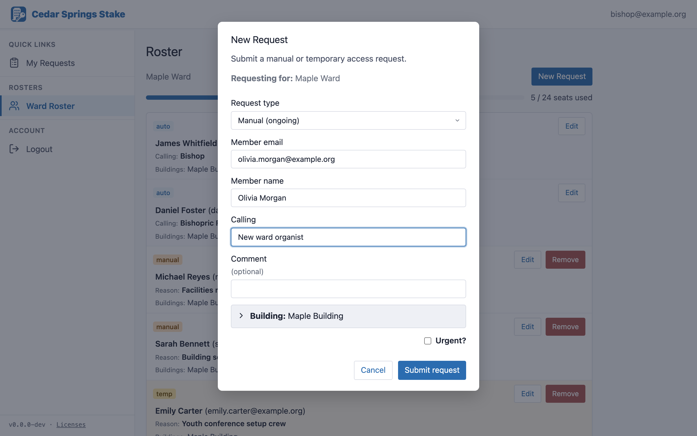

# User documentation

Reader-facing guides for Stake Building Access, written as standalone, self-contained
HTML (all CSS inlined — nothing external to load) plus generated PDFs. These are meant
to be **handed to end users** (emailed, printed, posted), not read as code docs. For the
authoritative description of runtime behaviour, see [`../spec.md`](../spec.md).

| File | Audience | Covers |
|---|---|---|
| `creating-requests.html` / `.pdf` | Bishoprics, stake presidency, other ward & stake leaders | Signing in, the roster, submitting add / temp requests, removing & editing seats, tracking requests |
| `kindoo-managers.html` / `.pdf` | Kindoo Managers | First-time stake setup, installing the extension, the web app, processing requests, Sync, Kindoo Sites, app access, caps, notifications, audit, troubleshooting |

## Regenerating the PDFs

The PDFs are rendered from the HTML with headless Chrome:

```
./docs/user-guide/build-pdfs.sh
```

Or open either `.html` in a browser and use **Print → Save as PDF**.

## Screenshots (placeholders)

The guides ship with marked screenshot placeholders (dashed boxes captioned
`Fig n.n`). Each one names exactly what to capture. Replace a placeholder by swapping
its `<figure class="shot">…</figure>` block for an ``, e.g.:

```html
<figure class="shot">
  
  <figcaption>Fig 5.1 — The New Request form.</figcaption>
</figure>
```

Then re-run `build-pdfs.sh`. Capture from the live app (do **not** include real member
names or emails — use test data).

### Regenerating the six web-app screenshots

Six of the figures are captured automatically by a Playwright utility against the local
emulator stack: `e2e/tests/screenshots.capture.ts`. It is **not** part of the regression
suite (the filename omits `.spec`, so `pnpm test:e2e` skips it) — run it explicitly by
path, against a fresh emulator instance:

```
firebase emulators:exec --only firestore,auth "npx playwright test tests/screenshots.capture.ts" --project demo-test
```

It rewrites the PNGs under `img/` in place. The three extension figures
(`kindoo-managers` 3.1 / 5.1 / 6.1) need a live Kindoo session + the extension and are
captured manually.

### Shot list

**creating-requests**
- Fig 2.1 — Sign-in page (Google button above the email link form)
- Fig 4.1 — A ward roster with utilization bar + New Request button
- Fig 5.1 — The New Request form (modal)
- Fig 9.1 — My Requests with mixed statuses + Cancel

**kindoo-managers**
- Fig 2.1 — Bootstrap setup wizard (buildings/wards step)
- Fig 3.1 — Extension panel open over Kindoo (Queue tab)
- Fig 5.1 — A request card with Provision & Complete / Reject
- Fig 6.1 — The Sync drift report
- Fig 11.1 — Audit log with an expanded before/after row
