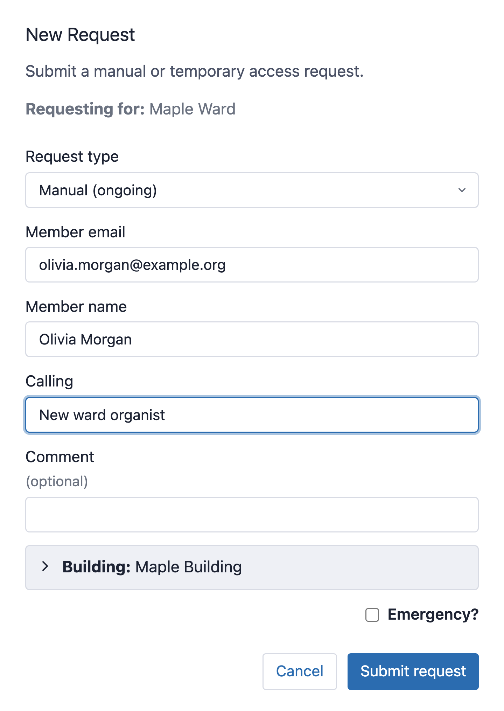

# User documentation

Reader-facing guides for Stake Building Access, written as standalone, self-contained
HTML (all CSS inlined — nothing external to load) plus generated PDFs. These are meant
to be **handed to end users** (emailed, printed, posted), not read as code docs. For the
authoritative description of runtime behaviour, see [`../spec.md`](../spec.md).

| File | Audience | Covers |
|---|---|---|
| `creating-requests.html` / `.pdf` | Bishoprics, stake presidency, other ward & stake leaders | Signing in, the roster, submitting add / temp requests, removing & editing seats, tracking requests |
| `kindoo-managers.html` / `.pdf` | Kindoo Managers | First-time stake setup, installing the extension, the web app, processing requests, applying from a phone, Sync, Kindoo Sites, app access, caps, notifications, audit, troubleshooting |

## Regenerating the PDFs

The PDFs are rendered from the HTML with headless Chrome:

```
./docs/user-guide/build-pdfs.sh
```

Or open either `.html` in a browser and use **Print → Save as PDF**.

## Screenshots (placeholders)

The guides ship with marked screenshot placeholders (dashed boxes captioned
`Fig n.n`). Each one names exactly what to capture. Replace a placeholder by swapping
its `<figure class="shot">…</figure>` block for an ``, e.g.:

```html
<figure class="shot">
  
  <figcaption>Fig 5.1 — The New Request form.</figcaption>
</figure>
```

Then re-run `build-pdfs.sh`. Capture from the live app (do **not** include real member
names or emails — use test data).

### Regenerating the seven web-app screenshots

Seven of the figures are captured automatically by a Playwright utility against the local
emulator stack: `e2e/tests/screenshots.capture.ts`. It is **not** part of the regression
suite (the filename omits `.spec`, so `pnpm test:e2e` skips it) — run it explicitly, from
`e2e/`, against a fresh emulator instance:

```
CAPTURE_SCREENSHOTS=1 firebase emulators:exec --only firestore,auth "npx playwright test" --project kindoo-staging
```

Both parts matter. `CAPTURE_SCREENSHOTS=1` flips `testMatch` in `playwright.config.ts`
over to the capture file — a positional path argument only *filters* the tests Playwright
already collected, and the default `testMatch` never collects this filename, so without
the env var you get "No tests found". And the project must be `kindoo-staging`, matching
the `PROJECT_ID` default in `e2e/fixtures/emulator.ts`; under a different project id the
seeded user lands in another namespace and `setCustomClaims` fails with `USER_NOT_FOUND`.

Add `-g 'Fig 6.1'` to regenerate a single figure. It rewrites the PNGs under `img/` in place. The three extension figures
(`kindoo-managers` 3.1 / 5.1 / 6.1) need a live Kindoo session + the extension and are
captured manually.

### Shot list

**creating-requests**
- Fig 2.1 — Sign-in page (Google button above the email link form)
- Fig 4.1 — A ward roster with utilization bar + New Request button
- Fig 5.1 — The New Request form (modal)
- Fig 6.1 — The New Request form as a **limited** user sees it: Temporary as the only request type, the 90-day note above the dates, and the read-only "Building:" row in place of the buildings checklist
- Fig 9.1 — My Requests with mixed statuses + Cancel

**kindoo-managers**
- Fig 2.1 — Bootstrap setup wizard (buildings/wards step)
- Fig 3.1 — Extension panel open over Kindoo (Queue tab)
- Fig 5.1 — A request card with Provision & Complete / Reject
- Fig 7.1 — The Sync drift report
- Fig 12.1 — Audit log with an expanded before/after row

Section 6 (applying from a phone) has no figure yet. It needs a phone-viewport capture of the
Requests Queue with a live presence line and an **Apply via extension** button, which
`e2e/tests/screenshots.capture.ts` does not currently produce. The audit-log capture in that file is
still named `Fig 11.1`; the figure is now 12.1.
